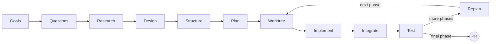

# qrspi-plus

**A structured agentic development pipeline for Claude Code.**

qrspi-plus is a Claude Code plugin that implements QRSPI — a methodology for agentic software development where every phase produces a reviewable artifact, gets human approval, and runs in isolated context. Based on Human Layer's QRSPI framework, extended with worktree parallelization, tiered code reviews, integration verification, acceptance testing, and between-phase replanning.

---

## Pipeline Overview



The pipeline has two route variants:

**Full pipeline** -- for features, new products, and anything requiring architectural design:

```
Goals -> Questions -> Research -> Design -> Structure -> Plan -> Worktree -> Implement -> Integrate -> Test -> Replan (loop)
```

**Quick fix** -- for targeted bug fixes, small changes, and 1-3 file modifications:

```
Goals -> Questions -> Research -> Plan -> Implement -> Test
```

Quick fix skips Design, Structure, Worktree, and Integrate. Plan produces a single task. The pipeline is shorter but still runs through the same approval gates.

A third variant, **Full + UX**, inserts a wireframing step between Design and Structure when the `qrspi:ux` skill is installed. This is offered during pipeline mode selection in Goals.

### Route Changes

Route changes are allowed before Plan executes:

- **Full to Quick Fix:** Drop Design, Structure, Worktree, Integrate from the route.
- **Quick Fix to Full:** Insert Design, Structure before Plan, and Worktree, Integrate after Plan.
- **Add/remove UX step:** Allowed before Structure.

After Plan is approved, the route is locked. Changing it after that point requires a backward loop to re-run Plan.

---

## How It Works

**Reviewable artifacts, not code dumps.** Each step produces a focused artifact (~200 lines) that humans review. You review a goals document, a research summary, a design spec, and a plan -- not 2000 lines of generated code.

**Human approval gates between steps.** Every artifact is presented to the user for approval before the pipeline advances. Rejection captures feedback and re-generates the artifact in a fresh subagent with the feedback included. No artifact is silently mutated.

**Fresh subagent per step.** Each step runs in a clean subagent with only its declared inputs. No context accumulation, no "dumb zone." Subagent boundaries are compaction boundaries -- every step gets clean context, guaranteed.

**Structural enforcement over instructional discipline.** Where possible, constraints are enforced architecturally. Research agents never see the goals document (prevents confirmation bias). Implement cannot write production code without a failing test. Review patterns are codified, not suggested.

---

## Pipeline Steps

### Step 1: Goals

Captures user intent, constraints, and acceptance criteria through interactive dialogue. The user and agent discuss purpose, constraints, success criteria, and scope. A subagent then synthesizes `goals.md` with structured acceptance criteria. This step also determines the pipeline mode (quick fix or full) and writes `config.md` with the route. The key design decision: acceptance criteria must be specific and testable ("response time < 200ms"), never subjective ("it should feel fast").

**Artifact:** `goals.md`

### Step 2: Questions

Generates tagged research questions from the approved goals. Each question is tagged with a research type (`codebase`, `web`, or `hybrid`) to dispatch the right specialist agent. Questions must not leak goals or intent -- they are neutral inquiries about how things work, not what the user wants to change. This goal leakage prevention is enforced by the review subagent, which flags any question where a researcher could infer the planned changes.

**Artifact:** `questions.md`

### Step 3: Research

Dispatches parallel specialist subagents per question. Codebase researchers read code and trace logic flows. Web researchers search for competitors, libraries, and best practices. Each specialist writes per-question findings, then a synthesis subagent produces a unified summary. Research isolation is structural: no research subagent ever receives `goals.md`. The synthesis subagent also never sees goals. If findings don't organize well without knowing the goals, that signals the questions were too vague.

**Artifact:** `research/summary.md` (plus per-question `research/q*.md` files)

### Step 4: Design

Interactive design discussion in the main conversation. The agent proposes 2-3 approaches with trade-offs and a recommendation. The user and agent converge on an approach, then a subagent synthesizes the artifact. Design enforces vertical slice decomposition -- end-to-end feature slices, not horizontal layers. Phases are defined with replan gates between them. Phase 1 is always the PoC that proves the full stack works. Includes test strategy and a high-level Mermaid system diagram.

**Artifact:** `design.md`

### Step 5: Structure

Maps each vertical slice from the design to specific files and components. Defines interfaces between components (function/class signatures, not implementations), identifies create vs. modify for each file, and produces a detailed architectural diagram. The key design decision: the file-level mapping makes the gap between design and plan concrete -- downstream agents know exactly which files to touch and what interfaces to honor.

**Artifact:** `structure.md`

### Step 6: Plan

Breaks the structure into ordered tasks with detailed specs. Each task spec includes exact file paths, a description, test expectations in plain language (behaviors, edge cases, error conditions), dependencies, and LOC estimates. No placeholders, no TBDs, no "similar to Task N." For large plans (6+ tasks), task spec writing is farmed to sub-subagents. In quick fix mode, Plan produces a single task directly from research (no design or structure). The plan is reviewed as a single merged document, then split into individual task files after approval.

**Artifact:** `plan.md` + `tasks/task-NN.md`

### Step 7: Worktree

Analyzes the task dependency graph for the current phase and determines the execution mode: sequential (chain dependencies), parallel (independent tasks on different files), or hybrid (mixed). Creates git worktrees forked from the feature branch, runs baseline tests, and dispatches tasks to Implement. Three execution modes ensure tasks run with maximum parallelism while respecting dependencies. If baseline tests fail, the user can auto-fix (inject a task-00), proceed with known failures, or stop.

**Artifact:** `parallelization.md`

### Step 8: Implement

TDD execution per task in an isolated worktree. The iron law: no production code without a failing test first. Write failing tests from the task spec's test expectations, verify they fail, write minimal implementation, verify they pass, self-review and commit. After implementation, 8 reviewers run in two tiers: 4 correctness reviewers (spec-reviewer, code-quality-reviewer, silent-failure-hunter, security-reviewer) always run; 4 thoroughness reviewers (goal-traceability, test-coverage, type-design-analyzer, code-simplifier) run in deep mode only. Review depth is configurable per phase.

**Reviewers:**

| Group | Reviewer | Mode |
|-------|----------|------|
| Correctness | spec-reviewer (runs first, gates the rest) | Quick + Deep |
| Correctness | code-quality-reviewer | Quick + Deep |
| Correctness | silent-failure-hunter | Quick + Deep |
| Correctness | security-reviewer | Quick + Deep |
| Thoroughness | goal-traceability-reviewer | Deep only |
| Thoroughness | test-coverage-reviewer | Deep only |
| Thoroughness | type-design-analyzer | Deep only |
| Thoroughness | code-simplifier | Deep only |

**Artifact:** `reviews/tasks/task-NN-review.md` (per-task review results)

### Step 8.5: Integrate

Merges worktree branches into the feature branch and runs cross-task reviews. Two reviewers check integration: an integration-reviewer verifies components work together, and a security-integration-reviewer checks cross-task security boundaries. After review, pushes the branch and triggers CI. Both integration review failures and CI failures generate fix tasks that route back through the pipeline (Worktree -> Implement -> Integrate). The user is in the loop at every decision point -- dispatch fixes, re-run reviews, accept, or stop.

**Artifact:** `reviews/integration/round-NN-review.md`, `reviews/ci/round-NN-review.md`

### Step 9: Test

Acceptance testing against the original goals. A test-writer subagent maps every acceptance criterion from `goals.md` to tests (acceptance, integration, E2E, boundary). Test code goes through its own review round. The tester can only write test files -- when tests fail, it outputs fix task descriptions, not code fixes. Fixes route back through the full pipeline so all production code changes go through reviews. Phase routing happens after acceptance: if this is the final phase, prepare a PR; if more phases remain, invoke Replan.

**Artifact:** `reviews/test/round-NN-review.md`

### Step 9.5: Replan

Runs between phases only. A subagent analyzes the completed phase for patterns, framework quirks, and architectural adjustments. Each proposed change gets a severity classification: minor changes (task spec wording, LOC estimates, add/split/merge tasks) are updated in place with a lightweight re-approval cycle. Major changes (new files, interface changes, technology switches, phase boundary changes) trigger fire-and-forget backward loops to the earliest affected artifact (Design or Structure). Replan writes a feedback file and resets downstream artifact statuses, then invokes the loop-back target -- the normal pipeline cascades forward from there.

**Artifact:** `reviews/replan-review.md`, `feedback/replan-phase-NN-round-MM.md`

---

## Key Concepts

### Artifact Gating

Every step checks that its required input artifacts exist on disk and have `status: approved` in their YAML frontmatter before proceeding. If an artifact is missing or unapproved, the skill refuses to run and tells the user what is needed. This prevents steps from executing with incomplete or unreviewed inputs. The gating is structural -- there is no way to bypass it without manually writing approval markers.

The gating chain builds cumulatively:

| Step | Required Approved Inputs |
|------|--------------------------|
| Goals | None (first step) |
| Questions | `goals.md` |
| Research | `questions.md` |
| Design | `goals.md`, `research/summary.md` |
| Structure | `goals.md`, `research/summary.md`, `design.md` |
| Plan | All prior artifacts (quick fix: `goals.md`, `research/summary.md` only) |
| Worktree | `plan.md`, `tasks/*.md`, `design.md`, `config.md` |
| Implement | Task file + pipeline-specific inputs (see below) |
| Integrate | Task reviews, worktree branches, `design.md`, `structure.md`, `parallelization.md` |
| Test | `goals.md`, `design.md` (full) or `research/summary.md` (quick), merged code |
| Replan | Merged phase code, `fixes/`, `reviews/`, remaining `tasks/*.md`, `plan.md`, `design.md` |

### Review Patterns

Three canonical review patterns are used across the pipeline. Every review loop must use one of these -- no ad-hoc variations.

**Pattern 1: Inner Loop** -- Autonomous per-task reviews with a batch gate at the end. Used by Implement (per-task reviews) and Test (test code reviews). Reviewers converge on unchanged code (up to 3 rounds) to build a complete issue list, the implementer fixes all issues, reviewers re-run on fixed code. Up to 3 fix cycles; if unresolved, the task is flagged and the user decides at the batch gate.

**Pattern 2: Outer Loop** -- User-confirmed reviews for non-deterministic reviewers. Used by integration reviews. Reviewers converge, then results are always presented to the user. The user chooses: dispatch fixes, re-run reviews, accept, or stop. No cycle counting -- the user is in the loop each time.

**Pattern 3: Deterministic Results** -- For tests and CI where results don't change on re-run. Run once, present pass/fail to user. Fix tasks include the specific test or CI check that must pass. After fixes return, re-run. The user decides the next action each time.

### Route-Based Routing

The `config.md` file's `route` field is the single source of truth for pipeline progression. Each skill's terminal state reads the route list, finds the current skill, and invokes the next entry. No conditional logic, no hardcoded next-skill invocations.

Replan is deliberately absent from the route list because it only fires between phases (invoked by Test, not by route progression). The multi-phase cycle works as follows:

- **Test** checks if more phases remain: last phase creates a PR, more phases invoke `qrspi:replan`
- **Replan** always invokes `qrspi:worktree` for the next phase
- **Worktree** re-enters the implement/integrate/test portion of the route for the new phase

### Severity Classification

Replan classifies every proposed change using a defined severity table:

| Change Type | Severity | Loop-Back Target |
|-------------|----------|------------------|
| Task spec wording, LOC estimates, test expectations | Minor | None -- update in place |
| Add/remove/split/merge tasks within existing slices | Minor | None -- update plan + tasks |
| Reorder tasks or change dependencies | Minor | None -- update plan |
| Change file paths or add files within existing slices | **Major** | Structure |
| Change interfaces between components | **Major** | Structure |
| Change technology choice, approach, or architecture | **Major** | Design |
| Change phase boundaries or slice definitions | **Major** | Design |
| Change vertical slice decomposition | **Major** | Design |

The loop-back target is always the earliest affected artifact. If file paths change, loop back to Structure (cascades to Plan). If architecture changes, loop back to Design (cascades to Structure, then Plan). This prevents architectural drift from being patched over with task-level fixes.

### Feedback Files

When a user rejects an artifact, the feedback is captured in `feedback/{step}-round-{NN}.md` containing the user's feedback verbatim and the full content of the rejected artifact. The next subagent receives all prior feedback files (not just the latest), preserving the full history of proposals and user responses. This ensures the agent learns from the complete rejection history, not just the most recent round.

### Backward Loops

When a later step surfaces new requirements or contradictions -- for example, implementation reveals a design flaw, or wireframes reviewed during Structure reveal missing features -- the pipeline loops backward to the earliest affected artifact and cascades forward. Each artifact is updated, reviewed, and re-approved at every step until reaching the point where the new learning was discovered.

This is not optional. Skipping backward loops creates drift between artifacts: goals say one thing, design says another, structure implements a third. Each artifact is a contract that downstream steps depend on. If the contract changes, every dependent must be updated.

### Compaction

Each skill's terminal state recommends compacting context before the next step (`/compact`). This is a recommendation, not a gate -- the pipeline continues regardless. Because each step runs in a fresh subagent with only declared inputs, compaction between steps is natural and safe.

### Fix Task Routing

Three outer fix loops cross skill boundaries, all following the same pattern:

| Source | Fix Tasks Written To | Routes Through |
|--------|---------------------|----------------|
| Integration review | `fixes/integration-round-NN/` | Worktree -> Implement -> Integrate |
| CI pipeline | `fixes/ci-round-NN/` | Worktree -> Implement -> Integrate |
| Acceptance tests | `fixes/test-round-NN/` | Worktree -> Implement -> Integrate -> Test |

Fix task files follow the same format as regular task files (with `pipeline` field in frontmatter) so Worktree and Implement process them identically. Every fix goes through TDD and code reviews -- no shortcuts for "small" fixes.

---

### Mid-Pipeline Entry

Users can enter the pipeline mid-stream if they already have artifacts from prior work. As long as the required input files exist with `status: approved`, any step can run. When entering mid-pipeline, the plugin scans for existing QRSPI runs (`docs/qrspi/*/goals.md`), presents matches if multiple exist, and resumes at the first incomplete step based on the `config.md` route.

---

## Installation

**From a local path:**

```bash
claude plugins add /path/to/qrspi-plus
```

**From GitHub (once published):**

```bash
claude plugins add github:dfrysinger/qrspi-plus
```

After installation, the plugin's session-start hook automatically loads the `using-qrspi` skill at the beginning of every conversation. The pipeline activates whenever the user wants to build something.

---

## Configuration

Each pipeline run creates a `config.md` file in its artifact directory during the Goals step. This is the single source of truth for pipeline configuration.

```yaml
---
created: 2026-04-06
pipeline: full
codex_reviews: false
route:
  - goals
  - questions
  - research
  - design
  - structure
  - plan
  - worktree
  - implement
  - integrate
  - test
review_depth: deep
review_mode: loop
---
```

**Field definitions:**

| Field | Set by | Description |
|-------|--------|-------------|
| `created` | Goals | ISO date the run was created. Set once, never updated. |
| `pipeline` | Goals | Human-readable label (`full` or `quick`). Informational only; `route` is authoritative. |
| `codex_reviews` | Goals | Whether to include Codex as a second reviewer in review rounds. |
| `route` | Goals | Ordered list of skill names this run will execute. |
| `review_depth` | Worktree / Implement | `quick` (4 correctness reviewers) or `deep` (all 8 reviewers). Set at phase start. |
| `review_mode` | Worktree / Implement | `single` (skip convergence) or `loop` (converge until clean). Set at phase start. |

---

## Project Structure

```
qrspi-plus/
├── .claude-plugin/
│   ├── plugin.json                 # Plugin metadata
│   └── marketplace.json            # Marketplace listing
├── hooks/
│   ├── hooks.json                  # SessionStart hook registration
│   ├── run-hook.cmd                # Cross-platform polyglot wrapper
│   └── session-start               # Loads using-qrspi at session start
├── skills/
│   ├── using-qrspi/
│   │   └── SKILL.md                # Entry point — pipeline overview, routing
│   ├── goals/
│   │   └── SKILL.md                # Step 1: Capture intent
│   ├── questions/
│   │   └── SKILL.md                # Step 2: Research questions
│   ├── research/
│   │   └── SKILL.md                # Step 3: Parallel research
│   ├── design/
│   │   └── SKILL.md                # Step 4: Architecture + vertical slices
│   ├── structure/
│   │   └── SKILL.md                # Step 5: File/component mapping
│   ├── plan/
│   │   └── SKILL.md                # Step 6: Task specs
│   ├── worktree/
│   │   └── SKILL.md                # Step 7: Parallelization + dispatch
│   ├── implement/
│   │   ├── SKILL.md                # Step 8: TDD execution
│   │   └── templates/
│   │       ├── implementer.md      # TDD execution prompt
│   │       ├── correctness/        # Always-run reviewers (4)
│   │       └── thoroughness/       # Deep-mode reviewers (4)
│   ├── integrate/
│   │   ├── SKILL.md                # Step 8.5: Merge + cross-task review
│   │   └── templates/
│   │       ├── integration-reviewer.md
│   │       └── security-integration-reviewer.md
│   ├── test/
│   │   ├── SKILL.md                # Step 9: Acceptance testing
│   │   └── templates/
│   │       ├── test-writer.md
│   │       ├── acceptance-test.md
│   │       ├── integration-test.md
│   │       ├── e2e-test.md
│   │       └── boundary-test.md
│   └── replan/
│       └── SKILL.md                # Step 9.5: Between-phase replanning
└── docs/
    └── qrspi-reference.md          # QRSPI framework reference
```

Each pipeline run produces its artifacts in the target project (not the plugin directory):

```
docs/qrspi/YYYY-MM-DD-{slug}/
├── config.md
├── goals.md
├── questions.md
├── research/
│   ├── summary.md
│   └── q*.md
├── design.md
├── structure.md
├── plan.md
├── parallelization.md
├── tasks/
│   └── task-NN.md
├── fixes/
│   ├── integration-round-NN/
│   ├── ci-round-NN/
│   └── test-round-NN/
├── feedback/
│   └── {step}-round-NN.md
└── reviews/
    ├── {step}-review.md
    ├── tasks/
    ├── integration/
    ├── ci/
    └── test/
```

---

## How Skills Work

Each skill is a `SKILL.md` file containing structured instructions for Claude Code. Skills declare their name, description, required inputs (artifact gating), process flow, review criteria, human gate behavior, and terminal state. The plugin framework loads skills by directory convention -- any directory under `skills/` containing a `SKILL.md` file is registered as a skill.

Skills are invoked with the `qrspi:` prefix (e.g., `qrspi:goals`, `qrspi:design`). The `using-qrspi` entry-point skill is loaded automatically at session start by the session-start hook. It establishes the pipeline context and invokes `qrspi:goals` to begin.

Each skill follows a consistent pattern:

1. **Announce** -- state which skill is running
2. **Artifact gating** -- verify required inputs exist and are approved
3. **Process** -- execute the step's work (interactive or subagent)
4. **Review round** -- Claude review subagent + optional Codex review, with loop-until-clean option
5. **Human gate** -- present artifact for approval or rejection
6. **Terminal state** -- commit approved artifact, recommend compaction, invoke next skill in route

---

## Credits

- **QRSPI methodology** from [HumanLayer](https://humanlayer.dev) by Dex Horthy. The original framework covers Goals, Questions, Research, Structure, Plan, and Implement as a methodology for steering coding agents.
  - [No Vibes Allowed: Solving Hard Problems in Complex Codebases](https://www.youtube.com/watch?v=rmvDxxNubIg) — the original RPI talk (AI Engineer World's Fair)
  - [Everything We Got Wrong About RPI](https://www.youtube.com/watch?v=YwZR6tc7qYg) — the follow-up introducing QRSPI
  - [Slide deck](https://docs.google.com/presentation/d/1mnp0CzrRS02Y0t0vGvqX-_M5IbYPjFoZ/mobilepresent?slide=id.g3bef903f3c9_0_435) — QRSPI talk starts at slide 291
  - [Advanced Context Engineering for Coding Agents](https://github.com/humanlayer/advanced-context-engineering-for-coding-agents) — methodology docs and reference

- **Built as a Claude Code plugin** using the skills, hooks, and agent conventions of the Claude Code plugin system.

### What qrspi-plus Adds

The original QRSPI methodology defines Goals, Questions, Research, Structure, Plan, and Implement. qrspi-plus extends this with:

| Addition | What it adds |
|----------|-------------|
| **Design step** | Interactive architecture discussion with vertical slice decomposition, phase definitions with replan gates, and test strategy -- inserted between Research and Structure |
| **Worktree step** | Dependency analysis, parallel/sequential/hybrid execution modes, git worktree isolation per task, baseline test verification |
| **Integrate step** | Cross-task integration review + security integration review after merging worktrees, CI pipeline gate with fix-task routing |
| **Test step** | Acceptance testing against original goals, per-failure quick/full classification, phase routing (PR on final phase, Replan on intermediate) |
| **Replan step** | Between-phase replanning with 8-type severity classification, fire-and-forget backward loops to Design or Structure |
| **8 specialized reviewers** | 4 correctness (spec, code quality, silent failures, security) + 4 thoroughness (goal traceability, test coverage, type design, simplification), configurable per phase |
| **3 canonical review patterns** | Inner Loop (autonomous per-task), Outer Loop (user-confirmed), Deterministic (run once) -- every review in the pipeline uses one of these |
| **Route-based routing** | `config.md` with route field as single source of truth for pipeline progression, replacing hardcoded skill-to-skill invocations |
| **Quick fix mode** | Shortened pipeline (Goals -> Questions -> Research -> Plan -> Implement -> Test) for targeted fixes, with single-task plans |
| **Fix-task routing loops** | Three outer loops (integration, CI, test) that route failures back through Worktree -> Implement with full TDD and reviews |
| **Artifact gating** | Structural enforcement -- each step checks prerequisites exist and are approved before proceeding, no bypass possible |
| **Feedback-driven re-generation** | Rejected artifacts capture user feedback + rejected snapshot, new subagent receives full rejection history |
| **Durable resume detection** | `replan-pending.md` marker + mid-pipeline entry via artifact scanning for crash recovery |

---

## License

MIT
