# qrspi-plus

**A structured agentic development pipeline for Claude Code.**

qrspi-plus is a Claude Code plugin that implements QRSPI — a methodology for agentic software development where every phase produces a reviewable artifact, gets human approval, and runs in isolated context. Based on Human Layer's QRSPI framework, extended with parallelization planning, runtime worktree creation and per-task implementation, tiered code reviews, integration verification, acceptance testing, and between-phase replanning.

---

## Pipeline Overview

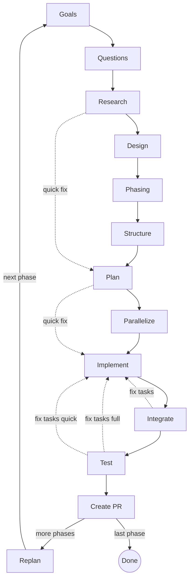

The pipeline has two routes. The **full pipeline** runs every step -- for features, new products, and anything requiring architectural design. The **quick fix** route (shown as dashed lines) skips Design, Phasing, Structure, Parallelize, and Integrate -- for targeted bug fixes, small changes, and 1-3 file modifications. **Replan's "next phase" path returns to Goals**, where the next phase's draft is auto-populated from `roadmap.md` + `future-goals.md` and cascaded through the full pipeline — not directly back to Parallelize.

### Route Changes

Route changes are allowed before Plan executes:

- **Full to Quick Fix:** Drop Design, Phasing, Structure, Parallelize, Integrate from the route.
- **Quick Fix to Full:** Insert Design, Phasing, Structure before Plan, and Parallelize, Integrate after Plan.

After Plan is approved, the route is locked. Changing it after that point requires a backward loop to re-run Plan.

---

## How It Works

**Tiered human review at every stage.** Each step produces a focused artifact that humans review, but the review depth varies by artifact type:

- **Goals, Questions, Research, Design** -- closely reviewed by the human. These are the alignment artifacts that determine whether the right thing gets built.
- **Structure, Plan, Tasks** -- spot-checked by the human. The detail is too dense to read line by line, but the human reviews the overall approach and catches structural issues.
- **Code** -- reviewed by the human during the Test step before the PR is created. The pipeline produces well-structured code designed to be reviewable in a standard code review, with comments that orient readers and explain non-obvious WHY (not line-by-line restatement).

**Human approval gates between steps.** Every artifact is presented to the user for approval before the pipeline advances. Rejection captures feedback and re-generates the artifact in a fresh subagent with the feedback included. No artifact is silently mutated.

**Fresh subagent per step.** Each step runs in a clean subagent with only its declared inputs. No context accumulation, no "dumb zone." Subagent boundaries are compaction boundaries -- every step gets clean context, guaranteed.

**Structural enforcement over instructional discipline.** Where possible, constraints are enforced architecturally. Research agents never see the goals document (prevents confirmation bias). Implement cannot write production code without a failing test. Review patterns are codified, not suggested.

**Hook-based deterministic enforcement.** Pipeline rules that were previously prompt-instructed are now code-enforced via Claude Code hooks that run on every tool call:

- **Pipeline step ordering:** The PreToolUse hook blocks artifact writes that skip prerequisites. You cannot write `design.md` before `goals.md` is approved -- the hook rejects the tool call with an actionable error message.
- **Asymmetric target-based enforcement:** The PreToolUse hook treats main chat and dispatched subagents differently based on the dispatch envelope. Main-chat tool calls go through pipeline-ordering checks only. Subagent tool calls (any agent dispatched via the Agent tool) are additionally walled to their assigned worktree at `.worktrees/{slug}/(task-NN[a-z]?|baseline)/` — Write/Edit targets and Bash write targets outside that path are blocked. Enforcement keys on the operation's target path, not on the agent's CWD, so it survives subagent CWD inheritance quirks.
- **Audit logging:** Hook-driven writes append to `<artifact_dir>/.qrspi/audit.jsonl` (one line per allowed/blocked Write, Edit, or Bash call inside QRSPI scope), and Codex review jobs append to `<artifact_dir>/.qrspi/audit-codex-review.jsonl`. Block decisions are logged alongside allow decisions.
- **Fail-closed security model:** All error paths in the hooks block with actionable messages rather than silently allowing violations.
- **State management:** `.qrspi/state.json` tracks pipeline progress and the artifact map. `.qrspi/task-NN-runtime.json` files capture mid-task user decisions as runtime overrides.

---

## Pipeline Steps

### Step 1: Goals

Captures user intent, constraints, and per-goal problem framing through interactive dialogue. The user and agent discuss purpose, constraints, problems to solve, and scope. A subagent then synthesizes `goals.md` with structured per-goal entries (Problem / Why we care / What we know so far). Acceptance criteria are NOT authored in `goals.md` — per the strip-from-goals contract, criteria are owned by `plan.md` (per-task `## Test Expectations` blocks plus an optional per-phase acceptance block in the overview) and exercised via Implement-TDD; `goals.md` provides the upstream problem framing only. This step also determines the pipeline mode (quick fix or full) and writes `config.md` with the route.

Each goal must be independently scopeable -- it can be moved between phases without surgery on other goals. Goals that bundle multiple distinct deliverables are split into separate goals with their own IDs. Late splitting is classified like any amendment (clarifying, additive, or architectural) and presented as a before/after diff.

**Artifact:** `goals.md`

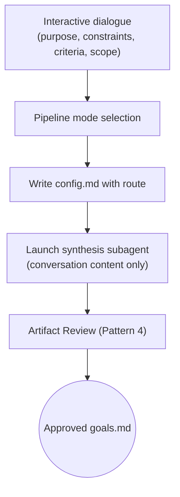

### Step 2: Questions

Generates tagged research questions from the approved goals. Each question is tagged with a research type (`codebase`, `web`, or `hybrid`) to dispatch the right specialist agent. Questions must not leak goals or intent -- they are neutral inquiries about how things work, not what the user wants to change. This goal leakage prevention is enforced by the review subagent, which flags any question where a researcher could infer the planned changes.

**Artifact:** `questions.md`

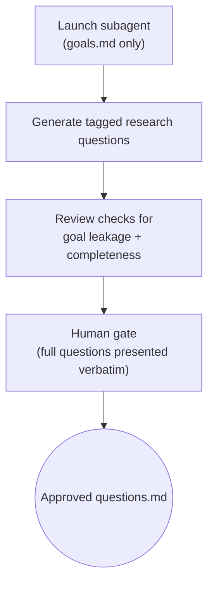

### Step 3: Research

Dispatches parallel specialist subagents per question. Codebase researchers read code and trace logic flows. Web researchers search for competitors, libraries, and best practices. Each specialist writes per-question findings, then a synthesis subagent produces a unified summary. Research isolation is structural: no research subagent ever receives `goals.md`. The synthesis subagent also never sees goals. If findings don't organize well without knowing the goals, that signals the questions were too vague.

**Artifact:** `research/summary.md` (plus per-question `research/q*.md` files)

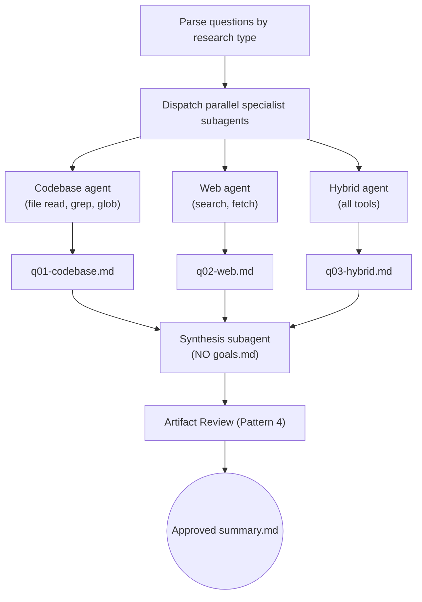

### Step 4: Design

Interactive design discussion in the main conversation. The agent proposes 2-3 approaches with trade-offs and a recommendation. The user and agent converge on an approach, then a subagent synthesizes the artifact. Design owns approach selection, key architectural decisions with rationale, design-level test strategy, and a high-level Mermaid system diagram. Vertical-slice authoring, phase boundaries, and roadmap composition are owned by Phasing (Step 5), not Design.

`design.md` may carry per-phase content keyed by `### {GOAL_ID} -- {name}`; future-phase entries live in `future-design.md` and are pulled in when goals are promoted via Replan.

**Artifact:** `design.md`

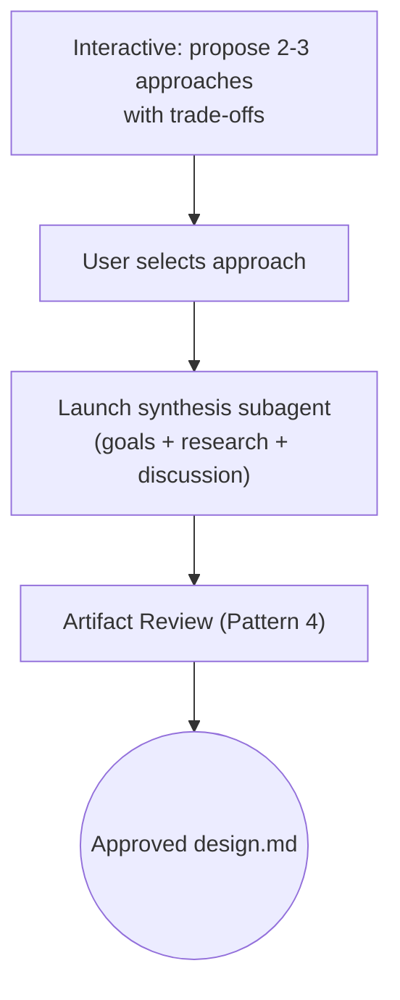

### Step 5: Phasing

Translates the approved architecture into delivery units. Phasing owns vertical-slice authoring (end-to-end demonstrable units, not horizontal layers), phase boundaries with explicit replan-gate criteria, the Phase 1 PoC guideline (prove the full stack end-to-end when possible), `roadmap.md` (canonical phase → slice → goal-ID mapping), current-phase pruning of the four synthesizing artifacts (`goals.md`, `questions.md`, `research/summary.md`, `design.md`) into current-phase content + `future-*` files, and goal-ID consistency validation across all nine target artifacts. Quick-fix routes skip Phasing entirely.

**Artifacts:** `phasing.md`, `roadmap.md`, `future-goals.md`, `future-questions.md`, `future-research-summary.md`, `future-design.md` (and pruned-in-place `goals.md`, `questions.md`, `research/summary.md`, `design.md`)

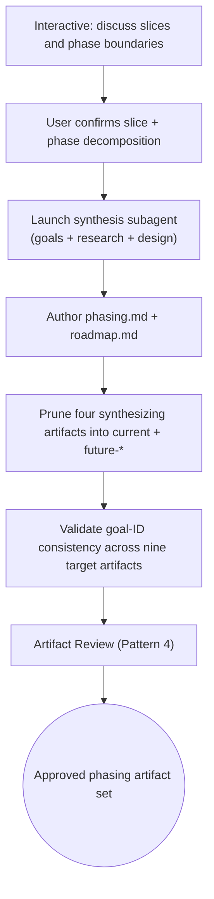

### Step 6: Structure

Maps each vertical slice from the design to specific files and components. Defines interfaces between components (function/class signatures, not implementations), identifies create vs. modify for each file, and produces a detailed architectural diagram. The key design decision: the file-level mapping makes the gap between design and plan concrete -- downstream agents know exactly which files to touch and what interfaces to honor.

**Artifact:** `structure.md`

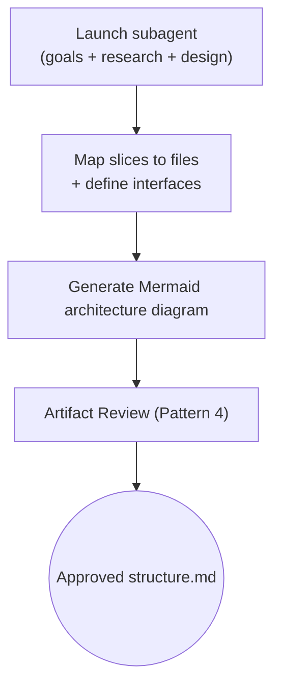

### Step 7: Plan

Breaks the structure into ordered tasks with detailed specs. Each task spec includes exact file paths, a description, test expectations in plain language (behaviors, edge cases, error conditions), dependencies, and LOC estimates. No placeholders, no TBDs, no "similar to Task N." For large plans (6+ tasks), task spec writing is farmed to sub-subagents. In quick fix mode, Plan produces a single task directly from research (no design or structure). The plan is reviewed as a single merged document by 7 reviewer subagents in parallel (1 unified plan-quality reviewer + 5 plan-artifact reviewers + the dedicated `qrspi-plan-scope-reviewer`), then split into individual task files after approval.

**Artifact:** `plan.md` + `tasks/task-NN.md`

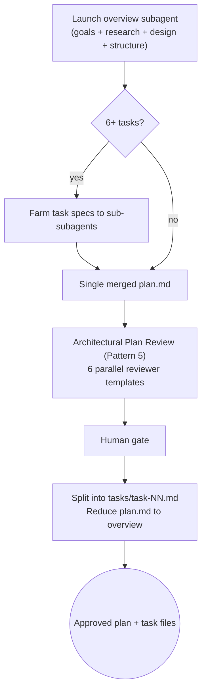

### Step 8: Parallelize

Plan-time analysis. Analyzes the task dependency graph for the current phase and determines the execution mode: sequential (chain dependencies), parallel (independent tasks on different files), or hybrid (mixed). Produces a symbolic Branch Map that names the base each task forks from -- but does not create branches, run baseline tests, or dispatch subagents. That work happens in Implement.

Splitting plan-time and runtime restores QRSPI's "one skill = one artifact + one human gate" symmetry. Parallelize owns `parallelization.md` and the parallelization-plan gate; Implement owns the per-task orchestration loop and the batch gate.

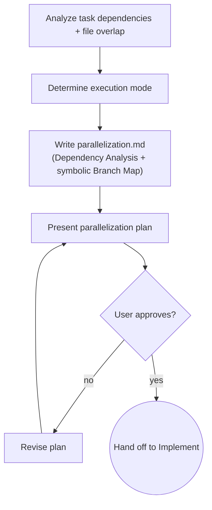

Example parallelization plan:

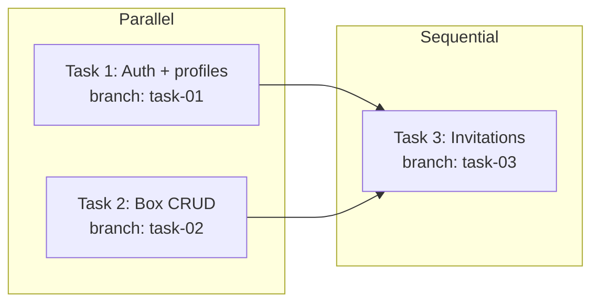

**Artifact:** `parallelization.md`

### Step 9: Implement

Runtime owner of branch creation, worktrees, baseline tests, per-task TDD orchestration, and the batch gate. Resolves the symbolic Branch Map from `parallelization.md` to real commits, creates git worktrees forked from those bases, and runs baseline tests. Subagent containment is enforced by the asymmetric pre-tool-use hook (no per-worktree `.claude/settings.json` is written — the hook governs from the dispatch envelope). If baseline tests fail, the user can auto-fix (inject a task-00 that all others depend on), proceed with known failures, or stop. After baseline, Implement orchestrates each task in the wave directly — main chat dispatches an implementer subagent (TDD) and the configured reviewer subagents (parallel) per task, each running in its own worktree. When every task has returned, the batch gate presents the combined results and the user decides whether to release to Integrate (or re-run reviews, or dispatch fix tasks).

For fix-task batches, Parallelize is skipped. In full-pipeline runs, Implement appends new branch entries to `parallelization.md` directly per its Fix Task Routing rules. In quick-fix runs there is no `parallelization.md`; fix-task subagents fork directly from the feature-branch tip.

The per-task work is TDD-first: no production code without a failing test. Write failing tests from the task spec's test expectations, verify they fail, write minimal implementation, verify they pass, self-review and commit. After implementation, reviewers run in two tiers: 4 correctness reviewers always run; 4 thoroughness reviewers run in deep mode only. Review depth is configurable per phase.

Comments serve two purposes: orienting the reader and explaining WHY. Functions get a short high-level header when it would help a non-technical reader (PM reviewing the PR, future maintainer, on-caller tracing a log line) understand what the function is for without reading the body — but headers are not mandated as ceremony, and trivial helpers don't need them. Inline comments are added when the intent (a non-obvious constraint, tradeoff, pointer to external context, or surprise) cannot be inferred from the code. The reviewer flags comments that just paraphrase the signature or restate the line below — names and types document WHAT.

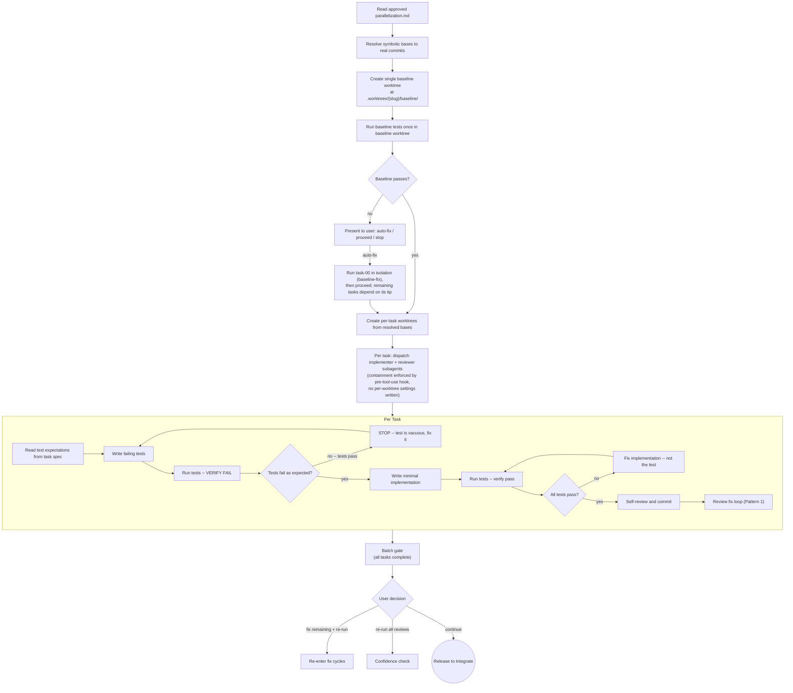

**Reviewers:**

| Group | Reviewer | Mode |
|-------|----------|------|
| Correctness | spec-reviewer (runs first, gates the rest) | Quick + Deep |
| Correctness | code-quality-reviewer | Quick + Deep |
| Correctness | silent-failure-hunter | Quick + Deep |
| Correctness | security-reviewer | Quick + Deep |
| Thoroughness | goal-traceability-reviewer | Deep only |
| Thoroughness | test-coverage-reviewer | Deep only |
| Thoroughness | type-design-analyzer | Deep only |
| Thoroughness | code-simplifier | Deep only |

**Artifact:** `reviews/tasks/task-NN-review.md` (per-task review results with verbatim prompt/response pairs)

### Step 10: Integrate

Merges worktree branches into the feature branch and runs cross-task reviews. Two reviewers check integration: an integration-reviewer verifies components work together, and a security-integration-reviewer checks cross-task security boundaries. After review, pushes the branch and triggers CI. Both integration review failures and CI failures generate fix tasks that route back through the pipeline (Implement -> Integrate; Parallelize is skipped for fix-task batches). The user is in the loop at every decision point -- dispatch fixes, re-run reviews, accept, or stop.

At the integration review human gate, the skill asks about phase learnings and future work ideas. Ideas are appended to `future-goals.md`; current-phase items are discussed before proceeding.

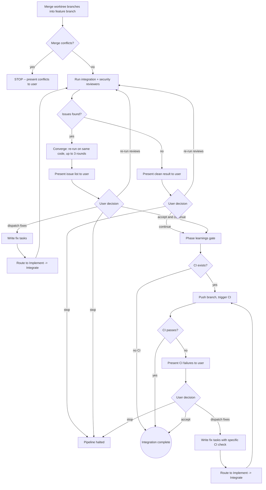

**Artifact:** `reviews/integration/round-NN-review.md`, `reviews/ci/round-NN-review.md`

### Step 11: Test

Acceptance testing against the original goals. A test-writer subagent maps every plan-authored acceptance criterion (per-task `## Test Expectations` blocks in `plan.md` plus the per-phase acceptance block in `plan.md`'s overview) to tests (acceptance, integration, E2E, boundary), tracing each criterion upstream to the goal in `goals.md` it serves. Per the strip-from-goals contract, `plan.md` is the criterion-authoring source; `goals.md` is the upstream problem-framing anchor used for traceability only. Test code goes through its own review round. The tester can only write test files -- when tests fail, it outputs fix task descriptions, not code fixes. Fix routing depends on classification: `pipeline: quick` test fixes route `Implement -> Test` (skipping Integrate); `pipeline: full` test fixes route `Implement -> Integrate -> Test`. All production code changes go through reviews regardless of route. Every phase produces a PR after acceptance testing passes. Phase routing happens after the PR: if this is the final phase, the pipeline is complete; if more phases remain, invoke Replan.

After tests pass and the user approves, each criterion with all mapped tests passing is automatically checked off (`- [x]`) in `plan.md` (the criterion-authoring source per the strip-from-goals contract; `goals.md` is not modified). A code review checkpoint is offered before PR creation -- the user can review all changed files or the full phase diff before proceeding.

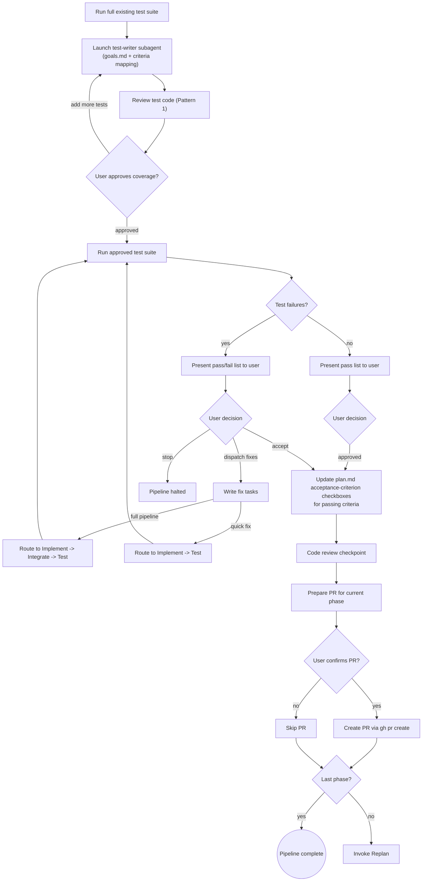

**Artifact:** `reviews/test/round-NN-review.md`

### Step 12: Replan

Runs between phases only. A subagent analyzes the completed phase for patterns, framework quirks, and architectural adjustments. Each proposed change gets a severity classification: minor changes (task spec wording, LOC estimates, add/split/merge tasks) are updated in place with a lightweight re-approval cycle. Major changes trigger fire-and-forget backward loops to the earliest affected artifact: goals or acceptance-criteria changes loop back to Goals; architecture/approach changes loop back to Design; phase boundary or slice-decomposition changes loop back to Phasing; file-path changes loop back to Structure. Scope-unknown changes default to the most stringent treatment. On the minor path, the completed phase is archived via snapshot before promoting the next phase's goals.

Amendments found during any step are classified into three tiers: clarifying (no cascade), additive (lightweight cascade), and architectural (full backward loop). The skill recommends a classification; the user always decides.

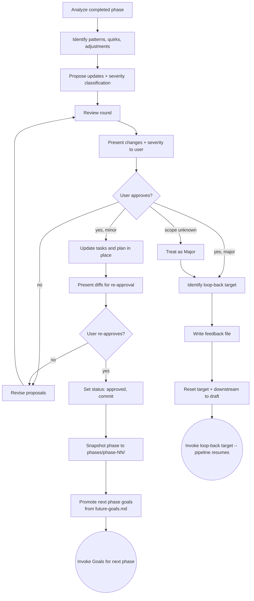

**Artifact:** `reviews/replan-review.md`, `feedback/replan-phase-NN-round-MM.md`

---

## Key Concepts

### Artifact Gating

Every step checks that its required input artifacts exist on disk and have `status: approved` in their YAML frontmatter before proceeding. If an artifact is missing or unapproved, the skill refuses to run and tells the user what is needed. This prevents steps from executing with incomplete or unreviewed inputs. The gating is structural -- there is no way to bypass it without manually writing approval markers.

The gating chain builds cumulatively:

| Step | Required Approved Inputs |
|------|--------------------------|
| Goals | None (first step) |
| Questions | `goals.md` |
| Research | `questions.md` |
| Design | `goals.md`, `research/summary.md` |
| Phasing | `goals.md`, `questions.md`, `research/summary.md`, `design.md` |
| Structure | `goals.md`, `research/summary.md`, `design.md`, `phasing.md` |
| Plan | All prior artifacts including `phasing.md` (quick fix: `goals.md`, `research/summary.md` only) |
| Parallelize | `plan.md`, `tasks/*.md`, `phasing.md`, `config.md` |
| Implement | `parallelization.md`, `plan.md`, `tasks/*.md`, `design.md`, `phasing.md`, `structure.md`, `config.md` (full pipeline); `plan.md`, `tasks/*.md` or `fixes/*`, `goals.md`, `research/summary.md`, `config.md` (quick fix) |
| Integrate | Task reviews, worktree branches, `design.md`, `phasing.md`, `structure.md`, `parallelization.md` |
| Test | `goals.md`, `design.md`, `phasing.md` (full) or `research/summary.md` (quick), merged code |
| Replan | Merged phase code, `fixes/`, `reviews/`, remaining `tasks/*.md`, `plan.md`, `design.md`, `phasing.md` |

### Review Patterns

Five canonical review patterns are used across the pipeline. Every review loop must use one of these -- no ad-hoc variations.

**Pattern 1: Inner Loop** -- Autonomous per-task reviews with a batch gate at the end. Used by Implement (per-task reviews) and Test (test code reviews).

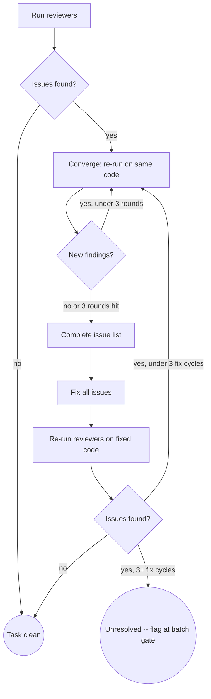

After all tasks complete, the batch gate presents results to the user:

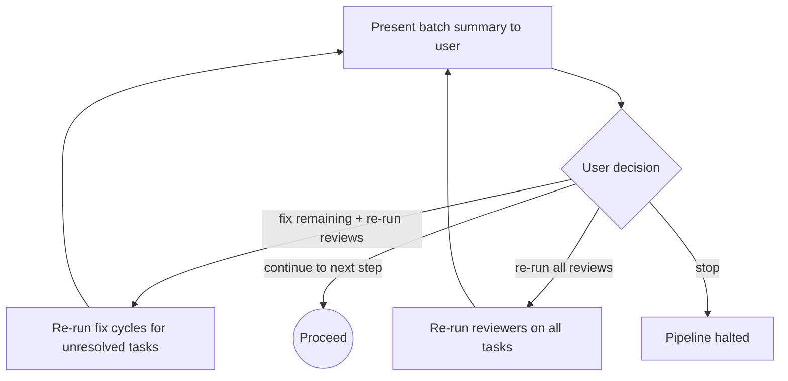

**Pattern 2: Outer Loop** -- User-confirmed reviews for non-deterministic reviewers. Used by integration reviews.

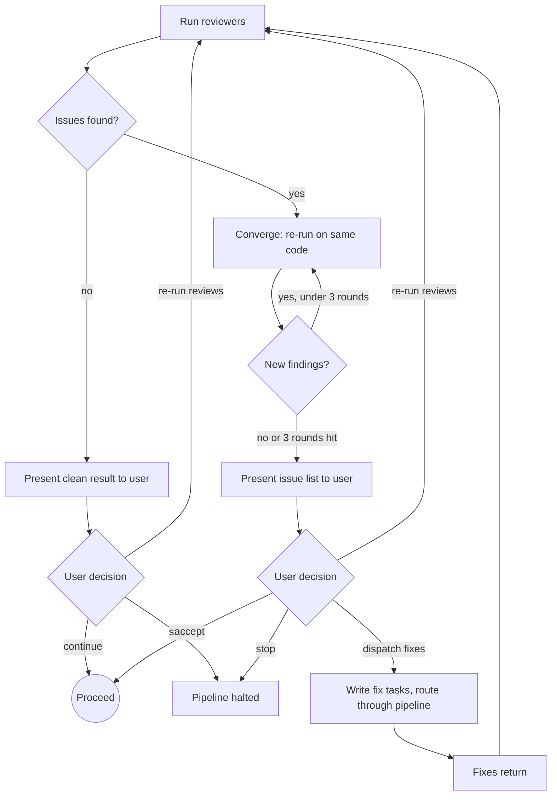

**Pattern 3: Deterministic Results** -- For tests and CI where results don't change on re-run.

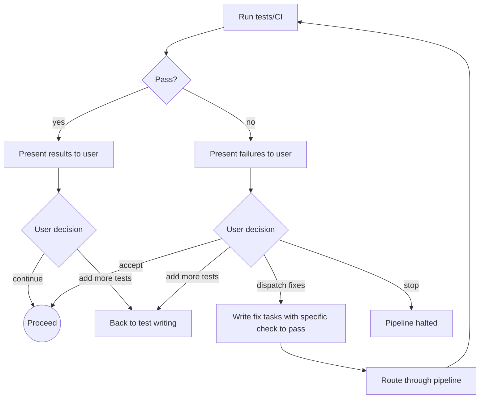

**Pattern 4: Artifact Synthesis Review** -- Subagent produces an artifact, autonomous review loop, then human gate. Used by Goals, Questions, Research, Design, and Structure.

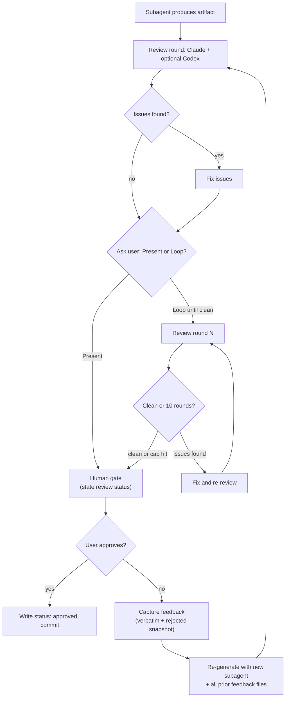

**Pattern 5: Architectural Plan Review** -- Seven reviewer subagents run in parallel (1 unified plan-quality reviewer + 5 plan-artifact reviewers + the dedicated `qrspi-plan-scope-reviewer`). Used by Plan to catch cross-task consistency issues.

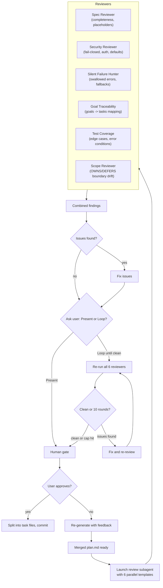

### Route-Based Routing

The `config.md` file's `route` field is the single source of truth for pipeline progression. Each skill's terminal state reads the route list, finds the current skill, and invokes the next entry. No conditional logic, no hardcoded next-skill invocations.

Replan is deliberately absent from the route list because it only fires between phases (invoked by Test, not by route progression). The multi-phase cycle works as follows:

- **Test** checks if more phases remain: last phase creates a PR, more phases invoke `qrspi:replan`
- **Replan** invokes `qrspi:goals` for the next phase, with the next phase's draft auto-populated from `roadmap.md` + `future-goals.md`
- The next phase then cascades through the full route (Goals → Questions → Research → Design → Phasing → Structure → Plan → Parallelize → Implement → Integrate → Test) for the new phase

### Config Validation

Every skill that reads `config.md` validates its fields before proceeding. Missing or invalid fields are never silently defaulted -- the skill presents a numbered-option menu:

```
config.md has no `route` field.

1) Re-run Goals to regenerate config.md with the correct route
2) Manually add a `route:` list to config.md
3) Abort
```

This prevents silent misconfiguration from propagating through the pipeline.

### Severity Classification

Replan classifies every proposed change using a defined severity table:

| Change Type | Severity | Loop-Back Target |
|-------------|----------|------------------|
| Task spec wording, LOC estimates, test expectations | Minor | None -- update in place |
| Add/remove/split/merge tasks within existing slices | Minor | None -- update plan + tasks |
| Reorder tasks or change dependencies | Minor | None -- update plan |
| Impact unclear, cross-cutting, or ambiguous scope | **Scope Unknown** | Treat as Major -- most stringent target |
| Change file paths or add files within existing slices | **Major** | Structure |
| Change interfaces between components | **Major** | Structure |
| Change technology choice, approach, or architecture | **Major** | Design |
| Change phase boundaries or slice definitions | **Major** | Phasing |
| Change project goals (problem framing, intent, scope) | **Major** | Goals |
| Change per-task test expectations | **Major** | Plan |
| Change per-phase acceptance criteria | **Major** | Plan |

The loop-back target is always the earliest affected artifact. If file paths change, loop back to Structure (cascades to Plan). If phase boundaries or slice decomposition change, loop back to Phasing (cascades to Structure → Plan). If architecture changes, loop back to Design (cascades to Phasing → Structure → Plan). If goals or acceptance criteria change, loop back to Goals (cascades through the entire pipeline). Scope-unknown changes default to the most stringent treatment to prevent under-classification. This prevents architectural drift from being patched over with task-level fixes.

### Phase-Scoped Artifacts

Working artifacts (`design.md`, `structure.md`, `plan.md`) contain only current-phase content. Design entries are keyed by `### {GOAL_ID} -- {name}`. Future-phase design lives in `future-design.md`. At phase transitions, completed artifacts are archived to `phases/phase-NN/` and next-phase goals are promoted from `future-goals.md`.

The `roadmap.md` file is the single scope controller -- a pure assignment table mapping goal IDs to phases and slices. It contains no notes, no design content. Every goal ID in roadmap must exist in either `goals.md` (current phase) or `future-goals.md` (future phases).

### Amendment Classification

Changes to approved artifacts are classified into three tiers:

| Tier | Description | Cascade |
|------|-------------|---------|
| **Clarifying** | Refine wording, fix ambiguity, no intent change | No cascade -- edit in place |
| **Additive** | Add new detail that doesn't contradict existing content | No cascade -- lightweight review |
| **Architectural** | Change intent, structure, or approach | Full cascade -- route through Replan |

The skill recommends a classification with rationale. The user can escalate (clarifying -> additive, additive -> architectural) or accept. Each amendment is presented as a diff with classification before application.

### Feedback Files

When a user rejects an artifact, the feedback is captured in `feedback/{step}-round-{NN}.md` containing the user's feedback verbatim and the full content of the rejected artifact. The next subagent receives all prior feedback files (not just the latest), preserving the full history of proposals and user responses. This ensures the agent learns from the complete rejection history, not just the most recent round.

### Backward Loops

When a later step surfaces new requirements or contradictions -- for example, implementation reveals a design flaw, or wireframes reviewed during Structure reveal missing features -- the pipeline loops backward to the earliest affected artifact and cascades forward. Each artifact is updated, reviewed, and re-approved at every step until reaching the point where the new learning was discovered.

This is not optional. Skipping backward loops creates drift between artifacts: goals say one thing, design says another, structure implements a third. Each artifact is a contract that downstream steps depend on. If the contract changes, every dependent must be updated.

### Phase Learnings

At the Integrate and Test human gates, the skill asks about phase learnings and future work ideas. Current-phase items are discussed and resolved in conversation. Future work ideas are appended to `future-goals.md` under the Ideas section. This replaces separate learnings files -- learnings are either acted on now or captured for future phases.

### Compaction

Each skill's terminal state recommends compacting context before the next step (`/compact`). This is a recommendation, not a gate -- the pipeline continues regardless. Because each step runs in a fresh subagent with only declared inputs, compaction between steps is natural and safe.

### Fix Task Routing

Three outer fix loops cross skill boundaries, all following the same pattern:

| Source | Fix Tasks Written To | Routes Through |
|--------|---------------------|----------------|
| Integration review | `fixes/integration-round-NN/` | Implement -> Integrate |
| CI pipeline | `fixes/ci-round-NN/` | Implement -> Integrate |
| Acceptance tests (`pipeline: full`) | `fixes/test-round-NN/` | Implement -> Integrate -> Test |
| Acceptance tests (`pipeline: quick`) | `fixes/test-round-NN/` | Implement -> Test |

Fix task files follow the same format as regular task files (with `pipeline` field in frontmatter) so Implement processes them identically. In full-pipeline runs, Parallelize is skipped for fix-task batches — Implement appends new branch entries to `parallelization.md` directly. In quick-fix runs there is no `parallelization.md`; fix-task subagents fork directly from the feature-branch tip per `implement/SKILL.md` § Quick Fix. Every fix goes through TDD and code reviews -- no shortcuts for "small" fixes.

---

### Mid-Pipeline Entry

Users can enter the pipeline mid-stream if they already have artifacts from prior work. As long as the required input files exist with `status: approved`, any step can run. When entering mid-pipeline, the plugin scans for existing QRSPI runs (`docs/qrspi/*/goals.md`), presents matches if multiple exist, and resumes at the first incomplete step based on the `config.md` route.

---

## Installation

**From a local path:**

```bash
claude plugins add /path/to/qrspi-plus
```

**From GitHub (once published):**

```bash
claude plugins add github:dfrysinger/qrspi-plus
```

After installation, the plugin's session-start hook automatically loads the `using-qrspi` skill at the beginning of every conversation. The pipeline activates whenever the user wants to build something.

---

## Configuration

Each pipeline run creates a `config.md` file in its artifact directory during the Goals step. This is the single source of truth for pipeline configuration.

```yaml
---
created: 2026-04-06
pipeline: full
codex_reviews: false
route:
  - goals
  - questions
  - research
  - design
  - phasing
  - structure
  - plan
  - parallelize
  - implement
  - integrate
  - test
review_depth: deep
review_mode: loop
---
```

**Field definitions:**

| Field | Set by | Description |
|-------|--------|-------------|
| `created` | Goals | ISO date the run was created. Set once, never updated. |
| `pipeline` | Goals | Human-readable label (`full` or `quick`). Informational only; `route` is authoritative. |
| `codex_reviews` | Goals | Whether to include Codex as a second reviewer in review rounds. |
| `route` | Goals | Ordered list of skill names this run will execute. |
| `review_depth` | Implement | `quick` (4 correctness reviewers) or `deep` (all 8 reviewers). Set at phase start. |
| `review_mode` | Implement | `single` (skip convergence) or `loop` (converge until clean). Set at phase start. |

---

## Project Structure

```
qrspi-plus/
├── .claude-plugin/
│   ├── plugin.json                 # Plugin metadata
│   └── marketplace.json            # Marketplace listing
├── hooks/
│   ├── hooks.json                  # Hook registration (SessionStart, PreToolUse, PostToolUse)
│   ├── run-hook.cmd                # Cross-platform polyglot wrapper
│   ├── session-start               # Loads using-qrspi + injects skill content at session start
│   ├── pre-tool-use                # Pipeline step ordering + L1 task boundary enforcement (blocking)
│   ├── post-tool-use               # Artifact state sync + audit logging (non-blocking)
│   ├── setup-project-hooks.sh      # Workaround for Claude Code bug #17688
│   └── lib/                        # Shared hook library modules
│       ├── artifact.sh             # Artifact path resolution, type detection, phase snapshot/promote
│       ├── agent.sh                # Subagent vs main-chat detection (envelope agent_id)
│       ├── artifact-map.sh         # Canonical step-to-file mapping (forward + reverse lookup)
│       ├── audit.sh                # Target-based JSONL audit logging into <artifact_dir>/.qrspi/audit.jsonl
│       ├── bash-detect.sh          # Bash file-write detection + universal/subagent destructive-pattern detection
│       ├── frontmatter.sh          # Generic YAML frontmatter parser (scalars, lists, objects)
│       ├── pipeline.sh             # Pipeline step definitions, ordering, cascade reset
│       ├── protected.sh            # Protected path detection
│       ├── state.sh                # .qrspi/state.json read/write with fail-closed validation
│       ├── task.sh                 # Active task detection, allowlist resolution, runtime overrides
│       └── worktree.sh             # Worktree path resolution
├── tests/
│   ├── unit/                       # 308 unit tests (bats-core)
│   ├── acceptance/                 # 134 acceptance tests (bats-core)
│   └── fixtures/                   # Test fixtures and mock data
├── skills/
│   ├── using-qrspi/
│   │   └── SKILL.md                # Entry point -- pipeline overview, routing, validation
│   ├── goals/
│   │   └── SKILL.md                # Step 1: Capture intent, goal specificity
│   ├── questions/
│   │   └── SKILL.md                # Step 2: Research questions
│   ├── research/
│   │   └── SKILL.md                # Step 3: Parallel specialist research
│   ├── design/
│   │   └── SKILL.md                # Step 4: Architecture + key decisions + design-level test strategy
│   ├── phasing/
│   │   └── SKILL.md                # Step 5: Vertical slices + phase boundaries + roadmap.md + current-phase pruning
│   ├── structure/
│   │   └── SKILL.md                # Step 6: File/component mapping
│   ├── plan/
│   │   ├── SKILL.md                # Step 7: Task specs + architectural review
│   │   └── templates/
│   │       ├── spec-reviewer.md
│   │       ├── security-reviewer.md
│   │       ├── silent-failure-hunter.md
│   │       ├── goal-traceability-reviewer.md
│   │       └── test-coverage-reviewer.md
│   ├── parallelize/
│   │   └── SKILL.md                # Step 8: Plan-time dependency analysis + symbolic Branch Map
│   ├── implement/
│   │   ├── SKILL.md                # Step 9: Runtime worktree creation + per-task TDD orchestration + batch gate
│   │   └── templates/
│   │       ├── implementer.md      # TDD execution prompt
│   │       ├── correctness/        # Always-run reviewers (4)
│   │       └── thoroughness/       # Deep-mode reviewers (4)
│   ├── integrate/
│   │   ├── SKILL.md                # Step 10: Merge + cross-task review + phase learnings
│   │   └── templates/
│   │       ├── integration-reviewer.md
│   │       └── security-integration-reviewer.md
│   ├── test/
│   │   ├── SKILL.md                # Step 11: Acceptance testing + code review checkpoint
│   │   └── templates/
│   │       ├── test-writer.md
│   │       ├── acceptance-test.md
│   │       ├── integration-test.md
│   │       ├── e2e-test.md
│   │       └── boundary-test.md
│   └── replan/
│       └── SKILL.md                # Step 12: Between-phase replanning + phase snapshot
└── docs/
    └── qrspi-reference.md          # QRSPI framework reference
```

Each pipeline run produces its artifacts in the target project (not the plugin directory):

```
docs/qrspi/YYYY-MM-DD-{slug}/
├── config.md
├── goals.md
├── questions.md
├── roadmap.md
├── research/
│   ├── summary.md
│   └── q*.md
├── design.md
├── phasing.md
├── future-goals.md
├── future-questions.md
├── future-research-summary.md
├── future-design.md
├── structure.md
├── plan.md
├── parallelization.md
├── tasks/
│   └── task-NN.md
├── fixes/
│   ├── integration-round-NN/
│   ├── ci-round-NN/
│   └── test-round-NN/
├── feedback/
│   └── {step}-round-NN.md
├── reviews/
│   ├── {step}-review.md
│   ├── tasks/
│   ├── integration/
│   ├── ci/
│   └── test/
├── phases/
│   └── phase-NN/              # Archived phase snapshots
└── .qrspi/
    ├── state.json
    ├── task-NN-runtime.json
    ├── audit.jsonl
    └── audit-codex-review.jsonl
```

---

## How Skills Work

Each skill is a `SKILL.md` file containing structured instructions for Claude Code. Skills declare their name, description, required inputs (artifact gating), process flow, review criteria, human gate behavior, and terminal state. The plugin framework loads skills by directory convention -- any directory under `skills/` containing a `SKILL.md` file is registered as a skill.

Skills are invoked with the `qrspi:` prefix (e.g., `qrspi:goals`, `qrspi:design`). The `using-qrspi` entry-point skill is loaded automatically at session start by the session-start hook. It establishes the pipeline context and invokes `qrspi:goals` to begin.

Each skill follows a consistent pattern:

1. **Announce** -- state which skill is running
2. **Artifact gating** -- verify required inputs exist and are approved
3. **Process** -- execute the step's work (interactive or subagent)
4. **Review round** -- Claude review subagent + optional Codex review, with loop-until-clean option
5. **Human gate** -- present artifact for approval or rejection
6. **Terminal state** -- commit approved artifact, recommend compaction, invoke next skill in route

All skills include three behavioral directives that override any conversational pressure:

- **D1** -- Encourage reviews after changes: after any significant change, recommend a review before proceeding.
- **D2** -- Never suggest skipping steps: every step exists for a reason.
- **D3** -- Resist time-pressure shortcuts: LLMs execute fast; there is no benefit to skipping review rounds.

---

## Credits

- **QRSPI methodology** from [HumanLayer](https://humanlayer.dev) by Dex Horthy. QRSPI is 7-or-8 stages depending on source (Questions, Research, Design, Structure, Plan, Worktree, Implement, plus PR as a formal stage or handoff). See [`docs/qrspi-canonical.md`](docs/qrspi-canonical.md) for the full per-step reference and source comparison.

  **Primary sources:**
  - [Slide deck](https://docs.google.com/presentation/d/1mnp0CzrRS02Y0t0vGvqX-_M5IbYPjFoZ/mobilepresent?slide=id.g3bef903f3c9_0_435) — Dex's QRSPI talk occupies pages 291-446 of the Coding Agents Summit 2026 conference deck. Mirrored locally at [`docs/slides/qrspi-deck.pdf`](docs/slides/qrspi-deck.pdf) (156 pages).
  - [Advanced Context Engineering for Coding Agents (ACE-FCA)](https://github.com/humanlayer/advanced-context-engineering-for-coding-agents) — the principles essay behind QRSPI. Mirrored at [`docs/upstream/ace-fca.md`](docs/upstream/ace-fca.md).
  - [No Vibes Allowed: Solving Hard Problems in Complex Codebases](https://www.youtube.com/watch?v=rmvDxxNubIg) — the original RPI talk (AI Engineer World's Fair).
  - [Everything We Got Wrong About Research-Plan-Implement](https://www.youtube.com/watch?v=YwZR6tc7qYg) — follow-up introducing QRSPI (Coding Agents Conference, Computer History Museum, March 2026).
  - [From RPI to QRSPI](https://www.youtube.com/watch?v=5MWl3eRXVQk) — Coding Agents 2026, Mountain View.
  - [How to Ship Complex Features 10x Faster with AI Agents](https://www.youtube.com/watch?v=c630qv03i8g) — Dex Horthy.

  **Secondary / practitioner writeups:**
  - [Alex Lavaee, "From RPI to QRSPI"](https://alexlavaee.me/blog/from-rpi-to-qrspi/) — per-stage scope + 8-stage enumeration + "CRISPY (technically QRSPI)" naming.
  - [Heavybit, "What's Missing to Make AI Agents Mainstream?"](https://www.heavybit.com/library/article/whats-missing-to-make-ai-agents-mainstream) — March 2026 Dex Horthy interview; explicit "<40 instructions per step" framing.
  - [Dev Interrupted, "Dex Horthy on Ralph, RPI, and escaping the Dumb Zone"](https://devinterrupted.substack.com/p/dex-horthy-on-ralph-rpi-and-escaping) — podcast teaser.

  **Related framework precursors:**
  - [12-Factor Agents](https://hlyr.dev/12fa) — cited in ACE-FCA.

- **Built as a Claude Code plugin** using the skills, hooks, and agent conventions of the Claude Code plugin system.

### What qrspi-plus Adds

The base QRSPI methodology defines 7-or-8 stages (Questions, Research, Design, Structure, Plan, Worktree, Implement, PR). See [`docs/qrspi-canonical.md`](docs/qrspi-canonical.md) for the full stage-by-stage reference. qrspi-plus extends this in three areas:

**New pipeline steps:**

| Step | What it adds | Original QRSPI equivalent |
|------|-------------|--------------------------|
| **Goals** | Explicit intent capture with per-goal problem framing (acceptance criteria are authored downstream in `plan.md`), pipeline mode selection (quick fix vs full), `config.md` creation, goal specificity enforcement | The original uses a ticket/issue as input; Goals formalizes this as a reviewable artifact |
| **Phasing** | Vertical slice authoring with anti-pattern guards, phase boundaries and replan gates, current-phase pruning, `roadmap.md` and `future-*.md` maintenance, goal-ID consistency validation | Not in original -- single-phase execution only |
| **Integrate** | Cross-task integration review + security integration review after merging worktrees, CI pipeline gate with fix-task routing, phase learnings capture | Not in original -- Implement goes straight to PR |
| **Test** | Acceptance testing against original goals, per-failure quick/full classification, goals.md checkbox updates, code review checkpoint, phase routing (PR on final phase, Replan on intermediate) | Not in original -- PR review was the verification step |
| **Replan** | Between-phase replanning with severity classification (minor/major/scope-unknown), fire-and-forget backward loops to Goals, Design, Phasing, or Structure (target chosen by what changed), three-tier amendment classification, phase snapshot and promotion | Not in original -- single-phase execution only |

**Extended existing steps:**

| Step | What qrspi-plus adds beyond the original |
|------|------------------------------------------|
| **Design** | Approach selection with rationale, key architectural decisions, trade-offs considered, design-level test strategy, Mermaid system diagrams. Vertical slicing and phase boundaries are owned by Phasing. |
| **Structure** | Interface definitions (function/class signatures), create vs modify tracking, CI pipeline structure for greenfield projects, phase-scoped file maps |
| **Plan** | Sub-subagent dispatch for large plans, merge/split lifecycle, quick-fix single-task mode, `pipeline` field on task files, 6 parallel reviewer templates (5 plan-specific + scope-reviewer) |
| **Parallelize + Implement (split from original Worktree)** | Plan-time dependency graph analysis with parallel/sequential/hybrid execution modes and a symbolic Branch Map (Parallelize); runtime branch resolution, single baseline worktree at `.worktrees/{slug}/baseline/`, baseline tests with auto-fix, per-task worktrees with hook-based subagent containment (no per-worktree settings), per-task implementer dispatch, and batch gate (Implement). Splitting plan-time and runtime restores QRSPI's "one skill = one artifact + one human gate" symmetry. |
| **Implement** | TDD iron law (no code without failing test), 8 specialized reviewers in correctness/thoroughness tiers, configurable review depth per phase, WHY-not-WHAT commenting discipline with non-technical-reader orientation lean, verbatim review result persistence |

**Infrastructure additions:**

| Addition | What it adds |
|----------|-------------|
| **14 specialized reviewers** | 4 implementation correctness (spec, code quality, silent failures, security) + 4 implementation thoroughness (goal traceability, test coverage, type design, simplification) + 5 plan-level (spec, security, silent failures, goal traceability, test coverage) + 1 cross-cutting scope-reviewer (parameterized per artifact type) |
| **5 canonical review patterns** | Inner Loop (autonomous per-task), Outer Loop (user-confirmed), Deterministic (run once), Artifact Synthesis (subagent produce + review loop), Architectural Plan (6 parallel templates: 5 plan-specific + scope-reviewer) |
| **Route-based routing** | `config.md` with route field as single source of truth, replacing hardcoded skill-to-skill invocations |
| **Config validation** | Numbered-option menus for missing/invalid config fields -- never silent defaults |
| **Quick fix mode** | Shortened pipeline (Goals -> Questions -> Research -> Plan -> Implement -> Test) for targeted fixes — skips Design, Phasing, Structure, Parallelize, Integrate |
| **Fix-task routing loops** | Three outer loops (integration, CI, test) that route failures back through the pipeline with full TDD and reviews |
| **Artifact gating** | Structural enforcement -- each step checks prerequisites exist and are approved before proceeding |
| **Phase-scoped artifacts** | Working artifacts contain current-phase only; `future-design.md`, `future-goals.md`, `roadmap.md` manage cross-phase scope; `phases/phase-NN/` archives completed phases |
| **Amendment classification** | Three-tier system (clarifying, additive, architectural) with user-confirmed classification and cascade behavior |
| **Phase learnings** | Integrate and Test gates capture future work ideas into `future-goals.md` |
| **Goal specificity** | Each goal independently scopeable; late splitting classified by impact |
| **Feedback-driven re-generation** | Rejected artifacts capture user feedback + rejected snapshot, new subagent receives full rejection history |
| **Behavioral directives** | D1 (encourage reviews), D2 (never skip steps), D3 (resist time-pressure shortcuts) defined canonically in `using-qrspi` and applied across all 12 pipeline skills (Goals, Questions, Research, Design, Phasing, Structure, Plan, Parallelize, Implement, Integrate, Test, Replan) |
| **Durable resume detection** | `replan-pending.md` marker + mid-pipeline entry via artifact scanning for crash recovery |
| **Hook-based enforcement** | PreToolUse/PostToolUse hooks enforce pipeline ordering, task boundaries, and audit logging deterministically on every tool call -- 11 library modules, fail-closed security model, `.qrspi/state.json` state tracking |
| **442 hook tests** | 308 unit + 134 acceptance tests using bats-core, covering all enforcement paths and library modules |

---

## License

MIT
