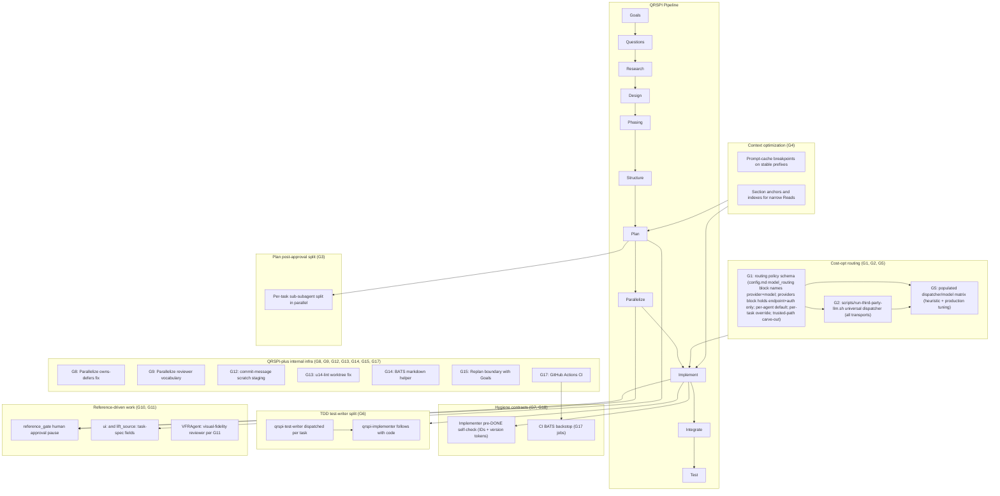

# Design: QRSPI v0.7 Release

This draft records the design decisions approved during the interactive Design discussion. It is written for downstream QRSPI agents that will create Phasing, Structure, Plan, Parallelize, Implement, Integrate, and Test artifacts.

## Approved goal decisions

### G1 — Cost-opt routing policy schema

#### What research found

`agents/qrspi-{role}.md` files already carry a `model:` frontmatter field that Claude Code reads at agent-activation time. Dispatch-time overrides already exist in four patterns:

- Hardcoded inline `model: "sonnet"` in dispatch sites.
- Implement reads per-task `model:` from `tasks/task-NN.md`.
- Test reads `test_writer_model:` from `plan.md`.
- The verifier and scope-tagger use frontmatter-only `model: haiku`.

Other agent frameworks (Claude plugins, OpenHands, Aider) use per-component `model` fields. AutoGen and LangGraph use constructor-injected model clients. OpenHands also uses named TOML profiles (`[llm.<name>]`) referenced by agent sections.

There is no environment-variable model surface today. No QRSPI run-level model routing exists today.

#### Recommendation

Build a four-layer routing schema.

1. **Per-agent default in agent-file frontmatter.** Already exists; extend ADDITIVELY with a `model_role:` key (for example, `model_role: lightweight-implementer`) so agent files name a role in addition to keeping a concrete `model:` value. `model_role:` does NOT replace the concrete `model:` frontmatter — the agent file MUST still carry a concrete `model:` value as the activation-time fallback, because Claude Code resolves agent defaults from concrete `model:` frontmatter at activation time (per research summary). Model assignment can then change via the role map without editing every agent file, while activation-time resolution remains intact.

   **Model-resolution chain at dispatch time:**
   1. Per-invocation override passed by the orchestrator. This layer has two explicit sub-layers with a strict tie-breaker:
      - **1a:** Per-task `model:` field on the task spec (e.g., `tasks/task-NN.md` frontmatter). Highest priority — the task author's per-task choice wins over any orchestrator default.
      - **1b:** Hardcoded dispatch-site `model:` override in orchestrator code (e.g., inline `model: "sonnet"` at a dispatch call site). Applied only when 1a is absent.
   2. Otherwise: if the agent file declares a `model_role:` AND `config.md`'s `model_routing:` (the role map) resolves it to a concrete provider+model, use the resolved concrete model.
   3. Otherwise: fall back to the agent file's concrete `model:` frontmatter (preserves the current Claude Code activation behavior).

   **Normalization note.** Existing hardcoded dispatch-site `model:` overrides in orchestrator code remain valid; they are simply reclassified as layer-1b defaults rather than top-priority resolutions. Once `tasks/task-NN.md` carries a `model:` field for a given dispatch, that layer-1a value overrides any layer-1b hardcoded override at the same dispatch site. No mass code rewrite is required to land this rule — preserving the hardcoded overrides as layer-1b is the migration path.
2. **Per-task override in `tasks/task-NN.md` frontmatter.** Already exists for the implementer; generalize so any per-task field named `model:` overrides the agent's default for that one dispatch.
3. **Per-run defaults in `config.md`** under a new `model_routing:` block. Maps roles to concrete provider + model pairs for this run. Each entry takes the form `<role>: { provider: <provider-name>, model: <model-id> }`. The `model:` value is the single source of truth for which concrete model identifier resolves at dispatch time.
4. **Trusted-path carve-out list in `config.md`.** A flat list of agent files or roles that must stay on Anthropic-native models regardless of the routing config above. The list always wins.

Precedence: per-task `model:` > hardcoded dispatch-site `model:` > per-run `model_routing:` > per-agent `model:` > built-in default. Trusted-path carve-out is checked separately and short-circuits the precedence chain.

**No conditional routing in v0.7.** Conditional routing is an extensibility point reserved for future goals. The v0.7 routing schema is unconditional (no `condition:` clauses, no predicate vocabulary, no `condition:` schema slot). Future goals that need conditional routing will add the schema slot alongside concrete predicates and dispatch-site consumers, so that each new key arrives with a concrete consumer rather than a YAGNI-flavored placeholder. Trusted-path carve-outs in v0.7 are also unconditional — they short-circuit before any other layer. Note: citation-density enforcement for `qrspi-research-specialist` (see G5) is NOT a pre-dispatch predicate — citation density is a property of specialist OUTPUT and is therefore handled as a post-dispatch output validator at the dispatch site, not via routing-schema machinery. This is why v0.7 ships no `condition:` slot.

**Provider configuration is separate.** `config.md` carries a `providers:` block listing the endpoint URL, the environment variable name to read for the API key, optional default headers, and a `supports_prompt_cache: true|false` capability flag (default false). The `supports_prompt_cache:` flag indicates whether the provider's API accepts vendor-specific prompt-cache control fields. When false, the shell shim omits any cache metadata; when true, the shim emits the provider's documented cache-control fields. Default false to keep the dispatcher portable across OpenAI-compatible providers that reject unknown fields. The `providers:` block does NOT carry the model identifier — model identifiers live in `model_routing:` only. The `model_routing:` block references provider names; it does not embed endpoint or auth details. This matches the OpenHands TOML-profile pattern.

**Trusted-path carve-out defaults.** Default contents include `qrspi-implementer` (TDD judgment-heavy), all reviewer agents (review independence), and orchestrator-side dispatch sites such as the replan analyzer. Plan will finalize the full list once the dispatcher inventory from G5 is known.

#### Compatibility — legacy config.md without routing fields

A `config.md` written before v0.7 has no `model_routing:` or `providers:` blocks. Resumed runs must keep working without forcing the user to edit `config.md` to land:

- If `model_routing:` is absent from `config.md`, all dispatches route to the trusted path (Anthropic models). No cheap-path dispatch occurs without explicit configuration.
- If `providers:` is absent, only the default trusted-path provider (Anthropic) is available. Any `model_routing:` entry referencing a missing provider fails loudly at run start (existing fail-loud rule).
- At run resume, the orchestrator emits a one-time warning when `model_routing:` is absent: "config.md has no model_routing block; all dispatches will use the trusted path. Re-run Goals to add cost-opt routing."
- No auto-mutation of `config.md`. The user invokes Goals (or hand-edits) to add the blocks. This matches the no-backcompat-cruft preference — runtime-backfill default, not perpetual compatibility logic.

#### Trade-offs considered

| Option | What it gives | Why rejected or accepted |
|---|---|---|
| **Pure per-agent `model: deepseek-chat` field, no layers** | Simplest. One source of truth per agent. | Loses the runtime-override capability the Implement task-frontmatter pattern already proves valuable. Forces edits across many agent files to swap models for a single run. |
| **Per-call inline override only, no config layer** | Lowest mechanism cost. | Every dispatch site reinvents routing. The goal's "shared policy layer" requirement fails. |
| **Single flat `config.md` map, no agent-file roles** | Conceptually clean. | Breaks the existing `model:` frontmatter pattern that `qrspi-finding-verifier.md` and others already use. Forces migration of every agent file in scope of the change. |
| **Four-layer schema with role indirection (accepted)** | Preserves existing patterns. Lets a run override per-task without editing agent files. Lets a single agent serve multiple runs with different model assignments via role-to-model mapping in config. | More moving parts than option 1. Worth it because the alternative is editing every agent file each time routing changes. |

#### Where the schema applies

The list of which dispatch sites consume which layer is owned by Structure and Plan. Design owns the schema and the precedence rule.

#### Test strategy at the design level

- Schema test: `config.md` parses with valid and invalid `model_routing:` and `providers:` blocks.
- Precedence test: when all four layers are set, the per-task value wins; when only three are set, the next-priority layer wins; and so on.
- Trusted-path test: when a trusted-path entry matches, the carve-out wins over every other layer.
- Provider-resolution test: a `model_routing:` entry that names a provider not in the `providers:` block fails loudly at run start.
- Legacy-config test: a `config.md` without `model_routing:` or `providers:` resumes successfully; all dispatches route to the trusted path; the resume warning is emitted exactly once per resume.
- Model-role resolution test: an agent file with `model_role: cheap_reviewer` AND `model: sonnet` resolves to `deepseek-v3` at dispatch when `config.md`'s `model_routing.cheap_reviewer` maps to `deepseek-v3`; remove the `cheap_reviewer` entry from `model_routing:` and the same agent resolves to `sonnet` via the concrete-`model:` fallback (both resolution paths verified).
- Layer-1 sub-precedence test: a task whose `tasks/task-NN.md` carries `model: opus` dispatching through a call site with a hardcoded `model: "sonnet"` override resolves to `opus` (layer 1a wins over layer 1b); a task with no `model:` field on its task spec dispatching through the same call site resolves to `sonnet` (layer 1b active in the absence of 1a). Both cases verified in the same fixture so the tie-break is not silently lost.

### G2 — Cost-opt dispatch mechanism

#### What research found

The existing pattern is the Codex companion: `scripts/run-codex-review.sh` plus `scripts/codex-companion-bg.sh`. The wrapper assembles prompts and pipes them to a long-running launch-and-await broker. The contract uses stdin-only prompt input, a five-source result extraction chain, fail-loud numbered exit codes (0, 1, 10, 11, 13, 14, 15), and a disk-state fallback for jobs not found in the broker.

Most OpenAI-compatible providers (DeepSeek, Mistral, Together, Fireworks, xAI, Groq, Anthropic) expose `POST /v1/chat/completions` with `messages`, `model`, OpenAI-like parameters, `choices`, `usage`, and SSE `data: [DONE]` termination. Request shape is highly consistent. Error response shape is not.

#### Recommendation

Ship a single universal shell dispatcher: `scripts/run-third-party-llm.sh`. It serves both OpenAI Chat Completions providers (DeepSeek, Mistral, Together, Fireworks, xAI, Groq, etc.) and the Codex companion broker, dispatching via a `transport_type:` field on each provider's `config.md` entry. The dispatcher is parameterized on `--provider`, `--model`, and `--output-file`. The prompt is read from stdin (piped into the script). This matches the Codex companion broker's stdin-only contract (per research summary Q3: the legacy `--prompt-file` argument form was retired in the #110 migration and now exits 1 if passed). Provider configuration (base URL, environment variable name for API key, default headers, transport type) resolves at call time from `config.md`'s `providers:` block. The `--model` flag value is supplied by the calling QRSPI skill, which sources it from `model_routing:` resolution per G1; the model identifier is not part of provider configuration. The `--provider` flag also selects which `providers:` entry's `api_key_env` and `transport_type:` are honored at call time.

**Universal blocking contract.** The dispatcher ALWAYS blocks until `--output-file` is populated, regardless of transport type. For `codex-broker` transport, the script internally chains `codex-companion-bg.sh launch` followed immediately by `codex-companion-bg.sh await` against the returned jobId, then writes the awaited result to `--output-file`. For `openai-chat-completions` transport, the script blocks on the HTTPS response. Callers see one symmetric blocking contract: prompt in on stdin → result in `--output-file` on exit 0. Callers that want async behavior compose with Bash `run_in_background: true` — the symmetric blocking contract composes naturally with shell backgrounding, no special async API needed.

**Transport-type vocabulary.** Two values ship in v0.7:

- `transport_type: codex-broker` — the dispatcher internally chains `codex-companion-bg.sh launch` and `codex-companion-bg.sh await` against the returned jobId, then writes the awaited result to `--output-file`. The launch/await/JSONL lifecycle is owned by `codex-companion-bg.sh`; the dispatcher hides the chaining behind the universal blocking contract.
- `transport_type: openai-chat-completions` — direct HTTPS call to `<base_url>/chat/completions` with OpenAI-compatible request shape. Blocks until the response is written to `--output-file`.

`codex-companion-bg.sh` is preserved as the Codex broker runtime — it continues to own the async launch/await/JSONL lifecycle. Only the user-facing wrapper script `run-codex-review.sh` retires; Codex becomes one transport among N declared in `providers:`.

The stdin-only prompt contract, numbered exit-code contract, `--output-file` contract, and key-resolution rules apply uniformly across both transports. Factor the shared prompt-composition utilities currently in `run-codex-review.sh` (frontmatter strip, marker-injection guard, dispatch-parameter emission) into a shared library file consumed by the universal dispatcher so we do not fork copies of that logic.

Error handling follows the same numbered exit-code contract as the Codex companion: 0 success, 1 validation, 10 timeout, 11 not-found, 13 result hard-error, 14 malformed, 15 phantom-launch. Failures are loud. The script never silently falls back to a different model. The calling QRSPI skill decides whether fallback to the trusted path is allowed for this dispatch, per the policy from G1.

**API-key management:** environment-variable indirection. Each provider in `config.md` names an environment variable, for example `api_key_env: DEEPSEEK_API_KEY`. The script resolves the variable at call time. Keys never appear in `config.md` itself. This matches the OpenAI-compatible CLI patterns research surfaced.

The dispatcher omits prompt-cache metadata unless the selected provider's `supports_prompt_cache:` flag is true. This preserves portability across OpenAI-compatible providers (DeepSeek, Mistral, Together, Fireworks, xAI, Groq, etc.) that may reject unrecognized request fields.

#### Trade-offs considered

| Option | What it gives | Why rejected or accepted |
|---|---|---|
| **In-process wrapper in Node.js or Python** | Better streaming and structured error handling. | Adds a runtime dependency the constraints forbid without explicit Design justification. QRSPI's batch-style dispatches do not need streaming. Shell can do non-streaming chat completions adequately. |
| **One script per provider** | Each provider's quirks isolated. | Duplicates plumbing. The OpenAI-compatible request shape is convergent enough that one parameterized script is cleaner. Provider-specific quirks belong in the `providers:` block, not in separate scripts. |
| **Reuse the existing Codex companion script directly as the third-party dispatcher** | Zero new shell code. | Reclassified at round-17 supplementary disposition: the prior rejection ("couples third-party LLM routing to Codex-specific behavior") assumed reuse-as-is. With the `transport_type:` abstraction adopted below, that coupling argument no longer applies — Codex is a peer transport, not a special case. The reuse-as-is option remains rejected for a different reason: it would skip the universal dispatcher entry point and leave the third-party providers without a shared call surface. |
| **One parameterized OpenAI-compatible script (rejected)** | Single dispatcher for OpenAI-compatible providers. Provider variation handled via config. | Previously accepted at earlier rounds; superseded by the universal-dispatcher decision at round-17 supplementary disposition gate. This option would have left Codex as a special case requiring a separate wrapper, defeating the "one mental model, one smoke-test loop" win. |
| **Single universal dispatcher with `transport_type:` config (accepted; user-directed at round-17 supplementary disposition gate)** | One entry point. Codex is one of N transports declared in `providers:`. Async-vs-sync dispatch handled by transport adapters; user-facing skill API is symmetric across all providers. Win: one mental model, one smoke-test loop covers all providers, eliminates the special-case Codex wrapper. | Cost: an internal branch on `transport_type:` inside the dispatcher, and the existing `run-codex-review.sh` wrapper retires (callers move to the universal dispatcher). `codex-companion-bg.sh` is preserved as the broker runtime. Shell limits structured error handling; mitigated by the numbered exit-code contract and disk-state fallback already proven in the Codex companion. |

#### Fallback behavior

When G1's policy for the dispatch says "cheap path with fallback allowed," the script returns non-zero and the calling skill catches and re-dispatches to the trusted path. When G1's policy says "cheap path required," the non-zero exit is fatal. The `model_routing:` policy in G1 declares this per role.

#### Test strategy at the design level

- Smoke test: for each provider listed in `config.md`'s `providers:` block (including the Codex provider entry), dispatch a small prompt through `run-third-party-llm.sh`, piping the prompt on stdin. Verify the response lands in `--output-file` and the exit code is 0. One loop covers all transports.
- Transport-type test: both transports block until `--output-file` is populated. A provider entry with `transport_type: codex-broker` internally chains `codex-companion-bg.sh launch` and `codex-companion-bg.sh await`, then writes the awaited result to `--output-file`. A provider entry with `transport_type: openai-chat-completions` blocks on the HTTPS response. Smoke test confirms `--output-file` is populated on exit 0 for every provider listed in `config.md`. Both transports share the stdin-only prompt contract and the numbered exit-code contract.
- Stdin-only test: invoking the script with any positional argument or a `--prompt-file` flag exits 1 (validation failure), matching the broker's stdin-only contract.
- Exit-code test: simulate each failure case (validation, timeout, not-found, result hard-error, malformed, phantom-launch). Verify the matching numbered exit code.
- Fail-loud test: the script never returns 0 with empty output. Loud diagnostics on stderr for each failure.
- Key-resolution test: a missing or empty environment variable named in `providers:` causes a validation failure (exit 1) at call time, not a silent attempt with an empty Authorization header.
- Provider-capability test: a provider with `supports_prompt_cache: false` produces no cache metadata in the request body; a provider with `supports_prompt_cache: true` emits the provider's documented cache-control fields.

### G3 — Plan post-approval split → sub-subagent

#### What research found

`skills/plan/SKILL.md` already documents "Sub-Subagent Dispatch (Large Plans Only)" for plan **generation** — one sub-subagent per task. The post-approval split, which writes `tasks/task-NN.md` files and rewrites `plan.md` to overview-only, currently happens in main chat. Bounded inputs are: the merged `plan.md` body, the task-file template embedded in the skill, and the ID-hygiene contract from G7.

#### Recommendation

Reuse the generation-side sub-subagent dispatch shape for the post-approval split. One sub-subagent per task, dispatched in parallel. Each sub-subagent receives the merged `plan.md` task section as wrapped input, the canonical task-file template from `skills/plan/SKILL.md`, and the ID-hygiene contract from G7. Each sub-subagent writes one `tasks/task-NN.md` file.

Main chat retains the transactional steps:

1. Collect sub-subagent confirmations.
2. Verify the resulting file count matches the expected task count.
3. Rewrite `plan.md` to overview-only (sub-subagents do not edit `plan.md`).
4. Capture `phase_start_commit:` in `plan.md` frontmatter.
5. Write `status: approved` to `plan.md` frontmatter.

This ordering preserves the existing contract that downstream skills never see an approved `plan.md` without corresponding `tasks/task-NN.md` files on disk.

**Small-plan carve-out:** when `plan.md` has 2 tasks or fewer, do the split in main chat. Sub-subagent overhead exceeds the cost saving below that threshold. Threshold widened from goals.md's N=1 to N=2 because a plan with exactly 2 tasks still fits in main chat context comfortably (combined LOC + task spec < 600 lines based on a design-time synthesis using Q6/Q7's documented task-file template structure (typical task spec ~150-200 lines; combined two-task plan + specs estimated at <600 lines)); the subagent overhead exceeds the context saving below N=3.

#### Trade-offs considered

| Option | What it gives | Why rejected or accepted |
|---|---|---|
| **One mega-sub-subagent that splits all tasks in one dispatch** | Simpler dispatch shape. | Loses the per-task parallelism that is the entire point of the split. A single sub-subagent splitting N tasks costs roughly the same as main chat doing it serially. |
| **Keep the split in main chat, just add `/compact` recommendation** | What we have today. | The goal explicitly identifies this as insufficient. The cost is not the post-split context; it is the cost of holding the full plan plus the task-file template plus the ID-hygiene contract plus the conversation history in main chat for the duration of the split. |
| **Per-task sub-subagent in parallel with small-plan carve-out (accepted)** | Per-task parallelism. Main chat stays light. The carve-out avoids overhead-larger-than-saving cases. | More dispatch surface to maintain. Mitigated by reusing the existing generation-side dispatch shape. |

#### Test strategy at the design level

- Multi-task test: a plan with three or more tasks dispatches sub-subagents in parallel and produces one `tasks/task-NN.md` per task.
- Single-task test: a plan with one task does the split in main chat and still produces a `tasks/task-NN.md`.
- Boundary test (N=2): a plan with exactly two tasks does the split in main chat (within the carve-out) and produces two `tasks/task-NN.md` files.
- Transactional test: after the split completes, `plan.md` is approved AND all `tasks/task-NN.md` files exist. If any sub-subagent fails to write, `plan.md` is not approved.
- `phase_start_commit:` test: after approval, `plan.md` frontmatter contains a `phase_start_commit:` value.

### G4 — Context optimization for repeated long-file reads

#### What research found

Long stable files (`reviewer-protocol/SKILL.md`, individual agent bodies, `implementer-protocol/SKILL.md`) are re-read across many dispatches in a single QRSPI run. Q8 confirmed prompt composition repeatedly includes the same long stable files.

Three published mechanisms surfaced in research:

- **Provider-level prompt caching.** Anthropic supports explicit `cache_control` breakpoints with 5-minute and 1-hour TTLs. Azure OpenAI auto-caches prompts of 1024 tokens or more. Vertex AI defaults to 60-minute TTL with usage metadata.
- **Framework-level summarization or extraction.** Some agent frameworks summarize long context into shorter input. None of these frameworks publishes a freshness or accuracy contract for the summary.
- **Narrow file Reads.** Read a specific line range or section of a long file instead of the whole file.

Anthropic guidance is explicit: summaries should not replace source-of-truth reads.

#### Recommendation

Use two complementary mechanisms. Reject the third.

**Mechanism A — Anthropic prompt caching.**

Treat this as two separate work surfaces because Claude Code Agent dispatches and shell-shim dispatches behave differently:

- For Claude Code Agent-tool dispatches: the working hypothesis is that Claude Code's Agent-tool dispatch path already caches stable system-prompt prefixes (agent body, preloaded skill files, CLAUDE.md) automatically, per general provider patterns surfaced in research. This is NOT confirmed for the QRSPI-specific dispatch path. A Plan-time spike resolves the hypothesis:
  - If the dispatch path DOES cache automatically, Mechanism A on this surface reduces to instrumenting hit-rate measurement via request-level usage metadata at the dispatch sites that matter, validating cache efficacy, and keeping prompt prefixes stable (avoiding edits that invalidate the cache between dispatches in the same run).
  - If the dispatch path does NOT cache automatically (to be verified during the Plan-time spike), Mechanism A on this surface also includes adding the caching mechanism at the Anthropic SDK boundary (Anthropic-style `cache_control` markers on stable prefixes) BEFORE the measurement step. G4 scope expands accordingly.
  - **Spike contract:**
    - **Deliverable:** a one-page report at `docs/qrspi/2026-05-17-v07-release/spikes/g4-cache-probe.md` showing (a) whether `Agent({})` dispatch responses include Anthropic cache-hit metadata (`cache_creation_input_tokens` / `cache_read_input_tokens`), and (b) hit rate on stable system-prompt prefixes across 3 reviewer dispatches.
    - **Success criterion:** measurable `cache_read_input_tokens > 0` on second-and-later dispatches with an identical system prefix.
    - **Failure path:** if no cache metadata is exposed (or hit rate is zero on identical prefixes), G4 scope expands to add `cache_control` markers at the Anthropic SDK boundary; Plan authors that as a separate task.
    - **Blocking:** G4 implementation tasks are blocked on spike completion. Other goals are NOT blocked on this spike.
- For shell-shim dispatches: explicit cache-control markers go in the request body only when the selected provider's `supports_prompt_cache:` flag is true. Codex companion targets Anthropic-compatible cache contracts and sets supports_prompt_cache: true; OpenAI-compatible providers default to false. Stable-prefix composition still helps providers with automatic prompt caching; only the explicit cache fields are gated by the capability flag.

The two surfaces share the same intent (cache the stable prefix, vary the per-dispatch tail). They do not share an implementation. Plan should treat them as two tasks.

**Mechanism B — narrow Reads via a section-anchor index.**

When an agent only needs one section of a long file (for example, a reviewer reading only the `## Reviewer Dispatch Contract` section of `reviewer-protocol/SKILL.md`), it should Read a specific line range, not the whole file.

The index is a small JSON-shaped file per stable artifact, refreshed when the artifact changes, mapping section heading to `{line_start, line_end}`. An agent that wants a section looks up the range from the index, then uses the existing `Read(offset, limit)` to fetch just those lines. The content the agent sees is verbatim, just sliced.

Index refresh details (when, where, by which mechanism) are deferred to Structure and Plan.

**Explicitly rejected — summary shims.**

A summary shim is an LLM-generated condensation that becomes the prompt input in place of the original file. Research found no framework that publishes a freshness contract for derived prompt inputs. The risk is that the summary drifts from the source file and the agent reasons against stale or partly invented content. Summaries can exist for human-facing surfaces (a digest of a long doc for a reader), but they must not feed agent prompts where the agent reasons or edits against them.

#### Trade-offs considered

| Option | What it gives | Why rejected or accepted |
|---|---|---|
| **Cache-only (no narrow Reads)** | Simplest. One mechanism. | Loses the savings where an agent only needs one section of a 1000-line file. Anthropic prompt cache rewards stable prefixes but does not help when the agent still has to load the entire file each time. |
| **Narrow Reads only (no cache)** | Verbatim slices, no implementation work for caching. | Misses the cross-dispatch savings on the stable prefix that is identical across dozens of dispatches in one run. The prompt cache is already half-working for free on Claude Code Agent dispatches; not using it leaves savings on the floor. |
| **Summary shims as primary mechanism** | Largest token reduction. | Source-of-truth drift risk. No framework publishes a freshness contract. Goals.md flagged this explicitly. |
| **Both A and B (accepted)** | Cross-dispatch caching of the stable prefix plus narrow Reads when only a slice is needed. Both keep the content verbatim. | Two mechanisms instead of one, but they cover different cost surfaces and do not conflict. |

#### Where each mechanism applies

The detailed site-by-site decision (which dispatch uses the cache, which uses narrow Reads, which loads the full file) is deferred to Structure and Plan. Design owns the mechanism contract and the rejection of summary shims.

#### Test strategy at the design level

- For prompt cache, verify usage metadata shows cache hits at the dispatch sites Plan flags as cache-eligible.
- For narrow Reads, verify that agents using the section-anchor index Read only the expected line ranges and that the assembled content is byte-identical to the corresponding source slice.
- For the rejection of summary shims, the test is a code search that confirms no agent dispatch site is feeding LLM-generated summaries of stable artifacts back into prompts as source-of-truth.
- Capability-gated cache test: shell-shim dispatch to a provider with `supports_prompt_cache: false` succeeds without emitting cache_control fields.

**Plan-time spike (Mechanism A hypothesis resolution).** The spike tests are organized by path so the reader can tell which test runs unconditionally, which is conditional on path A (caching already active), and which is conditional on path B (cache_control needs adding).

- **Spike (always runs):** the cache-probe report deliverable at `docs/qrspi/2026-05-17-v07-release/spikes/g4-cache-probe.md`. Measurement criterion: across 3 reviewer dispatches with an identical system prefix, the response usage metadata is inspected for Anthropic cache-hit fields (`cache_creation_input_tokens` / `cache_read_input_tokens`). The report records whether the metadata is exposed and the observed `cache_read_input_tokens` value on second-and-later dispatches.
- **Path A (caching already active):** verification-only tests. Hit-rate measurement on stable system-prompt prefixes (assert `cache_read_input_tokens > 0` on second-and-later dispatches with an identical prefix). No cache enablement work; Mechanism A on the Claude Code Agent-tool surface reduces to instrumentation plus keeping prefixes stable.
- **Path B (cache_control required):** add-cache-then-verify tests. Cache_control marker insertion at the Anthropic SDK boundary on stable prefixes, followed by the same hit-rate measurement as Path A after insertion. G4 scope expands to include the marker-insertion task before measurement.

### G5 — Dispatcher tolerance research

#### What research found

The QRSPI dispatcher inventory includes the lightweight implementer (prose, doc, config), the research collator (mechanical verbatim extraction), the research specialist (bounded factual research), the test-writer, and the general-purpose agent. The original research scope (q01, q02, q09, q28) named DeepSeek-V3 and Kimi K2 as candidate cheap models with strong reported capability on factual extraction and routine code tasks.

Q11/Q27 surveyed the broader literature: cheap-model substitution generally tolerates well-bounded mechanical tasks (extraction, transformation, structured rewriting) and tolerates poorly on open-ended judgment, multi-step planning, or tasks with implicit shared context.

#### Recommendation

Populate the routing matrix through **heuristic categorization plus production tuning via G1's schema**. Do not build an A/B replay harness.

The initial matrix this release ships with:

| Dispatcher class | Initial routing | Reasoning |
|---|---|---|
| `qrspi-research-collator` | Cheap-model eligible | Verbatim extraction is exact-match testable. The collator's contract is mechanical; cheap models reliably handle this. |
| `qrspi-implementer-lightweight` | Cheap-model eligible | Prose, doc, and config edits without TDD. Bounded scope. Cheap models reliably handle this. |
| `qrspi-research-specialist` | Cheap-model eligible (with post-output citation-density validation) | Bounded factual research with explicit citation requirements. Pre-dispatch routing is unconditional cheap-model dispatch; citation density is a property of the specialist's OUTPUT and cannot be evaluated at dispatch time. The dispatch site post-validates the specialist's output for citation density and, on a below-threshold result, re-runs the same prompt on the trusted model. This keeps cheap-model routing in force for the typical case while preserving an output-quality gate. |
| General-purpose / Explore | Conditional. Trusted path by default; cheap-eligible only via explicit G1 task-level override | Mixes bug localization with summarization and benefits from strong reasoning. Safer to default to trusted and let specific dispatches opt in. |
| `qrspi-test-writer` | Cheap-model eligible (both modes) | Standalone test-writer dispatches are bounded enough to tolerate cheap models regardless of mode. Mode distinction is preserved in agent behavior but does not affect model routing. |

**Production tuning, not A/B replay.** The matrix is the starting state. Instrument fix-cycle counts and review-finding categories per task. After roughly 30 v0.7 runs, compare cheap-model dispatches against trusted-path dispatches on the same dispatcher class. If a class shows higher fix-cycle counts or higher review-finding density on the cheap path, narrow that class to conditional or to trusted path via G1's `model_routing:` block. The matrix is a living config, not a one-time benchmark.

#### Trade-offs considered

| Option | What it gives | Why rejected or accepted |
|---|---|---|
| **A/B replay against the v0.6 corpus** | Strongest signal before bulk migration. Reproducible. | The user explicitly rejected this. Cheap-model decisions are reversible via G1's schema; the cost of building an A/B harness exceeds the cost of recovering from a bad routing choice in production. Production observation is good enough when reversibility is cheap. |
| **No initial matrix — leave all dispatchers on trusted path** | Zero risk. | Defers the entire cost-opt goal. Misses the easy wins (collator, lightweight) where cheap models clearly handle the work. |
| **Universal cheap-by-default with carve-outs** | Maximum cost savings up front. | Routes work to cheap models where the tolerance is unknown. Risks blowing fix-cycle budgets on tasks that needed trusted-path reasoning. The carve-out list grows quickly under this default. |
| **Heuristic matrix + production tuning (accepted)** | Captures the easy wins immediately. Reversible via G1. No A/B harness cost. | Less rigorous than A/B replay. Mitigated by G1's reversibility and by instrumenting fix-cycle metrics. |

#### Conditional cells

A matrix cell can read "yes", "no", or "conditional". In v0.7, "conditional" is a documentation marker only — it signals "trusted path by default; cheap-eligible only via explicit per-task `model:` override" (e.g., the General-purpose / Explore row). There is no `condition:` schema slot in G1, and v0.7 ships no pre-dispatch predicate vocabulary; the "conditional" label simply records that cheap-path eligibility requires explicit opt-in for that class. Future goals that need real pre-dispatch predicates will add the schema slot in G1 alongside concrete predicates and dispatch-site consumers. The `qrspi-research-specialist` row uses a different mechanism — a post-dispatch output validator (citation density) — because that property is not knowable until the specialist runs. Post-output validation lives at the dispatch site as part of G5's research-specialist contract, separate from routing.

#### Citation-density validator specification

The `qrspi-research-specialist` post-output gate referenced in the matrix is parameterized by one new `config.md` key. Plan may tune the default; Design fixes the contract.

- **Config key:** `validators.citation_density_floor:` — lives under a new `validators:` block in `config.md`.
- **Default value:** `0.05` (one citation per 20 lines of research output). Round-number conservative default; Plan can tune from production data.
- **Computational definition:** density = (citation count) / (total non-blank line count) of the specialist's `q*.md` output. A **citation** is any one of: a `Q\d+` reference (e.g., `Q12`), an external URL (any `https?://...` match), or a `file:line` reference (e.g., `path/to/file.ts:42`). The validator counts each match once per occurrence.
- **Enforcement loop:** below-floor output triggers exactly ONE re-run of the same prompt against the trusted model. The re-run output is used regardless of its own density (no infinite loops). The re-run event is recorded once per specialist invocation in the dispatch instrumentation.

#### Test strategy at the design level

- Matrix-application test: for each dispatcher class, the dispatch site actually consults the matrix and dispatches to the cheap or trusted path as the matrix says.
- Carve-out test: a trusted-path entry in `config.md` overrides the matrix's cheap routing for that dispatcher.
- Conditional-cell label test: a matrix cell marked "conditional" routes by default to the trusted path; the cheap path is reached only when a per-task `model:` override explicitly opts in. No `condition:` schema slot is required (the "conditional" label is documentation only in v0.7).
- Citation-density post-validation test: a `qrspi-research-specialist` dispatch produces output whose citation density falls below the configured floor — the dispatch site detects the shortfall and re-runs the same prompt on the trusted model; a dispatch whose output meets the floor proceeds without re-run. The cheap-model dispatch itself is unconditional; the gate is on the OUTPUT, not the dispatch decision.
- Citation-density floor-default test: with `validators.citation_density_floor: 0.05` (the v0.7 default), specialist output with density 0.03 (e.g., 3 citations across 100 non-blank lines) triggers exactly one trusted-model re-run; specialist output with density 0.06 proceeds without re-run. The re-run event is recorded once in the dispatch instrumentation (no infinite re-run loop on repeated below-floor output).
- Instrumentation test: fix-cycle counts and review-finding categories are captured per task with the routing decision recorded, so the matrix can be tuned from real data.

### G6 — Test-writer subagent investigation

#### What research found

Q10/Q12/Q17/Q20 found the QRSPI pipeline already splits test writing from code writing at the Test phase. The `qrspi-test-writer` agent exists. It is dispatched at the Test phase with `companion_plan` as the criterion source. The Implement phase, by contrast, dispatches a single subagent that writes both code and tests in one pass.

Q11/Q27 documented that joint authoring of code and tests by a single model risks confirmation bias: vacuous assertions match the bug rather than the spec. The Test phase exists in QRSPI specifically to add an independent test-writing layer. The Implement phase reintroduces the joint-author dynamic that the Test phase was designed to avoid.

`task_type: lightweight` already explicitly disables TDD: the agent body for `qrspi-implementer-lightweight` instructs no test scaffolding, no failing-test-first, and no test-code authoring. Lightweight tasks have no test surface to split.

#### Recommendation

Split test writing from code writing at the Implement phase for every TDD task. Universal for `task_type: code` (or absence of `task_type:`, which defaults to the TDD path). Lightweight tasks unchanged.

**Agent-contract change required.**

The current `qrspi-test-writer` agent body is Test-phase-only (per research summary): it expects `companion_plan` as the criterion source and produces acceptance/integration/e2e/boundary tests against `plan.md`. It does NOT today accept `task_definition` or operate in a per-task Implement-phase mode.

To support this split, `qrspi-test-writer` MUST be extended to a dual-mode contract keyed by the PRESENCE of `task_definition` in the dispatch payload — mirroring the existing per-task reviewer dual-mode pattern (where the same reviewer agent body handles both phase-level and per-task dispatches based on a payload signal):

- **Implement-phase mode (signal: `task_definition` present).** New mode. Writes per-task pre-implementation failing tests against the task spec, into `output_dir`. Inputs and behavior detailed in the dispatch-shape section below.
- **Test-phase mode (signal: `task_definition` absent).** Existing mode, preserved unchanged. Writes phase-level acceptance tests against `companion_plan` criteria.

The agent body itself must branch on `task_definition` presence and route to the correct mode. This is an agent-body edit, not just an orchestration change. Plan/Implement own the agent-body edit; Design owns the dual-mode contract specification.

**Dispatch shape on the TDD path:**

1. **qrspi-test-writer Implement-phase mode (signal: `task_definition` present).** Implement dispatches `qrspi-test-writer` first with `task_definition` present (the agent body uses this as the per-task-mode signal, mirroring the per-task reviewer reuse pattern). Dispatch parameters: `task_definition` (the task spec), `companion_goals`, `companion_codebase_context` (target files identified in the task spec), `output_dir` (where the task's test files land per Structure's file map). NO `companion_plan`, NO `companion_design_or_research`, NO `companion_fix_history` (Plan provides per-task spec via `task_definition`; Implement-phase scope is per-task, not phase-level; initial-dispatch only — fix-cycle dispatches re-use the round-1 inputs and add a defect summary, per existing reviewer pattern). Behavior: write unit/integration tests that fail against the un-implemented task spec to `output_dir`. The agent does NOT run the tests.

2. **qrspi-test-writer Test-phase mode (signal: `task_definition` absent).** Existing parameter set unchanged (`companion_plan`, `companion_goals`, `companion_design_or_research`, `companion_fix_history`, `companion_codebase_context`, `output_dir`). Behavior unchanged: writes acceptance/integration/e2e/boundary tests against `companion_plan` criteria.

3. **qrspi-implementer behavior in split mode.** When dispatched after `qrspi-test-writer` for a TDD task, the implementer treats the prewritten failing tests in `output_dir` as the RED input. It does NOT author duplicate RED tests. Its TDD cycle becomes: verify the test-writer's tests fail → write production code to turn them green → refactor if needed.

4. **Pre-implementer RED-verification gate.** Implement (the orchestrator) runs the test-writer's tests once before dispatching `qrspi-implementer`. The orchestrator parses the test runner output and verifies a two-part predicate: (a) **at least one task-relevant assertion FAILS** on the behavior the task targets (establishes RED on the intended change), AND (b) **no test fails for infrastructure reasons** — syntax error, import/load error, fixture/setup error, missing-symbol error, or other infrastructure failure (caught by the per-framework adapter described below). Pre-passing assertions covering behavior the task does NOT change are explicitly permitted and do not pause the gate; they are reviewed for vacuousness at code-review time only if the overall suite produces zero failing assertions on the targeted change. The orchestrator pauses with a load-bearing diagnostic when (i) no assertion fails on the targeted behavior (vacuous-RED — the suite as a whole is silent about the change), OR (ii) any test fails for infrastructure reasons; the user inspects the suite and either fixes it via a fix-task or skips. This is the load-bearing pre-implementer gate that closes the protocol boundary between the two agents.

    Mechanism: the orchestrator distinguishes assertion failures from infrastructure failures (syntax errors, import errors, fixture setup errors) via a small per-framework adapter that consumes the test runner's exit code and stdout/stderr output. Initial adapter set: BATS, Vitest, Jest, pytest. The orchestrator pauses on any infrastructure-class result returned by an adapter. Plan/Implement own the per-framework adapter code; Design owns the mechanism contract (adapters return one of `pass`, `assertion-failure`, `infrastructure-failure`).

5. Per-task reviewers run after the implementer reaches DONE, as today.

**No carve-out for lightweight.** Lightweight tasks already do not use TDD and already produce no test scaffolding. The split applies cleanly to TDD tasks only with no per-type guard logic needed beyond the existing `task_type` field.

**Routing:** the test-writer half is cheap-model eligible per G5's initial matrix. The implementer half stays on the default tier (Anthropic) unless production data argues otherwise. Decoupling lets the two halves route independently.

**Reviewer surface unchanged.** Per-task reviewers (spec, code-quality, goal-traceability, plus deep-mode crew) review the combined output (code + tests) as today. No new reviewer agent is introduced. The Test phase still runs after Implement, as today, with its own independent test-writer dispatch against the merged code.

#### Trade-offs considered

| Option | What it gives | Why rejected or accepted |
|---|---|---|
| **Keep unified implementer (status quo)** | One dispatch per task; faster per-task wall clock; shared context between code and tests. | Reintroduces the confirmation-bias dynamic the Test phase exists to avoid. Per-task tests are the main safety net before reviewers see the code; trusting a single agent to write both undermines that layer. |
| **A/B replay against the v0.6 corpus** | Strongest empirical signal on whether splitting actually improves test quality. | The user explicitly rejected the A/B harness across all v0.7 work. Decision is reversible if production data shows the split hurts. |
| **Split only for high-risk tasks (carve-out)** | Preserves single-dispatch wall clock for low-risk tasks. | Adds a per-task risk classifier with no clear definition. The split's confirmation-bias rationale applies to every TDD task, not just high-risk ones. |
| **Universal split for TDD tasks (accepted)** | Independent test-author increases adversarial pressure on the implementation. Test-writer half can route to cheap model. Reuses the existing `qrspi-test-writer` with a per-task dispatch signal. | Two dispatches per TDD task instead of one. Wall-clock cost mitigated by parallelism elsewhere in the wave; per-task token cost mitigated by cheap-model routing of the test-writer. |

#### Decision validation method

After roughly 30 v0.7 runs, compare per-task reviewer findings on the two dispatch shapes' historical record. If split-TDD tasks show fewer "vacuous assertion" or "test matches buggy code" findings than unified-TDD tasks did in v0.6, the decision is validated. If not, revert via G1's per-task `task_type` plumbing (treat the unified shape as a one-off override).

#### Test strategy at the design level

- Dispatch-shape test: a task with `task_type: code` produces two dispatches in order: test-writer first, then implementer.
- Failing-tests-before-implementer test: the test files written by `qrspi-test-writer` exist on disk and fail when run against the un-implemented code, before `qrspi-implementer` dispatches.
- Pre-implementer RED-verification test (pass case, all-fail): a `task_type: code` task whose tests all fail with assertion-failure signals on the targeted behavior proceeds to implementer dispatch.
- Pre-implementer RED-verification test (pass case, mixed): a `task_type: code` task with a suite of 3 assertions — 2 pre-pass (covering unchanged behavior) and 1 pre-fails (covering the targeted change) — proceeds to implementer dispatch; the pre-passing assertions do not pause the gate because at least one task-relevant assertion fails on the targeted behavior.
- Pre-implementer RED-verification test (pause cases): the orchestrator pauses when (i) no assertion fails on the targeted behavior (vacuous-RED — e.g., a suite where all assertions pre-pass), OR (ii) any test fails for an infrastructure reason — syntax error, import error, fixture/setup error.
- Per-framework adapter test: each supported test framework (BATS, Vitest, Jest, pytest) has an adapter that returns `pass` / `assertion-failure` / `infrastructure-failure` for representative test runs.
- Lightweight bypass test: a task with `task_type: lightweight` produces only the lightweight implementer dispatch. No test-writer dispatch.
- Reviewer-surface test: per-task reviewers see the combined output (code + tests) as today. Reviewer dispatches do not change shape.
- Test-writer dual-mode contract test: a `qrspi-test-writer` dispatch with `task_definition` present (Implement-phase mode) produces pre-implementation failing tests scoped to that single task; the SAME agent dispatched without `task_definition` (Test-phase mode) produces phase-level acceptance tests against `plan.md` criteria. Both modes verified against the same agent body.

### G7 — Fix-cycle ID-hygiene leak

#### What research found

Fix-cycle implementer prompts include reviewer finding IDs (`R3-F01`), task IDs (`T07`), goal IDs (`G5`), question IDs (`Q12`), and future-goal IDs (`F-31`). Implementers have carried these internal tokens into shipped skill files, agent files, and tests while patching prose. The leak appears specifically in fix cycles because initial-dispatch prompts have no finding IDs yet.

Q13/Q14/Q21 traced the dispatch shape: the reviewer's finding-ID schema is `R<round>-F<finding>` and is canonical inside the QRSPI artifact directory. It is never meant to ship to runtime-facing files.

#### Recommendation

Combine G7 and G18 into one hygiene contract. The hygiene contract lives in `skills/implementer-protocol/SKILL.md`. Both implementers (`qrspi-implementer` and `qrspi-implementer-lightweight`) preload implementer-protocol, so one edit covers TDD and lightweight paths.

**G7 specifically forbids QRSPI internal IDs in shipped or executable files.** Internal IDs include:

- `R<round>-F<finding>` — reviewer finding IDs.
- `T<NN>` — task IDs.
- `G<N>` — goal IDs.
- `Q<N>` — question IDs.
- `F-<N>` — future-goal IDs.
- `D<N>` — design decision IDs.

Implementers describe behavior by content: skill name, file path, contract surface, canonical field name, or function name. Not by internal ID.

**Pre-DONE self-check.** Both implementers grep added lines in their commit diff against the internal-ID regex. The check runs alongside the existing target-files check. Hits are reported. The implementer either removes the token (most cases) or explicitly acknowledges the hit in the DONE report with reasoning. Advisory, not blocking.

**Path-shaped carve-outs:**

- `docs/qrspi/**` — the artifact directory IS QRSPI's internal addressing.
- Reviewer agent files (`agents/qrspi-*-reviewer.md`) — these document the finding-ID schema.
- Runtime-assembled prompts (e.g., G11 `wave_context:` payloads) are exempt — these are in-memory dispatch parameters, not shipped files. G7's hygiene scan applies to git-tracked files only.
- Inline carve-out: `<!-- id-hygiene-exempt -->` on a line skips that line. Used when a BATS test or reviewer-agent file legitimately needs the ID format in prose. Matches G18's inline-exempt pattern.

**Scope:** both initial-dispatch and fix-cycle implementations. The leak was first observed in fix cycles but task IDs and goal IDs can appear in initial dispatches too. Cheap check, broader coverage.

#### Why advisory and not blocking

An irreducible class of false positives exists. A BATS test that pins the ID format must contain the literal regex in its assertion. A reviewer-agent body that documents the ID schema must mention the schema. Blocking creates an escape-hatch arms race in spec frontmatter; advisory plus explicit acknowledgment in DONE keeps friction proportional to the actual signal.

#### Trade-offs considered

| Option | What it gives | Why rejected or accepted |
|---|---|---|
| **Pure prose guidance in implementer agents** | Cheap to add. Signals the norm. | Forgotten under fix-cycle pressure, which is exactly the context where the leak appears. The leak has already happened despite implementer agents being read-and-followed; prose alone is insufficient. |
| **Reviewer-side check** | No new implementer surface. | Consumes a fix-cycle round to surface a class of defect the implementer could catch at authoring time. Burns the implementer's fix-cycle budget. |
| **Pre-commit Git hook** | Strongest enforcement. | Lives outside QRSPI's skill system. Brittle across worktrees and CI runners. Adds dependency on host-level Git configuration. |
| **Pre-DONE self-check (advisory) plus prose contract (accepted)** | Catches the leak at the implementer's authoring time, before review. Loud signal at the right moment. Path-shaped carve-outs handle false positives. | Advisory means a determined implementer could skip the check. Mitigated by requiring explicit acknowledgment of remaining hits in the DONE report (reviewers see the acknowledgment and can flag it). |

#### Test strategy at the design level

- Forbidden-token test: an implementer dispatch that adds a line containing `R3-F01` to `skills/foo/SKILL.md` triggers a self-check hit.
- Carve-out test: a line containing `R3-F01` added under `docs/qrspi/**` does not trigger a hit.
- Acknowledgment test: the implementer's DONE report contains the acknowledgment text when a hit is allowed.
- Reviewer-visibility test: when a hit is not acknowledged, the implementer's commit still proceeds (advisory), but the next reviewer dispatch sees the unacknowledged hit and can flag it as a finding.

### G8 — Parallelize / owns-defers gap

#### What research found

`skills/parallelize/SKILL.md` requires Worktree-Aware Setup Validation and instructs the skill to surface results in `parallelization.md`. `skills/parallelize/owns-defers.md` does not list that validation as an owned responsibility. The scope-reviewer reads `owns-defers.md` as its source of truth and therefore flags the skill-mandated section as scope drift on every run. Guaranteed false-positive that costs a human-gate pause.

#### Recommendation

Add Worktree-Aware Setup Validation to `skills/parallelize/owns-defers.md` OWNS list with explicit "advisory, no auto-patch" framing. The DEFERS list keeps worktree creation, branch creation, and baseline-test execution under Implement.

**OWNS addition:**

> Worktree-Aware Setup Validation (advisory). Parallelize inspects the target repo's lint, typecheck, and test configuration for `.worktrees/**` exclusion patterns and surfaces remediation suggestions in `parallelization.md`. Configuration is not auto-patched. Implement consumes the suggestions when wiring worktrees.

**DEFERS clarification:**

> Worktree creation, branch creation, baseline-test execution, and any actual edits to lint, typecheck, or test configuration files. Parallelize surfaces remediation. Implement performs it.

**Cross-skill audit (time-boxed).** As part of G8's Implement task, grep every skill's SKILL.md for instruction patterns ("write … to <artifact>", "verify …", "surface …") and cross-check against its owns-defers.md. Mismatches that share Parallelize's pattern (skill mandates the work, owns-defers omits it) get fixed in the same task. Mismatches that need genuine scope debate get logged to `future-goals.md`.

**BATS pin.** A unit test asserts the OWNS list contains a line matching the canonical pattern. Catches a future well-meaning edit that strips the line.

**Out of scope for G8 specifically:** the broader "general SKILL ↔ owns-defers consistency mechanism" idea is a future-release tooling problem (likely a generator or linter). Logged to `future-goals.md`.

#### Trade-offs considered

| Option | What it gives | Why rejected or accepted |
|---|---|---|
| **Add the line to `owns-defers.md` only** | Solves the immediate false positive. | Doesn't prevent the next drift between SKILL.md and owns-defers.md elsewhere. The cross-skill audit catches today's same-pattern drift, the BATS pin guards against future regressions, and the broader detector is deferred. |
| **Add to owns-defers + audit all skills now** | Closes the same hole everywhere this release. | Larger scope. Each skill's audit could surface non-trivial scope debates that need user input. Mitigated by time-boxing the audit to same-pattern drift only and deferring genuine debates. |
| **Add to owns-defers + add a general consistency check** | Strongest. Catches all drift. | Hard to mechanize. Process steps and OWNS bullets are not syntactically identical. Deferred to a later release. |
| **Surgical fix + audit + BATS pin (accepted)** | Closes the immediate false positive. Catches today's same-pattern drift. Pins the Parallelize OWNS contract structurally. | Doesn't close the general class. Mitigated by deferring the general detector and logging it explicitly. |

#### Why no auto-patching of host-project configs

That crosses the "Parallelize does not mutate target repo state" invariant that keeps Parallelize idempotent and pure. Implement is the only step authorized to touch the target repo's config files.

#### Test strategy at the design level

- Owns-defers content test: the OWNS list contains the Worktree-Aware Setup Validation line.
- Reviewer-pass test: a `parallelization.md` that follows the SKILL.md process for surfacing remediation does not produce a scope-drift finding from the Parallelize scope reviewer.
- Reviewer-fail test: a `parallelization.md` that uses an actual scope-drifting pattern (for example, embedding host-repo config edits) still produces the appropriate finding.
- BATS-pin presence test: the OWNS-list unit test exists and passes.

### G9 — Parallelize reviewer vocabulary

#### What research found

The Parallelize reviewer flags valid terms (`feature branch tip`, `task-NN tip`, `stage-after-W{N}`) as style violations. The canonical source is `skills/parallelize/SKILL.md` Branch Model and Worked Example. The reviewer's vocabulary expectations live somewhere in the dispatch chain (most likely `agents/qrspi-parallelize-reviewer.md`, possibly in `skills/reviewer-protocol/SKILL.md`, possibly across both).

Q13/Q14/Q21 traced the dispatch shape with 51 file:line citations into the parallelize skill family. The v0.6 corpus exposed a multi-stage-per-wave case using `stage-after-W4a/b/c` — the vocabulary needs to be closed under that real shape.

#### Recommendation

Align the reviewer's vocabulary to `skills/parallelize/SKILL.md` (not the other way around). The skill is the authority. The reviewer is the consumer.

**Step 1 — locate the authority.** Inspect `agents/qrspi-parallelize-reviewer.md`, the `skills:` preload chain it pulls, and `skills/reviewer-protocol/SKILL.md`. Identify the actual file that lists allowed vocabulary. Most likely it is the reviewer agent body; mitigated by inspection before editing.

**Step 2 — canonical vocabulary, closed under real plan shapes:**

- `feature branch tip`
- `task-NN tip` (with `NN` as the zero-padded two-digit task number)
- `task-00 tip` (the canonical wave-W0 task)
- `stage-after-W{N}` (single-stage wave)
- `stage-after-W{N}{suffix}` where suffix is a lowercase letter `a`, `b`, `c`, ... (multi-stage wave)

**Step 3 — document the suffix grammar explicitly in `skills/parallelize/SKILL.md`'s Branch Model.** The v0.6 multi-stage case becomes a worked example, not an unmodeled edge case.

**Step 4 — BATS pin.** A unit test asserts the canonical token regex appears in both `skills/parallelize/SKILL.md` and the reviewer authority file. Catches future drift on either side.

#### Trade-offs considered

| Option | What it gives | Why rejected or accepted |
|---|---|---|
| **Update the reviewer only, leave SKILL.md alone** | Minimal edit. | Doesn't document the multi-stage-suffix grammar. The next v0.7 run that uses `stage-after-W4a` either runs into the same reviewer false positive or finds the reviewer accepts an undocumented form. Both are bad. |
| **Update SKILL.md only, leave reviewer alone** | Documents the grammar. | Reviewer still flags valid terms because reviewer-side expectations are unchanged. The false positive persists. |
| **Update both + BATS pin (accepted)** | Aligns reviewer to SKILL.md. Documents the multi-stage grammar. Pins the alignment against future drift. | More edit surface. Mitigated by the BATS pin making future drift loud. |
| **Define a single canonical disambiguation form, forbid suffixes** | Cleaner grammar. | Suffixes are already in the wild on approved v0.6 artifacts. Forbidding them retroactively churns the corpus. The suffix grammar is a small extension; documenting it is cheaper than rewriting v0.6 history. |

#### Test strategy at the design level

- Vocabulary-presence test (in both files): the BATS pin asserts canonical tokens appear in both SKILL.md and the reviewer authority file.
- Reviewer-acceptance test: a `parallelization.md` using only canonical vocabulary does not produce style findings from the Parallelize reviewer.
- Multi-stage test: a `parallelization.md` using `stage-after-W4a` is accepted (matches the documented suffix grammar).
- Drift-detection test: an artificially-introduced unconventional form (for example, `stageAfterWave4`) does produce a style finding.

### G10 — Human-gate reviewer reference inputs

#### What research found

QRSPI can ask downstream reviewers to treat a reference artifact (prototype PNG, golden output file, contract fixture) as ground truth. The reviewer's verdict is only as trustworthy as the reference. In Keeplii, prototype-reference PNGs were wrong, but the visual-fidelity reviewer compared against those wrong PNGs and passed the work. Downstream tasks then implemented, reviewed, and deployed against an invalid reference.

The QRSPI batch gate fires at the wave boundary, which is too late: dependent tasks have already shipped against the bad reference. There is no existing gate that validates the reference itself before it propagates to dependent tasks.

#### Recommendation

Add a per-task `reference_gate: true` field. Three skill responsibilities work together to make the gate effective.

**Plan owns the field.** Task spec frontmatter carries `reference_gate: true` when the task's Test Expectations include producing a reference artifact that downstream tasks' reviewers will consume. A new `reference_artifact:` key names the produced artifact path. When `reference_gate: true` is set, `reference_artifact:` MUST be present — Plan refuses to write the task spec without it. When `reference_gate:` is absent or false, `reference_artifact:` is absent. The two fields go together as a paired contract.

**Parallelize owns the wave boundary.** A `reference_gate: true` task becomes a wave-terminating task. No dependent task in a later wave can dispatch until the gate releases. Parallelize emits an explicit note in `parallelization.md` naming the gate and the dependent tasks waiting on it.

**Implement owns the human gate.** When a reference-gated task reaches DONE, Implement pauses before dispatching dependents:

1. Render the produced reference artifact to the user in a form the user can actually inspect. A path alone is NOT a valid display: the gate exists because human visual judgment is what catches a bad reference, and a path cannot be visually judged. Mechanism by artifact type (design-level contract; Plan/Implement own the exact wiring):
   - Text artifacts: Read and display inline.
   - Images (PNG, JPG, GIF, WebP, SVG): surface via `SendUserFile` (already in the toolset) or equivalent attachment mechanism so the image renders in the user's UI.
   - PDFs: surface via `SendUserFile` so the user can open inline.
   - Other binaries: each new binary artifact type requires an explicit Plan-time decision selecting a renderable display mechanism; default rejection if no rendering mechanism is defined.
2. Require an explicit "reference approved" confirmation before any dependent task dispatches.
3. Record the approval in `reviews/tasks/task-NN/reference-gate.md`.

**Design-step advisory.** Add a checklist item to `skills/design/SKILL.md`: when a design introduces a reviewer whose verdict depends on an external reference artifact, the producing task must be flagged `reference_gate: true` in Plan.

**No automated reference-correctness reviewer.** The gate is a human-in-the-loop pause. Automating reference-correctness is the very problem the gate exists to solve: a reviewer cannot validate its own reference.

#### Trade-offs considered

| Option | What it gives | Why rejected or accepted |
|---|---|---|
| **New automated reference-correctness reviewer** | Faster than human gate. | Recursive problem. The reference-correctness reviewer would itself need a reference. Doesn't solve the root cause. |
| **Reuse the existing batch gate without a per-task field** | No new task-spec surface. | The batch gate fires after the whole wave finishes. Dependent tasks in that wave have already dispatched and committed against the bad reference. The gate must fire after the producing task and before dependents dispatch. |
| **Manual pre-merge check by the user** | Zero pipeline change. | Easy to forget. The whole point of QRSPI's gates is to make important checks structural, not optional. |
| **Per-task `reference_gate: true` field with three-skill cooperation (accepted)** | Structural pause at exactly the right moment in the pipeline. Approval is recorded. Dependent tasks cannot bypass. | New task-spec field. New Implement pause logic. Mitigated by the simplicity of the contract: Plan flags it, Parallelize makes it a wave boundary, Implement pauses. |

#### Test strategy at the design level

- Plan-side test: a task that produces a reference consumed by a downstream reviewer is flagged `reference_gate: true` and carries a `reference_artifact:` path.
- Parallelize-side test: a reference-gated task ends its wave; dependent tasks land in the next wave.
- Implement-side test: a reference-gated task reaching DONE triggers a pause. Dependent tasks do not dispatch until the user approves.
- Approval-recording test: after approval, `reviews/tasks/task-NN/reference-gate.md` exists with the approval recorded.
- Bypass-attempt test: a dependent task cannot be force-dispatched while the gate is open.
- Binary-render test: a reference-gated task whose `reference_artifact:` is an image (e.g., `foo.png`) produces a user-visible image attachment at the gate pause — not merely a path string. Absence of a renderable attachment (path-only display) is a Plan-level defect that the per-task reviewer flags before the gate runs.

### G11 — Apply Keeplii harness lessons

#### What research found

Q15/Q16/Q30 surfaced Keeplii harness lessons. Implementers over-index on external source fidelity when specs include explicit deltas. Re-deriving visual surfaces from prose loses information that already exists in CSS, HTML, PNG, or SVG artifacts. The QRSPI workflow has no structured way to capture these lessons in Design, Structure, Plan, or reviewer prompts.

The user noted that a working `qrspi-visual-fidelity-reviewer.md` agent lives in the Keeplii workspace and should be studied before authoring related reviewer work in v0.7.

Current task-spec affordances: `task_type` has two values (`code` for TDD, `lightweight` for prose/prompt/doc). Plan's task-spec template already includes a `visual_fidelity_check` block with a `wireframe_refs:` list and a `ui_producing:` boolean, but these are nested inside a sub-block rather than surfaced at the task-spec frontmatter level, so dispatch-time routing decisions cannot see them without descending into the body. The optional `ux` step in the pipeline addresses UI at the phase level (between Phasing and Structure), but by the time Plan emits tasks the UI-ness is no longer tagged at frontmatter. A working `agents/qrspi-visual-fidelity-reviewer.md` already exists in qrspi-plus's `agents/` directory. The gap is a top-level frontmatter UI signal that dispatch can branch on, plus a v0.7 refinement of the existing reviewer agent so it consumes that signal and the new wave-aware brief.

#### Recommendation

The axis is UI versus non-UI. Lift is a technique within UI when a coded prototype exists. Two new task-spec fields, orthogonal to `task_type`:

**`ui: true`** — a task-level tag set by Plan when the task's Target files match UI globs (`*.tsx`, `*.css`, `*.scss`, `*.svg`, component directories identified in Structure's file map). A UI task is typically `task_type: code` + `ui: true`. The combination `task_type: lightweight` + `ui: true` is rare but legal (for example, editing a Storybook MDX file).

**`lift_source: <path>`** — an optional field inside UI tasks pointing to the coded prototype path (sibling repo, scratch directory, etc.). Its presence flips on the lift-specific contract: the task spec must include a `SPEC OVERRIDES SOURCE` section listing source behavior the implementer should NOT copy and the required target behavior.

**Reviewer additions for UI tasks.** When `ui: true`, the per-task reviewer set adds a visual-fidelity reviewer. Study the existing Keeplii `qrspi-visual-fidelity-reviewer.md` reference before refining the existing qrspi-plus `agents/qrspi-visual-fidelity-reviewer.md` agent for v0.7. The visual-fidelity reviewer dispatches with the same per-task shape as other per-task reviewers.

Implementer reference: see the Keeplii workspace's `qrspi-visual-fidelity-reviewer` agent file as a working template.

**Wave-aware reviewer brief.** When multiple sibling UI tasks ship in the same plan with the same `ui:` + `lift_source:` combination, Implement constructs a per-wave brief from prior-wave reviewer findings on those siblings and passes it as `wave_context:` companion to the reviewers in later waves. This carries forward lessons like "wave 1 tasks over-copied a source class — wave 2 reviewers, watch for this" without requiring a separate replan.

**`wave_context:` schema.**

- **Wrapping:** Same convention as other companion parameters — the body is wrapped between `<<<UNTRUSTED-ARTIFACT-START id=wave_context>>>` and `<<<UNTRUSTED-ARTIFACT-END id=wave_context>>>` markers. Reviewer agents treat the contents as untrusted-data per the reviewer-protocol.
- **Contents (markdown body):** (a) the wave identifier (for example, "Wave 2 — UI tasks"); (b) per-task entries within the wave, each showing task ID, task name, `allowed_files` glob, and — when available — the post-implementation visual-fidelity reviewer findings from sibling tasks in the same wave (finding category, severity, and short summary). Earlier-wave findings on sibling UI tasks are the load-bearing payload; the wave/task identifiers are scaffolding so the reviewer can ground references in concrete siblings.
- **Reviewer agent interpretation:** the visual-fidelity reviewer reads `wave_context:` to understand cross-task visual consistency expectations within the wave (spacing, color tokens, typography) so its findings can cite "sibling task X already established color token Y" rather than redundantly proposing the same change in a later-wave task. Absence of `wave_context:` is legal (first-wave dispatches, single-UI-task plans) and is treated as "no sibling history."
- **Format owner:** Plan and Implement own the literal `wave_context:` assembly (per-wave finding aggregation, task-entry serialization). Design owns the wrapping convention and the content categories (wave identifier, per-task entries, sibling findings). The reviewer agent body, owned by the reviewer-protocol skill, owns the interpretation contract.
- **G7 hygiene reconciliation.** `wave_context:` is a RUNTIME-ASSEMBLED reviewer-prompt input, not a shipped artifact. It is in-memory only; never written to a git-tracked file. T-NN tokens (and any other QRSPI internal IDs) inside `wave_context:` are therefore exempt from G7's banned-token list. G7's hygiene scan applies to git-tracked files only; per-dispatch prompt assembly is out of scope. The corresponding carve-out is recorded in G7's "Path-shaped carve-outs" subsection so the two contracts agree in both directions.

**Quick-tier review wording clarification (ships independently).** Update `skills/reviewer-protocol/SKILL.md` quick-tier guidance: "inline-patch high findings AND correctness-medium findings; accept lows; do NOT blanket-merge quick-tier tasks." Codifies the observed-useful pattern from Keeplii. Independent of UI work.

**Structure records UI reference affordances once.** Structure.md gets an optional `## UI Reference Affordances` section capturing the sibling reference repo path, the canonical lift codemod or process (for example, a design-token import script), the image asset pipeline, and any other shared UI infrastructure. Plan tasks reference this section instead of each re-deriving the same transformation.

**Design-step heuristic.** When the design includes UI work AND a coded prototype is available, Design flags whether the implementation strategy is lift-verbatim or re-derive. The decision is recorded in `design.md` under cross-cutting test/strategy notes.

#### Reconciliation with existing visual-fidelity affordances

The recommendations above are additive to the existing `visual_fidelity_check` task-spec block and the existing visual-fidelity reviewer agent, not parallel duplicates. Concretely:

- The new `ui: true` field at task-spec frontmatter **replaces** the nested `visual_fidelity_check.ui_producing` boolean. Frontmatter is the single source of truth for UI-ness so dispatch-time routing can branch without descending into the body.
- `visual_fidelity_check.wireframe_refs:` remains. It is repositioned as a nested field consumed only when the task carries `ui: true` at the frontmatter.
- Migration: a pre-existing task spec with `visual_fidelity_check.ui_producing: true` is rewritten to carry `ui: true` at the frontmatter and the nested `ui_producing` field is dropped from the schema. Plan owns the rewrite. No existing task spec keeps both the new and the old signal. This is the carve-out called out in Decision 10's second exception — `ui: true` is the one replacement-not-additive new field in v0.7, and Decision 10 records the migration contract that governs the swap.
- The v0.7 visual-fidelity reviewer work **refines the existing `agents/qrspi-visual-fidelity-reviewer.md` agent in place**. It does NOT create a duplicate or parallel reviewer file. The refinement consumes the new `ui: true` + `lift_source:` task-spec fields and the new wave-aware brief described above.

#### Trade-offs considered

| Option | What it gives | Why rejected or accepted |
|---|---|---|
| **Promote `lift` to a third `task_type` alongside `code` and `lightweight`** | One field captures everything. | Conflates "this is UI work" with "this is lift-style implementation". UI work happens without lift; lift happens only in a subset of UI work. Two distinct concepts deserve two distinct fields. |
| **Single `ui: true` field, no separate lift_source** | Simplest UI tag. | Loses the structural signal that this UI task should follow lift discipline. Reviewers and implementers behave differently when a coded prototype is the source. |
| **No new fields; rely on Plan prose to flag UI work** | Zero schema change. | Reviewer dispatches cannot branch on prose; they need a structural signal. The whole point of the harness change is to make UI-vs-non-UI and lift-vs-rederive structurally visible. |
| **Two orthogonal fields (`ui: true` and `lift_source:`) plus reviewer and Structure additions (accepted)** | Clean separation of UI-ness and lift-discipline. Reviewer dispatches and Structure records align with task affordances. Quick-tier wording clarification ships independently. | More schema surface than option 1. Mitigated by orthogonality — each field is independently set and consumed. |

#### Test strategy at the design level

- UI-tag test: a task with target files matching the UI globs gets `ui: true` from Plan automatically; tasks without matching files do not.
- Lift-source test: a UI task with `lift_source:` set requires the task spec to contain a `SPEC OVERRIDES SOURCE` section. Plan refuses to write the task spec without that section when `lift_source:` is present.
- Reviewer-dispatch test: a `ui: true` task triggers a visual-fidelity reviewer dispatch in the per-task reviewer set.
- Wave-context test: when multiple sibling UI tasks ship in the same plan, later-wave reviewers receive a `wave_context:` companion built from earlier-wave findings. The assertion checks both (a) the parameter exists on the dispatch and (b) its body contains the required content sections — wave identifier and per-task entries (task ID, task name, `allowed_files` glob, and any earlier-wave sibling findings) — wrapped between the canonical `<<<UNTRUSTED-ARTIFACT-START id=wave_context>>>` / `<<<UNTRUSTED-ARTIFACT-END id=wave_context>>>` markers.
- Structure-section test: when the plan contains any `lift_source:` task, `structure.md` contains a `## UI Reference Affordances` section.
- Quick-tier wording test: `skills/reviewer-protocol/SKILL.md` contains the codified quick-tier patch-vs-accept guidance.
- Existing-agent-refinement test: the v0.7 reviewer task edits the existing `agents/qrspi-visual-fidelity-reviewer.md` file in place; no duplicate visual-fidelity reviewer agent file is created.
- G7 reconciliation test: a `wave_context:` payload containing T-NN tokens for sibling tasks dispatches cleanly to the visual-fidelity reviewer; G7's hygiene scan does not flag the wave_context contents (the scan applies to git-tracked files only, and `wave_context:` is a runtime-assembled in-memory dispatch parameter).

### G12 — Commit-message scratch staging

#### What research found

The implementer-protocol commit procedure writes a commit message to `<worktree>/.qrspi-commit-msg.txt` and then runs `git add -A` while the scratch file is still on disk. Because `git add -A` sees the scratch file, implementers can accidentally commit it unless they explicitly remove it first. This happened repeatedly in v0.6 task branches.

The bug is low severity but noisy and recurrent. User-global instructions prefer file-based commit messages (`git commit -F`) over heredocs, so the protocol change must preserve file-based commit-message support while eliminating the staged scratch noise.

#### Recommendation

Belt-and-suspenders: gitignore the scratch path AND order the commit procedure so the scratch file is removed in a post-commit cleanup step.

**Worktree-local gitignore via `.git/info/exclude` (primary defense).** When the implementer's worktree-setup step runs, it appends `.qrspi-commit-msg.txt` to the worktree's `.git/info/exclude`. This is honored by `git add -A` and is invisible to the target repo's committed `.gitignore`. The target repo is not polluted with QRSPI internals. With the exclude in place, even if the scratch file is on disk during `git add -A`, it is never staged.

**Commit-hygiene contract — architectural invariants.** The implementer commit procedure must satisfy three architectural invariants, expressed at the design level only:

1. **Staging-before-scratch invariant.** The staging operation for a commit cycle completes before the commit-message scratch file is written to the worktree. Implication: the scratch file does not exist on disk when staging runs and therefore cannot be accidentally included in that commit.
2. **Cleanup-after-commit invariant.** The scratch file is removed after the commit completes and before any subsequent staging cycle begins. Implication: even when the worktree-local exclude is absent (for example, in a worktree set up by a non-QRSPI mechanism), the next staging cycle finds no stale scratch file to include.
3. **Worktree-local-exclude invariant.** The scratch file path is excluded via worktree-local `.git/info/exclude`, added during worktree setup independently of any per-commit ordering. Implication: `git status` reports remain deterministic between scratch-file write and removal, and the target repo's committed `.gitignore` is not polluted with QRSPI internals.

These three invariants compose; any one alone is fragile. The pre-existing positional guarantees of the protocol (status-check guard before commit; SHA capture after commit) are unchanged. The literal git command sequence, the per-step state-machine branching (e.g., empty-status → `BLOCKED` vs `DONE_WITH_CONCERNS`), and exact scratch-file path conventions are implementation concerns that belong in `skills/implementer-protocol/SKILL.md`. Design owns the invariants above; Plan and Implement own the line-by-line procedure that realizes them.

**Both changes ship together.** Either alone is fragile:

- Gitignore-only fails when a worktree is misconfigured (no `.git/info/exclude` entry).
- Post-commit-cleanup-only relies on prompt discipline that has already proven brittle.

**No change to the file-based commit-message convention.** File-based commit messages remain the canonical commit mechanism, honoring the user's global Bash rule preferring file-based messages over heredocs.

**BATS pin.** A unit test simulates an implementer commit cycle and asserts the resulting tree contains no `.qrspi-commit-msg.txt` blob and the worktree's `.git/info/exclude` carries the entry.

#### Trade-offs considered

| Option | What it gives | Why rejected or accepted |
|---|---|---|
| **Reorder only, no gitignore** | Smallest change. | Relies on prompt fidelity in every implementer dispatch. The bug already happened despite implementer agents being read; prompt alone is brittle. |
| **Gitignore only, no reorder** | Structural. | Requires worktree setup to add the exclude. Fails when a worktree is set up by a non-QRSPI mechanism (manual setup, future tooling). |
| **Move scratch path under `.qrspi/` and gitignore the directory** | Matches the `.qrspi/state.json` pattern. Single directory ignored. | Slightly larger change (move scratch path, update protocol references). Equivalent reliability to the worktree-local exclude. Both approaches end up with the same effective behavior. The worktree-local exclude is simpler and does not change the existing path. |
| **Gitignore + reorder both (accepted)** | Two independent defenses. Cheap to implement. | Two changes instead of one. Mitigated by both being small and ship-together. |

#### Test strategy at the design level

- Worktree-setup test: a fresh worktree created by Implement contains `.qrspi-commit-msg.txt` in `.git/info/exclude`.
- Commit-cycle test: an implementer commit cycle satisfies the three architectural invariants — the scratch file does not appear in any commit, the scratch file is absent from the worktree once the cycle ends, and `commit_sha:` is emitted in the terminal-status report. The literal step ordering is verified at the implementer-protocol layer; the design-level test asserts the invariants, not the command sequence.
- File-based-commit test: the commit mechanism uses a file-based commit message rather than a heredoc, matching the user's global Bash convention.
- Resilience test: with the worktree-local exclude artificially emptied, the cleanup invariant still holds — no scratch file remains for a subsequent staging cycle to accidentally include.

### G13 — u14-lint worktree false positive

#### What research found

`tests/unit/test-u14-lint.bats` scans absolute file paths for excluded skill-name substrings such as `/integrate/`. When BATS runs from a QRSPI integrate worktree, the checkout path itself legitimately contains `/integrate/`, so the test fails even though the in-scope file set is correct. The assertion is checking the working-directory path rather than the skill slug it meant to validate.

The false positive bites during QRSPI baseline or integration testing from an integrate worktree. It contaminates baseline-failure classification and makes the CI/test gate look less reliable.

#### Recommendation

Extract the skill slug from the path under `skills/`. Compare only the slug, not the absolute path.

**Algorithm:** for each candidate file path, derive the skill slug from the path segment immediately after `skills/`, then compare that slug to the exclusion list. A file that is not under `skills/` at all yields an empty slug, which matches no exclusion.

**Preserve the intended failure mode.** A file actually living under `skills/integrate/` must still fail when integrate is excluded. The slug-extraction approach preserves this. Only the worktree-path false positive is removed.

**BATS regression fixture.** Add a fixture path like `/path/with/integrate/in/worktree/skills/goals/SKILL.md`. The worktree contains `/integrate/` but the actual skill is `goals`. The test must pass.

#### Trade-offs considered

| Option | What it gives | Why rejected or accepted |
|---|---|---|
| **Strip a known repo prefix before checking** | Simple. | Brittle. A user running BATS from `/foo/bar/integrate-experiments/qrspi-plus/skills/goals/...` still trips the substring bug. The source issue explicitly called out this option as more brittle than extracting the skill slug. |
| **Document that BATS must not run from a worktree** | Zero code change. | A bad fit for QRSPI. Worktree-based execution is core to the pipeline. The whole point of QRSPI's integrate skill is to operate from a worktree. |
| **Skill-slug extraction (accepted)** | Semantically aligned with what the lint is actually checking. Robust against any worktree path. | Slightly more sed than substring match. Equivalent test surface. |

#### Test strategy at the design level

- Worktree-path test: a file at `/anywhere/with/integrate/skills/goals/SKILL.md` does NOT trip the lint exclusion.
- Genuine-exclusion test: a file at `/anywhere/skills/integrate/SKILL.md` DOES trip the lint exclusion.
- Non-skill-path test: a file at `/anywhere/that/does/not/contain/skills/` yields an empty extracted slug and does not match any exclusion.

### G14 — BATS test helper

#### What research found

Multiple v0.6 tasks independently hand-rolled the same BATS pattern for extracting sections from skill markdown and grepping for contract-bearing phrases. The repeated pattern included section-scoped awk, structural exit anchors, empty-extract guards, named diagnostics, exit-before-print behavior, and `REPO_ROOT` guards. Each task paid the same review cost catching the same classes of structural-lint issues.

Most v0.7 goals add BATS pins that inspect skill or agent markdown (G8, G9, G11, G15 all have markdown-section-extraction tests). 15+ tasks reuse the pattern. Without a shared helper, each pays the same review cost. G18 is not a consumer: its evergreen check is a repo-wide regex scan, not a section-bounded extraction.

#### Recommendation

Ship a shared BATS helper library at `tests/helpers/skill-markdown.bash`. Sourced via `load 'helpers/skill-markdown'` at the top of any BATS file that needs it. Single source of truth for the section-extraction pattern.

**Initial function surface:**

- A function that extracts content between an H2/H3 heading and the next same-level heading, failing loudly on empty extracts or missing anchors (returns non-zero with a named diagnostic).
- A convenience wrapper that extracts a section then greps within it; fails loudly if either step fails.
- A BATS-shaped assertion variant that calls the extract-and-grep wrapper and surfaces a diagnostic on miss.
- A `REPO_ROOT` resolution guard sourced from `BATS_TEST_DIRNAME` plus `git rev-parse`; fails loudly if unset.

Exact function names and parameter shapes are Plan/Structure/Implement territory; Design owns only the behavioral surface above.

**Failure semantics — structural, not content-only.** Section boundaries are H2/H3 headings (`^## ` and `^### `), not arbitrary anchor strings. Helper does NOT swallow boundary lines into the extract. Empty extract is a loud error, never a silent pass.

**Migrate existing T09, T14, T19 BATS files in the same release.** Two reasons:

1. Those three are the canonical examples. Leaving them un-migrated forks "old pattern" and "new pattern" in the repo and confuses future authors.
2. Migration validates the helper covers real cases.

**Dependency note — G14 is depended on by G8/G9/G11/G15 BATS pins.** Every other goal in v0.7 with a markdown-section-extraction BATS pin (G8, G9, G11, G15) can reuse the helper. Those tests depend on G14's helper being present. G7 is not in this set: per Decision 4, G7 enforcement is implementer self-check plus reviewer visibility, with no CI BATS backstop. G12's BATS pin inspects working-tree state and `.git/info/exclude` rather than extracting markdown sections, so it does not consume G14's helper. G18 is also not in this set: its evergreen check is a repo-wide regex scan, not a section-bounded extraction. The dependency facts are recorded here; sequencing decisions belong to Phasing.

**Scope reminder.** This is QRSPI-internal test infrastructure. The helper is mechanically generic markdown logic, but it is only meant to support qrspi-plus's own BATS suite. It is not exposed to user projects.

#### Trade-offs considered

| Option | What it gives | Why rejected or accepted |
|---|---|---|
| **Inline pattern in each test** | What we have today. Zero new file. | Each new test pays the review cost. The pattern keeps drifting (subtle differences in awk anchor handling between tests). Cost has already added up across v0.6. |
| **Generator that emits per-test boilerplate** | Single source of truth without runtime indirection. | Adds a build step. Generator output is harder to debug than a sourced helper. Helper file is the standard BATS convention. |
| **Shared helper file at `tests/helpers/` (accepted)** | Single source of truth. Standard BATS convention. Easy to test the helper itself. | One additional file to maintain. Mitigated by amortizing across many consumers. |
| **Migrate vs leave existing tests inline** | Migrating in-release amortizes review cost and validates the helper. | Larger scope. Mitigated by the three target tests being well-bounded. |

#### Test strategy at the design level

- Helper-self test: a unit test exercises each helper function with happy-path, empty-extract, missing-anchor, and boundary-line cases.
- Consumer-migration test: the migrated T09/T14/T19 tests still pass after switching to the helper.
- Boundary-handling test: when the requested section ends at end-of-file (no next heading), the helper still extracts correctly without including bogus content.
- Diagnostic test: a missing anchor produces a named, readable diagnostic on stderr.

### G15 — Replan ↔ Goals coordination

#### What research found

The Replan skill's phase-boundary job is mechanical: analyze the completed phase, snapshot state, promote existing Formal goals that already have IDs, types, and the required Goals problem-framing subsections (Problem / Why we care / What we know so far), and hand off. The current `replan/SKILL.md` does not have a clear boundary with Goals. If Replan starts formalizing informal Ideas, it expands scope at a phase boundary without the deliberate user-intent capture that Goals is designed to provide.

Q20 traced the Replan dispatch shape and noted that `future-goals.md` already exists as the holding pen for between-phase work. What is missing is the contract describing what Replan may and may not do with entries in that file.

#### Recommendation

Add a "Boundary with Goals" section to `skills/replan/SKILL.md` stating the boundary contract explicitly. The two-state schema in `future-goals.md` distinguishes Formal goals from Ideas:

- **Formal goal.** Has `id:`, `type:`, and all three required Goals subsections (`## Problem`, `## Why we care`, `## What we know so far`). Replan-promotable.
- **Idea.** Missing any of `id:`, `type:`, or any of the three required Goals subsections (often a prose paragraph only, but also includes partial-Formal entries that have an `id:` but no `type:` or are missing one of the subsections). Replan-skippable.

**Replan's contract:**

- Promotes only Formal goals with `id:`, `type:`, and all three required Goals subsections (`## Problem`, `## Why we care`, `## What we know so far`) from `future-goals.md` to the next phase's `goals.md`.
- Does not mint IDs.
- Does not author acceptance criteria (those belong to Plan's per-task Test Expectations blocks, not to `goals.md`).
- Does not convert prose-only Ideas into Formal goals.

**Schema check on Replan side.** A goal is classified as an Idea if it is missing ANY of: `id:`, `type:`, or any of the three required Goals subsections (`## Problem`, `## Why we care`, `## What we know so far`). The load-bearing signal is the missing field or subsection; any one missing is sufficient to classify as Idea. No new explicit field needed.

**Workflow handoff.**

1. Replan completes phase snapshot.
2. Replan promotes Formal goals to next-phase `goals.md`.
3. Replan emits a hand-off report listing both Formal goals promoted AND Ideas left behind.
4. User invokes Goals separately if any Idea should be formalized.
5. Goals decides whether to mint an ID and formalize the Idea.

Reporting both sets in the hand-off avoids silent drop and keeps scope decisions in Goals where they belong.

**No reviewer-protocol change.** Replan's per-skill reviewer already checks SKILL ↔ owns-defers consistency. The boundary section lands in `replan/owns-defers.md` as well so the reviewer enforces it.

**BATS pin.** A unit test builds a fixture `future-goals.md` with one fully Formal entry (`id:` + `type:` + all three required subsections: `## Problem`, `## Why we care`, `## What we know so far`), one prose-only Idea, and one partial-Formal entry (has `id:` but missing either `type:` or one of the three required subsections). Runs Replan's promotion step. Asserts only the fully Formal entry becomes a `goals.md` entry; the Idea and the partial-Formal entry both remain in `future-goals.md` (the partial-Formal is classified as Idea because it is missing a required field or subsection, not promoted simply because it has an `id:`).

#### Trade-offs considered

| Option | What it gives | Why rejected or accepted |
|---|---|---|
| **Single sentence in `replan/SKILL.md`** | Minimum-cost spec change. | A sentence is easily overlooked under fix-cycle pressure. The behavior needs to be enforceable, not just documented. |
| **Replan auto-formalizes Ideas using prior-phase findings** | More work happens automatically. | Crosses into Goals' scope. Goals exists to capture user intent deliberately. Auto-formalization blurs ownership and risks silent scope expansion at phase boundaries. |
| **Explicit Formal-vs-Idea schema + BATS pin + hand-off report (accepted)** | Boundary is structural (schema), enforced (BATS), and visible (hand-off report). Goals retains formalization authority. | Slightly more structure than the source issue proposed. Mitigated by the structure being load-bearing (Replan can mechanically distinguish without semantic interpretation). |

#### Test strategy at the design level

- Promotion test: Replan promotes only fully Formal goals (with `id:`, `type:`, and all three required Goals subsections: `## Problem`, `## Why we care`, `## What we know so far`) from `future-goals.md` to the next-phase `goals.md`.
- Idea-skip test: a goal in `future-goals.md` missing any of `id:`, `type:`, or any of the three required Goals subsections is not promoted.
- Hand-off-report test: Replan's hand-off report lists both promoted Formal goals and skipped Ideas.
- Owns-defers test: `replan/owns-defers.md` contains the boundary contract.
- Replan-reviewer test: a Replan output that violates the boundary (for example, promoting an Idea without an ID) is flagged by the Replan reviewer.

### G17 — GitHub Actions CI for qrspi-plus

#### What research found

qrspi-plus has no GitHub Actions CI pipeline that runs its own BATS test suites and shell linting. The Integrate skill's CI gate is ambiguous for this repo even though the project itself recommends CI gates to downstream projects. Q22 documented current GitHub Actions best practices: pin action versions to commit SHAs, use `concurrency:` to cancel redundant runs, use `ubuntu-latest` for general shell-script CI.

The repo currently has two branch-naming conventions in use: QRSPI feature/task branches use `qrspi/{slug}/...` per `skills/implement/SKILL.md` Branch Model. The repo's agent-handle convention uses `{handle}/issue-{NNN}-{slug}` per `AGENTS.md`.

#### Recommendation

Ship the qrspi-plus CI workflow file (per GitHub Actions conventions, under `.github/workflows/`; exact filename owned by Implement) reorganized into two `ubuntu-latest` jobs. A `lint` job runs shellcheck plus the Option B ban-list grep as a supplemental fast-fail. A `bash32` job runs the BATS suites under the `bash:3.2` Docker image (e.g., `docker run --rm bash:3.2 bats tests/`) so every assertion executes against a real bash 3.2 runtime. The `bash32` job is the load-bearing version-compat gate; it catches both parse-time AND runtime bash-4+ incompatibilities (`declare -A`, for example, parses fine under 3.2 and only fails at runtime). The two jobs together satisfy the verification surfaces below.

**Four verification surfaces:**

1. A unit BATS suite runs under the `bash32` job (`bash:3.2` docker image). Installs `bats-core` plus the suite's parse-time dependencies (`jq`, `yq`) inside the image.
2. An acceptance BATS suite runs under the same `bash32` job. Same installed dependencies as the unit suite.
3. A **lint layer** on the `lint` job runs shellcheck against the shell-script surface — at minimum `hooks/**/*.sh`, `scripts/**/*.sh`, and `tests/helpers/**.bash`. Shellcheck enforces general shell hygiene. It is explicitly NOT a bash-version compatibility gate: shellcheck does not provide a true bash-version mode that flags `mapfile`, associative arrays, `${var,,}` and similar bash-4+ constructs as version-incompatibility errors.
4. A **version-compat layer** that verifies bash 3.2+ portability against the same shell-script surface. `goals.md` mandates bash 3.2+ portability for shell-side scripts that consumers may run. This layer is a distinct mechanism from the shellcheck layer above. The verification stack is two-tier with explicit roles — Option A' is load-bearing, Option B is supplemental:
   - **Option A' — bash 3.2 docker execution check (LOAD-BEARING gate):** the `bash32` job runs `docker run --rm bash:3.2 bats tests/` (or equivalent), executing every BATS assertion against a real bash 3.2 runtime. This catches both parse-time AND runtime-only bash-4+ incompatibilities, including builtins like `declare -A` that parse successfully under 3.2 but fail at runtime. Docker is already available on `ubuntu-latest`, so no separate runner is required. Any bash-4+ construct that fails to load or execute under bash 3.2 — INCLUDING constructs not enumerated on any ban-list — gates the merge.
   - **Option B — targeted ban-list grep (SUPPLEMENTAL fast-fail):** on the `lint` job, fail CI on patterns including `\bmapfile\b`, `\bdeclare -A\b`, `\$\{[^}]*,,\}`, `\$\{[^}]*\^\^\}`, `\bcoproc\b`, and `\bwait -n\b`. The list is extensible — additional bash-4+ constructs may be added as encountered. Option B is NOT the gate: it cannot catch bash-4+ syntax that is not enumerated and it cannot catch runtime-only failures. Its role is to give authors a fast signal on the cheap `lint` lane before the `bash32` job runs.

   Both layers run. Option A' is the load-bearing gate; if Option A' fails, CI fails regardless of Option B status. If Option B catches a known-bad construct early, Option A' would also catch it inside the docker image — Option B is a convenience, not the load-bearing check. `[[ ... ]]` is bash 3.2+ and is NOT flagged by either mechanism. The design commitment is that the two layers (lint + version-compat) are distinct verifications and that Option A' (the `bash32` docker execution check) — not Option B's grep ban-list — is the true bash-3.2 gate.

   **Alternative if Docker is undesired:** a `macos-latest` job running the full BATS suites under the macOS system bash 3.2.57 (e.g., `/bin/bash -c 'bats tests/'`) provides the same runtime coverage as Option A'. This fallback is listed for completeness but is less preferred because `macos-latest` GitHub Actions runners cost roughly 10x more minutes than `ubuntu-latest`.

**Four explicit verification surfaces, not a matrix.** Matrix is fancier but less readable in the GitHub UI. Four explicit surfaces let each fail independently and surface clearly. Exact job identifiers (names, IDs) are Plan/Implement territory; behavioral descriptions are pinned here.

**Triggers — cover all relevant branch families:**

- `push` to `main`.
- `push` to `qrspi/**` (QRSPI feature/task branches).
- `push` to `*/issue-*` (agent-handle convention).
- `pull_request` to `main`.

Wildcard coverage is cheap and avoids missing a branch family because the operator forgot to add it. CI cycles on idle branches are negligible.

**Concurrency control.** Concurrency control keyed on `github.ref` with cancel-in-progress, so rapid pushes do not queue redundant runs. Exact YAML syntax owned by Implement.

**Pin action versions to commit SHAs.** Q22 best practice. Mitigates supply-chain risk on third-party actions.

**No Codex matrix.** Codex-dependent tests gate locally by `command -v codex`. In CI without Codex on the runner, those tests skip via the same gate. Do not add a Codex-enabled CI lane in v0.7. If a user repo needs a Codex-enabled CI environment, that is a future-release concern.

**Two `ubuntu-latest` jobs cover lint and bash 3.2 dialect verification.** The `lint` job runs shellcheck and Option B's ban-list grep against the host Bash on `ubuntu-latest`. The `bash32` job runs the BATS suites inside the `bash:3.2` Docker image so every assertion executes against a real bash 3.2 runtime. The `bash32` job is the load-bearing version-compat gate; Option B (ban-list grep) on the `lint` job is supplemental fast-fail. Do not matrix the BATS suites across multiple Bash versions in v0.7.

**Integrate's CI gate consumes this workflow.** Once the workflow file exists, Integrate's CI-gate logic consumes the workflow run status via the GitHub Actions API (e.g., the `gh` CLI). The canonical signal is success of all jobs on the head commit of the integrate branch. Exact query shape owned by Implement. Update `skills/integrate/SKILL.md`'s CI-gate section to reference the workflow as the canonical signal.

**BATS pin for the workflow shape.** A unit test asserts the workflow file exists, parses as YAML, and defines the four verification surfaces described above. Catches accidental deletion or renaming. Exact filename and job identifiers are Plan/Implement territory; the test asserts the behavioral shape (four surfaces matching the described responsibilities).

#### Trade-offs considered

| Option | What it gives | Why rejected or accepted |
|---|---|---|
| **Single job running everything** | Smaller YAML. | One failure surface for three different concerns. Harder to read in the UI. Harder to skip selectively (for example, when only shell scripts changed). |
| **Matrix job** | Fancier. One job spec, three matrix entries. | Less readable. Matrix is overkill for three known-fixed entries. |
| **Codex-enabled CI lane** | Codex-dependent tests run in CI. | Adds runner-side Codex installation surface. Not needed in v0.7. Deferred to future release. |
| **Trigger on `main` and PRs only** | Smallest trigger surface. | Misses CI signal on QRSPI feature branches and agent-handle branches between PR creation. Wildcard trigger is cheap and broad. |
| **Four explicit surfaces + wildcard triggers + concurrency control (accepted)** | Readable. Each concern fails independently. Cancels redundant runs. Covers all relevant branch families. Bash 3.2 portability gated in CI. | Slightly larger workflow YAML. Mitigated by clarity. |

#### Test strategy at the design level

- Workflow-presence test: the qrspi-plus CI workflow file (under `.github/workflows/`) exists and parses as valid YAML.
- Job-shape test: the workflow defines the four behavioral surfaces (unit BATS, acceptance BATS, shellcheck, bash 3.2 dialect verification). The test matches on behavioral shape, not on specific job-identifier strings.
- Trigger test: pushing to `main`, a `qrspi/**` branch, and an agent-handle issue branch each triggers the workflow.
- Codex-skip test: tests that require Codex skip cleanly when Codex is not installed on the runner.
- Integrate-gate test: Integrate's CI-gate logic correctly reads the workflow run status via the GitHub Actions API (e.g., the `gh` CLI).
- Layer-separation test: the shellcheck lint job and the bash-3.2 version-compat job run as distinct verifications. The version-compat job's pass/fail signal is independent of shellcheck's.
- Bash-3.2-compatibility test: a fixture script that uses only POSIX/bash-3.2 constructs passes both the `lint` job (shellcheck and Option B ban-list grep) and the `bash32` job (Option A' BATS execution under the `bash:3.2` Docker image). A second fixture using `declare -A` (a runtime-only bash-4 builtin that parses fine in 3.2) is REJECTED by the `bash32` job EVEN IF it passes shellcheck — demonstrating runtime coverage beyond parse-time and confirming the version-compat layer is a real bash-3.2 gate, not merely a shellcheck pass.
- Option-A'-load-bearing test: a fixture script using a bash-4+ construct NOT enumerated on Option B's ban-list (for example, `${!array[@]}` — indirect array key expansion) is rejected by Option A' on the `bash32` job even though Option B does NOT flag it on the `lint` job. This is the load-bearing assertion that Option A' — not Option B — is the version-compat gate, and that Option B's enumerated ban-list cannot stand alone as the bash-3.2 check.
- Option-B-not-sufficient test: Option B alone is not a 3.2 gate. It does not catch runtime-only constructs that are not on the ban-list, so Option A' is load-bearing for any merge decision.
- Additional ban-list constructs (`mapfile` / `readarray`, `${var,,}` / `${var^^}`, `coproc`, `wait -n`) are flagged by Option B on the `lint` job AND rejected by Option A' on the `bash32` job; `[[ ... ]]` is bash 3.2+ and is accepted by both layers.

### G18 — Evergreen prose requirement for markdown

#### What research found

Skill `SKILL.md` files and QRSPI agent markdown files are evergreen contract surfaces. Release-version tokens (`v0.6`, `v0.7+`, `0.6+`) and milestone references rot after the release moves on. v0.6 cleanup found multiple such references that had survived existing reviewer rounds. The current review topology has no reliable check for this class of prose rot.

Q24/Q25 surveyed the broader landscape: GitLab's Vale rules, Strapi's content-style enforcement, and Anthropic's own skill-prose conventions all favor evergreen contract surfaces over version-anchored prose. Code comments and tests are different: legitimate forensic anchors like `// Workaround for upstream bug github.com/foo/bar/issues/42` have real value and the Claude Code system prompt already discourages stale code-comment references.

Q11/Q27 examined related dispatch-side anchor leakage and connected G18's prose-rot concern with G7's ID-hygiene concern: both leak QRSPI-internal addressing into shipped surfaces. Different token families, same defense pattern.

#### Recommendation

G18 ships under the same hygiene contract as G7 in `skills/implementer-protocol/SKILL.md`, but its scope is markdown only. Code-comment hygiene relies on the existing Claude Code system prompt plus reviewer judgment.

**Scope:**

- In scope: `**/*.md` (all markdown — skills, agents, owns-defers, README, AGENTS, CLAUDE).
- Out of scope: all code files (`.sh`, `.bash`, `.ts`, `.py`, `.bats`, etc.).

**Disallowed in evergreen markdown unless explicitly exempted:**

- Release tokens such as `v0.6`, `v0.7+`, or `0.6.0`.
- Milestone wording that will age badly, such as "in v0.7" or "after this release".
- PR or issue references used as the reason for current behavior.

**Allowed alternatives:**

- Name the stable contract instead of the release that introduced it.
- Name the skill, field, file path, or behavior directly.
- Put release history in changelogs or dated QRSPI artifacts.

**Path carve-outs (within markdown):**

- `docs/qrspi/YYYY-MM-DD-*/**` — dated pipeline artifacts; version references inside a v0.7 run's design.md are legitimate.
- `CHANGELOG.md`, version-of-record files.
- `tests/fixtures/**` — version-tagged test fixtures.

**Inline carve-out:** `<!-- evergreen-exempt -->` on a line skips the check on that line. Last resort for legitimate "minimum supported version" references that genuinely belong in skill prose.

**Combined hygiene contract.** G7's ID-hygiene contract and G18's evergreen-prose contract land in one combined "Hygiene contract" section in `skills/implementer-protocol/SKILL.md`. Both implementers preload implementer-protocol. The pre-DONE self-check runs one combined scan:

- G7 rules apply to all edited files except G7 carve-outs.
- G18 rules apply to edited markdown files only, except G18 carve-outs and inline exempt lines.

One regex pass for G7 tokens, one regex pass for G18 tokens, one combined report.

**CI BATS backstop.** A CI-runnable unit test scans evergreen markdown files for version tokens and stale references. Runs under G17's unit BATS verification surface.

**No dedicated reviewer agent.** A reviewer adds latency and review-loop surface for a class the BATS pin catches faster and more reliably. Reserve a dedicated reviewer for a future release if prose-rot scope expands beyond version tokens.

#### Why markdown only, not code

Code comments can legitimately reference issues or versions as forensic anchors:

- `// Workaround for upstream bug X — remove when Y fixed`
- A BATS test pinning `R\d+-F\d+` format must literally contain that string in its assertion.
- A test named `test "v0.6 dispatch shape still pinned"` is intentionally version-anchored.

An automated regex check cannot distinguish a forensic anchor from a stale reference. The Claude Code system prompt already discourages transient code-comment references, and reviewer judgment catches what slips through. Adding G18 on top of code would either produce many false positives (which trains operators to ignore the check) or require an escape-hatch arms race in code comments.

#### Trade-offs considered

| Option | What it gives | Why rejected or accepted |
|---|---|---|
| **Universal rule covering prose AND code** | One consistent rule. | False-positive rate in code is irreducibly high. Forensic anchors are legitimate. Operators would learn to ignore the check. |
| **Reviewer-side enforcement only** | More flexible than regex. Can read intent. | Adds latency. Costs review-loop bandwidth. The BATS pin is cheaper and just as reliable for the closed-form version-token class. |
| **Markdown-only BATS pin (accepted)** | Catches the closed-form class. Cheap. Runs in CI for free. Combined with G7's hygiene contract for one implementer-protocol edit. | Does not catch stale code-comment references. Mitigated by the existing Claude Code system prompt and reviewer judgment. |

#### Dependency notes — coupling with G7 and G17

G7 and G18 share an `skills/implementer-protocol/SKILL.md` edit, so they are tightly coupled at the file level and should be considered together by Phasing. G18's BATS pin depends on G17's CI workflow being present (otherwise the pin has no automatic place to run). G18 does NOT depend on G14: G18's evergreen check is a repo-wide regex scan, not a section-bounded extraction, so it does not consume G14's markdown-section helper.

Dependencies: G18 depends on G17. G18 and G7 share an edit surface. Sequencing decisions belong to Phasing.

#### Test strategy at the design level

- Markdown-positive test: a `skills/foo/SKILL.md` containing `in v0.6` fails the BATS check.
- Markdown-negative test: a `skills/foo/SKILL.md` describing behavior by contract surface (no version tokens) passes.
- Path-carve-out test: `docs/qrspi/2026-05-17-v07-release/design.md` (this file) containing `v0.7` does not fail the check.
- Inline-exempt test: a markdown line containing a version token immediately followed by `<!-- evergreen-exempt -->` passes the check on that line.
- Code-skipped test: a `.sh` file containing `# v0.6 workaround` does not affect the test result.
- Implementer self-check test: an implementer dispatch that adds a line containing `in v0.7+` to a non-exempt markdown file triggers a hit at pre-DONE.

## Deferred items

### Broader prose-rot detection deferred

G18 starts with release and stale-reference tokens in evergreen markdown. Broader checks for TODOs, dates, or dangling links are future work.

### General SKILL.md ↔ owns-defers drift detector deferred

G8 fixes the known Parallelize drift and allows a small same-pattern audit. A general detector for all skills is future work.

## Key architectural decisions

This section explains the reasoning behind the major choices in this design. Downstream agents should follow these even when the reasoning is not repeated in each goal.

### Decision 1: G1, G2, and G5 are one routing system in three layers

G1, G2, and G5 do three different jobs.

- G1 defines the policy schema. It says where cheap-model dispatch is allowed and how overrides combine.
- G2 defines the universal call mechanism. It runs every third-party LLM call (Codex included) from one shell script parameterized on `transport_type:`.
- G5 defines the populated matrix. It says which specific agent uses which specific model on which work.

This means G1 lands the empty framework, G2 lands the call layer, and G5 fills in the matrix using heuristics that get tuned in production.

Dependency facts: G5 depends on G1 (G5's matrix cannot be filled in without G1's schema). G5 also depends on G2 (the schema does not exercise anything until G2 can call a real provider). G2 depends on G1 (the call mechanism consumes the policy schema). Sequencing decisions belong to Phasing.

### Decision 2: No A/B replay harness

G5 originally proposed an A/B replay harness that would compare cheap-model output against Anthropic-model output across a v0.6 corpus. The user removed this.

Use heuristic categorization and production observation instead. Cheap-model decisions are reversible. Production tuning is enough.

### Decision 3: G6 splits test writing from code writing for TDD tasks

The Test phase already separates test writing from code writing because a single agent writing both is prone to confirmation bias: vacuous assertions can match a buggy implementation. The same risk applies at the Implement phase, where the per-task tests are the main check before reviewers see the code.

The split runs only for TDD tasks. Lightweight tasks already do not write tests.

The split reuses the existing `qrspi-test-writer` agent with a per-task signal so the agent can run in both Test phase mode and Implement phase mode. A new agent is not needed. Implement (the orchestrator) also runs a pre-implementer RED-verification gate: pause on vacuous-RED (no targeted-behavior failure) OR infrastructure failure; mixed-result suites where some assertions pre-pass on unchanged behavior are permitted. The gate closes the protocol boundary between the two split agents.

### Decision 4: G7 and G18 share one hygiene contract

G7 prevents QRSPI internal IDs from reaching shipped or executed files. G18 prevents stale release and PR references from reaching evergreen markdown.

Both use the same defense pattern:

1. A clear hygiene contract in `skills/implementer-protocol/SKILL.md`.
2. A pre-DONE self-check in both implementers.
3. A CI BATS test as a backstop (G18 only — G7 is enforced by the implementer self-check plus reviewer visibility, since G7 carve-outs are too path-shaped to mechanize cheaply).

Both contracts ship in a single edit to `skills/implementer-protocol/SKILL.md` (they share an edit surface). The implementer self-check should run one combined scan that applies G7 rules to all edited files and G18 rules to edited markdown files only.

The G18 scope is markdown only. Code comments can legitimately reference issues or versions as forensic anchors. The existing Claude Code system prompt already discourages stale code-comment references and reviewer judgment can catch the rest.

### Decision 5: G8 and G9 are both Parallelize reviewer hygiene

G8 and G9 both fix false-positive findings in the Parallelize reviewer. G8 fixes a SKILL.md versus owns-defers.md drift. G9 fixes a vocabulary drift between the SKILL.md Branch Model and the reviewer.

Dependency note: any Parallelize-touching work in v0.7 depends on G8 and G9. False positives slow every Parallelize run and reduce trust in review output, so other Parallelize work should treat these two as upstream dependencies. Sequencing decisions belong to Phasing.

### Decision 6: G10 and G11 both come from Keeplii reference-driven work

G10 adds a human gate for reference artifacts before downstream reviewers depend on them. G11 adds harness changes for UI tasks that use coded prototypes.

Treat them as sibling goals. G10 is the gate. G11 is the implementation pattern. They share assumptions about how reference-driven work flows through the pipeline.

### Decision 7: G14 is an upstream dependency of every markdown-extraction BATS pin

G14 ships a BATS helper for inspecting markdown sections. Many other v0.7 goals add BATS pins that inspect skill markdown:

- G8 owns-defers check.
- G9 vocabulary check.
- G11 reviewer-protocol quick-tier wording check.
- G15 Replan boundary check.

Each of these tests depends on G14's helper; without it, each test would reinvent the same extraction pattern. G7 is intentionally not in this set: per Decision 4, G7 enforcement is implementer self-check plus reviewer visibility, with no CI BATS backstop, so G7 has no helper consumer. G12 is also not in this set: G12's BATS pin inspects working-tree state and `.git/info/exclude`, not markdown sections, so it does not consume G14's helper. G18 is also not in this set: G18's evergreen check is a repo-wide regex scan, not a section-bounded extraction, so it does not consume G14's helper either. The canonical G14 dependent set is therefore {G8, G9, G11, G15}. Sequencing decisions belong to Phasing.

### Decision 8: G18 depends on G17

G17 adds GitHub Actions CI. G18 adds a CI BATS check for evergreen markdown. G18 depends on G17: without G17's workflow, G18's BATS pin has no automatic place to run. The dependency is recorded here. Sequencing decisions belong to Phasing.

### Decision 9: Reviewer agents are not added to the pipeline unless deterministic checks are not enough

G10 chose a human gate instead of a reference-correctness reviewer because no automated reviewer can validate its own reference.

G18 chose a BATS pin instead of a dedicated evergreen-prose reviewer because the BATS pin is faster, cheaper, and just as reliable.

In general, prefer deterministic checks over new reviewer agents. Reviewer agents add review-loop latency and prompt context cost.

### Decision 10: All new task-spec fields are additive and have safe defaults

The new task-spec fields are:

- `reference_gate: true` (G10)
- `reference_artifact: <path>` (G10)
- `ui: true` (G11)
- `lift_source: <path>` (G11)

A task spec that does not set these fields should behave exactly like a v0.6 task. Plan, Parallelize, and Implement should treat the absence of each field as the safe default.

Exception: `reference_artifact:` is required when `reference_gate: true` is set; absent when `reference_gate:` is absent or false. The two fields go together as a paired contract.

Exception: G11 `ui: true` REPLACES `visual_fidelity_check.ui_producing` (not purely additive). Migration: Plan authors a one-time migration task that rewrites existing `visual_fidelity_check: {ui_producing: true}` entries to top-level `ui: true`. After migration, `ui_producing` is removed from the schema. See G11's reconciliation paragraph for the migration ownership detail.

## System diagram

This diagram shows where the v0.7 changes plug into the existing QRSPI pipeline.

This is a logical view, not a strict call graph. Several blocks (Routing, Context, Hygiene) attach to multiple pipeline steps and the diagram shows only the most important attachment points.

## Cross-cutting test strategy

The Test phase should verify the following end-to-end behaviors, in addition to per-task acceptance tests created during Plan.

### Cost-opt routing behaves as advertised

- A run with `model_routing.research-collator: cheap` actually dispatches the cheap provider for that agent.
- A trusted-path carve-out forces Anthropic dispatch even when the default for that agent is cheap.
- A per-task `model` override beats the per-run `model_routing` block.

### Routing failures fail loudly

- When the third-party provider is unreachable, `scripts/run-third-party-llm.sh` exits non-zero with a numbered exit code and does not fall back silently.
- The calling QRSPI skill makes the fallback decision, not the script.

### Plan post-approval split

- For a plan with three or more independent tasks, post-approval split runs sub-subagents in parallel and produces one `tasks/task-NN.md` per task.
- For a plan with one task, post-approval split runs in main chat and still produces a `tasks/task-NN.md`.

### TDD test-writer split

- A task with `task_type: code` causes two dispatches: test-writer first, then implementer.
- The test-writer writes failing tests before the implementer runs.
- A task with `task_type: lightweight` causes only the lightweight implementer to run. No test-writer dispatch.
- TDD path default test: a task spec with no `task_type:` field is dispatched on the TDD path (acceptance: pre-implementation test-writer dispatched; gate runs).
- Orchestrator pauses at the pre-implementer RED-verification gate when (i) no assertion fails on the targeted behavior (vacuous-RED), or (ii) any test fails for an infrastructure reason (syntax error, import error, fixture setup). Pre-passing assertions covering behavior the task does NOT change do not trigger the pause.

### Hygiene contract (G7 + G18)

- Implementer self-check reports added-line hits containing QRSPI internal IDs in non-exempt files. The implementer either removes the hit or explicitly acknowledges it in the DONE report; the commit still proceeds (advisory).
- Reviewer visibility covers unacknowledged G7 hits.
- Implementer self-check reports added-line hits containing release tokens or stale references in evergreen markdown (non-exempt files). The implementer either removes the hit or acknowledges it in the DONE report; the commit still proceeds (advisory).
- CI BATS backstop blocks (in CI) on evergreen markdown that introduces version tokens or stale references — this is the blocking enforcement layer for G18. G7 has no CI BATS backstop; G7 enforcement is implementer self-check (advisory) plus reviewer visibility per Decision 4.

### Parallelize hygiene (G8 + G9)

- A `parallelization.md` that follows the SKILL.md vocabulary does not produce reviewer findings on either vocabulary or owns-defers grounds.
- A `parallelization.md` that uses incorrect vocabulary still produces findings.

### Reference-gated work (G10)

- A task marked `reference_gate: true` causes Implement to pause after the task reaches DONE.
- Dependent tasks in later waves do not dispatch until the user approves the reference.
- The approval is recorded under `reviews/tasks/task-NN/reference-gate.md`.

### UI and lift work (G11)

- A task with `ui: true` causes the visual-fidelity reviewer to run as part of the per-task reviewer set.
- A task with both `ui: true` and `lift_source: <path>` requires a `SPEC OVERRIDES SOURCE` section in the task spec.
- A wave-aware brief is constructed when more than one sibling UI task ships in the same plan.

### Commit hygiene (G12)

- After an implementer commit cycle, the committed tree does not contain `.qrspi-commit-msg.txt`.
- The `.git/info/exclude` entry is present in the worktree.

### BATS test helper (G14)

- The helper extracts a section between markdown headings and fails loudly on missing or empty sections.
- The migrated tests still pass after they switch to the helper.

### Replan boundary (G15)

- Replan's phase-boundary step promotes only formal future goals with IDs.
- Replan does not promote Ideas.
- Replan lists both formal goals promoted and Ideas left behind in its handoff report.

### GitHub Actions CI (G17)

- A push to `main` triggers the four verification surfaces (unit BATS, acceptance BATS, shellcheck, bash 3.2 dialect verification).
- A push to a `qrspi/**` branch triggers the same surfaces.
- A push to an agent-handle issue branch triggers the same surfaces.
- Codex-dependent tests skip when Codex is not installed on the runner.
- Shell-side scripts that use bash-4/5-only syntax fail the bash 3.2 dialect surface, gating merge.

### Evergreen markdown (G18)

- The CI BATS test fails when an evergreen markdown file contains a version token or stale reference.
- The CI BATS test passes when the only matches are inside path carve-outs or carry `<!-- evergreen-exempt -->`.
- Code files do not affect the test result.

## Per-goal test expectations summary

This table is a planning convenience. Plan will author the full Test Expectations block per task. Design-level unit BATS pins are a separate tier from phase-level acceptance tests; both appear in the table where applicable.

| Goal | Primary test surface | Test types |
|---|---|---|
| G1 | `config.md` routing block, agent dispatch | acceptance |
| G2 | `scripts/run-third-party-llm.sh` (universal dispatcher; boundary tests cover transport-type branching) | acceptance, boundary |
| G3 | Plan post-approval split flow | acceptance |
| G4 | Cache and index behavior in long-file Reads | acceptance |
| G5 | Populated routing matrix in `config.md` defaults | acceptance |
| G6 | Per-task dispatch shape for `task_type: code` and `lightweight` (default: TDD path when `task_type:` absent) | acceptance, integration |
| G7 | Implementer self-check + reviewer visibility | acceptance, boundary |
| G8 | Parallelize owns-defers content + reviewer behavior | acceptance, unit |
| G9 | Vocabulary present in both SKILL.md and reviewer | acceptance, unit |
| G10 | Implement pause behavior + recorded approval | acceptance, integration |
| G11 | UI task fields + visual-fidelity reviewer dispatch | acceptance, integration |
| G12 | Commit cycle does not commit scratch file | acceptance |
| G13 | u14-lint passes from a worktree path containing excluded slug | acceptance, unit |
| G14 | Helper functions behave correctly | acceptance, unit, boundary |
| G15 | Replan promotes only formal goals | acceptance, unit |
| G17 | CI workflow triggers and jobs | acceptance, unit |
| G18 | CI BATS catches version tokens in evergreen markdown | acceptance, unit, boundary |
