# Structure: qrspi-plus v0.7 release

The v0.7 release maps 17 current-phase goals (G1-G15, G17, G18) onto concrete edits to the qrspi-plus meta-stack — skills under `skills/<name>/`, agents under `agents/qrspi-*.md`, shell scripts under `scripts/`, BATS tests under `tests/`, a new `tests/helpers/` library, and a new `.github/workflows/` directory — without introducing any non-shell runtime dependency.

## File Map

### Slice 1: Cost-opt routing end-to-end (G1, G2, G5)

| File | Action | Responsibility | Goal IDs |
|------|--------|---------------|----------|
| `skills/using-qrspi/SKILL.md` | Modify | Add `## Config File` subsections documenting the `model_routing:`, `providers:`, `trusted_path:`, and `validators:` blocks, plus the legacy-config one-time warning when `model_routing:` is absent on resume. | G1, G5 |
| `scripts/run-third-party-llm.sh` | Create | Universal stdin-prompt dispatcher; resolves `providers:` entry, branches on `transport_type:` (`openai-chat-completions` or `codex-broker`), blocks until `--output-file` populated, emits numbered exit codes. | G2 |
| `scripts/lib/llm-prompt-utils.sh` | Create | Shared prompt-composition utilities (frontmatter strip, marker-injection guard, dispatch-parameter emission) factored out of `run-codex-review.sh`; sourced by `run-third-party-llm.sh` and (transitionally) the retired wrapper. | G2 |
| `scripts/run-codex-review.sh` | Modify | Retire user-facing entry behavior: re-implement as a thin shim that forwards stdin and target args to `run-third-party-llm.sh --provider codex --model <id> --output-file <path>` (preserves caller CLI surface during the migration window per Decision 10's safe-default principle). Transport selection is config-driven: the `codex` entry in `config.md`'s `providers:` block carries `transport_type: codex-broker`; the shim does not pass a transport flag. | G2 |
| `scripts/codex-companion-bg.sh` | Modify | No behavior change to launch/await/JSONL lifecycle; chained internally by `run-third-party-llm.sh` when `transport_type: codex-broker` resolves. Source untouched aside from helper-script reference comments. | G2 |
| `skills/implement/SKILL.md` | Modify | Add per-task `model` resolution chain (layer 1a/1b/2/3) to `### Per-Task Routing (task_type and model)`; add citation-density post-output validator dispatch around `qrspi-research-specialist` invocations (re-run on trusted model on below-floor output); emit per-task telemetry record (routing decision, fix-cycle count, review-finding categories, citation-density rerun count) to `reviews/telemetry/round-NN/task-NN.json` for matrix tuning per design G5 'living config' contract. | G1, G5 |
| `skills/research/SKILL.md` | Modify | Document specialist dispatch's citation-density post-validation hook and trusted-model re-run path; reference `validators.citation_density_floor:` config key. | G5 |
| `agents/qrspi-research-specialist.md` | Modify | Add `model_role: research-specialist` frontmatter alongside existing `model:` value (role indirection per G1 layer-2 resolution). | G1, G5 |
| `agents/qrspi-research-collator.md` | Modify | Add `model_role: research-collator` frontmatter alongside existing `model:` value. | G1, G5 |
| `agents/qrspi-implementer-lightweight.md` | Modify | Add `model_role: lightweight-implementer` frontmatter alongside existing `model:` value. | G1, G5 |
| `tests/unit/test-run-third-party-llm.bats` | Create | Stdin-only contract, exit-code matrix (0/1/10/11/13/14/15), `--artifact-dir`-based config resolution (provider entries read from `<artifact-dir>/config.md`), transport-type branching, key-resolution, capability-gated cache. | G2 |
| `tests/unit/test-config-model-routing.bats` | Create | Precedence (task > hardcoded > model_routing > agent default), trusted-path short-circuit, legacy-config one-time warning, provider-resolution fail-loud, role-resolution chain. | G1 |
| `tests/unit/test-citation-density-validator.bats` | Create | Below-floor specialist output triggers exactly one trusted re-run; above-floor proceeds; floor default `0.05`. | G5 |
| `tests/unit/test-routing-matrix-application.bats` | Create | Initial-matrix dispatch decisions per dispatcher class; conditional-cell label routes to trusted by default. | G5 |
| `tests/unit/test-g5-telemetry-emission.bats` | Create | Per-task telemetry record exists under `reviews/telemetry/`, contains routing decision + fix-cycle count + finding category counts + citation rerun count; absence triggers loud failure. | G5 |

### Slice 2: TDD test-writer split (G6, G14)

| File | Action | Responsibility | Goal IDs |
|------|--------|---------------|----------|
| `agents/qrspi-test-writer.md` | Modify | Dual-mode contract keyed on `task_definition` presence (Implement-phase per-task mode vs. Test-phase plan-level mode); add `model_role: test-writer` frontmatter; preserve existing Test-phase parameter set unchanged. | G6 |
| `skills/implement/SKILL.md` | Modify | Insert pre-implementer test-writer dispatch and RED-verification gate inside `### Dispatching the Implementer` for `task_type: code` (and absent `task_type:`) tasks; orchestrator parses adapter output and pauses on vacuous-RED or infrastructure-failure; lightweight bypass preserved. | G6 |
| `agents/qrspi-implementer.md` | Modify | Add split-mode awareness: when dispatched after a test-writer in the same task wave, treat prewritten failing tests as the RED input and skip the implementer's own RED-authoring step. Dispatch signal that flips the behavior is declared in `skills/implement/SKILL.md` (e.g. presence of a `prewritten_red_tests:` companion or equivalent field); the agent body changes only the RED-authoring control flow, not the GREEN/refactor cycle. | G6 |
| `skills/implement/red-verification-adapters.md` | Create | Per-framework adapter contract documentation; each adapter returns one of `pass` / `assertion-failure` / `infrastructure-failure` from runner exit code plus stdout/stderr. | G6 |
| `scripts/red-verify/bats-adapter.sh` | Create | BATS adapter — classifies BATS runner output. | G6 |
| `scripts/red-verify/vitest-adapter.sh` | Create | Vitest adapter. | G6 |
| `scripts/red-verify/jest-adapter.sh` | Create | Jest adapter. | G6 |
| `scripts/red-verify/pytest-adapter.sh` | Create | pytest adapter. | G6 |
| `skills/plan/SKILL.md` | Modify | Per-task spec template emits dispatch ordering note for TDD tasks (test-writer first, implementer second); add `task_type:` defaulting note (absent ⇒ TDD path). | G6 |
| `tests/helpers/skill-markdown.bash` | Create | Shared BATS helper library: H2/H3 section extractor, extract-and-grep wrapper, BATS-shaped assertion variant, `REPO_ROOT` resolution guard; loud failure on empty extract or missing anchor. | G14 |
| `tests/unit/test-helpers-skill-markdown.bats` | Create | Helper-self tests: happy path, empty-extract, missing-anchor, end-of-file boundary, diagnostic content; first consumer of the helper itself (validates helper alongside Slice 2 use). | G14 |
| `tests/unit/test-test-writer-dual-mode.bats` | Create | Implement-phase mode (signal: `task_definition` present) writes per-task failing tests; Test-phase mode (signal absent) writes phase-level acceptance tests; both verified against the same agent body. Uses `skill-markdown.bash`. | G6, G14 |
| `tests/unit/test-red-verification-gate.bats` | Create | Pass-case (all-fail and mixed), pause-case (vacuous-RED), pause-case (infrastructure-failure); adapter classification per framework. | G6 |
| `tests/unit/test-tdd-dispatch-order.bats` | Create | `task_type: code` produces test-writer-then-implementer dispatch order; absent `task_type:` defaults to TDD; `task_type: lightweight` produces lightweight-only. | G6 |

### Slice 3: Hygiene + CI foundation (G7, G17, G18)

| File | Action | Responsibility | Goal IDs |
|------|--------|---------------|----------|
| `.github/workflows/ci.yml` | Create | Two `ubuntu-latest` jobs (`lint`, `bash32`); `lint` runs shellcheck + Option B ban-list grep; `bash32` runs unit + acceptance BATS surfaces under a real bash 3.2 runtime (container-launch command shape owned by Plan/Implement); concurrency keyed on `github.ref` with `cancel-in-progress`; action versions pinned to commit SHAs; triggers cover `main`, qrspi feature branches, agent-handle issue branches, and PRs to `main`. | G17 |
| `skills/implementer-protocol/SKILL.md` | Modify | Add combined `## Hygiene contract` section covering G7 (internal-ID regex) and G18 (release/milestone-token regex) with pre-DONE self-check, path-shaped carve-outs, and `<!-- id-hygiene-exempt -->` / `<!-- evergreen-exempt -->` inline-exempt patterns. Advisory; explicit DONE-report acknowledgment for any retained hits. | G7, G18 |
| `agents/qrspi-implementer.md` | Modify | Preload guidance unchanged (already pulls implementer-protocol); ensure pre-DONE step is invoked. No new prose body — hygiene contract lives in the protocol. | G7, G18 |
| `agents/qrspi-implementer-lightweight.md` | Modify | Same preload-only behavior; pre-DONE step invoked. | G7, G18 |
| `skills/integrate/SKILL.md` | Modify | Update `### CI Gate` (or equivalent) to consume `.github/workflows/ci.yml` run status via `gh` CLI as the canonical CI signal. | G17 |
| `tests/unit/test-evergreen-markdown.bats` | Create | Repo-wide regex scan for release tokens (`v\d+\.\d+`, milestone wording, PR/issue refs) over `**/*.md`; respects path carve-outs (`docs/qrspi/YYYY-MM-DD-*/**`, `CHANGELOG.md`, `tests/fixtures/**`) and inline `<!-- evergreen-exempt -->`. Runs under the unit BATS surface so the `bash32` job executes it. | G18 |
| `tests/unit/test-hygiene-self-check.bats` | Create | Implementer pre-DONE self-check reports added-line hits on internal-ID and version-token regexes; advisory commit still proceeds; reviewer visibility surface for unacknowledged hits. | G7, G18 |
| `tests/unit/test-ci-workflow-shape.bats` | Create | `.github/workflows/ci.yml` parses as YAML and defines the four verification surfaces (unit BATS, acceptance BATS, shellcheck, bash 3.2 dialect verification); trigger set matches the documented branch families. | G17 |
| `tests/unit/test-bash32-runtime-coverage.bats` | Create | Per FD-02 (future-design.md known issue): the supplemental Option B grep ban-list may already be exhaustive enough that no in-the-wild bash-4+ construct exists outside it, so the test cannot demonstrate a runtime-only failure on a grep-missed construct. Reframe as the contrapositive: the `bash32` docker job executes every construct on the Option B ban-list (`mapfile`, `declare -A`, `${var,,}`, `${var^^}`, `coproc`, `wait -n`, etc.) under a real `bash:3.2` runtime, asserting each fails at runtime. This proves the ban-list claims hold in bash-3.2 reality and validates that Option A is the backstop when authors add new constructs to the ban-list before grep coverage catches them. Fixture set is the ban-list itself; the docker job is the load-bearing list-currency check. | G17 |

### Slice 4: Parallelize hygiene + G14 consumers (G8, G9, G14)

| File | Action | Responsibility | Goal IDs |
|------|--------|---------------|----------|
| `skills/parallelize/owns-defers.md` | Modify | Add Worktree-Aware Setup Validation to OWNS (advisory; surfaces remediation, no auto-patch); clarify DEFERS keeps worktree/branch creation and baseline-test execution plus actual config edits with Implement. The scope reviewer's false-positive behavior is fixed as a runtime consequence of this OWNS addition (no edit to the scope reviewer agent file). | G8 |
| `skills/parallelize/SKILL.md` | Modify | Branch Model section documents the multi-stage suffix grammar `stage-after-W{N}{suffix}` (suffix `a|b|c|...`); Worked Example covers a multi-stage-per-Wave case. | G9 |
| `agents/qrspi-parallelize-reviewer.md` | Modify | Align vocabulary expectations to `skills/parallelize/SKILL.md` canonical tokens (`feature branch tip`, `task-NN tip`, `task-00 tip`, `stage-after-W{N}`, suffixed form); remove rejected non-canonical forms. | G9 |
| `tests/unit/test-parallelize-owns-defers.bats` | Create | OWNS list contains the Worktree-Aware Setup Validation line (uses `skill-markdown.bash` H2/H3 extractor). | G8, G14 |
| `tests/unit/test-parallelize-vocab.bats` | Create | Canonical token regex present in both `skills/parallelize/SKILL.md` Branch Model section and `agents/qrspi-parallelize-reviewer.md` (uses `skill-markdown.bash`); drift fixture (`stageAfterWave4`) flagged by reviewer. | G9, G14 |
| `tests/unit/test-skill-md-content-patterns.bats` | Modify | Migrate inline section-extraction logic to `skill-markdown.bash`; behavior preserved. | G14 |
| `tests/unit/test-cross-skill-contracts.bats` | Modify | Migrate inline section-extraction to `skill-markdown.bash`; behavior preserved (analogous T09/T14/T19-era pattern). | G14 |
| `tests/unit/test-worktree-aware-defaults.bats` | Modify | Migrate inline section-extraction to `skill-markdown.bash`; behavior preserved. | G14 |

### Slice 5: Visual-fidelity + human-gate references (G10, G11)

| File | Action | Responsibility | Goal IDs |
|------|--------|---------------|----------|
| `skills/plan/SKILL.md` | Modify | Task-spec template adds `reference_gate: true` + paired-required `reference_artifact: <path>`, `ui: true`, and optional `lift_source: <path>` frontmatter fields; refuse-to-write contract when paired fields are inconsistent; mandatory `SPEC OVERRIDES SOURCE` body section when `lift_source:` is present; one-time migration step rewrites `visual_fidelity_check.ui_producing: true` to top-level `ui: true`. | G10, G11 |
| `skills/structure/SKILL.md` | Modify | Add optional `## UI Reference Affordances` section spec — captured once per release for sibling reference repo, lift codemod, and image-asset pipeline; required when any task spec carries `lift_source:`. | G11 |
| `skills/parallelize/SKILL.md` | Modify | Reference-gated task terminates its wave; `parallelization.md` emits an explicit note listing the gate and dependent tasks waiting on it. | G10 |
| `skills/implement/SKILL.md` | Modify | Reference-gate human pause inside per-task DONE handling: render `reference_artifact:` via `SendUserFile` (images/PDF) or inline Read (text); require explicit "reference approved" confirmation before dispatching dependents; record approval at `reviews/tasks/task-NN/reference-gate.md`. For `ui: true` tasks, add `qrspi-visual-fidelity-reviewer` to per-task reviewer set and assemble `wave_context:` companion from earlier-wave sibling findings. | G10, G11 |
| `agents/qrspi-visual-fidelity-reviewer.md` | Modify | Refined in-place (no duplicate file) to consume `ui:` + `lift_source:` task-spec fields and the wave-aware `wave_context:` companion (untrusted-data wrapped per reviewer-protocol). | G11 |
| `skills/reviewer-protocol/SKILL.md` | Modify | Add quick-tier finding-disposition guidance that distinguishes high and correctness-medium inline patching from low-finding acceptance and prohibits blanket quick-tier merges. Wording owned by the protocol body. Independent of UI work, ships in this slice. | G11 |
| `skills/design/SKILL.md` | Modify | Add checklist item: when a design introduces a reviewer whose verdict depends on an external reference artifact, the producing task is flagged `reference_gate: true` in Plan; record lift-verbatim vs. re-derive decision in `design.md`. | G10, G11 |
| `tests/unit/test-reference-gate-fields.bats` | Create | Paired-field contract: `reference_gate: true` requires `reference_artifact:`; image artifact triggers user-visible attachment (not path-only). | G10 |
| `tests/unit/test-ui-task-fields.bats` | Create | UI-glob auto-detection sets `ui: true`; `lift_source:` requires `SPEC OVERRIDES SOURCE` section; visual-fidelity reviewer dispatched on `ui: true`. Uses `skill-markdown.bash`. | G11, G14 |
| `tests/unit/test-wave-context-shape.bats` | Create | `wave_context:` payload contains wave identifier + per-task entries (task ID, task name, `allowed_files` glob, sibling findings) wrapped between `<<<UNTRUSTED-ARTIFACT-START id=wave_context>>>` / `<<<UNTRUSTED-ARTIFACT-END id=wave_context>>>`. | G11 |
| `tests/unit/test-quick-tier-wording.bats` | Create | `skills/reviewer-protocol/SKILL.md` contains codified quick-tier patch-vs-accept guidance (uses `skill-markdown.bash`). | G11, G14 |
| `tests/integration/test-reference-gate-pause.bats` | Create | Reference-gated task ending wave pauses dependents until approval recorded under `reviews/tasks/task-NN/reference-gate.md`; bypass attempt blocked. | G10 |

### Slice 6: Plan post-approval split (G3)

| File | Action | Responsibility | Goal IDs |
|------|--------|---------------|----------|
| `skills/plan/SKILL.md` | Modify | Post-approval split orchestration reuses generation-side sub-subagent dispatch shape; N>=3 dispatches per-task sub-subagents in parallel; N<=2 carve-out runs split inline in main chat; main-chat retains `phase_start_commit:` capture, `status: approved` write, and file-count verification (transactional). | G3 |
| `skills/plan/post-approval-split-contract.md` | Create | Per-sub-subagent input/output contract: wrapped task section, canonical task-file template, ID-hygiene contract from G7; output is one `tasks/task-NN.md` per dispatch; sub-subagent does NOT edit `plan.md`. | G3 |
| `tests/unit/test-plan-post-approval-split.bats` | Create | Multi-task (N>=3) parallel dispatch produces N separate `tasks/task-NN.md`; N=2 carve-out produces 2 files via inline split; N=1 inline; transactional contract (no approval if any sub-subagent fails); `phase_start_commit:` present after approval. | G3 |

### Slice 7: Caching spike + verify (G4)

G4 has TWO orthogonal axes per design lines 191-245:
- **Mechanism A** (prompt caching) and **Mechanism B** (section-anchor narrow Reads) are both unconditionally accepted ("Both A and B (accepted)" per the trade-offs table). Site-by-site application is deferred to Structure/Plan.
- **Path A vs Path B** is a Mechanism-A-only sub-decision the spike resolves: Path A = Claude Code Agent dispatch already caches automatically (instrument + measure only); Path B = `cache_control` markers needed at the Anthropic SDK boundary before measurement (Mechanism A scope expands).

Mechanism B's section-anchor index ships unconditionally; only the Mechanism A path-decision is gated on the spike.

**Mechanism A — prompt caching (Path-gated on spike outcome):**

| File | Action | Responsibility | Goal IDs |
|------|--------|---------------|----------|
| `docs/qrspi/2026-05-17-v07-release/spikes/g4-cache-probe.md` | Create | One-page measurement report — does `Agent({})` dispatch surface Anthropic cache-hit metadata (`cache_creation_input_tokens` / `cache_read_input_tokens`)? Hit rate across 3 reviewer dispatches with identical system prefix. Decision: Path A (caching already active — instrument + measure only) or Path B (cache_control markers needed — Mechanism A scope expands). | G4 |
| `scripts/g4-cache-probe.sh` | Create | Dispatches 3 reviewer prompts with identical system prefix, captures response usage metadata, writes the report. | G4 |
| `tests/unit/test-cache-hit-rate.bats` | Create | Verification-only (Path A) and add-then-verify (Path B) tests for cache-hit measurement at flagged dispatch sites; asserts `cache_read_input_tokens > 0` on second-and-later dispatches with identical prefix. Path-conditional fixture set. | G4 |
| `tests/unit/test-cache-control-capability-gate.bats` | Create | Shell-shim dispatch to a provider with `supports_prompt_cache: false` succeeds without emitting `cache_control` fields; provider with `supports_prompt_cache: true` does emit them. | G4 |

**Mechanism B — section-anchor narrow Reads (unconditional, ships in v0.7):**

| File | Action | Responsibility | Goal IDs |
|------|--------|---------------|----------|
| `skills/reviewer-protocol/SKILL.anchors.json` | Create | Section-anchor index for `skills/reviewer-protocol/SKILL.md` (the highest-traffic stable artifact — every reviewer dispatch preloads it). Maps H2/H3 heading text -> `{line_start, line_end}`. Colocated with source per the colocation convention declared in `skills/structure/SKILL.md`'s new section spec. | G4 |
| `skills/using-qrspi/SKILL.anchors.json` | Create | Section-anchor index for `skills/using-qrspi/SKILL.md` (preloaded at every skill entry; consumers Read specific subsections like `## Compaction Checkpoints` or `## Standard Review Loop`). | G4 |
| `skills/plan/SKILL.anchors.json` | Create | Section-anchor index for `skills/plan/SKILL.md` (one of the longest skill files; Plan dispatches frequently Read only the post-approval split sub-section). | G4 |
| `scripts/g4-section-anchor-refresh.sh` | Create | Regenerates `<source>.anchors.json` from the source artifact's current heading layout for every artifact listed in a configured index manifest. Idempotent. Fail-loud on duplicate heading text within a single artifact. Initial manifest enumerates the three indexed artifacts above; new entries added by extending the manifest. Future automation (git hook / CI) deferred to Plan/Implement. | G4 |
| `skills/structure/SKILL.md` | Modify | Add `## Section-Anchor Index` section spec documenting the index file location, refresh ownership, and the consumer contract (an agent that wants section X of artifact Y looks up the range from `<artifact>.anchors.json`, then uses `Read(offset, limit)` to fetch the slice verbatim). | G4 |
| `tests/unit/test-section-anchor-index-shape.bats` | Create | Each `<artifact>.anchors.json` parses as JSON; keys are H2 / H3 heading texts that exist in the source; values are `{line_start, line_end}` with `line_start <= line_end`; no duplicate heading text within one artifact. | G4 |
| `tests/unit/test-section-anchor-narrow-read.bats` | Create | For each indexed artifact, fetch a section via the index + `Read(offset, limit)`; assert the assembled slice is BYTE-IDENTICAL to the corresponding source slice (per design line 237). | G4 |
| `tests/unit/test-section-anchor-refresh.bats` | Create | After running `g4-section-anchor-refresh.sh`, the regenerated index reflects current heading layout (added / removed / renamed headings propagate). | G4 |

**Cross-cutting (rejection-of-summary-shims invariant — design line 219, 238):**

| File | Action | Responsibility | Goal IDs |
|------|--------|---------------|----------|
| `tests/unit/test-no-summary-shim-dispatches.bats` | Create | Code search confirms no agent dispatch site feeds LLM-generated summaries of stable artifacts back into prompts as source-of-truth. Rejection-of-summary-shims invariant. | G4 |

### Slice 8: Commit-message scratch staging (G12)

| File | Action | Responsibility | Goal IDs |
|------|--------|---------------|----------|
| `skills/implementer-protocol/SKILL.md` | Modify | Codify the three commit-hygiene invariants (staging-before-scratch, cleanup-after-commit, worktree-local-exclude). The procedure that realizes them is owned by Plan/Implement per Design G12; Structure declares the invariants the procedure must satisfy, not the literal command order. | G12 |
| `skills/implement/SKILL.md` | Modify | Worktree-setup step appends `.qrspi-commit-msg.txt` to `<worktree>/.git/info/exclude` during worktree creation (independent of per-commit ordering). | G12 |
| `tests/unit/test-commit-hygiene-invariants.bats` | Create | Simulated implementer commit cycle: scratch file absent from any committed tree, `.git/info/exclude` carries the entry, scratch file absent from worktree after cycle; file-based commit-message convention preserved (no heredoc); cleanup invariant holds even with exclude artificially emptied. | G12 |

### Slice 9: u14-lint worktree (G13)

| File | Action | Responsibility | Goal IDs |
|------|--------|---------------|----------|
| `tests/unit/test-u14-lint.bats` | Modify | Replace absolute-path substring match with skill-slug extraction: derive slug from path segment immediately after `skills/`, compare slug to exclusion list; preserve intended failure mode for genuine `skills/integrate/` paths. | G13 |
| `tests/fixtures/u14-worktree-confusable/skills/goals/SKILL.md` | Create | Fixture path containing `/integrate/` as a non-skill prefix segment but resolving to skill slug `goals`; positive control for the false-positive fix. | G13 |
| `tests/fixtures/u14-genuine-integrate/skills/integrate/SKILL.md` | Create | Fixture under a genuine integrate skill path; negative control — must still trip the exclusion. | G13 |

### Slice 10: Replan <-> Goals coordination (G15)

| File | Action | Responsibility | Goal IDs |
|------|--------|---------------|----------|
| `skills/replan/SKILL.md` | Modify | Add `## Boundary with Goals` section: Replan promotes only Formal goals (require `id:`, `type:`, and all three subsections `## Problem`, `## Why we care`, `## What we know so far`) from `future-goals.md` to next-phase `goals.md`; does not mint IDs; does not author acceptance criteria; does not convert Ideas; emits hand-off report listing promoted Formal goals AND skipped Ideas. | G15 |
| `skills/replan/owns-defers.md` | Modify | OWNS adds the Boundary-with-Goals responsibility (Formal-vs-Idea schema check, hand-off report shape) so the replan reviewer enforces it. | G15 |
| `tests/unit/test-replan-boundary-with-goals.bats` | Create | Fixture `future-goals.md` with one fully Formal entry, one prose-only Idea, one partial-Formal entry: only the fully Formal entry is promoted; the hand-off report lists both promoted Formal goals and skipped Ideas. Uses `skill-markdown.bash`. | G15, G14 |
| `tests/fixtures/future-goals-mixed-shape.md` | Create | Mixed-shape fixture: one Formal (`id:` + `type:` + 3 subsections), one prose-only Idea, one partial-Formal (`id:` present, missing `type:` or a subsection). | G15 |

## Interfaces

### scripts/run-third-party-llm.sh (G2 universal dispatcher)

The shell-level call surface every QRSPI dispatch site uses to invoke a third-party (or Codex) LLM endpoint. Prompt is read from stdin; result is written to `--output-file`; behavior is symmetric across transports.

```
run-third-party-llm.sh \
  --artifact-dir <path>      # required; absolute path to the per-run artifact directory; the script Reads <artifact-dir>/config.md to resolve providers: and model_routing: blocks
  --provider <name>          # required; matches a providers: entry in <artifact-dir>/config.md
  --model <id>               # required; concrete model identifier from G1 model_routing: resolution
  --output-file <path>       # required; absolute path; populated atomically on exit 0
  [--scope-hint <text>]      # optional; passthrough to reviewer adapters; wrapped untrusted
  [--timeout-seconds <int>]  # optional; transport adapter default applies when absent

# Prompt input: read from stdin only. Passing any positional argument or
# --prompt-file exits 1 (validation failure), matching codex-companion-bg.sh.

# Transport selection:
#   transport_type: openai-chat-completions  -> blocks on POST <base_url>/chat/completions
#   transport_type: codex-broker             -> internally chains
#                                                codex-companion-bg.sh launch
#                                                codex-companion-bg.sh await <jobId>
#                                              then writes result to --output-file

# Exit codes (shared across transports, matching codex-companion-bg.sh):
#   0   success; --output-file populated
#   1   validation / argument / missing-key failure
#   10  upstream timeout
#   11  job not found (broker disk-state fallback exhausted)
#   13  result hard-error from upstream
#   14  malformed result body
#   15  phantom-launch (broker returned jobId with no backing job)
```

### scripts/lib/llm-prompt-utils.sh (G2 shared helpers)

Sourced library; exposes the prompt-composition functions previously inlined in `run-codex-review.sh`.

```
# Source: . scripts/lib/llm-prompt-utils.sh
strip_frontmatter <file>              # stdout: file body with YAML frontmatter removed
guard_marker_injection <file>         # exit 0 if no marker collision; exit 1 with diagnostic otherwise
emit_dispatch_parameters <kv-list>    # stdout: canonical dispatch-parameter block for downstream prompt
```

### scripts/red-verify/<framework>-adapter.sh (G6 RED-verification adapters)

One-shot classifier the Implement orchestrator runs after `qrspi-test-writer` to decide whether to dispatch `qrspi-implementer`. Each adapter consumes the framework runner's exit code and captured stdout/stderr; emits one classification token on stdout.

```
bats-adapter.sh    --runner-exit <int> --stdout-file <path> --stderr-file <path>
vitest-adapter.sh  --runner-exit <int> --stdout-file <path> --stderr-file <path>
jest-adapter.sh    --runner-exit <int> --stdout-file <path> --stderr-file <path>
pytest-adapter.sh  --runner-exit <int> --stdout-file <path> --stderr-file <path>

# stdout: exactly one of:
#   pass
#   assertion-failure
#   infrastructure-failure
# Exit codes:
#   0  classification emitted
#   1  unrecognized runner output (loud diagnostic on stderr)
```

### scripts/g4-cache-probe.sh (G4 Plan-time spike)

Records the cache-hit metadata exposure question. Writes the deliverable report and exits.

```
g4-cache-probe.sh --report-out <path>

# stdout: short progress trail
# Exit codes:
#   0  report written; report body records Path A or Path B decision
#   1  dispatch failed or report write failed
```

### tests/helpers/skill-markdown.bash (G14 shared BATS helper)

Sourced via `load 'helpers/skill-markdown'` from any BATS file under `tests/`. Function names and parameter shapes are Structure-owned per OWNS "Function/script exports and parameter shapes"; bodies are Plan/Implement.

```
# Loaded with: load 'helpers/skill-markdown'

extract_section <file> <heading_level> <heading_text>
  # stdout: lines between the named H2/H3 heading and the next same-level heading.
  # Boundary lines NOT included in the extract.
  # Returns 1 with a loud diagnostic on stderr when:
  #   - file unreadable
  #   - heading anchor not found
  #   - extract is empty (silent-pass guard)

extract_and_grep <file> <heading_level> <heading_text> <regex>
  # Runs extract_section then greps the extract for <regex>.
  # Returns 0 if at least one match; 1 with diagnostic otherwise.

assert_section_contains <file> <heading_level> <heading_text> <regex>
  # BATS-shaped assertion wrapper around extract_and_grep.
  # Emits BATS-style failure with file:section:regex on miss.

require_repo_root
  # Resolves REPO_ROOT from BATS_TEST_DIRNAME plus git rev-parse --show-toplevel.
  # Returns 1 with loud diagnostic when neither resolution succeeds.
```

### agents/qrspi-test-writer.md (G6 dual-mode agent)

The agent body branches on the PRESENCE of `task_definition` in the dispatch payload. Required H2 section list (heading granularity; bodies belong to Plan/Implement):

- `## Purpose`
- `## Pre-Flight`
- `## Mode: implement-phase (per-task)` — Implement-phase mode (signal: `task_definition` present)
- `## Mode: test-phase (plan-level)` — Test-phase mode (signal: `task_definition` absent)
- `## Output Contract`
- `## Dispatch Signal Resolution` (documents the `task_definition`-presence keying rule)

### skills/implementer-protocol/SKILL.md (G7 + G18 combined hygiene contract)

Section additions (heading granularity; combined hygiene contract per Decision 4 in the same edit surface as G12's invariants):

- `## Hygiene contract` — combined section (G7 internal-ID rules apply to all edited files; G18 release/milestone-token rules apply to edited markdown only)
  - `### G7 forbidden tokens` — `R<round>-F<finding>`, `T<NN>`, `G<N>`, `Q<N>`, `F-<N>`, `D<N>`
  - `### G18 forbidden tokens` — release versions, milestone wording, PR/issue references
  - `### Path-shaped carve-outs` — `docs/qrspi/**`, reviewer agent files, runtime-assembled prompt parameters
  - `### Inline carve-outs` — `<!-- id-hygiene-exempt -->` (G7), `<!-- evergreen-exempt -->` (G18)
  - `### Pre-DONE self-check` — one combined regex pass; advisory; explicit acknowledgment in DONE report for retained hits
- `## Commit hygiene invariants` — G12 three-invariant block (staging-before-scratch, cleanup-after-commit, worktree-local-exclude)

### Per-run config.md schema additions (G1, G5)

`config.md` is the per-run pipeline artifact authored by `skills/using-qrspi/SKILL.md`. The new blocks consumed by Slice 1 dispatch sites:

```
# providers: endpoint + auth + transport selection (model identifier lives elsewhere)
providers:
  <provider-name>:
    base_url: <url>                              # OpenAI-compatible endpoint root, or unused for codex-broker
    api_key_env: <ENV_VAR_NAME>                  # environment variable holding the API key
    transport_type: openai-chat-completions | codex-broker
    supports_prompt_cache: true | false          # default false; gates cache_control emission
    default_headers:                             # optional
      <header-name>: <value>

# model_routing: role -> concrete provider+model pair for this run
model_routing:
  <role-name>:
    provider: <provider-name>                    # must exist in providers:
    model: <model-id>                            # concrete identifier consumed by --model

# trusted_path: flat list; always wins over model_routing for matching agent file or role
trusted_path:
  - <agent-file-path-or-role-name>

# validators: post-dispatch output gates
validators:
  citation_density_floor: 0.05                   # G5 specialist gate; one trusted-model re-run on below-floor
```

### Per-task spec frontmatter additions (G10, G11)

Additive fields landing on the existing `tasks/task-NN.md` frontmatter (Decision 10 — additive with safe defaults; exception: `ui:` replaces nested `visual_fidelity_check.ui_producing` via Plan migration).

```
# All optional; absence keeps v0.6 behavior.
reference_gate: true                              # G10; triggers Implement human pause + dependent block
reference_artifact: <path>                        # G10; REQUIRED when reference_gate: true; absent otherwise
ui: true                                          # G11; auto-set by Plan when Target files match UI globs
lift_source: <path>                               # G11; when set, body MUST include SPEC OVERRIDES SOURCE section
```

### .github/workflows/ci.yml (G17 CI workflow shape)

Boundary-level signature only. The workflow file lands at `.github/workflows/ci.yml` and defines two `ubuntu-latest` jobs covering two behavioral surfaces — `lint` (shellcheck plus the Option B ban-list scan) and `bash32` (BATS unit + acceptance suites under a pinned `bash:3.2` container). Triggers cover three push branch families (the `main` branch, the QRSPI feature-branch family rooted at `qrspi/`, and the agent-handle issue-branch family of the form `<handle>/issue-<n>`) plus pull requests targeting `main`. Concurrency is keyed on `github.ref` with cancel-in-progress so rapid pushes do not queue redundant runs. All third-party actions are pinned to commit SHAs. The canonical CI signal consumed by `skills/integrate/SKILL.md` is the success of all jobs on the head commit of the integrate branch, queried via the `gh` CLI.

Exact job IDs, YAML key choices, step bodies, in-image package installs, container-launch command shape, and the specific shellcheck and ban-list regex bodies are owned by Plan/Implement.

## Architectural Diagram

Modules grouped by slice; arrows are runtime dispatch direction (caller -> callee), not import order. Test pins are not drawn (one pin per consumer surface; see File Map). The diagram leads with the cost-opt routing trio because it is the single change with the broadest dispatch surface.

```mermaid
flowchart TB
  subgraph Pipeline["QRSPI pipeline (orchestration)"]
    Goals["skills/goals/SKILL.md"]
    UsingQrspi["skills/using-qrspi/SKILL.md\n(authors per-run config.md)"]
    Plan["skills/plan/SKILL.md"]
    Parallelize["skills/parallelize/SKILL.md"]
    Implement["skills/implement/SKILL.md"]
    Integrate["skills/integrate/SKILL.md"]
    Replan["skills/replan/SKILL.md"]
    Design["skills/design/SKILL.md"]
    Structure["skills/structure/SKILL.md"]
    Research["skills/research/SKILL.md"]
    Test["skills/test/SKILL.md"]
  end

  subgraph Slice1["Slice 1: Cost-opt routing (G1, G2, G5)"]
    ConfigBlocks["config.md\n providers:, model_routing:,\n trusted_path:, validators:"]
    Dispatcher["scripts/run-third-party-llm.sh"]
    PromptLib["scripts/lib/llm-prompt-utils.sh"]
    CodexBroker["scripts/codex-companion-bg.sh\n(transport: codex-broker)"]
    CodexShim["scripts/run-codex-review.sh\n(thin shim, retired entry)"]
    Specialist["agents/qrspi-research-specialist.md\n(model_role added)"]
    Collator["agents/qrspi-research-collator.md\n(model_role added)"]
    Lightweight["agents/qrspi-implementer-lightweight.md\n(model_role added)"]
  end

  subgraph Slice2["Slice 2: TDD test-writer split (G6, G14)"]
    TestWriter["agents/qrspi-test-writer.md\n(dual-mode)"]
    RedAdapterDoc["skills/implement/red-verification-adapters.md"]
    BatsAdapter["scripts/red-verify/bats-adapter.sh"]
    VitestAdapter["scripts/red-verify/vitest-adapter.sh"]
    JestAdapter["scripts/red-verify/jest-adapter.sh"]
    PytestAdapter["scripts/red-verify/pytest-adapter.sh"]
    SkillMdHelper["tests/helpers/skill-markdown.bash"]
  end

  subgraph Slice3["Slice 3: Hygiene + CI foundation (G7, G17, G18)"]
    CIWorkflow[".github/workflows/ci.yml\n(lint + bash32 jobs)"]
    ImplProtocol["skills/implementer-protocol/SKILL.md\n(combined hygiene contract\n+ commit invariants)"]
    Implementer["agents/qrspi-implementer.md"]
    EvergreenScan["tests/unit/test-evergreen-markdown.bats"]
  end

  subgraph Slice4["Slice 4: Parallelize hygiene (G8, G9, G14)"]
    ParallelizeSkill["skills/parallelize/SKILL.md\n(Branch Model + suffix grammar)"]
    ParallelizeOwns["skills/parallelize/owns-defers.md\n(OWNS: Worktree-Aware Setup)"]
    ParallelizeReviewer["agents/qrspi-parallelize-reviewer.md\n(canonical vocabulary)"]
  end

  subgraph Slice5["Slice 5: Visual-fidelity + ref gate (G10, G11)"]
    PlanSkill5["skills/plan/SKILL.md\n(reference_gate, ui, lift_source)"]
    StructureSkill5["skills/structure/SKILL.md\n(UI Reference Affordances)"]
    ParallelizeSkill5["skills/parallelize/SKILL.md\n(wave-terminating gate)"]
    ImplementSkill5["skills/implement/SKILL.md\n(human pause, wave_context)"]
    VFRAgent["agents/qrspi-visual-fidelity-reviewer.md\n(refined in-place)"]
    ReviewerProtocolQuick["skills/reviewer-protocol/SKILL.md\n(quick-tier wording)"]
    DesignSkill5["skills/design/SKILL.md\n(reference-reviewer checklist)"]
  end

  subgraph Slice6["Slice 6: Plan post-approval split (G3)"]
    PlanSkill6["skills/plan/SKILL.md\n(post-approval split orchestration)"]
    SplitContract["skills/plan/post-approval-split-contract.md"]
  end

  subgraph Slice7["Slice 7: Caching + narrow-Reads (G4)"]
    SpikeReport["docs/qrspi/.../spikes/g4-cache-probe.md\n(Mechanism A path-decision)"]
    SpikeScript["scripts/g4-cache-probe.sh"]
    AnchorIndex["skills/{reviewer-protocol,using-qrspi,plan}/SKILL.anchors.json\n(Mechanism B; colocated)"]
    AnchorRefresh["scripts/g4-section-anchor-refresh.sh"]
    StructureSkill7["skills/structure/SKILL.md\n(Section-Anchor Index spec)"]
  end

  subgraph Slice8["Slice 8: Commit scratch staging (G12)"]
    ImplProtocolG12["skills/implementer-protocol/SKILL.md\n(three commit invariants)"]
    ImplementG12["skills/implement/SKILL.md\n(worktree-setup exclude append)"]
  end

  subgraph Slice9["Slice 9: u14-lint worktree (G13)"]
    U14Lint["tests/unit/test-u14-lint.bats\n(slug-extraction logic)"]
  end

  subgraph Slice10["Slice 10: Replan <-> Goals (G15)"]
    ReplanSkill["skills/replan/SKILL.md\n(Boundary with Goals)"]
    ReplanOwns["skills/replan/owns-defers.md"]
  end

  %% Slice 1 dispatch arrows
  UsingQrspi --> ConfigBlocks
  Implement --> Dispatcher
  Research --> Dispatcher
  Dispatcher --> PromptLib
  Dispatcher --> CodexBroker
  CodexShim --> Dispatcher
  ConfigBlocks --> Dispatcher
  Specialist -.model_role.-> ConfigBlocks
  Collator -.model_role.-> ConfigBlocks
  Lightweight -.model_role.-> ConfigBlocks

  %% Slice 2 dispatch arrows
  Implement --> TestWriter
  Implement --> BatsAdapter
  Implement --> VitestAdapter
  Implement --> JestAdapter
  Implement --> PytestAdapter
  BatsAdapter -.contract.-> RedAdapterDoc
  VitestAdapter -.contract.-> RedAdapterDoc
  JestAdapter -.contract.-> RedAdapterDoc
  PytestAdapter -.contract.-> RedAdapterDoc

  %% Slice 3 enforcement arrows
  Implementer -.preload.-> ImplProtocol
  Lightweight -.preload.-> ImplProtocol
  CIWorkflow --> EvergreenScan
  Integrate -.consumes CI status.-> CIWorkflow

  %% Slice 4 arrows
  ParallelizeSkill -.canonical vocab source.-> ParallelizeReviewer

  %% Slice 5 arrows
  StructureSkill5 -.provides UI Reference Affordances.-> PlanSkill5
  ParallelizeSkill5 -.wave boundary.-> ImplementSkill5
  ImplementSkill5 --> VFRAgent
  ImplementSkill5 -.wave_context companion.-> VFRAgent
  DesignSkill5 -.checklist.-> PlanSkill5

  %% Slice 6 arrows
  PlanSkill6 --> SplitContract

  %% Slice 7 arrows
  SpikeScript --> SpikeReport
  SpikeScript -.metadata probe.-> Dispatcher
  AnchorRefresh --> AnchorIndex
  StructureSkill7 -.section spec.-> AnchorIndex

  %% Slice 8 arrows
  ImplementG12 -.worktree setup.-> ImplProtocolG12

  %% Slice 10 arrows
  ReplanSkill --> ReplanOwns

  %% G14 helper consumers (BATS test files in Slices 2, 4, 5, 10)
  G14Consumers["tests/unit/test-helpers-skill-markdown.bats\ntests/unit/test-parallelize-owns-defers.bats\ntests/unit/test-parallelize-vocab.bats\ntests/unit/test-quick-tier-wording.bats\ntests/unit/test-replan-boundary-with-goals.bats\ntests/unit/test-test-writer-dual-mode.bats\ntests/unit/test-ui-task-fields.bats"]
  G14Consumers -.sources.-> SkillMdHelper
```



## CI Pipeline

Slice 3 ships CI under `.github/workflows/ci.yml`. The behavioral surface is two jobs on `ubuntu-latest`; the four verification surfaces map cleanly onto them.

**Workflow file:** `.github/workflows/ci.yml` (new file; no prior `.github/workflows/` directory in qrspi-plus today — confirmed Create).

**Jobs (two jobs, four verification surfaces):**

- `lint` — verifies the shell-script surface (shellcheck across hooks, scripts, and BATS helpers) plus a supplemental ban-list scan that fails fast on bash-4+-only constructs parseable under 3.2. Exact shellcheck invocation and ban-list regex bodies are Plan/Implement-owned.
- `bash32` — runs the BATS unit suite (`tests/unit/`) and acceptance suite (`tests/acceptance/`) against a real bash 3.2 runtime inside a pinned `bash:3.2` container. This job is the load-bearing version-compat gate (catches both parse-time and runtime-only bash-4+ constructs). The G18 evergreen-markdown scan runs as part of the unit BATS surface here. Container-launch command shape and in-image package install steps are Plan/Implement-owned.

**Triggers:**

- `push` to `main`
- `push` to `qrspi/**` (QRSPI feature/task branch family)
- `push` to `*/issue-*` (agent-handle branch family)
- `pull_request` to `main`

**Concurrency control:** keyed on `github.ref` with `cancel-in-progress: true` so rapid pushes do not queue redundant runs.

**Action version pinning:** all third-party actions pinned to commit SHAs (Q22 best practice).

**Integrate CI-gate consumer.** `skills/integrate/SKILL.md` consumes this workflow's run status on the head commit of the integrate branch via the `gh` CLI. Success of all jobs is the canonical green-CI signal. The exact `gh` invocation is Plan/Implement-owned.
