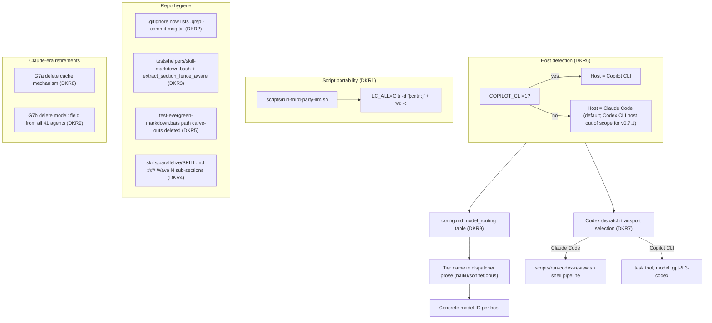

# Design: qrspi-plus v0.7.1 hardening

## Approach

This release is correctness, portability, and presentation hardening on top of the v0.7 protocol. The architectural through-line is **host-aware portability without a build pipeline**: a single source tree resolves host differences (Claude Code vs Copilot CLI vs future Cursor) through three mechanisms -- POSIX-clean shell idioms (G1), a config-driven model-tier abstraction (G7b + G6), and dispatch-transport branching at the skill prose layer (G6). No compile step is introduced; no host-specific output dirs. The release also retires two Claude-era assumptions (G7a cache mechanism; G7b agent `model:` field) that have become inside-baseball under the new multi-host reality.

All eight goal areas (G1-G7b) map to one of three buckets:

- **Script portability** (G1): POSIX-clean rewrite of the control-char detection routine, eliminating a silent-failure surface on BSD grep.
- **Repo hygiene** (G2, G3, G4, G5): gitignore the scratch commit-message file; migrate the fence-tracking helper to the shared library; restructure the Branch Map into Wave sub-sections; delete the evergreen-lint path carve-outs.
- **Cross-CLI portability** (G6, G7a, G7b): host-detection + Codex dispatch-transport branching; cache-mechanism retirement; agent `model:` field deletion with tier-vocabulary replacement.

## Key Decisions

Each decision is stated as a one-line decision followed by one-line reasoning.

### DKR1 -- Control-char detection rewrite (G1)

**Decision:** Replace `grep -qP '[\x00-\x1f\x7f]' 2>/dev/null` with `LC_ALL=C tr -d '[:cntrl:]'` + `LC_ALL=C wc -c` byte comparison at `scripts/run-third-party-llm.sh:558-569`.

**Reasoning:** Per `research/q02-web.md`, `[[:cntrl:]]` is the most portable single idiom; `tr` works across BSD/GNU/BusyBox; `LC_ALL=C wc -c` gives unambiguous byte counts (avoiding the multibyte-locale gotcha for `${#var}`). This is the only candidate that catches LF AND removes the silent-fallback failure mode on BSD grep (per `research/q01-codebase.md`, the current `2>/dev/null` suppression means BSD grep silently produces a false-negative on every macOS system without Homebrew grep).

### DKR2 -- Gitignore the scratch commit-message file (G2)

**Decision:** Add `.qrspi-commit-msg.txt` to the committed root `.gitignore`. Do NOT reorder the implementer-protocol commit procedure.

**Reasoning:** Per `research/q03-codebase.md` (the commit procedure relies on a per-clone `.git/info/exclude` entry; fresh clones and worktrees receive no protection) and `research/q04-codebase.md` (confirms the committed `.gitignore` carries no entry for the scratch file). Reordering the procedure (the alternative) is invasive, touches every SKILL.md commit section, and would still leak under any future code path that runs `git add -A` before `rm`. Gitignore is structurally stronger.

### DKR3 -- Separate fence-aware helper function (G3)

**Decision:** Add `extract_section_fence_aware` (working name; Plan settles final name) to `tests/helpers/skill-markdown.bash` as a sibling to `extract_section`. Do NOT extend `extract_section` with pluggable exit-anchor predicates.

**Reasoning:** Per `research/q05-codebase.md`, the inline helper at `tests/unit/test-skill-md-content-patterns.bats:167-176` is structurally different (fence-anchored, not heading-anchored), and its own inline commentary explicitly states "extract_review_round is retained as a local helper (fence-aware, not replaceable by the generic extract_section)." Mixing both predicates into one function couples orthogonal concerns; single-responsibility wins.

### DKR4 -- Wave-grouped Branch Map presentation (G4)

**Decision:** Replace the flat Branch Map in `skills/parallelize/SKILL.md` with `### Wave N` sub-sections, each containing a mini Branch Map table (Task | Branch | Base). The Dependency Analysis table stays separate. The "Execution Order" prose section is removed as redundant.

**Reasoning:** Per `research/q06-codebase.md`, the current flat three-column Branch Map (Task | Branch | Base) has no Wave column -- wave assignment lives in the separate Dependency Analysis table and in an Execution Order prose section that readers must cross-reference manually. Wave sub-sections collapse those two artefacts into one scannable structure at the Parallelize review point, when base-mismatch findings are cheapest to catch. The Wave sub-section shape changes the input shape that downstream parallelize-reviewer linting consumes (a Plan / Implement concern); existing symbolic-base vocabulary and row-completeness rules survive intact with the new shape.

### DKR5 -- Drop evergreen-lint path carve-outs entirely (G5)

**Decision:** Remove all 5 path-shaped exemption groups from `_is_path_exempt()` in `tests/unit/test-evergreen-markdown.bats`. The inline `<!-- evergreen-exempt -->` mechanism is retained as the sole remaining escape hatch. Per-line classification (rewrite vs delete vs inline-marker) is owned by Plan.

**Reasoning:** Per `research/q07-codebase.md`, with both carve-outs and inline markers disabled there are exactly 5 violations across 2 files; all 5 already carry `<!-- evergreen-exempt -->` markers, so disabling carve-outs while leaving inline markers active produces zero violations. The architectural decision Design owns is to close the path-shaped exemption surface; the per-line classification procedure belongs to Plan against current `main`.

### DKR6 -- Cross-CLI host detection via env-var probe + per-host Codex availability check (G6)

**Decision:** Detection function probes `COPILOT_CLI=1` first (Copilot CLI host signal since v0.0.421 per `research/q09-web.md`); otherwise defaults to Claude Code. Standalone Codex CLI as a host is explicitly out of scope for v0.7.1 (per `goals.md` G6 deferral); a Codex-CLI host falls through to the Claude Code branch. Per detected host, check the right path for Codex availability.

**Reasoning:** Under Copilot CLI, Codex is a routable model (`gpt-5.3-codex`) via the native subagent tool -- no filesystem probe needed; under Claude Code, glob `~/.claude/plugins/cache/openai-codex/codex/*/scripts/codex-companion.mjs` as today (per `research/q08-codebase.md`). At goals-time, if detection result disagrees with the `codex_reviews` config value, emit a one-line diagnostic naming the disagreement (catches the misdetection that surfaced at config-time in this run).

### DKR7 -- Codex dispatch transport branches per detected host (G6)

**Decision:** Skill prose for Codex dispatches names BOTH transports explicitly. Under Claude Code: shell pipeline via `scripts/run-codex-review.sh`. Under Copilot CLI: native subagent dispatch via the `task` tool with `agent_type: code-review` and `model: gpt-5.3-codex`.

**Reasoning:** The dispatch helper accepts both transports; the host-detection result selects. This is the single dispatch-routing decision for v0.7.1; it does not retire the shell pipeline (out of scope; revisit in v0.8). The concrete Copilot-CLI model identifier (`gpt-5.3-codex`) is the one named in `goals.md` G6 (per `research/q12-web.md`'s scan of the Copilot agents corpus); the exact value Plan writes into `config.md`'s `model_routing:` table is owned downstream.

### DKR8 -- G7a is mechanical lift-verbatim deletion (no design surface)

**Decision:** G7a (cache mechanism retirement) has no design surface. Plan enumerates the exact line ranges and produces a single deletion task.

**Reasoning:** The mechanism spans five files (per `research/q10-codebase.md`): the using-qrspi SKILL.md cache-hint block, the `scripts/run-third-party-llm.sh` cache gate, `scripts/g4-cache-probe.sh`, the stub spike report, and two BATS unit suites. The acceptance suite restructuring around dropped Slice 7 / C-5 assertions is a known sub-task per `goals.md`.

### DKR9 -- Delete `model:` from all 41 agents; retain `haiku`/`sonnet`/`opus` as canonical tier names (G7b)

**Decision:** Delete the `model:` field from all 41 `agents/*.md` frontmatters. Tier names (`haiku`, `sonnet`, `opus`) survive as platform-agnostic vocabulary in dispatcher prose. Per-host concrete-model resolution lives in `config.md`'s existing `model_routing:` table.

**Reasoning:** Per `research/q11-codebase.md`, the `model:` field is Layer 3 in the routing chain and is bypassed at every dispatch site that specifies an inline override (Layer 1b) -- the field's effect is already marginal. Under Copilot CLI, the field triggers a "model not available" warning per agent dispatch (per `goals.md`'s probe results). Per `research/q12-web.md`, `gentle-ai`'s pattern of using `haiku/sonnet/opus` as an abstraction layer is the closest multi-host precedent (its concrete mapping is `haiku → claude-haiku-4.5`, `sonnet → claude-sonnet-4.6`, `opus → claude-opus-4.6`); tier names are NOT model names. Plugin ships per-host defaults in the bundled `config.md` for both Claude Code and Copilot CLI; the concrete model identifiers Plan writes into the `model_routing:` table are owned downstream. Operators can override per-tier or per-role.

### DKR10 -- Single host-detection mechanism shared by G6 and G7b

**Decision:** One env-var probe implementation, surfaced at config-load time, serves both G6 (Codex availability check + dispatch transport selection) and G7b (model_routing table default selection).

**Reasoning:** Both goals need to know "what host am I on?" -- sharing one detection path avoids two competing implementations drifting independently and producing inconsistent results during the same pipeline run.

### DKR11 -- Close G8 placeholder as not in v0.7.1 scope

**Decision:** The "broader subagent-dispatch port" question is naturally absorbed by DKR7 (per-host dispatch transport). G1's `run-third-party-llm.sh` stays live under Claude Code; broader retirement is deferred to v0.8.

**Reasoning:** The script's reachability under Copilot is not a deletion question for v0.7.1. DKR7 provides the host-aware Codex dispatch path Copilot operators need without requiring the shell pipeline to be present on their host.

## Trade-offs Considered

### G1: Alternative candidates rejected

**`awk` with character-class match (rejected).** Awk's `\n` record-delimiter problem is the same as grep's; addressing it requires `RS="\0"` or string-mode operation -- more moving parts than `tr` for no clear win.

**`grep -E '[[:cntrl:]]'` (rejected).** Solves PCRE-portability but leaves LF as a known invisible-detection gap inside a security control. Per `research/q02-web.md`, LF is definitively absent from `grep [[:cntrl:]]` matches (confirmed: only 30 of 31 C0 chars matched, with 0x0a the miss). Acceptable in narrow contexts where LF can't appear, but the silent-failure-surface argument is what this fix closes; keeping a gap defeats it.

### G2: Reorder the commit procedure (rejected)

Invasive -- touches every SKILL.md commit section -- and any future code path that ran `git add -A` before `rm` would re-leak. Gitignore is structurally stronger, per `research/q03-codebase.md`'s finding that the current safety relies on `.git/info/exclude` per-clone setup.

### G3: Pluggable exit-anchor predicate on `extract_section` (rejected)

Mixes heading-anchored and fence-anchored concerns in one function. Per `research/q05-codebase.md`, the author intent at `tests/unit/test-skill-md-content-patterns.bats:167-176` explicitly rejects this: "extract_review_round is retained as a local helper (fence-aware, not replaceable by the generic extract_section)."

### G4: Flat Branch Map alternatives (rejected)

**Add Wave column to flat Branch Map (rejected).** Doesn't enable the Wave-grouped glance the issue asks for -- readers still scan and filter.

**Hybrid (Wave column AND visual grouping) (rejected).** Three flavors of presentation to maintain in sync; consistency-check cost dominates the marginal scan benefit.

### G5: Carve-out retention alternatives (rejected)

**Keep path-shaped carve-outs as belt-and-suspenders (rejected).** Path carve-outs exempt entire directory trees from forward-looking prose checks, which is the same class of regression the lint exists to catch. Maintenance over time grows the carve-out list rather than shrinking it; closing the surface once is cheaper than re-justifying each entry as the repository evolves.

**Rewrite violations but keep carve-outs disabled-by-default behind a flag (rejected).** Reintroduces a config knob with two modes that drift independently. The inline `<!-- evergreen-exempt -->` mechanism already covers the load-bearing-example escape hatch (per `research/q07-codebase.md`); a parallel disabled-by-default path adds surface area without coverage.

### G6: Config-only flag alternatives (rejected)

**Config-only flag, no auto-detect (rejected).** Loses out-of-the-box UX; every new operator has a manual setup step.

**Pure env-probe (no diagnostic on config mismatch) (rejected).** Misses the case where the operator's config disagrees with detection -- exactly the surprise this run hit at goals-time.

### G7b: Model-field alternatives (rejected)

**Install-time alias-map build pipeline (rejected).** Reintroduces a compile step v0.7.1 just decided not to add; version-brittle as Anthropic versions slip.

**Upstream FR to Copilot CLI (rejected as primary fix).** Unbounded timeline; doesn't help Cursor or future hosts. Worth filing in parallel as a quality-of-life ask but not load-bearing for v0.7.1.

**Vendor-neutral tier names (`fast`/`default`/`frontier`) (rejected).** Renaming surface touches every skill; operators familiar with QRSPI know what haiku/sonnet/opus do; the `model_routing:` table provides the abstraction layer without renaming.

## Test Strategy

All tests use BATS (bash-3.2 portable) -- no new framework. Assertion text, full test procedures, and per-test-file layout are deferred to Plan.

**G1 (control-char detection):** Unit test at the dispatcher pre-flight layer. Coverage: each of the 33 control bytes (0x00-0x1F + 0x7F) as a header value triggers the die path; clean ASCII passes; LF is pinned as a regression guard against the prior grep gap.

**G2 (gitignore scratch file):** Unit test that the scratch path matches the committed `.gitignore`. Integration test verifying that the scratch file does not appear in the staged index when a simulated implementer commit flow runs.

**G3 (fence-aware helper):** Unit test for the new fence-aware extraction helper covering fence-toggle correctness, exit-on-next-fence, exit-on-next-section, and empty-extract guard. Existing call-site behavior of the migrated inline helper is preserved.

**G4 (Branch Map presentation):** Parallelize-reviewer agent test pins the Wave sub-section structural rule. Worked-example regeneration ("Good" / "Bad") under the new shape. Existing parallelize unit tests are adapted to the new structure.

**G5 (TBD/TODO cleanup):** No new test code -- the existing evergreen-markdown unit test is the test. Coverage after fix: scan runs against the entire repo with zero carve-outs and zero violations.

**G6 (cross-CLI Codex detection):** Unit test for the new host-detection function with mocked environment signals. Unit test for the Codex availability check per detected host. Integration test that dispatching a Codex review via the host-appropriate transport succeeds.

**G7a (cache mechanism deletion):** Existing cache-mechanism unit tests removed. Post-deletion CI-green verifies the truth-table duplicate flagged in `research/q10-codebase.md` is removed cleanly alongside the cache gate.

**G7b (`model:` field deletion):** Structural lint unit test pinning that no agent frontmatter carries a top-level `model:` field. Regression smoke (manual): fresh `copilot plugin install` on the resulting branch shows zero "model not available" warnings across a full pipeline run.

## System Diagram

The diagram's organizing axis is host-aware portability: three mechanisms (POSIX-clean shell idioms, model-tier abstraction, dispatch-transport branching) resolve host differences at the dispatch boundary without a build pipeline.

