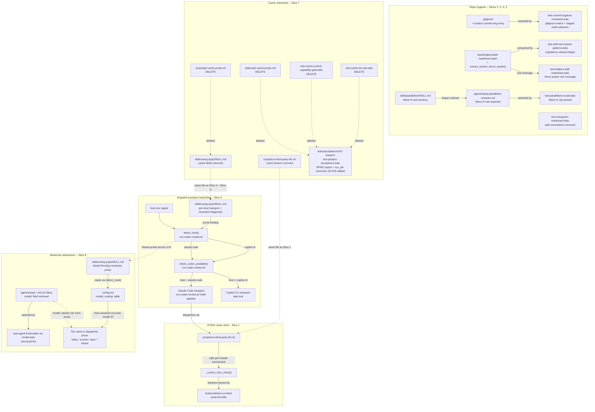

# Structure: qrspi-plus v0.7.1 hardening

The cross-cutting integration risk for this release is host-detection consistency between Slice 6 (transport selection for Codex dispatch) and Slice 8 (`model_routing` resolution for tier vocabulary). It is resolved by sharing one `detect_host()` implementation defined at the `scripts/run-codex-review.sh` boundary and consumed by `skills/using-qrspi/SKILL.md` dispatcher prose.

## File Map

Each table row names one concrete file, its action, a one-line boundary responsibility, and the goal IDs driving the change. Line-by-line locators (line ranges, exact regex patterns) are Plan's territory.

### Slice 1: POSIX control-char detection rewrite (G1)

| File | Action | Responsibility | Goal IDs |
|------|--------|----------------|----------|
| `scripts/run-third-party-llm.sh` | Modify | Replace the control-char detection block inside the `openai-chat-completions` transport block with a `_control_char_check()` function called for each header name and value | G1 |
| `tests/unit/test-run-third-party-llm.bats` | Modify | Extend existing control-char coverage to pin every C0+DEL byte as a die-path trigger, plus an explicit LF regression guard against the prior silent-false-negative | G1 |

### Slice 2: Scratch commit-message file added to committed gitignore (G2)

| File | Action | Responsibility | Goal IDs |
|------|--------|----------------|----------|
| `.gitignore` | Modify | Add the scratch commit-message filename so it is excluded on all fresh clones and worktrees, independent of per-clone `.git/info/exclude` setup | G2 |
| `tests/unit/test-commit-hygiene-invariants.bats` | Modify | Add assertions that the scratch filename appears in committed `.gitignore` and is absent from the staged index in a simulated implementer commit flow; existing `.git/info/exclude` invariant tests are retained | G2 |

### Slice 3: Fence-aware extract helper promoted to shared library (G3)

| File | Action | Responsibility | Goal IDs |
|------|--------|----------------|----------|
| `tests/helpers/skill-markdown.bash` | Modify | Add `extract_section_fence_aware` as a new exported function alongside `extract_section`; exposes fence-toggle tracking, exit-on-next-fence, exit-on-next-heading, and an empty-extract diagnostic guard | G3 |
| `tests/unit/test-skill-md-content-patterns.bats` | Modify | Migrate the inline `extract_review_round` call sites to the shared `extract_section_fence_aware` and remove the local duplicate definition | G3 |
| `tests/unit/test-helpers-skill-markdown.bats` | Modify | Add unit coverage for `extract_section_fence_aware`: fence-toggle correctness, exit-on-next-fence, exit-on-next-heading-anchor, and empty-extract guard | G3 |

### Slice 4: Wave-grouped Branch Map presentation (G4)

| File | Action | Responsibility | Goal IDs |
|------|--------|----------------|----------|
| `skills/parallelize/SKILL.md` | Modify | Reshape the Branch Map content (in the `## Artifact` specification and the worked-example output shape) from a flat three-column table into `### Wave N` sub-sections, each containing a Task/Branch/Base mini-table; drop the now-redundant Execution Order narrative from the same locations; update the inline Good and Bad worked-example pairs to the Wave-grouped shape | G4 |
| `agents/qrspi-parallelize-reviewer.md` | Modify | Update the Branch Map structural-rule assertions to require `### Wave N` sub-section grouping rather than the flat three-column layout | G4 |
| `tests/unit/test-parallelize-vocab.bats` | Modify | Add assertion pinning the `### Wave N` sub-section structural rule against `agents/qrspi-parallelize-reviewer.md`; adapt existing Wave-vocabulary assertions to reference the new sub-section grouping shape | G4 |

### Slice 5: Drop evergreen-lint path carve-outs (G5)

| File | Action | Responsibility | Goal IDs |
|------|--------|----------------|----------|
| `tests/unit/test-evergreen-markdown.bats` | Modify | Remove all path-shaped exemption groups from `_is_path_exempt()`; the inline `<!-- evergreen-exempt -->` mechanism is the sole remaining escape hatch | G5 |

### Slice 6: Cross-CLI Codex detection and per-host dispatch transport (G6)

| File | Action | Responsibility | Goal IDs |
|------|--------|----------------|----------|
| `scripts/run-codex-review.sh` | Modify | Add `detect_host()` function returning `copilot-cli` or `claude-code`; add `check_codex_available()` per-host availability check; add per-host transport branch selecting the shell-pipeline path (Claude Code) or the native task-tool dispatch annotation (Copilot CLI) | G6 |
| `skills/using-qrspi/SKILL.md` | Modify | Update the Codex-detection section to name both dispatch transports with per-host conditional prose; add a config-vs-detection mismatch diagnostic hook at the detection boundary | G6 |
| `tests/unit/test-host-detection.bats` | Create | Unit tests for `detect_host()` under mocked env signals and `check_codex_available()` per host; pins transport-selection correctness for both Claude Code and Copilot CLI paths | G6 |
| `tests/acceptance/v07-phase1/test-phase1-acceptance.bats` | Modify | Add end-to-end host-detection coverage asserting that under each detected host the appropriate dispatch transport (Copilot CLI task-tool annotation vs Claude Code shell pipeline) is selected | G6 |

### Slice 7: Cache mechanism retirement (G7a)

| File | Action | Responsibility | Goal IDs |
|------|--------|----------------|----------|
| `scripts/g4-cache-probe.sh` | Delete | Remove the cache-probe script (the spike that was never executed) | G7a |
| `docs/qrspi/2026-05-17-v07-release/spikes/g4-cache-probe.md` | Delete | Remove the stub spike report | G7a |
| `tests/unit/test-cache-control-capability-gate.bats` | Delete | Remove the dual-flag cache-control capability-gate unit suite | G7a |
| `tests/unit/test-cache-hit-rate.bats` | Delete | Remove the cache-hit-rate path-conditional unit suite | G7a |
| `skills/using-qrspi/SKILL.md` | Modify | Remove `supports_prompt_cache` and `emit_cache_control_markers` from the providers block (both the YAML example values and the description bullets) | G7a |
| `scripts/run-third-party-llm.sh` | Modify | Remove the `cache_control` marker emission branch from `_dispatch_openai_chat` | G7a |
| `tests/unit/test-run-third-party-llm.bats` | Modify | Remove the cache-control truth-table assertions that duplicate the deleted `test-cache-control-capability-gate.bats` suite | G7a |
| `tests/acceptance/v07-phase1/test-phase1-acceptance.bats` | Modify | Drop the `SPIKE` export pointing at the deleted spike report and the `run_pin` invocations for the deleted cache unit suites | G7a |

### Slice 8: Agent model-field deletion with tier vocabulary preserved (G7b)

| File | Action | Responsibility | Goal IDs |
|------|--------|----------------|----------|
| `agents/qrspi-*.md` (41 files, enumerated below) | Modify | Remove the top-level `model:` YAML frontmatter field from all 41 agent files; tier names (haiku, sonnet, opus, inherit) in dispatcher prose are preserved as platform-agnostic vocabulary | G7b |
| `docs/qrspi/2026-05-27-v071-hardening/config.md` | Modify | Populate the `model_routing:` table with per-host concrete-model entries for both Claude Code and Copilot CLI hosts, resolving the tier vocabulary to the appropriate model IDs per host | G7b |
| `skills/using-qrspi/SKILL.md` | Modify | Document the `model_routing` resolution path: dispatcher prose resolves agent tier vocabulary against the `config.md` `model_routing` table using `detect_host()` output to select the appropriate per-host column | G7b |
| `tests/unit/test-agent-frontmatter-no-model.bats` | Create | Structural lint asserting that no `agents/qrspi-*.md` frontmatter carries a top-level `model:` key | G7b |

#### Slice 8 agent file enumeration

The 41 concrete files matched by the Slice 8 `agents/qrspi-*.md` row:

- `agents/qrspi-code-quality-reviewer.md`
- `agents/qrspi-code-simplifier.md`
- `agents/qrspi-design-reviewer.md`
- `agents/qrspi-design-scope-reviewer.md`
- `agents/qrspi-finding-verifier.md`
- `agents/qrspi-goal-traceability-reviewer.md`
- `agents/qrspi-goals-reviewer.md`
- `agents/qrspi-goals-scope-reviewer.md`
- `agents/qrspi-implement-gate-reviewer.md`
- `agents/qrspi-implementer-lightweight.md`
- `agents/qrspi-implementer.md`
- `agents/qrspi-integration-reviewer.md`
- `agents/qrspi-parallelize-reviewer.md`
- `agents/qrspi-parallelize-scope-reviewer.md`
- `agents/qrspi-phasing-reviewer.md`
- `agents/qrspi-phasing-scope-reviewer.md`
- `agents/qrspi-plan-goal-traceability-reviewer.md`
- `agents/qrspi-plan-reviewer.md`
- `agents/qrspi-plan-scope-reviewer.md`
- `agents/qrspi-plan-security-reviewer.md`
- `agents/qrspi-plan-silent-failure-hunter.md`
- `agents/qrspi-plan-spec-reviewer.md`
- `agents/qrspi-plan-test-coverage-reviewer.md`
- `agents/qrspi-questions-reviewer.md`
- `agents/qrspi-replan-analyzer.md`
- `agents/qrspi-replan-reviewer.md`
- `agents/qrspi-replan-scope-reviewer.md`
- `agents/qrspi-research-collator.md`
- `agents/qrspi-research-reviewer.md`
- `agents/qrspi-research-specialist.md`
- `agents/qrspi-scope-tagger.md`
- `agents/qrspi-security-integration-reviewer.md`
- `agents/qrspi-security-reviewer.md`
- `agents/qrspi-silent-failure-hunter.md`
- `agents/qrspi-spec-reviewer.md`
- `agents/qrspi-structure-reviewer.md`
- `agents/qrspi-structure-scope-reviewer.md`
- `agents/qrspi-test-coverage-reviewer.md`
- `agents/qrspi-test-writer.md`
- `agents/qrspi-type-design-analyzer.md`
- `agents/qrspi-visual-fidelity-reviewer.md`

---

## Section Contracts

Top-level section-list contracts for the files this release reshapes at the heading level. Files whose modifications do not change top-level structure are omitted from this list (their boundary responsibility is captured in the File Map).

### Created files

**`tests/unit/test-host-detection.bats`** (Slice 6, G6)

- `setup` block: env-isolation harness (unset `COPILOT_CLI` etc) and source `scripts/run-codex-review.sh`
- `@test` blocks (one heading per behavior pinned):
  - host detection returns `copilot-cli` when env signal present
  - host detection returns `claude-code` when env signal absent
  - `check_codex_available` returns 0 under copilot-cli host
  - `check_codex_available` per-host availability under claude-code host (reachable and not-reachable cases)

**`tests/unit/test-agent-frontmatter-no-model.bats`** (Slice 8, G7b)

- `setup` block: locate repo root and the `agents/` directory
- `@test` blocks:
  - no `agents/qrspi-*.md` frontmatter carries a top-level `model:` key (single sweep assertion across all 41 files)

### Modified files

For modified files, the per-file boundary responsibility is captured in the File Map; this artifact does not re-assert heading-level shape for those files (the existing top-level section structure is preserved by all Phase 1 edits). Plan owns the per-line edit locations within each touched content block.

---

## Interfaces

Three components expose new or modified public boundaries; all others are internal rewrites. Shell function signatures use positional-arg notation; return codes follow shell convention (0 = success, non-zero = failure). Implementation algorithms (sentinel byte handling, probe ordering, glob locations, portability constraints) are Plan's responsibility and are not enumerated here.

### `tests/helpers/skill-markdown.bash` -- `extract_section_fence_aware`

```bash
# extract_section_fence_aware(file, start_pattern)
#
# $1  file          -- path to the Markdown file to extract from
# $2  start_pattern -- regex pattern matching the anchor line
#
# Output: section content from the start_pattern match through the
#         next out-of-fence section boundary, with code-fence state
#         tracked so heading-shaped lines inside fences are NOT
#         treated as section boundaries. Anchor line included.
#
# Returns: 0 on non-empty extract (output to stdout)
#          non-zero with an empty-extract diagnostic on stderr otherwise
extract_section_fence_aware()
```

### `scripts/run-codex-review.sh` -- `detect_host` and `check_codex_available`

The two host-detection functions are the single shared probe implementation. Slice 6 consumes them for transport selection; Slice 8 consumes them (via `skills/using-qrspi/SKILL.md` dispatcher prose) for `model_routing` resolution. This is the DKR10 shared-probe boundary.

```bash
# detect_host()
#
# Output: host identifier ("copilot-cli" or "claude-code") to stdout
# Returns: 0
# No arguments.
detect_host()

# check_codex_available(host)
#
# $1  host -- output of detect_host
#
# Returns: 0 (Codex reachable on this host)
#          non-zero (not reachable)
check_codex_available()
```

### `scripts/run-third-party-llm.sh` -- `_control_char_check`

The internal helper replaces the inline control-char detection within the security pre-flight block; it is not exported for external callers.

```bash
# _control_char_check(str)
#
# $1  str -- the string to inspect (a single header name or header value)
#
# Returns: 0 (no control bytes present)
#          non-zero (at least one control byte present)
# On non-zero, the caller invokes die() with the header-validation message.
_control_char_check()
```

---

## Architectural Diagram

Modules are grouped by the three portability mechanisms that form the design's through-line (POSIX-clean shell, model-tier abstraction, dispatch-transport branching), with repo-hygiene slices shown as a separate cluster. Arrows are runtime data-flow or dependency direction.



---

## CI Pipeline

The existing CI pipeline is unchanged for this release. The two jobs defined in `.github/workflows/ci.yml` -- the Lint job (shellcheck + bash ban-list grep) and the BATS-under-bash job -- already cover every test file in this release's scope. No workflow file changes are required.
