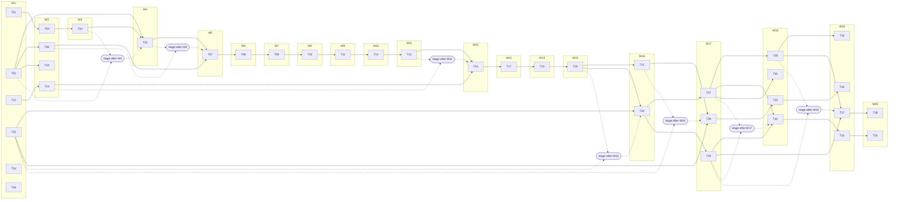

# Parallelization Plan — qrspi-plus v0.7.2 (Phase 1)

## Execution Mode

**Hybrid.**

Rationale: 38 tasks decompose into 20 Waves and 7 stage commits. Wave 1 holds 6 file-disjoint independent tasks; the rest of the graph is dominated by long sequential chains driven by shared-file contention on `skills/using-qrspi/SKILL.md`, `skills/reviewer-protocol/SKILL.md`, `skills/plan/SKILL.md`, `skills/design/SKILL.md`, and `tests/acceptance/v07-phase1/test-phase1-acceptance.bats`. A handful of tasks fan out into small parallel siblings within their Wave (W16: T21+T26; W17: T27+T29+T39; W18: T28+T30+T35+T40; W19: T31+T33+T37+T44; W20: T32+T38). Stage commits collapse multi-parent merges when transitive ancestry alone is insufficient.

**Dependency edges in this plan come from two sources:**

1. Plan-declared logical dependencies (taken from each task spec's `Dependencies` bullet)
2. File-overlap edges added at parallelize time when two tasks modify the same file but the plan did not encode a sequencing dependency — Parallelize adds the lower-id-first edge to serialize file access (no concurrent worktrees may edit the same file)

All wave assignments use transitive reduction so each task's `Base` cites only the minimal-tip ancestor set required to provide its dependencies.

**Reference gates:** none in this phase.

## Dependency Analysis

| Task | Goals | Logical Deps | Reduced Parents (sequencing) | Key Files | Wave |
|------|-------|--------------|------------------------------|-----------|------|
| T01 | G7 | none | — | skills/_shared/verifier-filter-rule.md | W1 |
| T02 | G12 | none | — | scripts/verifier-fan-in.sh; skills/_shared/verifier-dispatch-prose.md | W1 |
| T03 | G6 | T01 | T01 | skills/reviewer-protocol/SKILL.md; skills/reviewer-protocol/first-party-emission.md; +2 more | W2 |
| T04 | G8 | T03 | T03 | skills/reviewer-protocol/SKILL.md; tests/unit/test-change-type-partition.bats | W3 |
| T05 | G13 | T02, T04 | T02, T04 | scripts/verifier-fan-in.sh; skills/reviewer-protocol/SKILL.md; +1 more | W4 |
| T06 | G11 | T02 | T02 | agents/qrspi-finding-verifier.md; tests/unit/test-verifier-agent-file.bats | W2 |
| T07 | G14 | T06 | T05, T06 | skills/reviewer-protocol/SKILL.md; agents/qrspi-finding-verifier.md; +1 more | W5 |
| T08 | G19 | T07 | T07 | agents/qrspi-finding-verifier.md; tests/acceptance/v07-phase1/test-phase1-acceptance.bats | W6 |
| T09 | G20 | T08 | T08 | agents/qrspi-finding-verifier.md; skills/using-qrspi/SKILL.md; +3 more | W7 |
| T10 | G28 | T09 | T09 | agents/qrspi-finding-verifier.md; skills/using-qrspi/SKILL.md; +2 more | W8 |
| T11 | G3 | none | T10 | skills/using-qrspi/SKILL.md; scripts/run-codex-review.sh; +1 more | W9 |
| T12 | G4 | none | — | scripts/round-prepare.sh; scripts/await-round.sh; +4 more | W1 |
| T13 | G9 | T12 | T12 | scripts/round-prepare.sh; skills/implement/SKILL.md; +1 more | W2 |
| T14 | G15 | none | T11 | skills/plan/SKILL.md; agents/qrspi-plan-reviewer.md; +2 more | W10 |
| T15 | G18 | T14 | T14 | skills/plan/SKILL.md; agents/qrspi-plan-reviewer.md; +1 more | W11 |
| T16 | G22 | none | T13, T15 | config.md; scripts/_resolve-lib.sh; +8 more | W12 |
| T17 | G23 | T16 | T16 | skills/using-qrspi/SKILL.md; tests/unit/test-config-model-routing.bats | W13 |
| T19 | G27 | T16 | T17 | scripts/second-reviewer-available.sh; scripts/_host-detect.sh; +7 more | W14 |
| T20 | G3 | T09, T11, T12, T13, T19 | T19 | scripts/run-codex-review.sh; scripts/dispatch-agent.sh; +21 more | W15 |
| T21 | G16 | T20 | T20 | scripts/dispatch-agent.sh; tests/unit/test-dispatch-agent.bats; +2 more | W16 |
| T24 | G6, G11, G12 | T02 | T02 | scripts/detect-interaction-mode.sh; tests/unit/test-detect-interaction-mode.bats | W2 |
| T25 | G31 | none | — | skills/_shared/prompt-prose-detection.md; skills/_shared/prompt-prose-writer-addition.md; +5 more | W1 |
| T26 | G31 | T25 | T20, T25 | skills/design/SKILL.md; skills/plan/SKILL.md; +4 more | W16 |
| T27 | G3, G4, G22, G27 | none | T26 | skills/_shared/evergreen-output-rule.md; skills/goals/SKILL.md; +10 more | W17 |
| T28 | G1, G30, G33 | none | T27 | skills/_shared/multi-actor-flow-check.md; skills/structure/SKILL.md; +3 more | W18 |
| T29 | G34 | none | T26 | skills/_shared/design-altitude-boundary.md; agents/qrspi-design-scope-reviewer.md; +2 more | W17 |
| T30 | G1 | T29 | T27, T29 | skills/design/SKILL.md | W18 |
| T31 | G33 | T30 | T30 | skills/design/SKILL.md; tests/unit/test-interactive-skill-prompts.bats | W19 |
| T32 | G30 | T30, T31 | T31 | skills/goals/SKILL.md; skills/design/SKILL.md; +1 more | W20 |
| T33 | G2 | none | T28 | skills/plan/SKILL.md; agents/qrspi-plan-reviewer.md | W19 |
| T34 | G5 | none | — | skills/plan/post-approval-split-contract.md; tests/unit/test-plan-post-approval-split.bats | W1 |
| T35 | G10 | T03 | T27 | skills/reviewer-protocol/SKILL.md; tests/acceptance/test-review-pause.bats | W18 |
| T36 | G17 | none | — | skills/implementer-protocol/SKILL.md; agents/qrspi-test-writer.md | W1 |
| T37 | G35 | T29 | T28, T29 | skills/structure/SKILL.md; skills/_shared/structure-altitude-boundary.md; +2 more | W19 |
| T38 | G35 | T37 | T37 | agents/qrspi-structure-reviewer.md; agents/qrspi-structure-scope-reviewer.md | W20 |
| T39 | G32 | T21, T25 | T21, T25 | tools/build-plugin.mjs; tools/render-skill.sh; +11 more | W17 |
| T40 | G21, G26 | none | T39 | tests/unit/test-using-qrspi-vocab.bats; tests/lint/test-bats-body-assertion-guard.bats; +2 more | W18 |
| T44 | G24 | T17, T40 | T40 | tests/unit/test-using-qrspi-vocab.bats; tests/acceptance/v07-phase1/test-phase1-acceptance.bats | W19 |

## Branch Map

Branch names are `qrspi/v0.7.2-release/task-NN` (slug derived from the feature branch `qrspi/v0.7.2-release/main`). Bases use only the symbolic vocabulary defined in `skills/parallelize/SKILL.md` § Branch Model.

### Wave 1

| Task | Branch | Base |
|------|--------|------|
| task-01 | qrspi/v0.7.2-release/task-01 | feature branch tip |
| task-02 | qrspi/v0.7.2-release/task-02 | feature branch tip |
| task-12 | qrspi/v0.7.2-release/task-12 | feature branch tip |
| task-25 | qrspi/v0.7.2-release/task-25 | feature branch tip |
| task-34 | qrspi/v0.7.2-release/task-34 | feature branch tip |
| task-36 | qrspi/v0.7.2-release/task-36 | feature branch tip |

### Wave 2

| Task | Branch | Base |
|------|--------|------|
| task-03 | qrspi/v0.7.2-release/task-03 | task-01 tip |
| task-06 | qrspi/v0.7.2-release/task-06 | task-02 tip |
| task-13 | qrspi/v0.7.2-release/task-13 | task-12 tip |
| task-24 | qrspi/v0.7.2-release/task-24 | task-02 tip |

### Wave 3

| Task | Branch | Base |
|------|--------|------|
| task-04 | qrspi/v0.7.2-release/task-04 | task-03 tip |

### Wave 4

| Task | Branch | Base |
|------|--------|------|
| task-05 | qrspi/v0.7.2-release/task-05 | stage-after-W3 |

### Wave 5

| Task | Branch | Base |
|------|--------|------|
| task-07 | qrspi/v0.7.2-release/task-07 | stage-after-W4 |

### Wave 6

| Task | Branch | Base |
|------|--------|------|
| task-08 | qrspi/v0.7.2-release/task-08 | task-07 tip |

### Wave 7

| Task | Branch | Base |
|------|--------|------|
| task-09 | qrspi/v0.7.2-release/task-09 | task-08 tip |

### Wave 8

| Task | Branch | Base |
|------|--------|------|
| task-10 | qrspi/v0.7.2-release/task-10 | task-09 tip |

### Wave 9

| Task | Branch | Base |
|------|--------|------|
| task-11 | qrspi/v0.7.2-release/task-11 | task-10 tip |

### Wave 10

| Task | Branch | Base |
|------|--------|------|
| task-14 | qrspi/v0.7.2-release/task-14 | task-11 tip |

### Wave 11

| Task | Branch | Base |
|------|--------|------|
| task-15 | qrspi/v0.7.2-release/task-15 | task-14 tip |

### Wave 12

| Task | Branch | Base |
|------|--------|------|
| task-16 | qrspi/v0.7.2-release/task-16 | stage-after-W11 |

### Wave 13

| Task | Branch | Base |
|------|--------|------|
| task-17 | qrspi/v0.7.2-release/task-17 | task-16 tip |

### Wave 14

| Task | Branch | Base |
|------|--------|------|
| task-19 | qrspi/v0.7.2-release/task-19 | task-17 tip |

### Wave 15

| Task | Branch | Base |
|------|--------|------|
| task-20 | qrspi/v0.7.2-release/task-20 | task-19 tip |

### Wave 16

| Task | Branch | Base |
|------|--------|------|
| task-21 | qrspi/v0.7.2-release/task-21 | task-20 tip |
| task-26 | qrspi/v0.7.2-release/task-26 | stage-after-W15 |

### Wave 17

| Task | Branch | Base |
|------|--------|------|
| task-27 | qrspi/v0.7.2-release/task-27 | task-26 tip |
| task-29 | qrspi/v0.7.2-release/task-29 | task-26 tip |
| task-39 | qrspi/v0.7.2-release/task-39 | stage-after-W16 |

### Wave 18

| Task | Branch | Base |
|------|--------|------|
| task-28 | qrspi/v0.7.2-release/task-28 | task-27 tip |
| task-30 | qrspi/v0.7.2-release/task-30 | stage-after-W17 |
| task-35 | qrspi/v0.7.2-release/task-35 | task-27 tip |
| task-40 | qrspi/v0.7.2-release/task-40 | task-39 tip |

### Wave 19

| Task | Branch | Base |
|------|--------|------|
| task-31 | qrspi/v0.7.2-release/task-31 | task-30 tip |
| task-33 | qrspi/v0.7.2-release/task-33 | task-28 tip |
| task-37 | qrspi/v0.7.2-release/task-37 | stage-after-W18 |
| task-44 | qrspi/v0.7.2-release/task-44 | task-40 tip |

### Wave 20

| Task | Branch | Base |
|------|--------|------|
| task-32 | qrspi/v0.7.2-release/task-32 | task-31 tip |
| task-38 | qrspi/v0.7.2-release/task-38 | task-37 tip |

## Stage Commits

| Stage branch | Composition | Created before |
|--------------|-------------|----------------|
| qrspi/v0.7.2-release/stage-after-W3 | merge(task-02, task-04) | Wave 4 worktree creation |
| qrspi/v0.7.2-release/stage-after-W4 | merge(task-05, task-06) | Wave 5 worktree creation |
| qrspi/v0.7.2-release/stage-after-W11 | merge(task-13, task-15) | Wave 12 worktree creation |
| qrspi/v0.7.2-release/stage-after-W15 | merge(task-20, task-25) | Wave 16 worktree creation |
| qrspi/v0.7.2-release/stage-after-W16 | merge(task-21, task-25) | Wave 17 worktree creation |
| qrspi/v0.7.2-release/stage-after-W17 | merge(task-27, task-29) | Wave 18 worktree creation |
| qrspi/v0.7.2-release/stage-after-W18 | merge(task-28, task-29) | Wave 19 worktree creation |

## Worktree-Aware Setup Validation

Advisory only (non-blocking). Findings for the implementer to verify when worktree creation begins:

- This repo is shell/markdown/bats; no Next.js / Vite / Webpack build outputs land under per-task worktrees.
- `tests/` runs via `bats` directly with explicit path arguments in CI — no recursive test discovery walks `.worktrees/**`.
- No `eslint.config.js` or `tsconfig.json` to guard.
- **Confirm before W1 dispatch:** `tools/build-plugin.mjs` (T39 modifies) does not glob across `.worktrees/**` when building from a worktree. If it does, add an explicit exclusion.

## Dependency Graph

## Operational Notes

- **No reference gates in this phase** — all tasks may dispatch as soon as their Wave's dependencies resolve.
- **Runtime behavior** (stage-commit creation/cleanup, baseline-test handling, any `task-00` injection) is owned by Implement and Integrate per their skill contracts — see `skills/implement/SKILL.md` and `skills/integrate/SKILL.md`. This artifact records only the symbolic plan.
- **Dominant serializers** (informational, for review):
  - `skills/using-qrspi/SKILL.md`: chain T09→T10→T11→T14→T16→T17→T19→T27 (8 sequential consumers)
  - `skills/reviewer-protocol/SKILL.md`: chain T03→T04→T05→T07→T19→T27→T35
  - `skills/plan/SKILL.md`: chain T14→T15→T16→T20→T26→T27→T28→T33
  - `skills/design/SKILL.md`: chain T20→T26→T27→T30→T31→T32 + T29 fork
  - `tests/acceptance/v07-phase1/test-phase1-acceptance.bats`: chain T08→T09→T10→T11→T39→T44
