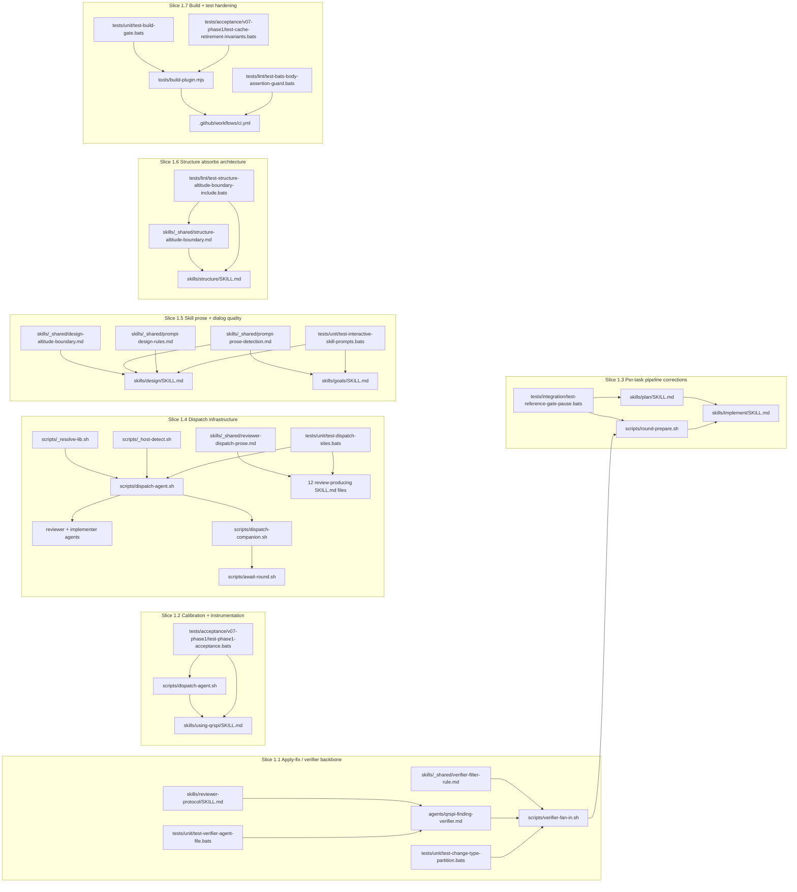

qrspi-plus v0.7.2 hardens one pipeline end to end: reviewer dispatch, verifier fan-in, skill prose, scope boundaries, and release packaging all tighten together. The release shifts repeated chat-era mechanics into shared scripts and shared snippets, then pins them with lint, integration, and self-host acceptance coverage. Structure therefore centers on cross-cutting boundaries rather than isolated feature files.

## File Map

### Slice 1.1 — Apply-fix / verifier backbone

This slice centralizes finding shape, sidecar handling, and keep-or-drop decisions so apply-fix stops reconstructing verifier state in chat.

| File | Action | Responsibility | Goal IDs |
|---|---|---|---|
| `scripts/verifier-fan-in.sh` | Create | Read round findings + sidecars, enforce schema, and emit kept-finding/audit artifacts for apply-fix. | G12, G13 |
| `skills/_shared/verifier-filter-rule.md` | Create | Hold the single threshold/filter rule consumed by orchestrator prose and verifier fan-in. | G7 |
| `skills/_shared/verifier-dispatch-prose.md` | Create | Hold the shared verifier dispatch prose snippet (`dispatch-agent.sh --verifier-fanout` invocation + spec-line contract + `await-round.sh` follow-up) consumed by `using-qrspi/SKILL.md` and `implement/SKILL.md`. | G12 |
| `skills/reviewer-protocol/SKILL.md` | Modify | Lock the canonical finding schema, `change_type` field name, enum, and informational-finding framing independent of transport. | G6, G8, G13, G14 |
| `skills/reviewer-protocol/first-party-emission.md` | Create | Define the Write-tool-only reviewer emission contract for first-party dispatches. | G6 |
| `skills/reviewer-protocol/third-party-emission.md` | Create | Define the stdout-boundary emission contract for third-party dispatches. | G6 |
| `agents/qrspi-finding-verifier.md` | Modify | Constrain verifier sidecar output path/extension and extend the rubric for informational + false-positive handling. | G11, G14 |
| `tests/unit/test-per-finding-file-emission.bats` | Modify | Pin reviewer disk-write behavior and clean-sentinel behavior at the file-contract layer. | G6 |
| `tests/unit/test-change-type-partition.bats` | Modify | Guard `change_type` routing, filter partitioning, and enum-based apply-fix behavior. | G8, G13 |
| `tests/unit/test-verifier-agent-file.bats` | Modify | Guard verifier sidecar extension, required fields, and rubric text anchors. | G11, G14 |

### Slice 1.2 — Verifier rubric calibration + instrumentation

This slice makes verifier scoring observable and review-round instrumentation durable enough to audit sub-threshold decisions after the fact.

| File | Action | Responsibility | Goal IDs |
|---|---|---|---|
| `agents/qrspi-finding-verifier.md` | Modify | Add hallucination screening, actual-model-aware scoring cues, and convergent-evidence exception handling. | G19, G20, G28 |
| `skills/using-qrspi/SKILL.md` | Modify | Define round instrumentation, sub-threshold observation logging, and verifier-visible audit surfaces. | G20, G28, G29 |
| `scripts/dispatch-agent.sh` | Modify | Add host/vendor/model metadata persistence into the dispatch manifest for later observability. | G20, G29 |
| `tests/unit/test-verified-file-shape.bats` | Modify | Pin verified-file headers, kept/dropped counts, and instrumentation fields. | G20, G28 |
| `tests/acceptance/v07-phase1/test-phase1-acceptance.bats` | Modify | Exercise verifier calibration and round instrumentation in the release-level path. | G19, G20, G28, G29 |

### Slice 1.3 — Per-task review pipeline corrections

This slice repairs the per-task lane so sweep tasks and contract-carrying tasks bring their real downstream surface with them into review.

| File | Action | Responsibility | Goal IDs |
|---|---|---|---|
| `scripts/round-prepare.sh` | Modify | Add per-task diff, scope, and commit-anchor artifact emission alongside the existing canonical diff/ref selection logic. | G9 |
| `skills/plan/SKILL.md` | Modify | Author `dependent_tests:` and `cross_task_consumers:` when a task changes shared contracts or sweep surfaces. | G15, G18 |
| `agents/qrspi-plan-reviewer.md` | Modify | Enforce sweep-task and cross-task-consumer heuristics at plan review time. | G15, G18 |
| `skills/implement/SKILL.md` | Modify | Require `round-prepare` outputs and scope-tagger/fan-in artifacts on each per-task review cycle. | G9 |
| `tests/unit/test-scope-tagger-dispatch.bats` | Modify | Guard per-task scope-set emission and round artifact production. | G9 |
| `tests/integration/test-reference-gate-pause.bats` | Modify | Exercise dependent-test and consumer-surface pause behavior across task boundaries. | G15, G18 |

### Slice 1.4 — Dispatch infrastructure

This slice collapses per-skill reviewer dispatch into one routed script chain and one shared prose surface, while making routing failures loud and host-aware.

| File | Action | Responsibility | Goal IDs |
|---|---|---|---|
| `scripts/dispatch-agent.sh` | Create | Universal batched dispatch entrypoint: resolve tier/model, prepare rounds, write manifests, and emit first-party task specs. | G3, G4, G16, G22, G23, G25, G27 |
| `scripts/dispatch-companion.sh` | Create | Launch vendor-specific third-party review jobs beneath the universal dispatcher. | G3, G27 |
| `scripts/third-party-finding-splitter.sh` | Create | Split third-party stdout boundaries into per-finding files. | G3 |
| `scripts/round-prepare.sh` | Create | Canonicalize cumulative diff/ref selection and next-round narrowing inputs. | G4 |
| `scripts/await-round.sh` | Create | Drain background reviewer jobs, finalize manifest state, and write round completion summaries. | G3, G4 |
| `scripts/_resolve-lib.sh` | Create | Own host×vendor routing, tier resolution, default-tier fallback, and fail-loud routing lookups. | G22, G23, G25, G27 |
| `scripts/_host-detect.sh` | Create | Expose the canonical host-detection probe reused by dispatch and reviewer selection. | G27 |
| `scripts/detect-interaction-mode.sh` | Create | Encapsulate per-host interaction-mode detection; return shell-verdict, llm-context instruction, or user-override-only signal depending on the active host. See Interface §13. | CD-4 |
| `skills/_shared/reviewer-dispatch-prose.md` | Create | Provide the one shared orchestrator dispatch snippet included by all review-producing skills. | G3, G4 |
| `skills/using-qrspi/SKILL.md` | Modify | Carry the unified five-tier `model_routing:` schema, host matrix, validation rows, and fail-loud invariant prose. | G3, G22, G23, G24, G25, G27 |
| `config.md` | Modify | Surface `model_routing`, `trusted_path`, and validator blocks consumed by universal dispatch. | G22, G23, G25 |
| `skills/_shared/config-validation-procedure.md` | Create | Define the repair-or-abort flow for invalid routing configuration. | G22, G23 |
| `scripts/g4-section-anchor-manifest.json` | Modify | Enumerate section-anchor sources used by narrow-read and round-preparation helpers. | G4 |
| `skills/using-qrspi/SKILL.anchors.json` | Modify | Index `using-qrspi` anchors for deterministic narrow reads. | G4 |
| `skills/reviewer-protocol/SKILL.anchors.json` | Modify | Index reviewer-protocol anchors for deterministic narrow reads. | G4 |
| `skills/plan/SKILL.anchors.json` | Modify | Index plan anchors for deterministic narrow reads. | G4 |
| `skills/goals/SKILL.md` | Modify | Replace inline reviewer-dispatch prose with a thin preamble plus shared include. | G3 |
| `skills/questions/SKILL.md` | Modify | Replace inline reviewer-dispatch prose with a thin preamble plus shared include. | G3 |
| `skills/research/SKILL.md` | Modify | Replace inline reviewer-dispatch prose with a thin preamble plus shared include. | G3 |
| `skills/design/SKILL.md` | Modify | Replace inline reviewer-dispatch prose with a thin preamble plus shared include. | G3 |
| `skills/structure/SKILL.md` | Modify | Replace inline reviewer-dispatch prose with a thin preamble plus shared include. | G3 |
| `skills/phasing/SKILL.md` | Modify | Replace inline reviewer-dispatch prose with a thin preamble plus shared include. | G3 |
| `skills/plan/SKILL.md` | Modify | Adopt shared reviewer dispatch and migrate per-task routing from `model:` to `tier:`. | G3, G22 |
| `skills/parallelize/SKILL.md` | Modify | Replace inline reviewer-dispatch prose with a thin preamble plus shared include. | G3 |
| `skills/replan/SKILL.md` | Modify | Replace inline reviewer-dispatch prose with a thin preamble plus shared include. | G3 |
| `skills/implement/SKILL.md` | Modify | Adopt shared reviewer dispatch and pass per-task tier overrides into implementer/test-writer fan-out. | G3, G4, G22, G27 |
| `skills/integrate/SKILL.md` | Modify | Replace inline reviewer-dispatch prose with a thin preamble plus shared include. | G3 |
| `skills/test/SKILL.md` | Modify | Replace inline reviewer-dispatch prose and read task `tier:` instead of task `model:`. | G3, G22 |
| `agents/qrspi-implementer.md` | Modify | Add the orchestrator-only-script allowlist and universal `DISPATCH_FILE` first-action pattern. | G16, G22 |
| `agents/qrspi-code-quality-reviewer.md` | Modify | Add `tier:` frontmatter and dispatch-file first action on a representative reviewer body. | G22 |
| `agents/qrspi-plan-reviewer.md` | Modify | Add `tier:` frontmatter and dispatch-file first action on a plan reviewer body. | G22 |
| `agents/qrspi-test-writer.md` | Modify | Add `tier:` frontmatter so test-writer dispatch co-escalates with implementer dispatch. | G22 |
| `tests/unit/test-dispatch-sites.bats` | Modify | Assert all reviewer-producing skills route through `dispatch-agent.sh`. | G3, G4 |
| `tests/unit/test-config-model-routing.bats` | Modify | Pin schema shape, validation rows, and fail-loud routing behavior. | G22, G23, G25 |
| `tests/unit/test-routing-matrix-application.bats` | Modify | Assert host-aware vendor routing and `--tier-override` behavior. | G22, G27 |
| `tests/unit/test-run-codex-review.bats` | Modify | Guard sanctioned-path filtering on review-wrapper inputs. | G16 |
| `tests/unit/test-codex-review-codex-availability.bats` | Modify | Guard host-aware second-reviewer availability probing. | G27 |

### Slice 1.5 — Skill prose & interactive dialog quality

This slice raises artifact-authoring quality at the prompt/prose boundary and makes long interactive phases survive compaction without losing locked decisions.

| File | Action | Responsibility | Goal IDs |
|---|---|---|---|
| `skills/design/SKILL.md` | Modify | Author richer per-goal design blocks, simple-language dialog conduct, and direct-to-artifact drafting. | G1, G30, G33 |
| `skills/goals/SKILL.md` | Modify | Mirror the approved dialog conduct subset and write locked goals directly into `goals.md`. | G1, G30 |
| `skills/plan/post-approval-split-contract.md` | Modify | Lock the block-hash position and idempotent split contract for per-task files. | G5 |
| `skills/plan/SKILL.md` | Modify | Add schema-migration task shape and prompt-prose-aware task classification/authoring clauses. | G2, G31 |
| `agents/qrspi-design-reviewer.md` | Modify | Enforce richer design blocks and apply prompt-prose review at block scope. | G1, G31 |
| `agents/qrspi-plan-reviewer.md` | Modify | Review schema-migration exceptions and prompt-prose deliverables using the shared rules. | G2, G31 |
| `skills/reviewer-protocol/SKILL.md` | Modify | Ban fabricated procedural authority and keep reviewer findings tied to real contract surfaces. | G10 |
| `skills/implementer-protocol/SKILL.md` | Modify | Correct stale committed-gitignore prose without changing runtime invariants. | G17 |
| `agents/qrspi-test-writer.md` | Modify | Correct stale committed-gitignore prose in the test-writer’s commit workflow. | G17 |
| `skills/_shared/design-altitude-boundary.md` | Create | Hold the single Design OWNS/DEFERS contract used by both contract and reviewer surfaces. | G34 |
| `skills/_shared/evergreen-output-rule.md` | Create | Hold the single Evergreen-Output Rule snippet consumed by all nine artifact-producing skills via `!cat`. | CD-2 |
| `skills/_shared/multi-actor-flow-check.md` | Create | Hold the single Multi-Actor Flow Check snippet `!cat`-included into structure, plan, parallelize, and implement SKILL.md files. | CD-3 |
| `skills/design/owns-defers.md` | Modify | Include the shared Design altitude boundary. | G34 |
| `skills/_shared/prompt-prose-detection.md` | Create | Define universal prompt-prose detection by content semantics. | G31 |
| `skills/_shared/prompt-prose-writer-addition.md` | Create | Define writer-side prompt-rule application. | G31 |
| `skills/_shared/prompt-prose-reviewer-addition.md` | Create | Define reviewer-side prompt-rule application. | G31 |
| `skills/prompt-prose-writer/SKILL.md` | Create | Wrapper skill that preloads detection + writer rules for authoring agents. | G31 |
| `skills/prompt-prose-reviewer/SKILL.md` | Create | Wrapper skill that preloads detection + reviewer rules for reviewer agents. | G31 |
| `skills/_shared/prompt-design-rules.md` | Create | Become the runtime rules file consumed when prompt prose is actually in scope. | G31 |
| `docs/prompt-design-guide.md` | Modify | Hand off the old guide surface to the new shared runtime rules location. | G31 |
| `tests/unit/test-plan-post-approval-split.bats` | Modify | Guard block-hash emission, safe re-run, and loud conflict behavior. | G5 |
| `tests/unit/test-interactive-skill-prompts.bats` | Modify | Pin dialog-conduct wording, simple-language framing, and compaction-resume diagnostics. | G1, G30, G33 |
| `tests/unit/test-author-skill-uses-cat.bats` | Modify | Guard shared include usage for prompt-prose and design-boundary snippets. | G31, G34 |
| `tests/lint/test-design-altitude-boundary-include.bats` | Create | Guard the two required `!cat` inclusions for `design-altitude-boundary.md` so the Design boundary cannot drift by subtraction. | G34 |
| `tests/acceptance/test-review-pause.bats` | Modify | Ensure pause/review flow respects operator authority rather than fabricated reviewer mandates. | G10 |

### Slice 1.6 — Structure SKILL absorbs unified architecture

This slice gives Structure the architecture and test-architecture altitude that Design intentionally stops owning in v0.7.2.

| File | Action | Responsibility | Goal IDs |
|---|---|---|---|
| `skills/structure/SKILL.md` | Modify | Add unified architecture and `## Test Architecture` authoring procedure to Structure. | G35 |
| `skills/_shared/structure-altitude-boundary.md` | Create | Hold the single Structure OWNS/DEFERS contract used by both contract and reviewer surfaces. | G35 |
| `skills/structure/owns-defers.md` | Modify | Include the shared Structure altitude boundary. | G35 |
| `agents/qrspi-structure-reviewer.md` | Modify | Treat unified architecture and test architecture as expected Structure content. | G35 |
| `agents/qrspi-structure-scope-reviewer.md` | Modify | Restate the shared Structure boundary in the reviewer’s immediate reasoning context. | G35 |
| `tests/lint/test-structure-altitude-boundary-include.bats` | Create | Guard the two required `!cat` inclusions so the boundary cannot drift by subtraction. | G35 |

### Slice 1.7 — Build & release tooling + test-infrastructure hardening

This slice hardens the test gate itself and ensures the shipped plugin artifact matches the source-controlled runtime tree.

| File | Action | Responsibility | Goal IDs |
|---|---|---|---|
| `tests/unit/test-using-qrspi-vocab.bats` | Modify | Replace brittle literal-string pins with guarded semantic regex pins for silent-fallback language. | G21, G24, G26 |
| `tests/lint/test-bats-body-assertion-guard.bats` | Create | Lint all BATS files for `$body`-guard and BW02 minimum-version hygiene. | G21, G26 |
| `tests/unit/test-build-gate.bats` | Modify | Guard build-sync failure shape and stale-build diagnostics. | G32 |
| `tests/unit/test-ci-workflow-shape.bats` | Modify | Assert CI runs the added lint and build-sync gates. | G21, G32 |
| `tools/build-plugin.mjs` | Create | Build the installable plugin tree, expand `!cat`, and strip dev-only content. | G32 |
| `tools/render-skill.sh` | Create | Hold the relocated dev-only skill-render helper outside shipped runtime scripts. | G32 |
| `tools/g4-section-anchor-refresh.sh` | Create | Hold the relocated dev-only anchor-refresh helper outside shipped runtime scripts. | G32 |
| `.claude-plugin/marketplace.json` | Modify | Point marketplace installs at `./build` and carry the v0.7.2 release metadata. | G32 |
| `.github/workflows/ci.yml` | Modify | Add recursive BATS lint coverage and a PR-blocking build-sync check. | G21, G32 |
| `CONTRIBUTING.md` | Modify | Document the rebuild-before-commit workflow for the committed `build/` tree. | G32 |
| `tests/acceptance/v07-phase1/test-cache-retirement-invariants.bats` | Modify | Assert built plugin trees omit dev-only paths and keep runtime-only content. | G32 |
| `tests/acceptance/v07-phase1/test-phase1-acceptance.bats` | Modify | Exercise full-release acceptance, including G24’s re-scoped closure and G26’s regression-prevention path. | G24, G26, G32 |

## Interfaces

The release’s hardening value comes from explicit small contracts, not from prose-only conventions.

### 1. Verifier fan-in script

The apply-fix boundary is a single script contract so round assembly no longer depends on chat parsing.

```bash
# scripts/verifier-fan-in.sh
# Usage: verifier-fan-in.sh <round-dir> [--strict]
# Exit 0: wrote <round-dir>/kept-findings.txt
# Exit 1: contract violation (missing sidecars, out-of-enum change_type)
# Output: <round-dir>/kept-findings.txt (newline-separated finding IDs)
#         <round-dir>/.verifier-fan-in-audit.json (scored/failed/dropped/kept counts)
```

### 2. Canonical cumulative diff helper

Round preparation is script-owned so every per-task review round computes the same ref, scope, and anchor artifacts.

```bash
# scripts/round-prepare.sh <task-branch> <round-NN> <output-dir> [--implementer-commit <SHA>] [--verify]
# Exit 0: <output-dir>/round-NN.diff + <output-dir>/round-NN-commit.txt written
# Exit 10: SHA already matches (idempotent skip)
# Exit 11: worktree integrity break
# Exit 12: re-dispatch implementer needed
```

### 3. Universal dispatch CLI

Reviewer dispatch is one batch-oriented CLI surface regardless of reviewer family or host path.

```bash
scripts/dispatch-agent.sh --step <step> --round <N> --output-dir <round-dir> \
  --artifact <artifact-name> \
  --agents tag1=agent-name-1,tag2=agent-name-2,... \
  [--task-branch <worktree-path> --implementer-commit <40-char-SHA>] \
  [--tier-override tag1=high,tag2=medium,...]
# Stdout: M lines of form: MODE=first_party TAG=<tag> SUBAGENT_TYPE=<agent-name> MODEL=<resolved-model> PROMPT_FILE=<absolute-path>
```

### 4. `model_routing:` config block

Model selection is config-owned and fail-loud, so hosts never silently substitute a neighboring tier.

```yaml
model_routing:
  extra-low:  none
  low:        { vendor: claude, model: claude-haiku-4.5 }
  medium:     { vendor: claude, model: claude-sonnet-4.6 }
  high:       { vendor: claude, model: claude-opus-4.7 }
  extra-high: { vendor: claude, model: claude-opus-4.7-high }
trusted_path:
  copilot_cli: true
  claude_code: false
validators:
  change_type_enum: [style, clarity, correctness, scope, intent]
  finding_schema_required: [finding_id, severity, change_type, referenced_files, artifact]
```

### 5. Structure altitude-boundary snippet

The Structure boundary lives in one shared snippet so both the contract file and the scope reviewer reason from identical text.

```markdown
## Structure Altitude Boundary

<boundary rule prose>

### What Structure OWNS
- ...

### What Structure DEFERS
- ...
```

Concrete v0.7.2 path: `skills/_shared/structure-altitude-boundary.md`.

### 6. Design altitude-boundary snippet

The Design boundary uses the same single-source pattern; the shipped file name is the concrete v0.7.2 authority even though earlier draft wording described the surface generically.

```markdown
## Design Altitude Boundary

<boundary rule prose>

### What Design OWNS
- ...

### What Design DEFERS
- ...
```

Concrete v0.7.2 path: `skills/_shared/design-altitude-boundary.md`.

### 7. Host-and-tier-aware second-reviewer override

Second-reviewer choice is a tag-scoped override contract, not a separate dispatch path.

```text
--tier-override <csv>

csv        := assignment ("," assignment)*
assignment := <reviewer-tag> "=" <tier>
tier       := extra-low | low | medium | high | extra-high
```

Semantics:
- tags not named in `--tier-override` resolve through agent `tier:` → `default_tier:` → fail-loud fallback chain
- the override is applied per emitted reviewer tag, so one batch can escalate only the second reviewer while leaving primary reviewers unchanged
- invalid tag names or tier values halt dispatch before any Task invocation

### 8. Section-anchor index files

Anchor lookups are file-backed so narrow reads and round preparation can consume deterministic line windows.

```json
{ "source": "skills/using-qrspi/SKILL.md", "indexes": [ { "heading": "## Section-Anchor Index", "line_start": 12, "line_end": 44 } ] }
```

Concrete surfaces:
- `scripts/g4-section-anchor-manifest.json`
- `skills/using-qrspi/SKILL.anchors.json`
- `skills/reviewer-protocol/SKILL.anchors.json`
- `skills/plan/SKILL.anchors.json`

### 9. Verifier sidecar schema

Verifier scoring is sidecar-only so human-readable reasoning stays available without contaminating the finding file itself.

```yaml
---
finding_id: R3-F02
reviewer_tag: quality-claude
score: 84
change_type: correctness
actual_model: claude-sonnet-4.6
reasoning_summary: >-
  Concise verifier rationale explaining the score.
---
```

Path rule: `<round-dir>/<reviewer-tag>.finding-FNN.score.md`.

### 10. Dispatch manifest schema

Dispatch state survives compaction because first-party and third-party launches share one round-local manifest.

```json
[
  {
    "tag": "quality-claude",
    "agent": "qrspi-plan-reviewer",
    "mode": "first_party",
    "status": "dispatched",
    "dispatch_spec": {
      "subagent_type": "qrspi-plan-reviewer",
      "model": "claude-sonnet-4.6",
      "prompt_file": "/abs/path/reviews/plan/round-01/.dispatch/quality-claude.prompt"
    }
  },
  {
    "tag": "quality-codex",
    "agent": "qrspi-plan-reviewer",
    "mode": "background",
    "status": "pending",
    "job_id": "job-123",
    "await_cmd": "scripts/dispatch-companion.sh await job-123",
    "split_cmd": "scripts/third-party-finding-splitter.sh --round-dir /abs/path/reviews/plan/round-01"
  }
]
```

### 11. `.verifier-fan-in-audit.json` schema

Fan-in emits machine-readable counts because apply-fix needs a stable summary even when the round halts early.

```json
{
  "round_dir": "reviews/plan/round-01",
  "scored": 6,
  "failed": 1,
  "dropped": 2,
  "kept": 4,
  "halts": [
    {
      "finding_id": "R1-F03",
      "reason": "missing sidecar"
    }
  ]
}
```

### 12. Shared verifier filter rule snippet

Threshold logic is snippet-backed so fan-in, apply-fix, and reviewer-facing documentation all point at one authoritative rule.

```markdown
## Verifier Filter Rule

<threshold and filter rule prose>
- ...
```

Concrete v0.7.2 path: `skills/_shared/verifier-filter-rule.md`.

### 13. Interaction-mode detector

The orchestrator consults this script once per round-start; detection logic stays script-encapsulated so no consumer skill or agent body carries per-host signal names.

```bash
# scripts/detect-interaction-mode.sh
# Usage: detect-interaction-mode.sh  (no arguments)
# Exit 0: detection succeeded (including safe-default branch)
# Exit non-zero: internal script error only
# Stdout: KEY=VALUE pairs, one per line; DETECTION_TYPE ∈ {shell-verdict, llm-context, user-override-only}
#
# shell-verdict:      PLATFORM=<name> DETECTION_TYPE=shell-verdict VERDICT=auto|interactive EVIDENCE=<signal>
# llm-context:        PLATFORM=<name> DETECTION_TYPE=llm-context INSTRUCTION=<prose>
# user-override-only: PLATFORM=<name> DETECTION_TYPE=user-override-only VERDICT=interactive EVIDENCE=<override-chain-result>
```

Override chain (consulted for `user-override-only` hosts and as fallback when the primary signal is absent): (1) `QRSPI_INTERACTION_MODE=auto|interactive` env var; (2) safe-default `interactive`.

Locked platform directory (verified at design time as of 2026-05-31): Copilot CLI (`COPILOT_CLI=1`) returns `llm-context`; Claude Code (no `COPILOT_CLI`, system-reminder framing present) returns `llm-context`; unknown host returns `user-override-only`. See design.md CD-4 §I.7 for full platform table.

Audit file: after each detection cycle, the orchestrator (exclusive writer) writes `<round-dir>/.interaction-mode-audit.json` with shape `{platform, detection_type, verdict, evidence}`. For `shell-verdict` and `user-override-only` the orchestrator copies fields directly from script stdout; for `llm-context` the orchestrator derives verdict and evidence from its own context inspection. Separate file from `.verifier-fan-in-audit.json` (different writer, different timing — round-start vs round-end).

## Architectural Diagram

The architecture is deliberately script-led: skills set parameters, shared snippets unify prompt text, and scripts carry the round mechanics that must not drift by host or reviewer count.



## CI Pipeline

The release keeps one workflow file, but that workflow becomes the release gate for linted tests and for the built plugin tree.

### `.github/workflows/ci.yml`

This workflow remains the only CI entrypoint and picks up three new blocking surfaces.

- **Lint job (`lint`)**: keep shellcheck + bash-3.2 ban-list, then add recursive BATS lint coverage so `tests/lint/test-bats-body-assertion-guard.bats` blocks silent-pass regressions from G21/G26 and `tests/lint/test-structure-altitude-boundary-include.bats` blocks G35 boundary drift.
- **Build-sync gate inside PR CI**: after checkout and Node setup, run `node tools/build-plugin.mjs` and then `git diff --exit-code build/ .claude-plugin/marketplace.json`; any stale built tree or malformed `!cat` stops the PR. This is the G32 release-integrity gate.
- **BATS execution shape**: the bash-3.2 test job expands from unit + acceptance only to recursive runtime coverage so the new lint tests and build-structure guards run on the same blocking path as existing unit/acceptance suites.

## Test Architecture

The release test plan is taxonomy-first: each test type owns a distinct boundary, and Structure stitches design acceptance blocks into those boundaries rather than re-authoring behavior.

### T1 — Unit tests

Unit tests pin one helper, one script, one agent body, or one shared contract at a time. They own deterministic shell-level behavior, schema shape, prompt-body invariants, and reviewer/agent file structure where no multi-step orchestration is required.

Feeds: G6, G7, G8, G11, G13, G14, G16, G17, G19, G20, G21, G22, G23, G24, G26, G27, G28, G31, G32, G34, G35.

### T2 — Integration tests

Integration tests wire multiple scripts or review-loop stages together. They own manifest-driven reviewer dispatch, verifier fan-in, per-task round preparation, scope-tagger sequencing, and plan-to-implement hand-off checks that only make sense across more than one file or actor.

Feeds: CD-1, CD-3, CD-4, G3, G4, G6, G9, G12, G15, G16, G18, G22, G23, G27, G32.

### T3 — Acceptance tests

Acceptance tests run the pipeline as a real flow against `tests/acceptance/v07-phase1/` and the existing acceptance surfaces. They own behavior that must remain true only when multiple slices cooperate: direct-to-artifact drafting, pause-gate behavior, stitched architecture authoring, and end-to-end verifier flow.

Feeds: CD-2, CD-4, G1, G2, G3, G4, G5, G9, G10, G15, G18, G30, G31, G33, G34, G35.

### T4 — Lint / regression-guard tests

Lint and regression-guard tests pin source-level invariants that should fail before runtime ever begins. They own include presence, vocabulary pins, schema token names, evergreen-output prose rules, and reviewer-contract drift that is cheapest to catch by scanning source.

Feeds: CD-2, G7, G8, G10, G11, G13, G17, G21, G24, G26, G29, G31, G34, G35.

### T5 — Build-pipeline tests

Build-pipeline tests verify the shipped plugin artifact, not just the source tree. They own `!cat` expansion, stripped install content, marketplace source routing, and any prompt-boundary contract that depends on the built artifact matching the source contracts.

Feeds: G32, plus the build-expanded shared-snippet surfaces from G31, G34, and G35.

### T6 — Self-host acceptance

The final acceptance test is the release running against itself: the v0.7.2 self-host path demonstrates that the hardened pipeline, reviewer routing, scope boundaries, and build output all hold together on a real project. This type also owns closure of absorbed or moot-by-design goals because their acceptance is “no regression + correct absorption,” not standalone runtime behavior.

Feeds: CD-1, CD-2, CD-3, CD-4, and G1–G35.

### Cross-cutting invariants

These invariants are release-wide and each is owned by the smallest test type that can fail it loudly.

- **CD-1 universal dispatch fails loud on missing routing entry** — T4 + T2
- **CD-2 evergreen-output rule strips dialogue exhaust from draft→approved artifacts** — T4 + T3
- **CD-3 multi-actor flow check halts instead of guessing missing hand-offs** — T2
- **CD-4 verifier-fan-in pipeline remains script-owned end to end** — T2 + T3
- **G6 reviewer disk-write reliability holds across first-party and third-party reviewer families** — T2
- **G7 verifier filter rule stays DRY at point of use** — T4
- **G8 finding files use `change_type:` rather than drifted field names** — T4 + T1
- **G11 verifier sidecar extension and write path stay locked** — T1 + T4
- **G12 verifier-fan-in script emits kept-findings and audit artifacts deterministically** — T2
- **G13 `change_type` enum enforcement is loud on both reviewer and fan-in sides** — T1 + T2
- **G15/G18 sweep-task and consumer-surface under-scoping is caught before implementation** — T1 + T2
- **G16 review-wrapper path filtering blocks sanctioned-channel exfil surfaces** — T1 + T2
- **G21/G24-F05/G26 BATS silent-pass, anti-pattern, and BW02 hygiene regressions fail before merge** — T4
- **G22/G27 host-aware tier routing and second-reviewer override resolve deterministically** — T1 + T2
- **G28 sub-threshold observations and actual-model observability remain visible after a round** — T1 + T3
- **G30 incremental draft persistence survives compaction/resume without placeholder bodies** — T3 + T6
- **G31 prompt-prose rules apply by content semantics, not by path alone** — T1 + T5
- **G32 build sync check guarantees `build/` matches source and shipped plugin omits dev-only paths** — T5 + T6
- **G35 `structure-altitude-boundary` include presence stays in both consumer files** — T4

## Section Contracts

Section-list contracts for new `skills/`, `_shared/`, and protocol files created in this release. Each entry names required top-level sections at heading-level granularity. Prose content under those headings is deferred to Plan/Implement. Files already contracted in the Interfaces section (`skills/_shared/structure-altitude-boundary.md` → §5; `skills/_shared/design-altitude-boundary.md` → §6; `skills/_shared/verifier-filter-rule.md` → §12; `scripts/detect-interaction-mode.sh` → §13) are cross-referenced rather than duplicated here.

| File | Required top-level sections |
|---|---|
| `skills/_shared/evergreen-output-rule.md` | `## Evergreen-Output Rule` |
| `skills/_shared/multi-actor-flow-check.md` | `## Multi-Actor Flow Check` |
| `skills/_shared/verifier-dispatch-prose.md` | `## Verifier Dispatch` |
| `skills/_shared/verifier-filter-rule.md` | `## Verifier Filter Rule` — see Interface §12 |
| `skills/_shared/structure-altitude-boundary.md` | `## Structure Altitude Boundary`, `### What Structure OWNS`, `### What Structure DEFERS` — see Interface §5 |
| `skills/_shared/design-altitude-boundary.md` | `## Design Altitude Boundary`, `### What Design OWNS`, `### What Design DEFERS` — see Interface §6 |
| `skills/_shared/reviewer-dispatch-prose.md` | `## Reviewer Dispatch` |
| `skills/_shared/config-validation-procedure.md` | `## Config Validation Procedure`, `### Valid Configuration`, `### Invalid Configuration` |
| `skills/_shared/prompt-prose-detection.md` | `## Prompt-Prose Detection` |
| `skills/_shared/prompt-prose-writer-addition.md` | `## Prompt-Prose Writer Addition` |
| `skills/_shared/prompt-prose-reviewer-addition.md` | `## Prompt-Prose Reviewer Addition` |
| `skills/_shared/prompt-design-rules.md` | `## Prompt Design Rules` |
| `skills/reviewer-protocol/first-party-emission.md` | `## First-Party Emission Contract`, `### Write-Tool Requirements`, `### Path Rules` |
| `skills/reviewer-protocol/third-party-emission.md` | `## Third-Party Emission Contract`, `### Stdout Boundary`, `### Splitter Requirements` |
| `skills/prompt-prose-writer/SKILL.md` | `## Overview`, `## Detection`, `## Rules Application`, `## Process` |
| `skills/prompt-prose-reviewer/SKILL.md` | `## Overview`, `## Detection`, `## Rules Application`, `## Process` |

## Hook-Point Locations

Cross-cutting insertion sites locked by this release. Locations only — text content is deferred to Plan/Implement. Each entry names the consumer file and the section heading at which the hook fires or the include lands.

### CD-1 reviewer-dispatch-prose `!cat` include sites

`skills/_shared/reviewer-dispatch-prose.md` replaces inline reviewer-dispatch prose in the following consumer SKILL.md files. Include lands at each file's reviewer-dispatch section (the section that previously carried the inline `dispatch-agent.sh` invocation prose):

| Consumer file | Section heading |
|---|---|
| `skills/goals/SKILL.md` | `## Reviewer Dispatch` |
| `skills/questions/SKILL.md` | `## Reviewer Dispatch` |
| `skills/research/SKILL.md` | `## Reviewer Dispatch` |
| `skills/design/SKILL.md` | `## Reviewer Dispatch` |
| `skills/structure/SKILL.md` | `## Reviewer Dispatch` |
| `skills/phasing/SKILL.md` | `## Reviewer Dispatch` |
| `skills/plan/SKILL.md` | `## Reviewer Dispatch` |
| `skills/parallelize/SKILL.md` | `## Reviewer Dispatch` |
| `skills/replan/SKILL.md` | `## Reviewer Dispatch` |
| `skills/implement/SKILL.md` | `## Reviewer Dispatch` |
| `skills/integrate/SKILL.md` | `## Reviewer Dispatch` |
| `skills/test/SKILL.md` | `## Reviewer Dispatch` |

### CD-2 evergreen-output-rule `!cat` include sites

`skills/_shared/evergreen-output-rule.md` is `!cat`-included into nine artifact-producing SKILL.md files at the section that introduces the artifact-output contract (typically immediately before the artifact template or at the artifact-quality section):

| Consumer file | Section heading |
|---|---|
| `skills/goals/SKILL.md` | artifact-output contract section (before artifact template) |
| `skills/questions/SKILL.md` | artifact-output contract section (before artifact template) |
| `skills/research/SKILL.md` | artifact-output contract section (before artifact template) |
| `skills/design/SKILL.md` | artifact-output contract section (before artifact template) |
| `skills/structure/SKILL.md` | artifact-output contract section (before artifact template) |
| `skills/phasing/SKILL.md` | artifact-output contract section (before artifact template) |
| `skills/plan/SKILL.md` | artifact-output contract section (before artifact template) |
| `skills/parallelize/SKILL.md` | artifact-output contract section (before artifact template) |
| `skills/replan/SKILL.md` | artifact-output contract section (before artifact template) |

### CD-3 multi-actor-flow-check `!cat` include sites

`skills/_shared/multi-actor-flow-check.md` is `!cat`-included into four downstream-gate SKILL.md files at the section that introduces multi-actor hand-off checking behavior:

| Consumer file | Section heading |
|---|---|
| `skills/structure/SKILL.md` | `## Multi-Actor Flow Check` |
| `skills/plan/SKILL.md` | `## Multi-Actor Flow Check` |
| `skills/parallelize/SKILL.md` | `## Multi-Actor Flow Check` |
| `skills/implement/SKILL.md` | `## Multi-Actor Flow Check` |

### CD-4 / G12 verifier-dispatch-prose `!cat` include sites

`skills/_shared/verifier-dispatch-prose.md` is `!cat`-included into the Apply-fix protocol section of two consumer skills:

| Consumer file | Section heading |
|---|---|
| `skills/using-qrspi/SKILL.md` | artifact-level Apply-fix protocol section |
| `skills/implement/SKILL.md` | task-level Apply-fix protocol section |

### G34 design-altitude-boundary `!cat` include sites

`skills/_shared/design-altitude-boundary.md` is `!cat`-included in two consumer files per design.md CD-4 §D1:

| Consumer file | Location |
|---|---|
| `skills/design/owns-defers.md` | replaces inline contract body |
| `agents/qrspi-design-scope-reviewer.md` | procedure section, immediately after Step 1 Read citation (introducer prose precedes the include) |

### G35 structure-altitude-boundary `!cat` include sites

`skills/_shared/structure-altitude-boundary.md` is `!cat`-included in two consumer files per design.md G35 §D1:

| Consumer file | Location |
|---|---|
| `skills/structure/owns-defers.md` | replaces inline contract body |
| `agents/qrspi-structure-scope-reviewer.md` | procedure section, immediately after Step 1 Read citation (introducer prose precedes the include) |

