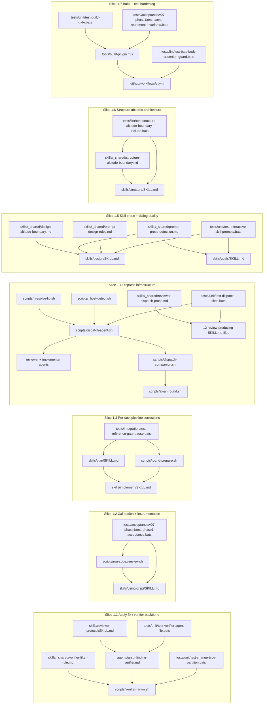

qrspi-plus v0.7.2 hardens one pipeline end to end: reviewer dispatch, verifier fan-in, skill prose, scope boundaries, and release packaging all tighten together. The release shifts repeated chat-era mechanics into shared scripts and shared snippets, then pins them with lint, integration, and self-host acceptance coverage. Structure therefore centers on cross-cutting boundaries rather than isolated feature files.


## Prose Provenance Convention

This artifact uses **per-file specification blocks** (see `## Per-File Specifications` below) as the load-bearing organizing axis. Each block consolidates everything an architect needs to reason about that file in one place: action, slice, goal IDs, responsibility, interface signature, design.md-sourced verbatim prose, outline-only constraints for Plan/Implement, tests, and `!cat` / `skills:` hook points.

**Why per-file blocks.** Each per-file block is the single anchor point where an architect, Plan consumer, or Implement consumer reads everything that pertains to one target file: its action, slice, goal IDs, responsibility, interface signature, design.md-sourced verbatim prose (when locked), outline-only constraints (when deferred), test-coverage boundary, and `!cat` / `skills:` hook-point list. Consolidating these into one block removes per-file dereference cost across structure.md and removes the dual-citation drift risk where structure.md and design.md could disagree on the locked prose.

**Verbatim vs outline.** Each per-file block distinguishes two prose forms:

- **Verbatim content (lifted from design.md):** A structured citation header followed by a mandatory fenced code block carrying the lifted payload. Each citation declares three fields — `**Source:**` (plain bold, format `design.md §<section> (L<start>-L<end>)`), `**Lift type:**` (one of `Full file body`, `Insertion delta`, or `Section body`), and `**Insertion site (in target file):**` (required iff Lift type ≠ Full file body — names the exact location in the target file where the payload lands). The fenced code block (e.g., ```markdown for `.md` targets, ```bash for shell scripts) is the unambiguous payload boundary and carries the lifted prose byte-identical to design.md, with no leading `> ` blockquote markers. **design.md display-fence carve-out.** When design.md wraps a payload in its own outer code fence (e.g., a 4-backtick ````markdown wrap so design.md can render `## headings` and `| tables |` as literal characters), that outer fence is design.md's display affordance — not part of the payload — and MUST NOT be lifted into structure.md's verbatim block. The structure.md fence is the only fence; the payload starts at the first line of substantive content inside design.md's display wrap. The same rule applies to any trailing `Placement:` / `Consumers:` metadata that design.md keeps adjacent to a payload — those are design-process metadata and belong in structure.md's `**Insertion site (in target file):**` field, never inside the payload. **`Old:` / `New:` delta-schema carve-out.** When design.md describes a prose-edit delta using an `Old:` / `New:` bullet pair (a substitution recipe), only the `New:` content is the verbatim payload destined for the target file. The `Old:` quote serves as a find-and-replace locator and belongs in the `**Insertion site (in target file):**` field, where the structure.md block names the pre-edit text the Insertion site uses to relocate the substitution point. A `**Verbatim content (lifted from design.md):**` heading on a per-file block means design.md is the canonical source — Plan/Implement consumers MUST author the cited file with the fenced payload exactly, preserving code fences, HTML comments, and any list/anchor scaffolding the lift carries. A future drift between structure.md and design.md is a contract violation caught by the structure-reviewer's stitching audit.
- **Outline-only sections (Plan/Implement authors):** A bullet list naming section anchors, anchor phrases that MUST appear, and behavior constraints. design.md provides scope and constraints; the actual prose body is authored at Plan/Implement time per design.md G1 Sub-Rule B ("deferred-prose-design" form). The outline pins what the authored prose must achieve without locking the wording.

**Asymmetry is explicit, not implicit.** A per-file block that omits both `**Verbatim content (lifted from design.md):**` and `**Outline-only sections:**` headings means design.md authored neither — the file is fully Plan/Implement-DEFERS. Test files (any `tests/**/*.bats` row) carry only `**Tests:**` content (what the test pins), never verbatim assertion text, per Plan/Implement's DEFERS contract on test bodies.

**Interface signatures are inline.** Function/class/CLI signatures used by other files in the codebase are included in the file's own block under `**Interface:**`. Cross-file interface coordination (caller-callee contracts) is verified by the structure-reviewer's stitching audit; the prior §Interfaces section is removed as the per-file inlining renders it redundant.

**Hook-point integration view.** The prior §Hook-Point Locations section is retained at the end of this artifact as `## Hook-Point Cross-Slice Index` — preserved because the G31 prompt-prose-detection !cat hook fans out across 9 consumer files spanning 4 slices, and the cross-slice integration view aids the structure-reviewer's stitching audit at a different altitude than per-file detail. Per-file `!cat` source/target listings live in each file's block; the cross-slice index is navigation-only.

**Consumer hand-off.** Plan reads each per-file block to author task specs (one per file or one per coordinated file group per Plan's task partitioning). Implement reads each per-file block to author the file. Verbatim blocks are copied byte-identically; outline blocks are expanded into prose under the cited constraints. Where this artifact and design.md diverge, design.md is canonical — file an issue against structure.md to re-lift.

## File Index

Navigation table for the 109 per-file specifications in `## Per-File Specifications` below. Search the file path (CTRL-F) to jump to the per-file block.

| File | Action | Slice | Goal IDs |
|------|--------|-------|----------|
| `scripts/verifier-fan-in.sh` | Create | 1.1 | {G12, G13} |
| `skills/_shared/verifier-filter-rule.md` | Create | 1.1 | {G7} |
| `skills/_shared/verifier-dispatch-prose.md` | Create | 1.1 | {G12} |
| `skills/reviewer-protocol/SKILL.md` | Modify | 1.1 | {G6, G8, G13, G14} |
| `skills/reviewer-protocol/first-party-emission.md` | Create | 1.1 | {G6} |
| `skills/reviewer-protocol/codex-emission-override.md` | Rename → `skills/reviewer-protocol/third-party-emission.md` | 1.1 | {G6} |
| `agents/qrspi-finding-verifier.md` | Modify | 1.1 | {G11, G14} |
| `tests/unit/test-per-finding-file-emission.bats` | Modify | 1.1 | {G6} |
| `tests/unit/test-change-type-partition.bats` | Modify | 1.1 | {G8, G13} |
| `tests/unit/test-verifier-agent-file.bats` | Modify | 1.1 | {G11, G14} |
| `agents/qrspi-finding-verifier.md` | Modify | 1.2 | {G19, G20, G28} |
| `skills/using-qrspi/SKILL.md` | Modify | 1.2 | {G20, G28, G29, CD-4} |
| `scripts/run-codex-review.sh` | Modify | 1.2 | {G20, G29} |
| `tests/unit/test-verified-file-shape.bats` | Modify | 1.2 | {G20, G28} |
| `tests/acceptance/v07-phase1/test-phase1-acceptance.bats` | Modify | 1.2 | {G19, G20, G28, G29} |
| `scripts/round-prepare.sh` | Modify | 1.3 | {G9} |
| `skills/plan/SKILL.md` | Modify | 1.3 | {G15, G18} |
| `agents/qrspi-plan-reviewer.md` | Modify | 1.3 | {G15, G18} |
| `skills/implement/SKILL.md` | Modify | 1.3 | {G9} |
| `tests/unit/test-scope-tagger-dispatch.bats` | Modify | 1.3 | {G9} |
| `tests/integration/test-reference-gate-pause.bats` | Modify | 1.3 | {G15, G18} |
| `scripts/run-codex-review.sh` | Rename → `scripts/dispatch-agent.sh` | 1.4 | {G3, G4, G16, G22, G23, G25, G27} |
| `scripts/run-third-party-llm.sh` | Rename → `scripts/dispatch-companion.sh` | 1.4 | {G3, G27} |
| `scripts/codex-finding-splitter.sh` | Rename → `scripts/third-party-finding-splitter.sh` | 1.4 | {G3} |
| `scripts/round-prepare.sh` | Create | 1.4 | {G4} |
| `scripts/await-round.sh` | Create | 1.4 | {G3, G4} |
| `scripts/_resolve-lib.sh` | Create | 1.4 | {G22, G23, G25, G27} |
| `scripts/second-reviewer-available.sh` | Create | 1.4 | {G27} |
| `scripts/_host-detect.sh` | Create | 1.4 | {G27} |
| `scripts/detect-interaction-mode.sh` | Create | 1.4 | {CD-4} |
| `skills/_shared/reviewer-dispatch-prose.md` | Create | 1.4 | {G3, G4} |
| `skills/_shared/codex/launch-await-pattern.md` | Rename → `skills/_shared/third-party/launch-await-pattern.md` | 1.4 | {G3, G32} |
| `skills/using-qrspi/SKILL.md` | Modify | 1.4 | {G3, G22, G23, G24, G25, G27, CD-2} |
| `config.md` | Modify | 1.4 | {G22, G23, G25} |
| `skills/_shared/config-validation-procedure.md` | Create | 1.4 | {G22, G23} |
| `scripts/g4-section-anchor-manifest.json` | Modify | 1.4 | {G4} |
| `skills/using-qrspi/SKILL.anchors.json` | Modify | 1.4 | {G4} |
| `skills/reviewer-protocol/SKILL.anchors.json` | Modify | 1.4 | {G4} |
| `skills/plan/SKILL.anchors.json` | Modify | 1.4 | {G4} |
| `skills/goals/SKILL.md` | Modify | 1.4 | {G3} |
| `skills/questions/SKILL.md` | Modify | 1.4 | {G3} |
| `skills/research/SKILL.md` | Modify | 1.4 | {G3} |
| `skills/design/SKILL.md` | Modify | 1.4 | {G3} |
| `skills/structure/SKILL.md` | Modify | 1.4 | {G3} |
| `skills/phasing/SKILL.md` | Modify | 1.4 | {G3} |
| `skills/plan/SKILL.md` | Modify | 1.4 | {G3, G22} |
| `skills/parallelize/SKILL.md` | Modify | 1.4 | {G3} |
| `skills/replan/SKILL.md` | Modify | 1.4 | {G3} |
| `skills/implement/SKILL.md` | Modify | 1.4 | {G3, G4, G22, G27} |
| `skills/integrate/SKILL.md` | Modify | 1.4 | {G3} |
| `skills/test/SKILL.md` | Modify | 1.4 | {G3, G22} |
| `agents/qrspi-implementer.md` | Modify | 1.4 | {G16, G22} |
| `agents/qrspi-code-quality-reviewer.md` | Modify | 1.4 | {G22, G31} |
| `agents/qrspi-plan-reviewer.md` | Modify | 1.4 | {G22} |
| `agents/qrspi-test-writer.md` | Modify | 1.4 | {G22} |
| `agents/*.md` | Modify — schema migration | 1.4 | {G22} |
| `tests/unit/test-dispatch-sites.bats` | Modify | 1.4 | {G3, G4} |
| `tests/unit/test-config-model-routing.bats` | Modify | 1.4 | {G22, G23, G25} |
| `tests/unit/test-routing-matrix-application.bats` | Modify | 1.4 | {G22, G27} |
| `tests/unit/test-run-codex-review.bats` | Rename → `tests/unit/test-dispatch-agent.bats` | 1.4 | {G16} |
| `tests/unit/test-codex-review-codex-availability.bats` | Rename → `tests/unit/test-dispatch-companion-availability.bats` | 1.4 | {G27} |
| `tests/unit/test-second-reviewer-available.bats` | Create | 1.4 | {G27} |
| `skills/design/SKILL.md` | Modify | 1.5 | {G1, G30, G31, G33} |
| `skills/goals/SKILL.md` | Modify | 1.5 | {G1, G30} |
| `skills/plan/post-approval-split-contract.md` | Modify | 1.5 | {G5} |
| `skills/plan/SKILL.md` | Modify | 1.5 | {G2, G31} |
| `agents/qrspi-design-reviewer.md` | Modify | 1.5 | {G1, G31} |
| `agents/qrspi-design-scope-reviewer.md` | Modify | 1.5 | {G34} |
| `agents/qrspi-plan-reviewer.md` | Modify | 1.5 | {G2, G31} |
| `skills/reviewer-protocol/SKILL.md` | Modify | 1.5 | {G10} |
| `skills/implementer-protocol/SKILL.md` | Modify | 1.5 | {G17} |
| `agents/qrspi-test-writer.md` | Modify | 1.5 | {G17} |
| `skills/_shared/design-altitude-boundary.md` | Create | 1.5 | {G34} |
| `skills/_shared/evergreen-output-rule.md` | Create | 1.5 | {CD-2} |
| `skills/_shared/multi-actor-flow-check.md` | Create | 1.5 | {CD-3} |
| `skills/design/owns-defers.md` | Modify | 1.5 | {G34} |
| `skills/_shared/prompt-prose-detection.md` | Create | 1.5 | {G31} |
| `skills/_shared/prompt-prose-writer-addition.md` | Create | 1.5 | {G31} |
| `skills/_shared/prompt-prose-reviewer-addition.md` | Create | 1.5 | {G31} |
| `skills/prompt-prose-writer/SKILL.md` | Create | 1.5 | {G31} |
| `skills/prompt-prose-reviewer/SKILL.md` | Create | 1.5 | {G31} |
| `skills/_shared/prompt-design-rules.md` | Create | 1.5 | {G31} |
| `docs/prompt-design-guide.md` | Rename → `skills/_shared/prompt-design-rules.md` | 1.5 | {G31} |
| `tests/unit/test-plan-post-approval-split.bats` | Modify | 1.5 | {G5} |
| `tests/unit/test-interactive-skill-prompts.bats` | Modify | 1.5 | {G1, G30, G33} |
| `tests/unit/test-author-skill-uses-cat.bats` | Modify | 1.5 | {G31, G34} |
| `tests/lint/test-design-altitude-boundary-include.bats` | Create | 1.5 | {G34} |
| `tests/acceptance/test-review-pause.bats` | Modify | 1.5 | {G10} |
| `agents/qrspi-implementer-lightweight.md` | Modify | 1.5 | {G31} |
| `agents/qrspi-plan-spec-reviewer.md` | Modify | 1.5 | {G31} |
| `agents/qrspi-plan-test-coverage-reviewer.md` | Modify | 1.5 | {G31} |
| `skills/structure/SKILL.md` | Modify | 1.6 | {G35} |
| `skills/_shared/structure-altitude-boundary.md` | Create | 1.6 | {G35} |
| `skills/structure/owns-defers.md` | Modify | 1.6 | {G35} |
| `agents/qrspi-structure-reviewer.md` | Modify | 1.6 | {G35} |
| `agents/qrspi-structure-scope-reviewer.md` | Modify | 1.6 | {G35} |
| `tests/lint/test-structure-altitude-boundary-include.bats` | Create | 1.6 | {G35} |
| `tests/unit/test-using-qrspi-vocab.bats` | Modify | 1.7 | {G21, G24, G26} |
| `tests/lint/test-bats-body-assertion-guard.bats` | Create | 1.7 | {G21, G26} |
| `tests/unit/test-build-gate.bats` | Modify | 1.7 | {G32} |
| `tests/unit/test-ci-workflow-shape.bats` | Modify | 1.7 | {G21, G32} |
| `tools/build-plugin.mjs` | Create | 1.7 | {G32} |
| `tools/render-skill.sh` | Create | 1.7 | {G32} |
| `tools/g4-section-anchor-refresh.sh` | Create | 1.7 | {G32} |
| `.claude-plugin/marketplace.json` | Modify | 1.7 | {G32} |
| `.github/workflows/ci.yml` | Modify | 1.7 | {G21, G32} |
| `CONTRIBUTING.md` | Modify | 1.7 | {G32} |
| `tests/acceptance/v07-phase1/test-cache-retirement-invariants.bats` | Modify | 1.7 | {G32} |
| `tests/acceptance/v07-phase1/test-phase1-acceptance.bats` | Modify | 1.7 | {G24, G26, G32} |

## Per-File Specifications

The 107 per-file blocks below are the authoritative file-level scope for this release, organized by vertical slice. Each block follows the format described in `## Prose Provenance Convention` above. Slices match `design.md` and `phasing.md`; row order within each slice matches the prior §File Map row order.

## Slice 1.1 — Apply-fix / verifier backbone

### `scripts/verifier-fan-in.sh`

**Action:** Create
**Slice:** 1.1
**Goal IDs:** {G12, G13}
**Responsibility:** Read round findings + paired sidecars, enforce frontmatter/enum/sidecar schema, and emit `kept-findings.txt` + `.verifier-fan-in-audit.json` so apply-fix consumes only deterministic script output instead of chat-parsed verifier prose.

**Interface:**
```bash
# scripts/verifier-fan-in.sh
# Usage: verifier-fan-in.sh <round-dir> [--strict]
# Exit 0: wrote <round-dir>/kept-findings.txt
# Exit 1: contract violation (missing sidecars, out-of-enum change_type)
# Output: <round-dir>/kept-findings.txt (one absolute finding-file path per line)
#         <round-dir>/.verifier-fan-in-audit.json (scored/dropped/kept counts + threshold echo)
```

Audit-file schema (per structure.md §11):
```json
{
  "scored": 6,
  "kept": 4,
  "dropped": 2,
  "halts": [
    {
      "finding_id": "R1-F03",
      "cause": "missing sidecar"
    }
  ],
  "thresholds": { "style": 80, "clarity": 80, "correctness": 70 }
}
```

**Outline-only sections (Plan/Implement authors):**
- Script header: declare canonical `change_type` enum (`[style, clarity, correctness, scope, intent]` per the canonical enum locked in `skills/reviewer-protocol/SKILL.md` per-file block above and the `scripts/verifier-fan-in.sh` header constants — see `## Cross-Cutting Schemas` §9 Verifier sidecar schema for the sidecar field that carries the enum value) as the DRY source of truth referenced by `reviewer-protocol/SKILL.md` (per G13 / design.md CD-4 §G).
- Script header: declare per-`change_type` threshold floor constants (current state: style/clarity ≥80, correctness ≥70 — full per-enum table including any values added by G13's enum lock is Plan-time author work per design.md CD-4 §C step 3).
- Step 1 — Glob `<round-dir>/*.finding-F*.md` to enumerate findings (per design.md CD-4 §C step 1).
- Step 2 — For each finding: read frontmatter → assert `change_type:` present (halt cause `missing_change_type`) → assert value in canonical enum (halt cause `change_type_out_of_enum`) → glob paired sidecar at `<round-dir>/<reviewer-tag>.finding-F<NN>.score.md` (halt causes `missing_sidecar` / `sidecar_wrong_extension`) → read `score:` from sidecar (halt cause `score_unparseable`). Halt causes MUST match the per-cause table in design.md CD-4 §I.1.
- Step 3 — Apply threshold rule from script header constants keyed on `change_type` (per design.md CD-4 §C step 3).
- Step 4 — On all-clean: write `kept-findings.txt` (one absolute finding-file path per line, no header, no comments — per design.md CD-4 §D) + `.verifier-fan-in-audit.json` (counts + threshold echo + `halts: []`), exit 0.
- Step 5 — On any halt: write the audit JSON with populated `halts: [{finding_id, cause}, ...]`, exit non-zero with a one-line stderr message naming the first halt cause (per design.md CD-4 §C step 5).
- Loud-failure invariant: no silent default-keep and no silent default-drop. Round fails to converge on any contract violation (per design.md CD-4 §6).

**Tests:**
- `tests/unit/test-change-type-partition.bats`: pins `change_type` field-name required, enum membership enforced, partition routing on the enum, and apply-fix behavior keyed on enum membership (Slice 1.1 row).
- `tests/unit/test-verifier-agent-file.bats`: pins paired-sidecar extension contract that this script enforces (Slice 1.1 row).

---

### `skills/_shared/verifier-filter-rule.md`

**Action:** Create
**Slice:** 1.1
**Goal IDs:** {G7}
**Responsibility:** Hold the single threshold/filter rule snippet consumed by orchestrator prose and by `scripts/verifier-fan-in.sh`'s header — eliminates DRY drift across the five pre-CD-4 restatement sites and makes the script the executable source of truth (per design.md G7 + CD-4 §F).

**Outline-only sections (Plan/Implement authors):**
- `## Verifier Filter Rule`: one short canonical statement (~2 sentences) of what the filter does and that current threshold values live as constants in the header of `scripts/verifier-fan-in.sh` (per design.md G7 + CD-4 §F).
- The snippet MUST NOT carry the numeric thresholds inline — threshold values live as script constants and never enter orchestrator context (per design.md CD-4 §6 context-cost element).
- Anchor pointer phrase: name `scripts/verifier-fan-in.sh` header constants as the authoritative source so consumers point at the script rather than re-stating values.

---

### `skills/_shared/verifier-dispatch-prose.md`

**Action:** Create
**Slice:** 1.1
**Goal IDs:** {G12}
**Responsibility:** Hold the shared verifier-dispatch prose snippet (`dispatch-agent.sh --verifier-fanout` invocation + spec-line iteration contract + `await-round.sh` follow-up) `!cat`-included into the Apply-fix protocol section of `using-qrspi/SKILL.md` (artifact-level) and `implement/SKILL.md` (task-level) so neither consumer re-states the verifier dispatch loop.

**Outline-only sections (Plan/Implement authors):**
- Snippet is the verifier-mode mirror of `skills/_shared/reviewer-dispatch-prose.md` (CD-1 §11). The two snippets are deliberately separate even though their bodies are ~85% identical: each names a different `dispatch-agent.sh` mode flag (`--agents tag1=..,tag2=..` vs `--verifier-fanout`) and the mode flag is the load-bearing difference at the call site (per design.md CD-4 L494 / §H rationale).
- MUST carry: (1) the single `scripts/dispatch-agent.sh --verifier-fanout --step <step> --round <N> --output-dir <round-dir> [--tier-override <tier>]` invocation form (per the `scripts/dispatch-agent.sh` per-file block above (`--verifier-fanout` mode) + design.md CD-4 §H invocation form); (2) the spec-line iteration contract — one parallel Task batch reading `DISPATCH_FILE=<path>` per emitted spec line, with the same iron law as CD-1 reviewer dispatch (Task tool invoked exactly once per emitted spec line, `SUBAGENT_TYPE` / `MODEL` / `PROMPT_FILE` copied verbatim, prompt arg literally `"DISPATCH_FILE=<absolute-path-from-PROMPT_FILE>"` — per design.md CD-4 §H step 3); (3) the follow-up `scripts/await-round.sh --round-dir <round-dir>` call, no-op-safe for first-party-only rounds (per design.md CD-4 orchestrator-side flow step 3); (4) the follow-up single `scripts/verifier-fan-in.sh <round-dir>` invocation (per design.md CD-4 orchestrator-side flow step 4).
- Verifier-fanout takes a bare `<tier>` for `--tier-override` (NOT the CSV `tag=tier` grammar used by reviewer-fanout) because the verifier is a singleton agent — per `## Cross-Cutting Schemas` §7 Host-and-tier-aware second-reviewer override.
- MUST NOT echo captured verifier payloads on stdout/stderr (CD-1 #4 output-bound contract — inherited via `await-round.sh`).

**Hook points / `!cat` includes:**
- `!cat skills/_shared/verifier-dispatch-prose.md` at `skills/using-qrspi/SKILL.md` → artifact-level Apply-fix protocol section (per structure.md `## Hook-Point Cross-Slice Index` → CD-4 / G12 verifier-dispatch-prose `!cat` include sites + design.md CD-4 L494).
- `!cat skills/_shared/verifier-dispatch-prose.md` at `skills/implement/SKILL.md` → task-level Apply-fix protocol section (per structure.md `## Hook-Point Cross-Slice Index` → CD-4 / G12 verifier-dispatch-prose `!cat` include sites + design.md CD-4 L494).

---

### `skills/reviewer-protocol/SKILL.md`

**Action:** Modify
**Slice:** 1.1
**Goal IDs:** {G6, G8, G13, G14}
**Responsibility:** Lock the canonical 5-field finding schema, the `change_type:` field name and canonical enum, and the Informational-prefix convention — all independent of transport — by extracting per-transport emission contracts into sibling files and centralizing schema constants here.

**Outline-only sections (Plan/Implement authors):**
- Strip all emission prose from the body. Post-G6 the file contains no "use Write tool" or "emit to stdout" prose; the only emission-context grep matches MUST be in the per-transport sibling files (per design.md G6 acceptance: `grep -E 'Write tool|stdout' skills/reviewer-protocol/SKILL.md` returns no matches in emission-contract context).
- Retain emission-agnostic core only: 5-field finding schema, change-type classifier, untrusted-data handling, phase routing, dispatch contract, untrusted-scope-hint markers (per design.md G6-1 L1232).
- Field name `change_type:` is centralized here (G8); the canonical enum (`[style, clarity, correctness, scope, intent]` per the canonical enum locked in `skills/reviewer-protocol/SKILL.md` per-file block above and the `scripts/verifier-fan-in.sh` header constants — see `## Cross-Cutting Schemas` §9 Verifier sidecar schema for the sidecar field that carries the enum value) is defined here once and referenced — not duplicated — by per-reviewer agent bodies (per design.md CD-4 §F + §G + G13). The enum here MUST stay in lock-step with the enum in the `scripts/verifier-fan-in.sh` header (DRY source).
- Add new `## Informational Findings` section, inserted between `## Disagreement-Valid Framing` (currently ~L115) and `## Untrusted Data Handling` (currently ~L125) — per design.md G14 D1 placement.
- Section body MUST document: (a) the prefix shape — literal `Informational:` token, case-sensitive, capital I, lowercase remainder, trailing colon, at the start of the first non-blank line of `message`; (b) when to use it (reviewer believes the finding is real but is not demanding action); (c) what happens downstream (verifier scores on structural confidence; review loop logs the finding but does NOT auto-apply or pause regardless of `change_type`) — per design.md G14 D1 placement bullet at L1476.
- Backward compatibility note: findings without the prefix continue to be scored exactly as before (per design.md G14 D1 placement L1476).
- Post-CD-1/G6 name sweep MUST land: `grep -E 'run-codex-review|codex-emission-override|codex-finding-splitter' skills/reviewer-protocol/SKILL.md` returns zero matches; all references use post-rename names (`dispatch-agent.sh`, `dispatch-companion.sh`, `third-party-emission.md`, `third-party-finding-splitter.sh`) — per design.md G6 acceptance L1278.

**Tests:**
- `tests/unit/test-verifier-agent-file.bats`: pins reviewer-protocol section presence and the prefix-shape definition (per design.md G14 acceptance L1520; cross-slice — assertion lives in the verifier-agent-file test row in Slice 1.1).

---

### `skills/reviewer-protocol/first-party-emission.md`

**Action:** Create
**Slice:** 1.1
**Goal IDs:** {G6}
**Responsibility:** Define the Write-tool-only reviewer emission contract for first-party dispatches: per-finding files at `<round_subdir>/<reviewer_tag>.finding-F<NN>.md` or the `<reviewer_tag>.clean.md` zero-findings sentinel — single-voice emission story with no stdout boundary prose.

**Outline-only sections (Plan/Implement authors):**
- `## First-Party Emission Contract`, `### Write-Tool Requirements`, `### Path Rules` (anchors per structure.md §Hook-Point file table at L686).
- Contract body MUST state, per design.md G6-1 L1233: "use Write tool to write `<round_subdir>/<reviewer_tag>.finding-F<NN>.md` per finding, or `<reviewer_tag>.clean.md` sentinel when no findings exist. Chat-only return is a contract violation and produces zero findings for your tag."

**Verbatim content (lifted from design.md):**

**Source:** design.md §G6 (L1247)
**Lift type:** Insertion delta
**Insertion site (in target file):** Appended as the iron-law clause that closes the `## First-Party Emission Contract` body in `skills/reviewer-protocol/first-party-emission.md` — the load-bearing sentence the contract pivots on.

```markdown
**Iron law: emit findings ONLY by Write tool to `<round_subdir>/<reviewer_tag>.finding-F<NN>.md` (one file per finding) or `<round_subdir>/<reviewer_tag>.clean.md` (zero-findings sentinel). Any other channel — chat-only return, narrative reply, stdout emission, summary prose — is a contract violation and produces zero findings for your tag. The orchestrator's apply-fix step will report 'expected tag produced no output' and the round will fail to converge.**
```


**Tests:**
- `tests/unit/test-per-finding-file-emission.bats`: pins disk-write contract behavior and clean-sentinel behavior at the file-contract layer (Slice 1.1 row).

---

### `skills/reviewer-protocol/codex-emission-override.md`

**Action:** Rename → `skills/reviewer-protocol/third-party-emission.md`
**Slice:** 1.1
**Goal IDs:** {G6}
**Responsibility:** Define the stdout-boundary emission contract for third-party dispatches: `<<<FINDING-BOUNDARY>>>`-prefixed blocks (or the literal single-line `NO_FINDINGS` sentinel) on stdout, materialized into per-finding files on disk by `third-party-finding-splitter.sh`. Rename strips both the Codex-specific naming (CD-1) and the "override" framing (G6) in one step.

**Outline-only sections (Plan/Implement authors):**
- `## Third-Party Emission Contract`, `### Stdout Boundary`, `### Splitter Requirements` (anchors per structure.md §Hook-Point file table at L687).
- Contract body MUST state, per design.md G6-1 L1234: "you are running in a read-only filesystem sandbox; the Write tool will fail. Emit `<<<FINDING-BOUNDARY>>>` blocks (or the literal `NO_FINDINGS` sentinel) to stdout. The orchestrator pipes your stdout through `third-party-finding-splitter.sh` which materializes the on-disk files."
- The word "override" MUST NOT appear in the prose — there is nothing to override once the disk-write section is removed from the protocol core (per design.md G6 acceptance L1275).

**Verbatim content (lifted from design.md):**

**Source:** design.md §G6 (L1248)
**Lift type:** Insertion delta
**Insertion site (in target file):** Appended as the iron-law clause that closes the `## Third-Party Emission Contract` body in `skills/reviewer-protocol/third-party-emission.md` — the load-bearing sentence the stdout-boundary contract pivots on.

```markdown
**Iron law: emit findings ONLY by `<<<FINDING-BOUNDARY>>>`-prefixed blocks on stdout, or the literal single-line `NO_FINDINGS` sentinel on stdout. Any other channel — chat-only return without boundary markers, narrative reply, attempts to call the Write tool (which will fail silently in this read-only sandbox), summary prose — is a contract violation and produces zero findings for your tag. The orchestrator's apply-fix step will report 'expected tag produced no output' and the round will fail to converge.**
```


**Tests:**
- `tests/unit/test-per-finding-file-emission.bats`: pins the disk-write contract that the splitter materializes from this stdout boundary protocol (Slice 1.1 row — file-contract layer).

---

### `agents/qrspi-finding-verifier.md`

**Action:** Modify
**Slice:** 1.1
**Goal IDs:** {G11, G14}
**Responsibility:** Constrain the verifier's Write-tool call to the locked sidecar path/extension (`<round-dir>/<reviewer-tag>.finding-F<NN>.score.md`) and extend the rubric with an Informational-prefix carve-out from the false-positive rubric so reviewer-labeled Informational findings score on structural confidence rather than being mis-dropped.

**Interface:** (verifier sidecar schema per structure.md §9)
```yaml
---
finding_id: R3-F02
reviewer_tag: quality-claude
score: 84
change_type: correctness
actual_model: claude-sonnet-4.6
reasoning_summary: >-
  Concise verifier rationale explaining the score.
---
```
Path rule: `<round-dir>/<reviewer-tag>.finding-FNN.score.md` (per structure.md §9 + design.md CD-4 §B).

**Outline-only sections (Plan/Implement authors):**
- Constrain the verifier's Write tool call to the locked path/extension: `<round-dir>/<reviewer-tag>.finding-F<NN>.score.md` (G11 — `.score.md` extension locked; one extension, no `.yml` alternative). Today's chat-emit-of-score-prose remains as telemetry but is no longer load-bearing — per design.md CD-4 §B at L429-433.
- Sidecar frontmatter MUST include `score:` integer 0–100 (per design.md CD-4 §B). Reasoning prose lives in the body (consumed by humans + future debug tooling, not by the fan-in script).
- Insert the G14 Informational-carve-out paragraph as a new paragraph immediately BEFORE the existing "Treat the following patterns as likely false positives and score them low (0–25):" sentence (currently ~L19 of the agent file) — per design.md G14 D1 placement at L1478.

**Verbatim content (lifted from design.md):**

**Source:** design.md §G14 D1 (L1481-L1498)
**Lift type:** Insertion delta
**Insertion site (in target file):** Inserted as a new paragraph in `agents/qrspi-finding-verifier.md` immediately BEFORE the existing sentence "Treat the following patterns as likely false positives and score them low (0–25):" (currently ~L19 of the agent file), per design.md G14 D1 placement at L1478.

```markdown
**Informational findings.** If the finding's
`message` body's first non-blank line begins with the literal token `Informational:`
(case-sensitive, capital I, trailing colon), do NOT apply the false-positive patterns
below. The reviewer has explicitly labeled this finding as a real observation that does
not demand action — false-positive scoring is the wrong rubric. Instead, score on
structural confidence: does the cited issue actually exist in the referenced files as
the message describes?

- **75:** Structurally verifiable. You can locate the cited issue in the referenced
  files and the message's description matches what is there.
- **50:** Partially verifiable. The cited issue exists in some form but the message's
  description is loose or partially mismatched against the file content.
- **25:** Premise wrong. The cited issue cannot be located in the referenced files as
  described — the informational claim itself is incorrect.

DROP/KEEP threshold applies normally to the resulting score. Informational findings
that are structurally real (≥50) keep and are logged to the round artifact; informational
findings whose premise is wrong (≤25) drop.
```


**Tests:**
- `tests/unit/test-verifier-agent-file.bats`: pins the literal `Informational:` token anchor in the carve-out clause (regression guard against rubric edits removing the branch — per design.md G14 acceptance L1519) + verifier sidecar `.score.md` extension and required fields.

---

### `tests/unit/test-per-finding-file-emission.bats`

**Action:** Modify
**Slice:** 1.1
**Goal IDs:** {G6}
**Responsibility:** Pin reviewer disk-write behavior and clean-sentinel behavior at the file-contract layer — assert per-finding files land at `<round_subdir>/<reviewer_tag>.finding-F<NN>.md`, the `<reviewer_tag>.clean.md` zero-findings sentinel lands when no findings exist, and the "wrong-channel emission" failure mode produces "expected tag produced no output" rather than a silent partial round (per design.md G6 acceptance L1276 + iron-law clauses at L1247-1248).

**Tests:**
- This file IS a test. It pins the file-contract layer shared by `first-party-emission.md` (Write-tool path) and `third-party-emission.md` (stdout-boundary path → splitter materialization). Assertion strings authored by Plan/Implement.

---

### `tests/unit/test-change-type-partition.bats`

**Action:** Modify
**Slice:** 1.1
**Goal IDs:** {G8, G13}
**Responsibility:** Guard the `change_type:` field-name requirement (G8), enum-membership enforcement on the canonical enum (`[style, clarity, correctness, scope, intent]` per the canonical enum locked in `skills/reviewer-protocol/SKILL.md` per-file block above and the `scripts/verifier-fan-in.sh` header constants — see `## Cross-Cutting Schemas` §9 Verifier sidecar schema for the sidecar field that carries the enum value), enum-based partition routing into apply-fix, and the loud-failure paths in `scripts/verifier-fan-in.sh` — no silent default-keep on a missing or out-of-enum value (per design.md CD-4 §6 + G13).

**Tests:**
- This file IS a test. It pins `change_type` field name, enum membership, partition routing, and apply-fix behavior keyed on enum membership. The canonical enum surface lives in `skills/reviewer-protocol/SKILL.md` and the `scripts/verifier-fan-in.sh` header; this test pins the partition contract that connects them. Assertion strings authored by Plan/Implement.

---

### `tests/unit/test-verifier-agent-file.bats`

**Action:** Modify
**Slice:** 1.1
**Goal IDs:** {G11, G14}
**Responsibility:** Guard verifier sidecar extension (`.score.md` locked, no `.yml` alternative — G11), required sidecar frontmatter fields (`score:` integer 0–100, per structure.md §9 + design.md CD-4 §B), and the G14 Informational-carve-out rubric text anchors in `agents/qrspi-finding-verifier.md` — including a pin on the literal `Informational:` token (case-sensitive) inside the carve-out clause as a regression guard against accidental rubric edits removing the branch (per design.md G14 acceptance L1519).

**Tests:**
- This file IS a test. It pins both the verifier-agent-file shape (sidecar path/extension + required fields) and the reviewer-protocol `## Informational Findings` section presence with the prefix-shape definition (per design.md G14 acceptance L1520). Assertion strings authored by Plan/Implement.

## Slice 1.2 — Verifier rubric calibration + instrumentation

### `agents/qrspi-finding-verifier.md`

**Action:** Modify
**Slice:** 1.2
**Goal IDs:** {G19, G20, G28}
**Responsibility:** Add hallucination screening, actual-model-aware scoring cues, and convergent-evidence exception handling to the verifier rubric.

**Verbatim content (lifted from design.md):**

**Source:** design.md §G19 Implementation deliverables (L1808-L1819)
**Lift type:** Insertion delta
**Insertion site (in target file):** Inserted in `agents/qrspi-finding-verifier.md` between the existing Step 3 (Read `referenced_files`) and Step 4 (lazy-Read upstreams) of the rubric procedure — a new Step 3.5 (Cite Check).

```markdown
3.5. **Cite Check** — verify cited resources actually contain what the finding claims they contain. The verifier MUST perform this check before scoring; mismatch produces `score: 0` and halts the rubric.

   For each citation present in the finding (whether in `referenced_files` frontmatter or quoted in the finding's prose body), assert one of the following depending on citation shape:

   - **File existence** — a bare path (no line number) in `referenced_files` MUST resolve to an existing file. Missing file → emit `score: 0`, reason `HALLUCINATED: file <path> does not exist`, write sidecar, halt.
   - **Line range** — a `path:line` or `path:line-line` entry in `referenced_files` MUST resolve to an existing range in the file. Out-of-range → emit `score: 0`, reason `HALLUCINATED: <path> has <N> lines, cited <range> out of range`, write sidecar, halt.
   - **Quoted content at cited location** — when the finding's prose quotes a specific string (in backticks, double quotes, or a fenced excerpt) and attributes it to a specific cited path:line, the verifier MUST read that line range and assert the quoted substring appears. Mismatch → emit `score: 0`, reason `HALLUCINATED: quoted content '<excerpt>' not found at <path:line>`, write sidecar, halt.
   - **Named anchor** — when the finding names a heading, function, class, type, variable, configuration key, CLI flag, or other identifier and attributes it to a specific cited file, the verifier MUST grep the cited file for the anchor. Anchor absent → emit `score: 0`, reason `HALLUCINATED: anchor '<name>' not found in <path>`, write sidecar, halt.

   Findings whose prose carries no specific factual cite (pure-advisory style notes such as "consider naming this more clearly") have nothing to cite-check. Cite Check on such findings is a no-op; proceed to step 4.

   The verifier MUST NOT invent claims to check, MUST NOT extrapolate from a finding's general tone, and MUST NOT flag findings whose prose carries no specific factual cite. Cite Check fires only against citations the finding actually makes.
```

**Source:** design.md §G19 Implementation deliverables (L1823)
**Lift type:** Insertion delta
**Insertion site (in target file):** Prepended in `agents/qrspi-finding-verifier.md` to the rubric anchor list as a new top-anchor tier (anchor `a.`), sitting ABOVE the existing 0/25/50/75/100 anchors (which renumber accordingly).

```markdown
a. **0 / HALLUCINATED:** Cite Check (step 3.5) found that the finding cites content that does not exist at the cited location — file missing, line range out of bounds, quoted string absent at cited line, or named anchor absent in cited file. The finding is structurally untrustworthy regardless of how plausible its prose reads. Halt rubric, emit `score: 0` with reason `HALLUCINATED: <diagnostic>`.
```

**Source:** design.md §G19 Implementation deliverables (L1827)
**Lift type:** Insertion delta
**Insertion site (in target file):** Appended as one additional sentence to the existing Step 6 (Write sidecar) success-case description in `agents/qrspi-finding-verifier.md`.

```markdown
When the score is `0` due to Cite Check failure (step 3.5), the `reason` value MUST start with the literal prefix `HALLUCINATED: ` so dropped sidecars can be greppable for the hallucination subset.
```

**Source:** design.md §G20 Deliverables item 5 (L1871)
**Lift type:** Insertion delta
**Insertion site (in target file):** Inserted as a phrase appended to the existing Step 1 (Read finding file) description in `agents/qrspi-finding-verifier.md`, extending the parse contract from 5 fields to 5 fields plus the `actual_model:` audit field.

```markdown
parse the 5-field finding object plus the audit field `actual_model:`
```

**Source:** design.md §G20 Deliverables item 5 (L1871)
**Lift type:** Insertion delta
**Insertion site (in target file):** Inserted as one additional sidecar frontmatter line in BOTH the success-case and the `VERIFY_FAILED`-case sidecar shapes documented in Step 6 (Write sidecar) of `agents/qrspi-finding-verifier.md`.

```markdown
actual_model: <copied verbatim from finding frontmatter>
```

**Source:** design.md §G28 Implementation deliverables item 1 (L2265-L2269)
**Lift type:** Insertion delta
**Insertion site (in target file):** Inserted in `agents/qrspi-finding-verifier.md` as a new rubric step (Defect-class tag) AFTER the current scoring step and BEFORE the existing Step 6 (Write sidecar).

```markdown
**Defect-class tag.** After scoring and before writing the sidecar, emit a `defect_class:` tag classifying the finding's defect type. The tag MUST be lowercase kebab-case (letters, digits, hyphens only), ≤30 characters, and capture the structural defect — what *kind* of problem the finding identifies — not its location or severity.

Examples of well-formed tags: `goal-leakage` (a question or design reveals goals-content it should not), `unanchored-claim` (a statement makes an assertion without a citation), `imprecise-quantifier` (a constraint uses vague words like "many" or "often"), `redundant-restatement` (the same content appears in multiple places), `dangling-reference` (a citation points at content that no longer exists).

**Required when score is sub-threshold** (`clarity` <80 or `correctness` <70) so the data is usable for future cluster analysis. **Optional but permitted when score is at-or-above threshold** (informational only). If the finding does not fit any meaningful defect category — e.g., pure-advisory style suggestions ("consider naming this more clearly") — emit literal `defect_class: unspecified` rather than omitting the field. A missing field is a schema violation; an unspecified value is honest absence of signal.

Emit on its own line in the sidecar frontmatter alongside `score:`, `change_type:`, and `reason:`.
```


**Outline-only sections (Plan/Implement authors):**
- Sidecar example block update (per design.md §G28 deliverable 2, L2280): the documented example sidecar gains `defect_class:` as the 5th frontmatter field with a representative value (`defect_class: goal-leakage`). When fused with G20's deliverable 5, the example sidecar shows both `actual_model:` and `defect_class:` in the same frontmatter.
- When the finding file omits `actual_model:` (older rounds, hand-written rounds, or pre-adoption reviewer drift), the verifier writes `actual_model: unknown` rather than failing — this is observability data, not a correctness gate (per design.md §G20 deliverable 5, L1878).
- Rubric anchor renumbering: the existing five anchors (0, 25, 50, 75, 100) are relabelled b–f (or per the file's current letter scheme) so the new `0 / HALLUCINATED` anchor sits at the top without colliding with the existing plain `0` anchor for pre-existing-issue / false-positive cases (per design.md §G19 deliverable 2, L1832).
- Rubric step ordering: Cite Check is Step 3.5 (between current step 3 read of `referenced_files` and current step 4 lazy-Read of upstreams); Defect-class tag is inserted after the scoring step and before the write-sidecar step; G19's reason-prefix sentence appends to step 6 (Write sidecar) success case.
- Convergent-evidence iron-rule consistency: Defect-class tagging is verifier-side classification only — it does NOT change `kept-findings.txt` semantics, the `scripts/verifier-fan-in.sh` audit-JSON shape, or any orchestrator override path. CD-4's iron rule (script is single source of truth for the kept set) holds (per design.md §G28 D3 + D4, L2264-2265).

**Tests:**
- `tests/unit/test-verifier-agent-file.bats` (Slice 1.1): pins verifier sidecar extension, required fields, rubric text anchors — extends to assert the new `0 / HALLUCINATED` anchor and `defect_class:` token presence after this slice lands.
- `tests/unit/test-verified-file-shape.bats` (Slice 1.2, this slice): pins verified-file headers, kept/dropped counts, and instrumentation fields including `actual_model:` and `defect_class:`.
- `tests/acceptance/v07-phase1/test-phase1-acceptance.bats` (Slice 1.2, this slice): exercises Cite Check halt path + defect-class emission in the release-level path.
- Bats test (per design.md §G28 deliverable 7, L2292): asserts the verifier rubric prose contains the literal `defect_class:` token in the new rubric step (regression guard against accidental edits removing the step).

---

### `skills/using-qrspi/SKILL.md`

**Action:** Modify
**Slice:** 1.2
**Goal IDs:** {G20, G28, G29, CD-4}
**Responsibility:** Define round instrumentation, sub-threshold observation logging, verifier-visible audit surfaces, and the orchestrator-side halt-response protocol (CD-4 §I.3) — including reading `orchestrator_rescue` and `max_drift_per_round` from `config.md` to gate rescue-layer behavior and drift-count enforcement.

**Outline-only sections (Plan/Implement authors):**
- `## Apply-fix protocol` → halt-response protocol subsection (per design.md CD-4 §I.3, L519-528): orchestrator MUST consult `orchestrator_rescue` (default `false`) and `max_drift_per_round` (default `3`) from `config.md` and branch per the locked behavior matrix:
  - `orchestrator_rescue: true`, any mode → Rescue layer attempts all three tiers silently; escalation fires only on rescue failure (E1–E4) or drift-limit reached (E5).
  - `orchestrator_rescue: false`, interactive mode → Every halt cause escalates immediately to the user with a cause-specific menu — even tier-1-shaped causes (e.g., `category:` instead of `change_type:`) surface as "orchestrator detected mechanical drift; choose: fix-and-continue / retry actor / drop / stop round." User remains the sole fixer.
  - `orchestrator_rescue: false`, auto-mode → Every halt cause produces drop + `drift_count++`. Halt the run at `drift_count > max_drift_per_round`.
- `## Apply-fix protocol` → rescue layer (per design.md CD-4 §I.3, L529-538): when `orchestrator_rescue: true`, three tiers fire silently — Tier 1 mechanical fixes do NOT increment `drift_count`; Tier 2 interpretive fixes DO increment `drift_count` and MUST cite a verbatim phrase from the finding body; Tier 3 dispatches a fresh verifier subagent and DO increment `drift_count`. Anchor phrases that MUST appear: `missing_change_type`, `change_type_out_of_enum`, `missing_sidecar`, `sidecar_wrong_extension`, `score_unparseable`.
- `## Apply-fix protocol` → escalation triggers E1–E5 (per design.md CD-4 §I.3, L545-549) MUST be enumerated with their anchor phrases (E1: cause has no applicable rescue tier; E2: `orchestrator_rescue: false`; E3: Tier 2 fall-through; E4: Tier 3 fall-through; E5: `drift_count > max_drift_per_round`). Interactive-mode per-finding menu options 1–6 (Fix and continue / Retry actor / Provide value / Drop finding / Enable rescue / Stop round) per L551-558. Auto-mode behavior per L562-565.
- `## Apply-fix protocol` → drift-count semantics (per design.md CD-4 §I.3, L567-574): Tier 1 silent rescue under rescue=on does NOT count; Tier 2/3 silent rescues + every user-resolved escalation outcome + auto-drops DO count; "Stop round" is not a drift increment.
- `## Apply-fix protocol` → rescue audit surface (per design.md CD-4 §I.3 "Rescue audit file" / "Round-summary prose surface", L539-541): orchestrator (writer) appends rescue events to `<round-dir>/.orchestrator-fixes.json` after each tier 1/2/3 fix attempt (including failed attempts with `tier_outcome: failed`); orchestrator appends a one-paragraph "Rescue tier breakdown" subsection to `reviews/{step}/round-NN-dispositions.md` at round end, sourcing per-tier counts (T1 silent, T2 silent, T3 silent, E1–E4 escalated) from `.orchestrator-fixes.json`.
- `## Apply-fix protocol` → iron-rule preservation (per design.md CD-4 §I.5, L587): orchestrator-side rescue does NOT compute the kept set, does NOT look up thresholds inline, and does NOT chat-parse verifier output for kept-set semantics. Tier 1/2 fixes adjust the script's INPUT (finding frontmatter or filename); Tier 3 extends the verifier-dispatch budget by +1. After every rescue path and every escalation resolution, the script re-runs and applies thresholds.
- Interaction-mode detection consumer prose (per design.md CD-4 §I.7, L600-681): the apply-fix protocol consults `scripts/detect-interaction-mode.sh` once per round-start, derives the `auto` / `interactive` verdict per the script's returned `DETECTION_TYPE` (shell-verdict copy directly; llm-context execute the returned `INSTRUCTION` against own context and observe; user-override-only copy directly), and writes `<round-dir>/.interaction-mode-audit.json` with shape `{platform, detection_type, verdict, evidence}` as the exclusive writer. The cached tuple is reused for every subsequent consumer check in the round. Encapsulation rule: this file MUST NOT reference per-host signal names directly (no env var names, no literal `## Auto Mode Active`, no `<autopilot_mode>` tag, no "Autopilot mode is currently active." sentence) — all per-host knowledge lives only in `scripts/detect-interaction-mode.sh`.
- Filter-rule consolidation (per design.md CD-4 §F, L457): collapse the today's 5 filter-rule restatements to ONE short paragraph (~2 sentences) that explains what the fan-in script does and points to its header constants for current threshold values. Remove the other 4 sites entirely. Anchor phrase that MUST appear: a one-line pointer to `scripts/verifier-fan-in.sh` as the single source of truth.
- Verifier-dispatch loop replacement (per design.md CD-4 §F + §H, L457 + L463-503): replace the today's per-finding verifier dispatch loop at the artifact-level Apply-fix protocol with a single invocation of `scripts/dispatch-agent.sh --verifier-fanout --output-dir <round-dir>` followed by spec-line iteration per CD-1's reviewer dispatch pattern (one parallel Task batch reading `DISPATCH_FILE=<path>` per line), followed by `await-round.sh`. The verifier-loop prose disappears entirely. Acceptance grep (per design.md CD-4 G12 acceptance, L708): `grep -rE "loop per finding|for each finding.*verifier" skills/using-qrspi/SKILL.md` returns zero matches.
- Dispatch parameter addition (per design.md §G20 deliverables item 2, L1872): the reviewer dispatch prompt adds one parameter — `actual_model: <resolved model ID>`. The orchestrator already resolves this value at dispatch site (it's the value passed to the Task tool `model` arg for first-party subagents and to the model-resolution output consumed by `scripts/dispatch-companion.sh` for third-party subagents). The new parameter is record-keeping for the reviewer to copy into emission frontmatter.
- `## Sub-Threshold Observations` dispositions template (per design.md §G28 deliverable 4, L2286): update the dispositions writer prose to document the optional `## Sub-Threshold Observations` H2 section as a YAML-fenced block listing observation summary, contributing finding paths (relative to artifact dir), their `defect_class` tags, their scores, and the threshold that dropped them. Provide a canonical example mirroring the v0.7.2 self-host `goal-leakage` cluster shape. The section is purely informational and is consumed by no script in v0.7.2.
- G29 absorbed-by-CD-1 note: no surface change for G29 in this file — the orchestrator-context concern G29 was guarding against (87 KB artifact body in orchestrator tool-call args) is resolved by CD-1's off-LLM prompt assembly. Per design.md §G29 (L2317-2329), "no new skill prose, no new contract section, no new reviewer agent change." G29 appears in this slice's Goal IDs only because the dispatch-parameter / actual_model wiring (G20 + CD-4) lands alongside the dispatch-flow shape G29 referenced.

**Hook points / `!cat` includes:**
- `!cat skills/_shared/verifier-dispatch-prose.md` at the artifact-level Apply-fix protocol section (per design.md CD-4 §H "Shared dispatch prose snippet," L494; per structure.md `## Hook-Point Cross-Slice Index` → CD-4 / G12 verifier-dispatch-prose `!cat` include sites). The snippet replaces today's per-finding verifier dispatch loop and carries the `dispatch-agent.sh --verifier-fanout` invocation + spec-line iteration contract + `await-round.sh` follow-up. The snippet itself is created in Slice 1.1.

---

### `scripts/run-codex-review.sh`

**Action:** Modify
**Slice:** 1.2
**Goal IDs:** {G20, G29}
**Responsibility:** Persist host/vendor/resolved-model metadata into `<round-dir>/.dispatch-manifest.json` per dispatch entry for later observability. **Cross-slice note:** this file is renamed to `scripts/dispatch-agent.sh` in Slice 1.4 (per structure.md L60 rename row and design.md L198 rename inventory). Either slice can land first; whichever lands second works against the post-rename path.

**Interface:** (per the `scripts/dispatch-agent.sh` per-file block above — post-rename surface; see also `## Cross-Cutting Schemas` → §10 Dispatch manifest schema)
```bash
# Slice 1.4 renames this file to scripts/dispatch-agent.sh; the universal CLI shape is:
scripts/dispatch-agent.sh --step <step> --round <N> --output-dir <round-dir> \
  --artifact <artifact-name> \
  --agents tag1=agent-name-1,tag2=agent-name-2,... \
  [--task-branch <worktree-path> --implementer-commit <40-char-SHA>] \
  [--tier-override tag1=high,tag2=medium,...]
# Stdout: M lines of form: MODE=first_party TAG=<tag> SUBAGENT_TYPE=<agent-name> MODEL=<resolved-model> PROMPT_FILE=<absolute-path>
# Side effect: appends manifest entries to <round-dir>/.dispatch-manifest.json
#              (first-party entries on first-party path; background entries after dispatch-companion.sh returns JOB_ID on third-party path)

# Verifier-fanout mode:
scripts/dispatch-agent.sh --verifier-fanout \
  --step <step> --round <N> --output-dir <round-dir> \
  [--tier-override <tier>]
# Script globs <round-dir>/*.finding-F*.md to enumerate findings; --agents is not used
# Stdout: one spec line per finding: MODE=first_party TAG=<reviewer-tag>.F<NN> SUBAGENT_TYPE=qrspi-finding-verifier MODEL=<resolved-model> PROMPT_FILE=<absolute-path>
```

**Outline-only sections (Plan/Implement authors):**
- Manifest entry schema (per `## Cross-Cutting Schemas` → §10 Dispatch manifest schema): each dispatch entry under `<round-dir>/.dispatch-manifest.json` MUST include a `dispatch_spec` object whose required fields are `subagent_type`, `host`, `vendor`, `model`, and (first-party) `prompt_file`. Third-party entries carry the same `host` / `vendor` / `model` triple plus `job_id`, `await_cmd`, and `split_cmd`. The `host`, `vendor`, and `model` values are resolved by `_resolve-lib.sh` (tier → vendor → model) and `_host-detect.sh` (host) — already computed at dispatch site; this slice persists them rather than recomputing.
- G20 audit-field flow (per design.md §G20 sub-decision D1, L1866 + deliverable 2, L1872): the manifest's `model` field IS the `actual_model` value the reviewer copies into finding-file frontmatter and `*.clean.md` sentinels. Persisting the value in the manifest closes the loop — every dispatch is greppable by host × vendor × model after the fact (`grep -E '"model":' reviews/*/round-NN/.dispatch-manifest.json | sort | uniq -c`-class one-liners).
- G29 absorbed-by-CD-1 note (per design.md §G29, L2317-2329): G29's original framing (per-skill threshold rule for wrapped `artifact_body` vs `artifact_path`) is moot — CD-1 moves prompt assembly off-LLM into this script. The orchestrator's tool-call args never carry artifact bodies anymore. No threshold rule, no reviewer-side parser, no per-skill amendment. This file's G29 work is the dispatch-manifest persistence that makes the off-LLM assembly auditable.
- Provenance behavior: the manifest write is the audit-log surface CD-1's iron law refers to (per design.md L176 "The dispatch manifest (`$REVIEW_OUTPUT_DIR/.dispatch-manifest.json`) records expected dispatches; the apply-fix step's 'expected tag produced no output' diagnostic catches missed or mis-routed Task invocations"). Atomic append semantics required; idempotent + atomic-mv pattern, no flock needed (per design.md L67).
- Cross-slice ordering: when this slice lands before Slice 1.4's rename, work is at the legacy `scripts/run-codex-review.sh` path; when Slice 1.4 lands first, work is at `scripts/dispatch-agent.sh`. The host/vendor/model persistence is the same patch either way — only the file path of the patch changes.

**Tests:**
- `tests/unit/test-run-codex-review.bats` (renamed to `tests/unit/test-dispatch-agent.bats` in Slice 1.4 per structure.md L97): not extended in this slice for G20 directly, but the dispatch-agent unit suite is the natural home for a future regression guard on manifest `host`/`vendor`/`model` field presence (deferred to Plan).
- `tests/acceptance/v07-phase1/test-phase1-acceptance.bats` (Slice 1.2, this slice): exercises end-to-end manifest emission with host/vendor/model fields present in the resulting `.dispatch-manifest.json`.

---

### `tests/unit/test-verified-file-shape.bats`

**Action:** Modify
**Slice:** 1.2
**Goal IDs:** {G20, G28}
**Responsibility:** Pin verified-file headers, kept/dropped counts, and instrumentation fields (`actual_model:`, `defect_class:`) at the file-contract layer.

**Tests:**
- Pins that every verifier sidecar frontmatter carries `actual_model:` (G20 deliverable 5, design.md L1878) — value is whatever the verifier copied verbatim from finding frontmatter, with `unknown` accepted as the documented fallback when the finding omitted the field.
- Pins that every verifier sidecar frontmatter carries `defect_class:` as a non-empty kebab-case token ≤30 chars, with `unspecified` accepted as the documented "honest absence of signal" value (G28 D1, design.md L2262).
- Pins kept/dropped/scored count headers in the verified-file shape so the round-summary path (orchestrator's per-tier breakdown sourced from `.orchestrator-fixes.json` + `.verifier-fan-in-audit.json`) has stable anchors to grep against.
- Pins the `0 / HALLUCINATED` rubric-tier signature in dropped-sidecar reason fields: when a sidecar is dropped via Cite Check, its `reason:` MUST start with the literal prefix `HALLUCINATED: ` per G19 deliverable 3 (design.md L1834). (G19 is Slice 1.1's primary owner; Slice 1.2 picks up the instrumentation-shape assertion that rides on the same data.)
- Test assertion text (anchor phrases, regex shapes, fixture round-dir layout) is Plan/Implement-deferred; Plan authors the per-test expectation block.

---

### `tests/acceptance/v07-phase1/test-phase1-acceptance.bats`

**Action:** Modify
**Slice:** 1.2
**Goal IDs:** {G19, G20, G28, G29}
**Responsibility:** Exercise verifier calibration and round instrumentation in the release-level acceptance path: Cite Check halt-and-zero, defect-class emission, actual-model persistence in both sidecars and dispatch manifest, and the dispatch-manifest off-LLM-assembly shape that absorbs G29.

**Tests:**
- G19 acceptance (per design.md L1840 "any wholesale-hallucination finding produced by a reviewer subagent in v0.7.2 self-host MUST drop with `HALLUCINATED:` reason"): fixture round with a fabricated citation drives the verifier through Cite Check, asserts `score: 0` + `reason: HALLUCINATED: …`, asserts the finding falls below both thresholds and is excluded from `kept-findings.txt`.
- G20 acceptance (per design.md §G20 sub-decisions A1+B1+D1, L1864-1866): asserts `actual_model:` flows reviewer-frontmatter → verifier-sidecar (verbatim copy); asserts the field appears on `*.clean.md` sentinels too; asserts no threshold change (existing `≥70` correctness / `≥80` style|clarity keep behavior is unchanged).
- G28 acceptance (per design.md §G28 deliverable 7, L2292 + D3, L2264): asserts every sidecar carries `defect_class:`; asserts the orchestrator does NOT keep any sub-threshold finding via override (no path from dropped finding → `kept-findings.txt`); asserts the optional `## Sub-Threshold Observations` H2 section in `round-NN-dispositions.md` is well-formed when present (YAML-fenced block with observation summary, contributing finding paths, `defect_class` tags, scores, threshold).
- G29 acceptance (per design.md §G29, L2317-2329): asserts the dispatch flow carries no per-skill threshold-rule prose for wrapped `artifact_body` vs `artifact_path` (CD-1 already deletes that contract surface); asserts the dispatch manifest carries `host` / `vendor` / `model` per entry so the off-LLM-assembly path is auditable end-to-end.
- CD-4 §I.3 rescue/escalation acceptance (per design.md L591-598): fixture rounds covering each halt cause × each `orchestrator_rescue` value × each interaction mode produce the expected outcome (silent rescue + log, escalation menu + log, or auto-mode drop + halt-at-limit); Tier 1 mechanical rescue under rescue=true fires silently and is logged to `.orchestrator-fixes.json`; Tier 2 interpretive rescue under rescue=true fires silently and is logged with a verbatim body citation (test fails if citation is missing); auto-mode halt triggers exactly when `drift_count > max_drift_per_round`; interactive mode at `drift_count > max_drift_per_round` surfaces the E5 round-level menu and never auto-halts.
- CD-4 §I.7 interaction-mode-audit acceptance (per design.md L685-693): per-host fixtures (Claude Code w/ and w/o `## Auto Mode Active`; Copilot CLI w/ and w/o `<autopilot_mode>` block; Copilot CLI with `QRSPI_INTERACTION_MODE=auto` override; shell-detectible synthetic host; unknown host) produce the expected `verdict` + `evidence` in `<round-dir>/.interaction-mode-audit.json`. Grep lint: no occurrence of host-specific auto-mode signal names or strings (env var names, literal `## Auto Mode Active`, literal `<autopilot_mode>` tag, literal "Autopilot mode is currently active." sentence) outside `scripts/detect-interaction-mode.sh` and its dedicated test fixtures.
- Test assertion text (exact bats syntax, fixture layout, status/output regex shapes) is Plan/Implement-deferred.

## Slice 1.3 — Per-task review pipeline corrections

### `scripts/round-prepare.sh`

**Action:** Modify
**Slice:** 1.3
**Goal IDs:** {G9}
**Responsibility:** Add per-task diff, scope, and commit-anchor artifact emission alongside the existing canonical diff/ref selection logic.

**Interface:**
```bash
# scripts/round-prepare.sh <round-NN> <output-dir> [--task-branch <name> --implementer-commit <SHA>] [--verify]
# (The --task-branch / --implementer-commit pair is per-task only; both flags
# appear together or not at all. Partial use is rejected with exit 10.)
# Exit 0: <output-dir>/round-NN.diff + <output-dir>/../round-NN-commit.txt written
# Exit 10: --task-branch set without --implementer-commit (orchestrator bug — halt + surface to user)
# Exit 11: passed SHA != git rev-parse HEAD (worktree integrity break — halt + diagnose)
# Exit 12: passed SHA == prior round's anchor (re-dispatch implementer)
#
# Authoritative table: design.md §G4 L1090-L1097. Verbatim shell body lifted in the
# Slice 1.4 per-file block for this same script.
```

**Verbatim content (lifted from design.md):**

**Source:** design.md §G9 (L1318-L1326)
**Lift type:** Section body
**Insertion site (in target file):** Authored as the contract prose body in the header / leading-documentation block of `scripts/round-prepare.sh` (immediately above the shell implementation), enumerating the three SHA-correctness checks and the commit-anchor write rule the script enforces.

```markdown
The script runs three checks in order before writing the anchor:

   - **Missing-flag check (exit 10).** `--task-branch` is set but `--implementer-commit` is empty/absent → orchestrator bug (main chat lost the SHA between the Task return and the dispatch invocation). Halt with a diagnostic; main chat surfaces to user.
   - **Across-rounds advance check (exit 12).** Passed SHA equals the prior round's anchor (`<output-dir>/../round-(NN-1)-commit.txt` for NN ≥ 2, or the task base SHA for NN = 1) → implementer did not advance HEAD this round. Recovery: re-dispatch the implementer subagent via `SendMessage` or a fresh Task tool invocation; only main chat can take that action, but main chat takes it in response to the script's exit code rather than computing the comparison itself.
   - **Within-round equality check (exit 11).** Passed SHA ≠ `git rev-parse HEAD` → the implementer's report and the worktree's actual state disagree. Halt; suspect worktree corruption, wrong worktree path, concurrent commit by another process, or implementer self-report drift. Do NOT auto-retry; surface to user (integrity break, not a transient failure).

   On exit 0, the script writes `round-NN-commit.txt = <passed-SHA>`. Exit codes propagate verbatim through the dispatch chain so callers can branch on the round-prepare.sh exit code without re-interpreting it.
```


**Outline-only sections (Plan/Implement authors):**
- `Pre-dispatch presence assertion` (per design.md §G9 L1330, layer 5): verify `round-(NN-1)-commit.txt` and (when narrowing-eligible AND `scope_tagger_enabled: true`) `round-(NN-1)-scope-set.txt` exist and are well-formed before computing the round NN diff. Missing or malformed inputs exit non-zero with a diagnostic naming the specific missing file. Full assertion spec + diagnostic strings authored in G4 solution step 10.
- `Exit-code semantics`: exit 0 (success, anchor written), 10 (missing-flag — orchestrator bug), 11 (within-round mismatch — integrity break), 12 (across-rounds non-advance — re-dispatch implementer); exit codes propagated verbatim by `dispatch-agent.sh` per CD-1 component #3.
- `Anchor write rule`: `round-NN-commit.txt` content is `<passed-SHA>` followed by a trailing newline (per acceptance criterion (a) in design.md §G9 L1351).
- `Round-1 across-rounds variant`: when round NN = 1, compare passed SHA against task base commit (not prior anchor); diagnostic must name "task base commit" rather than "prior round anchor" (per design.md §G9 L1351 fixture (e)).

**Tests:**
- `tests/unit/test-scope-tagger-dispatch.bats`: pins per-task scope-set emission and round artifact production (Slice 1.3 row 5).
- Five bats fixtures pinned by design.md §G9 L1351 (happy path, missing-flag, across-rounds non-advance, within-round mismatch, round-1 across-rounds variant) — Plan/Implement authors decide whether they land in the unit test row above or a sibling test file.

---

### `skills/plan/SKILL.md`

**Action:** Modify
**Slice:** 1.3
**Goal IDs:** {G15, G18}
**Responsibility:** Author `dependent_tests:` and `cross_task_consumers:` when a task changes shared contracts or sweep surfaces.

**Verbatim content (lifted from design.md):**

**Source:** design.md §G15 (L1541-L1550)
**Lift type:** Section body
**Insertion site (in target file):** Authored as a new `### Sweep Task Contract` subsection appended to the END of the `## Test Expectations` section of `skills/plan/SKILL.md` (per design.md §G15 L1574).

```markdown
### Sweep Task Contract

A **sweep task** removes, replaces, or enforces an invariant across many files at once (e.g., "strip `model:` from all agent frontmatter," "rename `qrspi-foo` to `qrspi-bar` across all skills," "remove all `${VAR}` references in CDs"). Sweep tasks systematically invalidate test files that assert on the swept property's previous values, even when those test files are not in the task's `files_in_scope`.

A sweep-task plan-spec MUST include, in its Test Expectations block, a `dependent_tests:` field with one of two values:

- A list of test file paths the per-task gate must additionally run. Each path must be a file (not a directory glob) and must exist at plan-authoring time. Each listed test SHOULD be expected to either (a) pass unchanged once the sweep is applied or (b) require a specific predicted update — describe which in one sentence per file.
- The literal string `none` followed on the next line by a grep-confirmable search command of shape `grep -rn '<pattern>' tests/` that demonstrably returns zero matches. The pattern is the swept identifier (e.g., `'^model:'`) — the plan-reviewer will re-run the grep and surface a finding if it returns ≥1 hit.

Skipping the `dependent_tests:` field on a sweep-shaped task is a plan-spec defect, not a deferred-to-implementer concern.
```

**Source:** design.md §G18 (L1739-L1756)
**Lift type:** Section body
**Insertion site (in target file):** Authored as a new `### Cross-Task Consumer Surface` subsection appended to the END of the `## Task Definition` section of `skills/plan/SKILL.md` (same neighborhood as G15's Sweep Task Contract subsection), per design.md §G18 L1744.

```markdown
### Cross-Task Consumer Surface

A task is **consumer-surface-touching** when its description or `files_in_scope` indicates ANY of:

- Adding, renaming, or removing a function, method, class, interface, exported symbol, or other named declaration.
- Adding, renaming, removing, or moving a file listed in `files_in_scope`.
- Changing the public signature (parameter list, return type, exceptions or errors raised, side effects, or visibility) of any callable in `files_in_scope`.
- Changing the schema or structure of any structured document (JSON, YAML, frontmatter, TOML, XML, etc.) in `files_in_scope` whose keys, anchors, or top-level identifiers are referenced by name from other files.
- Adding, renaming, or removing a documented contract — a configuration key, environment variable, CLI flag, URL route, RPC method, command-line subcommand, schema field, anchor heading, or any other named extension point declared in `files_in_scope`.

A task that only modifies the body of an existing callable, edits prose paragraphs without changing referenced anchor names, or fixes formatting is NOT consumer-surface-touching. The trigger fires on changes that other code or documents could plausibly be coupled to *by name*.

When the trigger fires, the plan-spec MUST include a `cross_task_consumers:` field with one of two shapes:

- A list of consumer file paths outside `files_in_scope`, each followed on the next line by a one-sentence disposition: `no change` (consumer keeps working unmodified), `pass-through` (consumer's behavior intentionally unchanged but the consumer file must be re-verified), `co-edit` (consumer file must be modified inside this same task), or `break-and-fix-task` (consumer file will be intentionally broken by this task and repaired in a named follow-up task — the follow-up task ID must be cited).
- The literal string `none` followed on the next line by a reproducible search command demonstrating zero consumer references exist outside `files_in_scope`. Command shape is left to the author: `grep`, `rg`, `git grep`, a language-specific reference-finder (`go vet`, `tsc --noEmit -p`, `rustc --emit=metadata`, IDE-equivalent CLI), or any other reproducible zero-result probe. The reviewer re-runs the command and treats a non-zero hit count as a defect.

Skipping the `cross_task_consumers:` field on a consumer-surface-touching task is a plan-spec defect, not a deferred-to-implementer concern.
```


**Outline-only sections (Plan/Implement authors):**
- `Sweep Task Contract worked examples` (per design.md §G15 L1576): two ~30–40-line worked examples appended under the Sweep Task Contract subsection — (a) a plan-spec excerpt with a well-formed `dependent_tests:` path list with per-file dispositions, and (b) a second example using the `none` + grep shape.
- `Cross-Task Consumer Surface worked examples` (per design.md §G18 L1775–1777): two ~40–60-line worked examples appended under the Cross-Task Consumer Surface subsection — Example 1: consumer-surface-touching task renaming a public function across two files with `cross_task_consumers:` listing three consumer files (`co-edit` / `co-edit` / `no change` dispositions); Example 2: body-only bug fix where the trigger does NOT fire, with a one-line note explaining why.
- `Sweep + consumer-surface composition note` (per design.md §G18 L1783): a task that is both a sweep AND consumer-surface-touching carries both fields; the two contracts remain separate subsections, not merged.

**Tests:**
- `tests/integration/test-reference-gate-pause.bats`: exercises dependent-test and consumer-surface pause behavior across task boundaries (Slice 1.3 row 6).

---

### `agents/qrspi-plan-reviewer.md`

**Action:** Modify
**Slice:** 1.3
**Goal IDs:** {G15, G18}
**Responsibility:** Enforce sweep-task and cross-task-consumer heuristics at plan review time.

**Verbatim content (lifted from design.md):**

**Source:** design.md §G15 (L1554-L1559)
**Lift type:** Insertion delta
**Insertion site (in target file):** Inserted as a new bullet within the existing review rubric of `agents/qrspi-plan-reviewer.md`, alongside (NOT replacing) existing field-shape checks, per design.md §G15 L1575.

```markdown
**Sweep-task detection.** Treat a task as a sweep when BOTH conditions hold:

- `files_in_scope` lists >5 files (strict greater-than, not >=) of the same file type (file type = matching extension; `.md` agents in `agents/` count as one type, `.bats` tests count as another, etc.).
- The task title OR the task description body contains at least one of: `all`, `every`, `strip`, `remove`, `rename`, `replace`, `delete`, `sweep` (case-insensitive, word-boundary match — `removal` matches `remove`; `installer` does NOT match `all`).

On detection, the reviewer MUST verify the task's Test Expectations block contains a `dependent_tests:` field per the `plan/SKILL.md` § Sweep Task Contract. Missing-field → emit a `severity: high, change_type: correctness` finding referencing the contract. Field-present-but-malformed (no paths, no `none`-with-grep, or `none` with a grep that returns ≥1 hit when re-run) → same severity.
```

**Source:** design.md §G18 (L1760-L1766)
**Lift type:** Insertion delta
**Insertion site (in target file):** Inserted as a new bullet within the existing review rubric of `agents/qrspi-plan-reviewer.md`, alongside (NOT replacing) G15's Sweep-Task Detection clause, per design.md §G18 L1765.

```markdown
**Cross-task consumer surface detection.** A task is consumer-surface-touching when ANY of the trigger conditions in `plan/SKILL.md` § Cross-Task Consumer Surface apply (named-declaration add/rename/remove, file add/rename/remove/move, public-signature change, structured-document schema change to referenced keys/anchors, named extension-point add/rename/remove). On detection, the reviewer MUST verify the task's plan-spec contains a `cross_task_consumers:` field per the contract:

1. Field present and well-formed (one of the two documented shapes).
2. If the field value is `none`, re-run the cited search command from the repo root and treat a non-zero hit count as a finding.
3. If the field lists consumers, verify each listed disposition is one of `no change` / `pass-through` / `co-edit` / `break-and-fix-task`, and (for `break-and-fix-task`) verify the cited follow-up task ID exists in the plan.

Missing field, malformed field, non-zero hits on a `none` claim, or invalid disposition value → emit a `severity: high, change_type: correctness` finding referencing the contract.
```


**Outline-only sections (Plan/Implement authors):**
- `Rubric placement`: both clauses inserted alongside (NOT replacing) existing field-shape checks; reviewer-protocol 5-field finding schema unchanged — sweep + consumer-surface findings use existing `severity` + `change_type` values per design.md §G15 L1575 and §G18 L1765.

**Tests:**
- `tests/integration/test-reference-gate-pause.bats`: exercises dependent-test and consumer-surface pause behavior across task boundaries (Slice 1.3 row 6).

---

### `skills/implement/SKILL.md`

**Action:** Modify
**Slice:** 1.3
**Goal IDs:** {G9}
**Responsibility:** Require `round-prepare` outputs and scope-tagger/fan-in artifacts on each per-task review cycle.

**Verbatim content (lifted from design.md):**

**Source:** design.md §G9 (L1335-L1343)
**Lift type:** Insertion delta
**Insertion site (in target file):** Inserted in `skills/implement/SKILL.md` at the END of the per-task reviewer fan-out section — immediately after the reviewer-dispatch prose and before the orchestrator's attention moves on, per design.md §G9 L1332.

```markdown
**Between rounds — required sequence.** After this round's reviewer fan-in completes and BEFORE preparing the next round's dispatch, the orchestrator MUST perform these five steps in order:

1. Read `<round-dir>/.round-complete.json` (written by `await-round.sh`). Confirm no `mode: background` entries are still `pending`.
2. Dispatch `qrspi-scope-tagger` Task subagent against the round's kept finding-files (see § Per-Task Convergence Narrowing → "Step 6" for the dispatch parameters). The tagger writes `<round-dir>/../round-NN-scope-set.txt` per its agent contract.
3. If the round just completed included an implementer dispatch (initial pass for round 1; fix-cycle implementer-fix for round NN ≥ 2), read the implementer's self-reported `commit_sha:` from the Task tool return per `implementer-protocol/SKILL.md` § Report Format. If `commit_sha:` is absent or malformed, re-dispatch the implementer immediately (do NOT invoke `dispatch-agent.sh` — the SHA-correctness checks in step 4 require a valid SHA). The all-SHA-checks rule (within-round equality, across-rounds advance, missing-flag) lives in `round-prepare.sh` step 1 and is enforced when step 4 runs; this checklist step is just the field-read.
4. Invoke `dispatch-agent.sh --implementer-commit <SHA-from-step-3> ...` for round NN+1. `round-prepare.sh` (auto-invoked via dispatch-agent's passthrough) runs all three SHA-correctness checks and writes `<round-dir>/../round-NN+1-commit.txt = <passed-SHA>` on exit 0, then asserts that prior-round artifacts (`round-NN-commit.txt`, and `round-NN-scope-set.txt` when narrowing-eligible) exist and are well-formed. Branch on the exit code: 0 → proceed to step 5; 10 → orchestrator bug, halt + surface to user; 11 → worktree integrity break, halt + surface to user; 12 → re-dispatch implementer subagent, then restart this checklist from step 3 with the fresh `commit_sha:`; other non-zero → surface diagnostic.
5. After dispatch-agent.sh returns: parse stdout for `MODE=first_party` spec lines. For each spec line, invoke the Task tool exactly once with `subagent_type`/`model` copied verbatim from the line and `prompt = "DISPATCH_FILE=<absolute-path-from-the-PROMPT_FILE-field>"`. If zero `MODE=first_party` lines were emitted (all reviewers were third-party this round), skip the Task-tool loop entirely. Either way, call `await-round.sh --round-dir <round-dir>` to finalize the round — it is no-op-safe on first-party-only rounds (returns immediately after reading the manifest) and processes background third-party manifest entries on third-party-mixed rounds. The dispatch contract (Iron Law: invoke Task exactly once per spec line, verbatim values, no skipping/dedup/modification) is described in full earlier in this SKILL.md inside the reviewer-dispatch block.

Steps 1, 3, 4 are mechanical reads, a field extraction, and an exit-code branch; steps 2 and 5 dispatch first-party Task subagents through the orchestrator (step 2: one scope-tagger against the round's kept findings; step 5: zero-or-more reviewers, one Task invocation per `MODE=first_party` spec line returned by dispatch-agent). The forward-reference to § Per-Task Convergence Narrowing covers details (anchor format, scope-set format, narrow-vs-broaden semantics).
```


**Outline-only sections (Plan/Implement authors):**
- `Scope-tagger relocation` (per design.md §G9 L1328, layer 4): move the scope-tagger invocation step from § Per-Task Convergence Narrowing → Step 6 (v0.7.1 lines 1199–1207) up into the per-task fan-out section (v0.7.1 line ~929) so the orchestrator sees it sequentially with the reviewer dispatches. The detailed dispatch parameters (anchor format, scope-set format, narrow-vs-broaden semantics) remain in § Per-Task Convergence Narrowing as the forward-reference target.
- `Main-chat residual narrowing` (per design.md §G9 L1356): remove v0.7.1 lines 1190–1195 "run git rev-parse HEAD then compare" instructions; replace with the narrow pattern "read `commit_sha:` from implementer Task return; if missing re-dispatch; else invoke `dispatch-agent.sh --implementer-commit <SHA>` and branch on exit code per G4 step 1 recovery table." Companion lint asserts zero `rev-parse HEAD` matches inside the per-task review section.

**Hook points / `!cat` includes:**
- `!cat skills/_shared/verifier-dispatch-prose.md` at the task-level Apply-fix protocol section (per structure.md `## Hook-Point Cross-Slice Index` → CD-4 / G12 verifier-dispatch-prose `!cat` include sites, CD-4/G12 site).
- `!cat skills/_shared/reviewer-dispatch-prose.md` at `## Reviewer Dispatch` (per structure.md `## Hook-Point Cross-Slice Index` → CD-1 reviewer-dispatch-prose `!cat` include sites, CD-1 site). Note: this include is owned by Slice 1.4 (G3/G4); the G9 "Between rounds" checklist authored by this slice lands at the END of the per-task reviewer fan-out section, downstream of the shared `!cat` include, and must not duplicate dispatch-contract prose that already lives in `reviewer-dispatch-prose.md`.

---

### `tests/unit/test-scope-tagger-dispatch.bats`

**Action:** Modify
**Slice:** 1.3
**Goal IDs:** {G9}
**Responsibility:** Guard per-task scope-set emission and round artifact production.

**Tests:**
- Pins that `qrspi-scope-tagger` is dispatched against the round's kept finding-files between rounds and that `<round-dir>/../round-NN-scope-set.txt` is produced per agent contract (per design.md §G9 L1338 checklist step 2 and L1357 acceptance criterion "scope-tagger fires every round and `round-NN-scope-set.txt` lands on disk for every round NN").
- Pins that `round-NN-commit.txt` is written on exit 0 with the passed SHA + trailing newline (per design.md §G9 L1351 fixture (a)).
- Pins round artifact production from `round-prepare.sh`: `round-NN.diff` emission (inherited from G4) plus the G9 commit-anchor write fires when `--task-branch` + `--implementer-commit` are both set.
- Anchor text for assertion strings is sourced from design.md §G9 L1351 acceptance criteria and the verbatim "Between rounds — required sequence" checklist at design.md §G9 L1335–1341; Plan/Implement authors the assertion strings — actual literal pin text is Plan/Implement DEFERS.

---

### `tests/integration/test-reference-gate-pause.bats`

**Action:** Modify
**Slice:** 1.3
**Goal IDs:** {G15, G18}
**Responsibility:** Exercise dependent-test and consumer-surface pause behavior across task boundaries.

**Tests:**
- Pins G15 sweep-task detection: a task with `files_in_scope` > 5 files of the same extension AND a title/body matching one of the 8 keywords (`all`, `every`, `strip`, `remove`, `rename`, `replace`, `delete`, `sweep`, case-insensitive word-boundary) without a `dependent_tests:` field surfaces a `severity: high, change_type: correctness` finding from `qrspi-plan-reviewer` and pauses the gate (per design.md §G15 L1561–1566).
- Pins G15 malformed-field shapes (no paths, no `none`-with-grep, or `none` with a grep that returns ≥1 hit when re-run) trigger the same finding shape (per design.md §G15 L1566).
- Pins G18 consumer-surface trigger: a task whose changes match ANY of the five trigger conditions (named-declaration add/rename/remove; file add/rename/remove/move; public-signature change; structured-document schema change to referenced keys/anchors; named extension-point add/rename/remove) without a `cross_task_consumers:` field surfaces a `severity: high, change_type: correctness` finding and pauses the gate (per design.md §G18 L1767–1773).
- Pins G18 `none`-claim re-verification: when `cross_task_consumers: none` is followed by a search command that returns ≥1 hit on re-run from repo root, the reviewer emits a finding (per design.md §G18 L1770).
- Pins G18 disposition vocabulary: each listed consumer disposition must be one of `no change` / `pass-through` / `co-edit` / `break-and-fix-task`; for `break-and-fix-task`, the cited follow-up task ID must exist in the plan (per design.md §G18 L1771).
- Pins sweep ∧ consumer-surface composition: a task that satisfies both triggers carries both fields independently; missing either field surfaces its own finding (per design.md §G18 L1783).
- Anchor text for assertion strings is sourced from design.md §G15 / §G18 verbatim blocks; Plan/Implement authors the assertion strings — actual literal pin text is Plan/Implement DEFERS.

## Slice 1.4 — Dispatch infrastructure

### `scripts/run-codex-review.sh`

**Action:** Rename → `scripts/dispatch-agent.sh`
**Slice:** 1.4
**Goal IDs:** {G3, G4, G16, G22, G23, G25, G27}
**Responsibility:** Universal batched dispatch entry point. Resolves agent tier → vendor → model via `_resolve-lib.sh`, detects host via `_host-detect.sh`, auto-invokes `round-prepare.sh` (G4) when `.round-prepare.json` is absent, assembles per-reviewer prompt files under `<round-dir>/.dispatch/<tag>.prompt`, emits one `MODE=first_party …` spec line per first-party reviewer on stdout, routes third-party reviewers via `dispatch-companion.sh` (background), and appends per-tag entries to `.dispatch-manifest.json`. Also exposes `--verifier-fanout` mode that globs `<round-dir>/*.finding-F*.md` and emits one verifier spec line per finding. Halts loudly when a tier resolves to `none` (G25 absorbed acceptance criterion). Reads `second_reviewer:` from `config.md` per G27 D4 to decide whether to emit a second-vendor dispatch per reviewer-agent tag, halting loudly when no second-reviewer-eligible vendor exists for the detected host. Inherits the canonicalize-under-`$REPO_ROOT/` boundary guard on every `--subject-code` / `--artifact-body` / `--companion` / `--diff-file` path argument from the pre-rename `run-codex-review.sh` (G16 helper `assert_path_under_repo_root`).

**Interface:**
```bash
# Reviewer dispatch mode:
scripts/dispatch-agent.sh --step <step> --round <N> --output-dir <round-dir> \
  --artifact <artifact-name> \
  --agents tag1=agent-name-1,tag2=agent-name-2,... \
  [--task-branch <worktree-path> --implementer-commit <40-char-SHA>] \
  [--tier-override tag1=high,tag2=medium,...]
# Stdout: M lines of form: MODE=first_party TAG=<tag> SUBAGENT_TYPE=<agent-name> MODEL=<resolved-model> PROMPT_FILE=<absolute-path>
# Side effect: appends manifest entries to <round-dir>/.dispatch-manifest.json
#              (first-party entries on first-party path; background entries after dispatch-companion.sh returns JOB_ID on third-party path)

# Verifier-fanout mode:
scripts/dispatch-agent.sh --verifier-fanout \
  --step <step> --round <N> --output-dir <round-dir> \
  [--tier-override <tier>]
# Script globs <round-dir>/*.finding-F*.md to enumerate findings; --agents is not used
# Stdout: one spec line per finding: MODE=first_party TAG=<reviewer-tag>.F<NN> SUBAGENT_TYPE=qrspi-finding-verifier MODEL=<resolved-model> PROMPT_FILE=<absolute-path>
```

**Verbatim content (lifted from design.md):**

**Source:** design.md §CD-1 component #3 (L80)
**Lift type:** Insertion delta
**Insertion site (in target file):** Authored into the header / leading-documentation block of `scripts/dispatch-agent.sh` as the orchestrator-side iron law that the script's stdout spec-line contract relies on.

```markdown
**Iron law (orchestrator side):** invoke Task tool exactly once per emitted spec line, with `SUBAGENT_TYPE`, `MODEL`, and `PROMPT_FILE` copied verbatim. Skipping lines, deduplicating, modifying values, or reordering parameters is a contract violation that the manifest gap catches at apply-fix step 2 ("expected tag produced no output").
```

**Source:** design.md §CD-1 component #3 (L87)
**Lift type:** Insertion delta
**Insertion site (in target file):** Authored into the header / leading-documentation block of `scripts/dispatch-agent.sh` (alongside the iron-law clause above) as the locked stdout spec-line format the orchestrator parses.

```markdown
**Spec line format:** shell-style `KEY=VALUE` pairs, space-separated, one line per dispatch, no quoting (values contain no spaces — paths use no-space chars; tag names are dash-separated; agent names are dot-separated). LLM-parseable, grep-friendly for the orchestrator's loud-failure debug case (`grep '^MODE=first_party' <bash-result>` yields all dispatches).
```


**Outline-only sections (Plan/Implement authors):**
- `--implementer-commit` SHA passthrough: forward verbatim to `round-prepare.sh`; propagate its exit code verbatim (per design.md CD-1 #3 L68, "dispatch-agent.sh propagates round-prepare.sh's exit code verbatim so main chat sees the script's exit code from its bash invocation").
- PROMPT_FILE always-absolute emission: resolved from `<round-dir>` at write time, never session-scoped (per design.md CD-1 #3 L82).
- PATH A / PATH B branching per (host, vendor) matrix lookup; PATH B emits no spec line on stdout (background-only — orchestrator drives via `await-round.sh`).
- Loud one-liner to stderr summarizing the batch (host-relative routing audit signal) per design.md CD-1 #3 L81.
- D4 second-reviewer dispatch (G27 §D4, L2193-2197): when `second_reviewer: true`, resolve second vendor via override or D5 default column, emit two dispatch entries per reviewer-agent tag, halt loudly via `[second-reviewer-unavailable]` diagnostic when no eligible vendor.

**Tests:**
- `tests/unit/test-dispatch-sites.bats`: pins that every reviewer-producing skill routes through `dispatch-agent.sh` (per Slice 1.4 row).
- `tests/unit/test-dispatch-agent.bats` (renamed from `test-run-codex-review.bats`): pins the canonicalize-under-`$REPO_ROOT/` boundary on every path argument (G16 sanctioned-channel exfil regression).
- `tests/unit/test-routing-matrix-application.bats`: pins host-aware vendor routing and `--tier-override` per-tag application (G22, G27).
- `tests/unit/test-config-model-routing.bats`: pins `none`-tier halt and fail-loud routing behavior (G22, G23, G25 absorbed smoke test).

---

### `scripts/run-third-party-llm.sh`

**Action:** Rename → `scripts/dispatch-companion.sh`
**Slice:** 1.4
**Goal IDs:** {G3, G27}
**Responsibility:** Vendor-routing tier underneath `dispatch-agent.sh` on the third-party path. Takes `--vendor` + resolved `--model` + `--prompt-file` + `--round-dir` + `--tag`; routes to vendor-specific transport (`codex-companion-bg.sh` today; future `deepseek-companion-bg.sh`). Also provides the `await <job-id>` subcommand recorded in each background manifest entry's `await_cmd` field. Output-bound per CD-1 #4 — `await` writes the captured payload to `<round-dir>/.dispatch/<tag>.raw` on disk and emits nothing on stdout/stderr (no payload echo into the orchestrator's context).

**Interface:** (per `## Cross-Cutting Schemas` §13 above)
```bash
# scripts/dispatch-companion.sh
# Usage (launch): dispatch-companion.sh --vendor <vendor> --model <model-id> \
#                   --prompt-file <abs-path> --round-dir <abs-round-dir> \
#                   --tag <reviewer-tag>
# Usage (await):  dispatch-companion.sh await <job-id>
# Exit 0 (launch): job registered with vendor; JOB_ID=<id> written to stdout
# Exit 0 (await):  job output captured and written to <round-dir>/.dispatch/<tag>.raw
# Exit 1: vendor transport error, missing --prompt-file, or unknown job-id
# Stdout (launch): JOB_ID=<vendor-job-id>  (one line; consumed by dispatch-agent.sh)
# Stdout (await):  (empty — output bound per CD-1 #4 output-bound contract)
# Side effect (launch): returns JOB_ID on stdout (consumed by dispatch-agent.sh, which
#                       appends the manifest entry to <round-dir>/.dispatch-manifest.json)
```

**Outline-only sections (Plan/Implement authors):**
- Per-vendor transport branch table (current entry: `claude` first-party impossible on third-party path; `openai-codex` → `codex-companion-bg.sh`; future `deepseek` → `deepseek-companion-bg.sh`). Pattern: one branch per vendor, fail-loud on unknown vendor.
- `await` subcommand reads vendor-specific job state and writes `<round-dir>/.dispatch/<tag>.raw` for the per-finding splitter to consume.
- Inherits G27 D2's host-aware availability semantics — when invoked on a host where the requested vendor is unreachable, fail with `[second-reviewer-unavailable]`-class diagnostic on stderr.

**Tests:**
- `tests/unit/test-dispatch-companion-availability.bats` (renamed from `test-codex-review-codex-availability.bats`): pins host-aware second-reviewer availability probing — exit 0 on Copilot CLI for `openai-codex` (D5 default second-reviewer vendor); exit non-zero with the `[second-reviewer-unavailable]` diagnostic on a host where the requested vendor is unreachable.

---

### `scripts/codex-finding-splitter.sh`

**Action:** Rename → `scripts/third-party-finding-splitter.sh`
**Slice:** 1.4
**Goal IDs:** {G3}
**Responsibility:** Split third-party reviewer raw stdout (captured by `dispatch-companion.sh await` to `<round-dir>/.dispatch/<tag>.raw`) into per-finding files written to `<round-dir>/<tag>.finding-F<NN>.md`. Invoked once per resolved background manifest entry by `await-round.sh`. Writes `NO_FINDINGS` sentinel on a clean NO_FINDINGS stdout from the third-party reviewer. Vendor-neutral rename completes CD-1's removal of Codex-specific naming from the universal dispatch chain.

**Interface:** (per `## Cross-Cutting Schemas` §15 above)
```bash
# scripts/third-party-finding-splitter.sh
# Usage: third-party-finding-splitter.sh --round-dir <abs-round-dir> --tag <reviewer-tag>
# Exit 0: per-finding files written to <round-dir>/
# Exit 1: no finding boundaries found, missing --round-dir, missing --tag, or write failure
# Stdout: (empty)
# Stderr: diagnostic on failure naming the specific cause
# Side effect: reads <round-dir>/.dispatch/<tag>.raw; writes <round-dir>/<tag>.finding-F<NN>.md
#              for each <<<FINDING-BOUNDARY>>> block in that tag's raw output;
#              writes NO_FINDINGS sentinel file on clean NO_FINDINGS stdout
```

**Outline-only sections (Plan/Implement authors):**
- Boundary tokenizer: split on `<<<FINDING-BOUNDARY>>>`; emit one per-finding file per block in stable F01, F02, … order.
- Failure diagnostics: stderr line names the specific failure cause (missing flag, no boundaries found, write failure).

---

### `scripts/round-prepare.sh`

**Action:** Create
**Slice:** 1.4
**Goal IDs:** {G4}
**Responsibility:** Single deterministic script consolidating diff-anchor construction and ref-selection logic that today lives as orchestrator-side prose across 9 skills (uniform "Pre-dispatch diff-file emission" paragraph). Auto-invoked by `dispatch-agent.sh` when `<output-dir>/.round-prepare.json` is absent. Owns all three HEAD-related correctness checks on per-task invocations (`--task-branch` + `--implementer-commit`): required-flag check (exit 10), within-round equality check (exit 11), across-rounds advance check (exit 12). Idempotent + atomic-mv pattern; no `flock` needed for parallel reviewer dispatch. (Note: This file appears in Slice 1.3 as a Modify row covering later G4 amendments; this Slice 1.4 row owns initial creation.)

**Interface:**
```bash
# scripts/round-prepare.sh <round-NN> <output-dir> [--task-branch <name> --implementer-commit <SHA>] [--verify]
# (The --task-branch / --implementer-commit pair is per-task only; both flags
# appear together or not at all. Partial use is rejected with exit 10.)
# Exit 0: <output-dir>/round-NN.diff + <output-dir>/../round-NN-commit.txt written
# Exit 10: --task-branch set without --implementer-commit (orchestrator bug — halt + surface to user)
# Exit 11: passed SHA != git rev-parse HEAD (worktree integrity break — halt + diagnose)
# Exit 12: passed SHA == prior round's anchor (re-dispatch implementer)
#
# Authoritative table: design.md §G4 L1090-L1097. Verbatim shell body below.
```

**Verbatim content (lifted from design.md):**

**Source:** design.md §G4 solution step 1 (L1061-L1084)
**Lift type:** Section body
**Insertion site (in target file):** Authored as the body of the HEAD-correctness checks step (Step 1) inside `scripts/round-prepare.sh` — three shell checks (required-flag, across-rounds advance, within-round equality) followed by the anchor write.

```sh
# Check 1: required-flag check (exit 10 — orchestrator bug).
if [[ -z "$IMPLEMENTER_COMMIT" ]]; then
  echo "round-prepare: --task-branch requires --implementer-commit. Recovery: orchestrator bug — main chat must read commit_sha from the implementer Task return and pass it via --implementer-commit." >&2
  exit 10
fi

# Check 2: across-rounds advance check (exit 12 — re-dispatch implementer).
#   PRIOR_ANCHOR resolves to <output-dir>/../round-(NN-1)-commit.txt when NN >= 2,
#   or to <task-base-commit> (resolved per step 6) when NN == 1.
PRIOR=$(resolve_prior_anchor "$ROUND" "$TASK_BASE_COMMIT" "$OUTPUT_DIR")
if [[ "$IMPLEMENTER_COMMIT" == "$PRIOR" ]]; then
  echo "round-prepare: implementer did not advance HEAD — passed SHA $IMPLEMENTER_COMMIT equals $( [[ $ROUND -eq 1 ]] && echo 'task base commit' || echo 'prior round anchor (round '$((ROUND-1))')' ). Recovery: re-dispatch the implementer subagent via SendMessage or a fresh Task tool invocation; the implementer must produce a new commit before reviewers can run." >&2
  exit 12
fi

# Check 3: within-round equality check (exit 11 — halt + diagnose worktree).
ACTUAL_HEAD=$(git -C "<worktree-path>" rev-parse HEAD)
if [[ "$ACTUAL_HEAD" != "$IMPLEMENTER_COMMIT" ]]; then
  echo "round-prepare: implementer-commit / HEAD mismatch — main chat passed $IMPLEMENTER_COMMIT, worktree HEAD is $ACTUAL_HEAD. Recovery: HALT — likely worktree corruption, wrong worktree path, concurrent commit by another process, or implementer self-report drift. Surface to user; do not auto-retry." >&2
  exit 11
fi

# All checks passed — write the anchor.
printf '%s\n' "$IMPLEMENTER_COMMIT" > "<output-dir>/../round-NN-commit.txt"
```


**Outline-only sections (Plan/Implement authors):**
- Steps 2-9 per design.md G4 solution (L1105-1112): read-and-delete `round-NN-backward-loop.flag`, read prior `round-(NN-1)-scope-set.txt` and `round-(NN-2)-scope-set.txt`, apply step 12's deterministic set-comparison narrow/broaden table, SHA safety check (`git rev-parse HEAD~1` vs `round-(NN-1)-commit.txt`), resolve base ref, `git -C <repo> diff <ref> [-- <artifact>]` → `<output-dir>/round-NN.diff`, write `<output-dir>/.round-prepare.json` sidecar (`ref`, `narrowed`, `scope_hint`, `diff_file`, `reason`), exit 2 for non-git workspace.
- Pre-dispatch presence assertion per design.md G4 step 10 (L1113-1123): on round NN ≥ 2, assert `round-(NN-1)-commit.txt` exists and matches `^[0-9a-f]{40}\n$`; when `scope_tagger_enabled: true` and NN ≥ 3, assert `round-(NN-1)-scope-set.txt` exists and is non-empty. Named failure diagnostics per the four bullets in design.md L1118-1121.

---

### `scripts/await-round.sh`

**Action:** Create
**Slice:** 1.4
**Goal IDs:** {G3, G4}
**Responsibility:** Manifest-driven async drain step called unconditionally after every reviewer or verifier fan-out round. Reads `<round-dir>/.dispatch-manifest.json`; awaits all `mode: background` entries with `status: pending` via each entry's `await_cmd`; runs `third-party-finding-splitter.sh` per resolved entry; updates manifest statuses; writes `<round-dir>/.round-complete.json`; removes the `<round-dir>/.dispatch/` subdir after the round-complete summary is written. No-op-safe when the manifest has zero background entries (first-party-only rounds still invoke it; it returns immediately after reading the manifest). Output-bound per CD-1 #4 — MUST NOT echo captured third-party subagent stdout (or any substring of it) to its own stdout or stderr.

**Interface:** (per `## Cross-Cutting Schemas` §14 above)
```bash
# scripts/await-round.sh
# Usage: await-round.sh --round-dir <abs-round-dir>
# Exit 0: round complete (.round-complete.json written; all background entries resolved)
# Exit 1: unrecoverable transport failure on a background dispatch entry
# Stdout: one short status line summarizing round (dispatches awaited / with findings / clean)
# Stderr: (empty — MUST NOT echo captured third-party payloads per CD-1 #4 output-bound contract)
# Side effects:
#   - resolves each background manifest entry via its await_cmd; updates status fields
#   - invokes split_cmd (third-party-finding-splitter.sh) per resolved entry to materialize per-finding files
#   - writes <round-dir>/.round-complete.json summary
#   - removes <round-dir>/.dispatch/ subdir after .round-complete.json is written
```

**Verbatim content (lifted from design.md):**

**Source:** design.md §CD-1 component #4 (L98)
**Lift type:** Insertion delta
**Insertion site (in target file):** Authored into the header / leading-documentation block of `scripts/await-round.sh` as the output-bound contract sentence the script's stdout/stderr boundary must honor.

```markdown
**Output-bound contract.** `await-round.sh` MUST NOT echo captured third-party subagent stdout (or any substring of it) to its own stdout or stderr. Its terminal output is bounded to: (a) one short status line summarizing the round (dispatches awaited / with findings / clean), (b) per-dispatch status updates already persisted to `.dispatch-manifest.json` and `.round-complete.json` on disk. Raw third-party payloads stay captured in tempfiles within the script chain and are consumed only by `third-party-finding-splitter.sh`. Any future maintainer change that adds `cat`-of-captured-tempfile or equivalent payload echo is a context-leakage violation. Lint candidate: a smoke test that runs `await-round.sh` against a fixture with a known-large third-party payload and asserts the script's combined stdout+stderr is under a small byte cap (~1KB).
```


**Outline-only sections (Plan/Implement authors):**
- Manifest-iterate loop: for each `mode: background, status: pending` entry, run `await_cmd`, then `split_cmd`, then update entry status in place.
- `.round-complete.json` summary shape: counts of dispatches awaited, with-findings, clean; per-tag status echo for the round summary.
- `.dispatch/` subdir teardown after summary is written.

---

### `scripts/_resolve-lib.sh`

**Action:** Create
**Slice:** 1.4
**Goal IDs:** {G22, G23, G25, G27}
**Responsibility:** Shared bash library (sourced by `dispatch-agent.sh` and friends): owns agent-frontmatter `tier:` parsing, the precedence chain (`--tier-override` → agent `tier:` → `default_tier:` → hardcoded `medium` with loud warning), tier → (vendor, model) lookup from `config.md` `model_routing:`, host × vendor matrix lookup (G27 D5 extended with the "Default second-reviewer vendor" column), and the `none`-tier halt rule (no silent fallback to a neighboring tier — G25 absorbed by CD-1). Single source of truth for the resolution algorithm; consumed by `dispatch-agent.sh` reviewer-fanout and verifier-fanout modes, and by `scripts/second-reviewer-available.sh` (G27 D2).

**Verbatim content (lifted from design.md):**

**Source:** design.md §G27 D5 (L2194-L2200)
**Lift type:** Section body
**Insertion site (in target file):** Authored into the header / leading-documentation block of `scripts/_resolve-lib.sh` as the host × vendor routing matrix the library's lookup helpers (`lookup_host_vendor_path`, `lookup_default_second_reviewer`) implement.

```markdown
| Host          | Claude        | Codex         | DeepSeek (v0.7.3+) | Default second-reviewer vendor |
|---------------|---------------|---------------|--------------------|--------------------------------|
| Claude Code   | first-party   | third-party   | third-party        | `openai-codex`                 |
| Codex CLI*    | third-party   | first-party   | third-party        | `anthropic-claude` (v0.7.3+)   |
| Copilot CLI   | first-party   | first-party   | third-party        | `openai-codex`                 |

*Codex CLI host support deferred to v0.7.3+.
```


**Outline-only sections (Plan/Implement authors):**
- Resolution precedence chain (top wins): (1) `--tier-override` flag at dispatch site; (2) agent `tier:` frontmatter; (3) `default_tier:` in `config.md`; (4) hard-coded fallback `medium` with loud warning. Verbatim chain per design.md CD-1 #1 L31-35.
- `none`-tier halt: a dispatch resolving to a `none` tier halts with a loud diagnostic (no silent fallback to a neighboring tier) — verbatim acceptance criterion per design.md CD-1 #2 L51 and G25 §1 L2103.
- Matrix lookup helpers: `lookup_host_vendor_path(host, vendor) → first-party|third-party`; `lookup_default_second_reviewer(host) → vendor-id|none`.
- Reuses `_host-detect.sh` for host signal; halts loudly when `--tier-override` targets an unconfigured tier per design.md CD-1 #2 L51-55.

**Tests:**
- `tests/unit/test-config-model-routing.bats`: pins schema shape (5-tier vendor-neutral), `none`-tier halt, missing-`model_routing:` validation, fail-loud routing behavior (G22, G23, G25).
- `tests/unit/test-routing-matrix-application.bats`: pins host-aware vendor routing and `--tier-override` per-tag application (G22, G27).

---

### `scripts/second-reviewer-available.sh`

**Action:** Create
**Slice:** 1.4
**Goal IDs:** {G27}
**Responsibility:** Host-aware second-reviewer probe. Detects the active host, consumes `_resolve-lib.sh` for the host × vendor matrix and default second-reviewer lookup, and exits non-zero with a `[second-reviewer-unavailable]` diagnostic on stderr when no second reviewer is available for the requested vendor on this host.

**Interface:**
```bash
# scripts/second-reviewer-available.sh [<vendor>]
# When <vendor> is omitted, the script reads the default-second-reviewer vendor for the
# detected host from `_resolve-lib.sh`'s host × vendor matrix (design.md §G27 D5). Skill
# prose invokes the no-arg form; `<vendor>` is an optional override for operator/diagnostic use.
# Exit 0: the requested/default second-reviewer vendor is potentially available for the detected host
# Exit 1: the vendor is absent from the host × vendor matrix, no default exists, or the vendor is unreachable on this host
# Stdout: optional default vendor identifier for verbose/operator diagnostics only; not consumed by SKILL prose
# Stderr: `[second-reviewer-unavailable] host=<detected_host> vendor=<vendor> ...` diagnostic on non-zero exit
```

**Verbatim content (lifted from design.md):**

**Source:** design.md §G27 D2 (L2180)
**Lift type:** Insertion delta
**Insertion site (in target file):** Authored into the script header / leading documentation as the probe's runtime contract; implementation may source `_host-detect.sh` and `_resolve-lib.sh` rather than `dispatch-agent.sh` directly, but the same matrix is the source of truth.

```markdown
Runs `detect_host` (sourced from `scripts/dispatch-agent.sh` via the existing `QRSPI_SOURCE_ONLY=1` guard, OR pulled into a tiny helper in `scripts/lib/` — implementer's choice during Structure/Plan). Looks up the detected host in CD-1's host×vendor matrix (D5). Exits 0 if D5's "Default second-reviewer vendor" column for this host names a vendor that is **potentially available on this host** (the host can reach it). Exits 1 if D5 names no default second-reviewer vendor for this host, or if the named vendor is unreachable. The probe is **not** keyed on `first-party` vs `third-party` — that distinction names the transport branch (Task tool vs broker), not second-reviewer eligibility. The probe also does **not** verify "distinct from primary" — primary vendor depends on per-tier `model_routing:` config the probe does not read; D4 enforces the vendor-distinct invariant at dispatch time using the fully-resolved primary vendor. On Copilot CLI, where both Claude and Codex are first-party, D5 names `openai-codex` as the default second-reviewer vendor and the probe exits 0. Optionally prints the default vendor identifier to stdout for diagnostic purposes (not consumed by the SKILL; useful for `--verbose` operator runs). Single source of truth = the same matrix the dispatcher reads — there is no parallel table to drift.
```

**Outline-only sections (Plan/Implement authors):**
- Argument handling: accept an optional `<vendor>` override; when omitted, call `_resolve-lib.sh`'s default-second-reviewer lookup for the detected host.
- Host detection: call `_host-detect.sh` / `detect_host`; do not duplicate env-var detection locally.
- Matrix lookup: use `_resolve-lib.sh` helpers for host × vendor path and default second-reviewer lookup; no parallel host table.
- Diagnostic boundary: on unavailable/missing vendor, print exactly one `[second-reviewer-unavailable]` stderr line naming host and vendor, then exit non-zero.
- Probe boundary: do not read `model_routing:` and do not enforce primary/second vendor distinctness; `dispatch-agent.sh` owns that runtime invariant.

**Tests:**
- `tests/unit/test-second-reviewer-available.bats`: pins Copilot CLI and Claude Code exit 0 for the D5 default `openai-codex`, unknown host exits non-zero with `[second-reviewer-unavailable]`, and the script reads the same `_resolve-lib.sh` matrix as `dispatch-agent.sh`.
- `tests/unit/test-dispatch-companion-availability.bats`: retained rename-era coverage for downstream companion availability behavior.

**Hook points:**
- Sourced/used by `skills/goals/SKILL.md` and `skills/using-qrspi/SKILL.md` second-reviewer prompt prose (G27 D3).
- Consumes `_host-detect.sh` and `_resolve-lib.sh`; no direct `!cat` include sites.

---

### `scripts/_host-detect.sh`

**Action:** Create
**Slice:** 1.4
**Goal IDs:** {G27}
**Responsibility:** Shared bash library exposing one function (`detect_host`) that returns the canonical host identifier (`claude-code` | `copilot-cli` | `codex-cli` [v0.7.3+] | `unknown`) from environment signals: `COPILOT_CLI=1` (Copilot CLI), `CLAUDE_PROJECT_DIR` (Claude Code), future Codex CLI env. Sourced by `dispatch-agent.sh`, `_resolve-lib.sh`, `second-reviewer-available.sh`, and any future per-host helper. Replaces the inline `detect_host` function previously embedded in `scripts/run-codex-review.sh` (L97-191), making it reusable without sourcing the full review wrapper. Sourcing guard via the existing `QRSPI_SOURCE_ONLY=1` convention.

**Outline-only sections (Plan/Implement authors):**
- Function signature: `detect_host() { echo "<host-id>"; return 0; }`; emits one of `claude-code | copilot-cli | codex-cli | unknown`.
- Detection table maps env var → host id; fall-through to `unknown` (paired with G27 D5's "user-override-only" branch in `detect-interaction-mode.sh`).
- No filesystem probes (those live in `second-reviewer-available.sh`'s matrix lookup) — env-var-only signal per design.md CD-1 #8 L110.

---

### `scripts/detect-interaction-mode.sh`

**Action:** Create
**Slice:** 1.4
**Goal IDs:** {CD-4}
**Responsibility:** Encapsulate per-host interaction-mode detection. Consulted once per round-start by the orchestrator; returns one of three output shapes (`shell-verdict`, `llm-context`, or `user-override-only`) depending on the active host's auto-mode signal characteristics. The script is the single place where per-host detection knowledge lives (encapsulation rule per design.md CD-4 §I.7 L679); no SKILL.md prose, no agent body, and no `_shared/` snippet references per-host signal names directly. Audit-log entry (`<round-dir>/.interaction-mode-audit.json`) is written by the orchestrator (single-writer principle per design.md L671), not by this script.

**Interface:** (per `## Cross-Cutting Schemas` §12 above)
```bash
# scripts/detect-interaction-mode.sh
# Usage: detect-interaction-mode.sh  (no arguments)
# Exit 0: detection succeeded (including safe-default branch)
# Exit non-zero: internal script error only
# Stdout: KEY=VALUE pairs, one per line; DETECTION_TYPE ∈ {shell-verdict, llm-context, user-override-only}
#
# shell-verdict:      PLATFORM=<name> DETECTION_TYPE=shell-verdict VERDICT=auto|interactive EVIDENCE=<signal>
# llm-context:        PLATFORM=<name> DETECTION_TYPE=llm-context INSTRUCTION=<prose>
# user-override-only: PLATFORM=<name> DETECTION_TYPE=user-override-only VERDICT=interactive EVIDENCE=<override-chain-result>
```

**Verbatim content (lifted from design.md):**

**Source:** design.md §CD-4 §I.7 (L611-L615)
**Lift type:** Insertion delta
**Insertion site (in target file):** Authored into the header / leading-documentation block of `scripts/detect-interaction-mode.sh` as the locked platform-discriminator → auto-mode-signal → script-output-shape directory the script's per-host branches implement.

```markdown
| Platform discriminator | Auto-mode signal | Script output shape |
|---|---|---|
| `COPILOT_CLI=1` (Copilot CLI; observed on v1.0.57-1, signal not documented in `copilot help environment` or official autopilot docs but injected at runtime) | `<autopilot_mode>` block in active context containing the literal sentence "Autopilot mode is currently active." Durable per-turn injection while autopilot is on. Verified by direct toggle-and-observe in session `fff21ea0` on 2026-05-31. | `DETECTION_TYPE=llm-context, INSTRUCTION="Inspect your active context for a block delimited by <autopilot_mode> ... </autopilot_mode> tags. If the block is present AND its body contains the literal sentence 'Autopilot mode is currently active.', the session is auto-mode; otherwise interactive."` |
| Claude Code (no `COPILOT_CLI` env, Claude Code's standard system-reminder framing present) | `## Auto Mode Active` system-reminder block in active context. Documented precedent in `qrspi/skills/goals/SKILL.md` and other plugin skills that already condition on the same signal. | `DETECTION_TYPE=llm-context, INSTRUCTION="Inspect your active context for a system-reminder block containing the literal string '## Auto Mode Active'. If present, the session is auto-mode; otherwise interactive."` |
| Unknown / unrecognized host | n/a | `DETECTION_TYPE=user-override-only` (script defers to `QRSPI_INTERACTION_MODE` override or safe-default `interactive`) |
```

**Source:** design.md §CD-4 §I.7 (L666-L669)
**Lift type:** Insertion delta
**Insertion site (in target file):** Authored into the header / leading-documentation block of `scripts/detect-interaction-mode.sh` (alongside the platform directory above) as the ordered override-chain the script consults when the primary host signal is absent.

```markdown
**Override chain** (consulted by the script in this order for any `user-override-only` host, AND as a fallback for shell-verdict/llm-context hosts when the primary signal is absent):

1. `QRSPI_INTERACTION_MODE=auto|interactive` env var (highest precedence for testing and explicit user opt-in)
2. Safe-default `interactive` (never auto-halt on a misread)
```

**Source:** design.md §CD-4 §I.7 (L679)
**Lift type:** Insertion delta
**Insertion site (in target file):** Authored into the header / leading-documentation block of `scripts/detect-interaction-mode.sh` as the encapsulation rule the script is the sole consumer-facing surface for.

```markdown
**Encapsulation rule.** No SKILL.md prose, no agent body, and no `_shared/` snippet references per-host signal names directly (env var names, system-reminder strings, etc.). They all consult `scripts/detect-interaction-mode.sh` and act on its output. The script's source is the only place where per-host detection knowledge lives. When a new host CLI is supported (or an existing host adds a shell-visible or in-context auto signal that previously was undocumented), the script gains one new branch — no consumer prose changes.
```


**Outline-only sections (Plan/Implement authors):**
- Three output-shape exemplars verbatim from design.md L636-664 (shell-verdict, llm-context, user-override-only) — produce as the script's three stdout templates.
- Audit-log shape (written by orchestrator, NOT this script): `<round-dir>/.interaction-mode-audit.json` with shape `{platform, detection_type, verdict, evidence}` per design.md §I.7 L671-677 (single-writer principle — script's contract is stdout-only).
- Implementation-start verification Iron Law per design.md §I.7 L619-626: before locking the Copilot-CLI / Claude-Code branches, implementer MUST re-verify against current host docs AND actual installed CLI version via direct runtime observation; script header carries a verification-citation block listing host CLI versions verified, observation method, `copilot help environment` snapshot date, Claude Code skill citation, observation timestamps.
- Caching: orchestrator invokes once per round-start, caches the resolved `{platform, detection_type, verdict, evidence}` tuple for the round, re-invokes only on round transitions or after a user-visible mode flip (per design.md §I.7 L681).
- Grep lint surface (per design.md §I.7 L692): no occurrence of host-specific auto-mode signal names or strings (env var names, literal `## Auto Mode Active`, literal `<autopilot_mode>` tag, literal "Autopilot mode is currently active." sentence) outside this script and its dedicated test fixtures.

---

### `skills/_shared/reviewer-dispatch-prose.md`

**Action:** Create
**Slice:** 1.4
**Goal IDs:** {G3, G4}
**Responsibility:** Single shared snippet carrying the orchestrator-side reviewer dispatch instructions. `!cat`-included by every review-producing SKILL.md (12 consumer files per structure.md `## Hook-Point Cross-Slice Index` → CD-1 reviewer-dispatch-prose `!cat` include sites). Carries: the `dispatch-agent.sh` invocation pattern (batched form), the spec-line parse instructions, the per-line Task tool invocation contract (one Task call per spec line, verbatim values, `prompt = "DISPATCH_FILE=<path>"`), the iron law forbidding skipped / deduplicated / modified Task calls, and the `await-round.sh` follow-up. The snippet is generic — it does NOT enumerate agent names, step names, or per-skill artifact names; those flow in via the `$REVIEW_*` dispatch parameters the per-skill preamble sets.

**Verbatim content (lifted from design.md):**

**Source:** design.md §CD-1 component #11 (L149-L187)
**Lift type:** Full file body

````markdown
# Reviewer Dispatch (shared)

With `$REVIEW_STEP`, `$REVIEW_ROUND`, `$REVIEW_OUTPUT_DIR`, `$REVIEW_ARTIFACT`, and `$REVIEW_AGENTS` set by the per-skill preamble above, run:

```sh
scripts/dispatch-agent.sh --step "$REVIEW_STEP" --round "$REVIEW_ROUND" \
  --output-dir "$REVIEW_OUTPUT_DIR" --artifact "$REVIEW_ARTIFACT" \
  --agents "$REVIEW_AGENTS"
```

`dispatch-agent` emits M lines on stdout (one per first-party reviewer; zero lines for a third-party-only batch). Each line has the form:

```
MODE=first_party TAG=<tag> SUBAGENT_TYPE=<agent-name> MODEL=<resolved-model> PROMPT_FILE=<absolute-path>
```

**For every emitted spec line, invoke the Task tool with these arguments (parse the line as space-separated `KEY=VALUE` pairs; values contain no spaces):**

- `subagent_type` = the `SUBAGENT_TYPE` value, verbatim
- `model` = the `MODEL` value, verbatim
- `prompt` = the literal string `"DISPATCH_FILE=<PROMPT_FILE-value>"` — a single-line env-var-style reference; the prompt argument has no other content

**Invoke all M Task tool calls in parallel in one orchestrator response** (one Task call per spec line). The reviewer agent body's first instruction is to `Read` its `DISPATCH_FILE` — do not pre-Read the file yourself; the dispatch context belongs in the subagent's window, not the orchestrator's.

**Iron law (orchestrator-side dispatch contract):** invoke the Task tool exactly once per emitted spec line, with `SUBAGENT_TYPE`, `MODEL`, and `PROMPT_FILE` copied verbatim. Skipping a line, deduplicating across lines, modifying any value, or substituting a different subagent_type is a contract violation. The dispatch manifest (`$REVIEW_OUTPUT_DIR/.dispatch-manifest.json`) records expected dispatches; the apply-fix step's "expected tag produced no output" diagnostic catches missed or mis-routed Task invocations.

After all Task tool calls return (Task tool is synchronous; first-party subagents have written their per-finding files to disk by the time Task returns), drain any third-party background dispatches and finalize the round:

```sh
scripts/await-round.sh --round-dir "$REVIEW_OUTPUT_DIR"
```

`await-round` is no-op-safe — first-party-only rounds still call it; it returns immediately after reading the manifest. It writes a small `$REVIEW_OUTPUT_DIR/.round-complete.json` summary and (for third-party dispatches) materializes per-finding files via `third-party-finding-splitter.sh`. It does NOT echo captured subagent payloads (CD-1 #4 output-bound contract).

Then read `$REVIEW_OUTPUT_DIR/.round-complete.json` and the per-finding files as needed for apply-fix. The raw per-reviewer prompt content (assembled by dispatch-agent into `PROMPT_FILE`) never enters the orchestrator's context — only the small spec lines + the small `DISPATCH_FILE` references passed to Task.
````


**Hook points / `!cat` includes:**
- `!cat`-included into 12 consumer SKILL.md files at `## Reviewer Dispatch` (per structure.md `## Hook-Point Cross-Slice Index` → CD-1 reviewer-dispatch-prose `!cat` include sites — goals, questions, research, design, structure, phasing, plan, parallelize, replan, implement, integrate, test).

**Tests:**
- `tests/unit/test-dispatch-sites.bats`: pins that every reviewer-producing skill `!cat`-includes this snippet at the `## Reviewer Dispatch` section (G3, G4).

---

### `skills/_shared/codex/launch-await-pattern.md`

**Action:** Rename → `skills/_shared/third-party/launch-await-pattern.md`
**Slice:** 1.4
**Goal IDs:** {G3, G32}
**Responsibility:** Vendor-neutrality rename per CD-1 rename inventory (design.md L201). Co-shipped G32 cleanup: the file body's `<!-- Embedded via: ... -->` comment example (currently at line 45) is updated to use the bare-relative `!cat skills/_shared/...` convention so future copy-paste users don't propagate the Claude-coupled `${CLAUDE_SKILL_DIR}` pattern (per design.md G32 L2724 "co-shipped vendor-neutrality cleanup"). Post-rename `grep -rn 'CLAUDE_SKILL_DIR' skills/ agents/` returns no matches (per design.md G32 L2725).

**Outline-only sections (Plan/Implement authors):**
- File body content unchanged except (1) the directory rename `codex/` → `third-party/` propagates into any internal self-reference, and (2) the line-45 `<!-- Embedded via: ... -->` comment example is rewritten to the bare-relative form `!cat skills/_shared/third-party/launch-await-pattern.md`.
- All current call-sites that reference the old path (`codex/launch-await-pattern.md`) must be updated to the new path in the same commit — hard cutover, no shim (per design.md CD-1 L197 "hard cutover, no shim").

---

### `skills/using-qrspi/SKILL.md`

**Action:** Modify
**Slice:** 1.4
**Goal IDs:** {G3, G22, G23, G24, G25, G27, CD-2}
**Responsibility:** The single highest-traffic doc-edit surface in this slice. Carries (a) the unified vendor-neutral 5-tier `model_routing:` schema documentation replacing the old tier-keyed-per-host block at L448-470 (G22 Deliverable 3); (b) the rewritten `trusted_path:` block at L472-488 to reference agent `tier:` instead of `model_role:` (G22); (c) the CD-1 precedence chain at L503-512 (G22); (d) the validation-table row addition + bidirectional cross-link annotations to/from the L470 dispatcher-scope and L526 missing-block backfill paragraphs (G23 — those paragraphs themselves disappear with CD-1's rewrite, so cross-links re-point at CD-1's new single fail-loud sentence per G23 Cross-links); (e) the second-reviewer probe invocation prose at the v0.7.1 inline-glob site at L405 (G27 D3 — delete the Claude-only `~/.claude/plugins/cache/openai-codex/codex/*/scripts/codex-companion.mjs` glob, replace with `bash scripts/second-reviewer-available.sh` invocation and a vendor-neutral question); (f) one-line by-reference pointer to `skills/_shared/evergreen-output-rule.md` from the artifact-quality section per CD-2 acceptance #5 (pointer-only, NOT `!cat`-included since using-qrspi is not an artifact-producing skill); (g) replacement of inline reviewer-dispatch prose with the shared include (G3). G24's regex-pin sites are intent-based and continue to match CD-1's new "no silent fallback to a neighboring tier" phrasing — only pin locations move.

**Outline-only sections (Plan/Implement authors):**
- L448-470 region: DELETE the old tier-keyed-per-host `model_routing:` schema (haiku/sonnet/opus/inherit per claude-code / copilot-cli per G22 Deliverable 3 L1970); REPLACE with documentation of CD-1's vendor-neutral 5-tier schema, the resolution chain, and a pointer to G22's initial rubric.
- L472-488 region: REWRITE `trusted_path:` to reference agent `tier:` (and agent file paths) instead of `model_role:` (per G22 Deliverable 3 L1971).
- L503-512 region: REPLACE precedence-chain documentation with CD-1's chain (`--tier-override` → agent `tier:` → `default_tier:` → hardcoded `medium`) per G22 Deliverable 3 L1972.
- L641-660 region (validation table — `### Fields that affect pipeline behavior (must be validated)`): ADD a `model_routing:` row enumerating the required structure and the fail-loud behavior; ADD bidirectional cross-link annotations to/from CD-1's new single fail-loud sentence per G23.
- L405 region: DELETE the Claude-only inline glob `~/.claude/plugins/cache/openai-codex/codex/*/scripts/codex-companion.mjs`; REPLACE with the G27 D3 prose pattern (run `bash scripts/second-reviewer-available.sh`; on exit 0 ask the vendor-neutral "Second-model review: yes/no?" question; on non-zero, skip silently and write `second_reviewer: false`).
- Reviewer-dispatch section: thin per-skill preamble (set `$REVIEW_STEP`, `$REVIEW_ROUND`, `$REVIEW_OUTPUT_DIR`, `$REVIEW_ARTIFACT`, `$REVIEW_AGENTS`) + `!cat skills/_shared/reviewer-dispatch-prose.md` (per design.md CD-1 #11 L130-132).
- Artifact-quality section: ONE-LINE by-reference pointer to `skills/_shared/evergreen-output-rule.md` (NOT a `!cat` include — using-qrspi is not an artifact-producing skill per CD-2 acceptance #5; the snippet itself is `!cat`-included by the 9 artifact-producing SKILL.md files per structure.md `## Hook-Point Cross-Slice Index` → CD-2 evergreen-output-rule `!cat` include sites).

**Hook points / `!cat` includes:**
- `!cat skills/_shared/reviewer-dispatch-prose.md` at `## Reviewer Dispatch` (per structure.md `## Hook-Point Cross-Slice Index` → CD-1 reviewer-dispatch-prose `!cat` include sites).
- `!cat skills/_shared/verifier-dispatch-prose.md` at the artifact-level Apply-fix protocol section (per structure.md `## Hook-Point Cross-Slice Index` → CD-4 / G12 verifier-dispatch-prose `!cat` include sites — verifier-dispatch-prose.md itself is authored in Slice 1.1 / CD-4).
- Pointer-only reference to `skills/_shared/evergreen-output-rule.md` at the artifact-quality section (CD-2 acceptance #5; not `!cat`-included here).

---

### `config.md`

**Action:** Modify
**Slice:** 1.4
**Goal IDs:** {G22, G23, G25}
**Responsibility:** Surface `model_routing:`, `trusted_path:`, and `validators:` blocks consumed by universal dispatch; add `orchestrator_rescue` (default `false`) and `max_drift_per_round` (default `3`) per CD-4 §I.4 for the halt-response protocol. The 5-tier `model_routing:` block uses CD-1's vendor-neutral schema (extra-low / low / medium / high / extra-high), with `extra-low: none` as the default (operator opts in to a cheaper vendor). Halt-on-`none` semantics live in `_resolve-lib.sh`; `config.md` is the schema authority. Adds `second_reviewer:` field (replaces the deleted vendor-named `codex_reviews:`) per G27 D1; optionally adds `second_reviewer_vendor:` advanced-operator override per G27 D1.

**Verbatim content (lifted from design.md):**

**Source:** design.md §CD-4 §I.4 (L580-L585)
**Lift type:** Section body
**Insertion site (in target file):** Authored as the `model_routing:` / `trusted_path:` / `orchestrator_rescue` / `max_drift_per_round` configuration block within `config.md` — the 5-tier vendor-neutral routing schema plus the halt-response additions for CD-4 §I.4.

```yaml
model_routing:
  extra-low:  none
  low:        { vendor: claude, model: claude-haiku-4.5 }
  medium:     { vendor: claude, model: claude-sonnet-4.6 }
  high:       { vendor: claude, model: claude-opus-4.7 }
  extra-high: { vendor: claude, model: claude-opus-4.7-high }
trusted_path:
  copilot_cli: true
  claude_code: false
validators:
  change_type_enum: [style, clarity, correctness, scope, intent]
  finding_schema_required: [finding_id, severity, change_type, referenced_files, artifact]
orchestrator_rescue: false        # opt-in for silent orchestrator-driven fixes; when false every halt escalates
max_drift_per_round: 3            # drift-event counter ceiling per round (tier 2/3 rescues + escalated resolutions + auto-drops)
```


**Outline-only sections (Plan/Implement authors):**
- `second_reviewer: true|false` (G27 D1) — vendor-neutral replacement for the deleted `codex_reviews:`. NO alias for the legacy field; Config Validation Procedure treats an unknown `codex_reviews:` as a hard validation error with the rename-naming diagnostic from G27 D1 L2185.
- Optional `second_reviewer_vendor: <vendor-id>` advanced-operator override for hosts where multiple second-reviewer vendors are available (G27 D1).
- `default_tier: medium` row (migration fallback for any agent shipped without `tier:` per design.md CD-1 #1 L34).
- Halt-rule semantics for `max_drift_per_round` per design.md §I.4 L585 (consulted in both interactive and auto-mode — drift events accumulate uniformly).

**Tests:**
- `tests/unit/test-config-model-routing.bats`: pins schema shape, validation rows, `none`-tier halt, missing-`model_routing:` validation, fail-loud routing behavior (G22, G23, G25).

---

### `skills/_shared/config-validation-procedure.md`

**Action:** Create
**Slice:** 1.4
**Goal IDs:** {G22, G23}
**Responsibility:** Define the repair-or-abort flow for invalid routing configuration. Consulted by `dispatch-agent.sh` (and by Goals onboarding) on every config load; halts loudly on missing or malformed `model_routing:`, unknown fields (e.g., a stray `codex_reviews:` after the G27 D1 rename), or any tier resolving to `none` when a dispatch targets it. Names the per-error diagnostic shape so operators can self-serve the fix (e.g., the rename-naming diagnostic for `codex_reviews:` per G27 D1 L2185).

**Outline-only sections (Plan/Implement authors):**
- Per-error diagnostic table: missing `model_routing:` block → loud error + abort; unknown field (e.g., `codex_reviews:`) → loud error naming the rename (per G27 D1 L2185); malformed tier value → loud error naming the allowed enum.
- Repair-or-abort flow: under interactive mode, surface the fix prompt; under auto-mode, halt with diagnostic.
- Cross-link annotations to the CD-1 single fail-loud sentence (per G23 Cross-links resolution).

**Tests:**
- `tests/unit/test-config-model-routing.bats`: pins each repair-or-abort branch (G22, G23).

---

### `scripts/g4-section-anchor-manifest.json`

**Action:** Modify
**Slice:** 1.4
**Goal IDs:** {G4}
**Responsibility:** Enumerate section-anchor sources used by narrow-read helpers and round-preparation. Per design.md G4 the section-anchor manifest is the lookup table that `round-prepare.sh` and narrow-read consumers use to translate `(file, heading)` pairs into line windows. This Modify expands the manifest with anchors covering the new dispatch/round-prepare/SKILL surfaces introduced in slice 1.4.

**Interface:** (per `## Cross-Cutting Schemas` §8 below)
```json
{ "source": "skills/using-qrspi/SKILL.md", "indexes": [ { "heading": "## Section-Anchor Index", "line_start": 12, "line_end": 44 } ] }
```

**Outline-only sections (Plan/Implement authors):**
- New entries: one per heading newly introduced or relocated in slice 1.4 (e.g., the new `## Reviewer Dispatch` sections, new dispatch-prose section locations, the `model_routing:` schema block in using-qrspi).
- Removed entries: old codex-named anchors superseded by CD-1 renames.

---

### `skills/using-qrspi/SKILL.anchors.json`

**Action:** Modify
**Slice:** 1.4
**Goal IDs:** {G4}
**Responsibility:** Index `using-qrspi` SKILL.md anchors for deterministic narrow reads after the CD-1 / G22 / G23 / G27 / CD-2 edits. The anchor file shape matches `g4-section-anchor-manifest.json`; this file is the per-SKILL companion narrow-read table.

**Outline-only sections (Plan/Implement authors):**
- Refresh every `line_start` / `line_end` window touched by the `skills/using-qrspi/SKILL.md` Modify row above.

---

### `skills/reviewer-protocol/SKILL.anchors.json`

**Action:** Modify
**Slice:** 1.4
**Goal IDs:** {G4}
**Responsibility:** Index reviewer-protocol SKILL.md anchors for deterministic narrow reads. Touched in this slice because the G27 D6 rename of the Expected-Reviewer Matrix column headers (`codex_reviews:` → `second_reviewer:`) shifts surrounding line windows.

**Outline-only sections (Plan/Implement authors):**
- Refresh anchor windows around the Expected-Reviewer Matrix (G27 D6 header rename) and any other surface touched by reviewer-protocol Modify rows in slices that ship before this one.

---

### `skills/plan/SKILL.anchors.json`

**Action:** Modify
**Slice:** 1.4
**Goal IDs:** {G4}
**Responsibility:** Index `plan` SKILL.md anchors for deterministic narrow reads after the G3 reviewer-dispatch include and the G22 `model:` → `tier:` Step 2 heuristic edits.

**Outline-only sections (Plan/Implement authors):**
- Refresh anchor windows around Step 2 (Per-Task Classification) and the `## Reviewer Dispatch` section.

---

### `skills/goals/SKILL.md`

**Action:** Modify
**Slice:** 1.4
**Goal IDs:** {G3}
**Responsibility:** Replace the existing per-reviewer Claude+Codex inline dispatch prose with a thin per-skill preamble setting `$REVIEW_STEP`, `$REVIEW_ROUND`, `$REVIEW_OUTPUT_DIR`, `$REVIEW_ARTIFACT`, `$REVIEW_AGENTS` (Goals dispatches `quality-claude` + `scope-claude` + Codex peers when `second_reviewer: true`), followed by the `!cat` shared include. No other behavioral change in this row.

**Hook points / `!cat` includes:**
- `!cat skills/_shared/reviewer-dispatch-prose.md` at `## Reviewer Dispatch` (per structure.md `## Hook-Point Cross-Slice Index` → CD-1 reviewer-dispatch-prose `!cat` include sites).

---

### `skills/questions/SKILL.md`

**Action:** Modify
**Slice:** 1.4
**Goal IDs:** {G3}
**Responsibility:** Replace inline reviewer-dispatch prose with a thin per-skill preamble (set `$REVIEW_AGENTS` to the questions-reviewer set) plus the `!cat` shared include.

**Hook points / `!cat` includes:**
- `!cat skills/_shared/reviewer-dispatch-prose.md` at `## Reviewer Dispatch` (per structure.md `## Hook-Point Cross-Slice Index` → CD-1 reviewer-dispatch-prose `!cat` include sites).

---

### `skills/research/SKILL.md`

**Action:** Modify
**Slice:** 1.4
**Goal IDs:** {G3}
**Responsibility:** Replace inline reviewer-dispatch prose with the thin per-skill preamble (set `$REVIEW_AGENTS` to the research-reviewer set; preserve the research-isolation invariant — no goals-content in the dispatch payload) plus the `!cat` shared include.

**Hook points / `!cat` includes:**
- `!cat skills/_shared/reviewer-dispatch-prose.md` at `## Reviewer Dispatch` (per structure.md `## Hook-Point Cross-Slice Index` → CD-1 reviewer-dispatch-prose `!cat` include sites).

---

### `skills/design/SKILL.md`

**Action:** Modify
**Slice:** 1.4
**Goal IDs:** {G3}
**Responsibility:** Replace inline reviewer-dispatch prose with the thin per-skill preamble (set `$REVIEW_AGENTS` to the design-reviewer + design-scope-reviewer set) plus the `!cat` shared include.

**Hook points / `!cat` includes:**
- `!cat skills/_shared/reviewer-dispatch-prose.md` at `## Reviewer Dispatch` (per structure.md `## Hook-Point Cross-Slice Index` → CD-1 reviewer-dispatch-prose `!cat` include sites).

---

### `skills/structure/SKILL.md`

**Action:** Modify
**Slice:** 1.4
**Goal IDs:** {G3}
**Responsibility:** Replace inline reviewer-dispatch prose with the thin per-skill preamble (set `$REVIEW_AGENTS` to the structure-reviewer + structure-scope-reviewer set) plus the `!cat` shared include. Other Modify surfaces on this file (G35 unified-architecture posture + `## Test Architecture` authoring procedure, CD-2 evergreen-output-rule include, CD-3 multi-actor-flow-check include) are owned by Slice 1.6 / Slice 1.5 respectively; this row carries only the G3 reviewer-dispatch swap.

**Hook points / `!cat` includes:**
- `!cat skills/_shared/reviewer-dispatch-prose.md` at `## Reviewer Dispatch` (per structure.md `## Hook-Point Cross-Slice Index` → CD-1 reviewer-dispatch-prose `!cat` include sites).

---

### `skills/phasing/SKILL.md`

**Action:** Modify
**Slice:** 1.4
**Goal IDs:** {G3}
**Responsibility:** Replace inline reviewer-dispatch prose with the thin per-skill preamble (set `$REVIEW_AGENTS` to the phasing-reviewer + phasing-scope-reviewer set) plus the `!cat` shared include.

**Hook points / `!cat` includes:**
- `!cat skills/_shared/reviewer-dispatch-prose.md` at `## Reviewer Dispatch` (per structure.md `## Hook-Point Cross-Slice Index` → CD-1 reviewer-dispatch-prose `!cat` include sites).

---

### `skills/plan/SKILL.md`

**Action:** Modify
**Slice:** 1.4
**Goal IDs:** {G3, G22}
**Responsibility:** Two coupled edits in one row. (a) G3: replace inline reviewer-dispatch prose with the thin per-skill preamble (set `$REVIEW_AGENTS` to the four plan-specific reviewers — plan-reviewer, plan-scope-reviewer, plan-spec-reviewer, plan-security-reviewer, plan-silent-failure-hunter, plan-test-coverage-reviewer, plan-goal-traceability-reviewer; per the existing plan reviewer set) plus the `!cat` shared include. (b) G22 Deliverable 3 L1974: rename Step 2 heuristic field `model:` → `tier:` in plan-time per-task frontmatter emission. Remap values: `lightweight → tier: low`, `code default → tier: medium`, `code + escalation → tier: high`. Update the operator-override prose accordingly. Co-escalation rule (Deliverable 2): when Step 2 emits `tier: high` for a `code` task, BOTH per-task implementer AND per-task TDD test-writer dispatches run at `tier: high` (Plan emits ONE `tier:` field per task; the dispatcher applies the same `--tier-override` to both).

**Outline-only sections (Plan/Implement authors):**
- Step 2 (Per-Task Classification, L150-174): replace `model: <value>` field emission with `tier: <value>` per the rename map (`lightweight → low`, `code default → medium`, `code + escalation → high`).
- Operator-override prose: name the per-task `tier:` override path (operator edits `tasks/task-NN.md` frontmatter) instead of the deleted `model:` override path.
- Reviewer-dispatch section: thin per-skill preamble + `!cat`.

**Hook points / `!cat` includes:**
- `!cat skills/_shared/reviewer-dispatch-prose.md` at `## Reviewer Dispatch` (per structure.md `## Hook-Point Cross-Slice Index` → CD-1 reviewer-dispatch-prose `!cat` include sites).

---

### `skills/parallelize/SKILL.md`

**Action:** Modify
**Slice:** 1.4
**Goal IDs:** {G3}
**Responsibility:** Replace inline reviewer-dispatch prose with the thin per-skill preamble (set `$REVIEW_AGENTS` to the parallelize-reviewer + parallelize-scope-reviewer set) plus the `!cat` shared include.

**Hook points / `!cat` includes:**
- `!cat skills/_shared/reviewer-dispatch-prose.md` at `## Reviewer Dispatch` (per structure.md `## Hook-Point Cross-Slice Index` → CD-1 reviewer-dispatch-prose `!cat` include sites).

---

### `skills/replan/SKILL.md`

**Action:** Modify
**Slice:** 1.4
**Goal IDs:** {G3}
**Responsibility:** Replace inline reviewer-dispatch prose with the thin per-skill preamble (set `$REVIEW_AGENTS` to the replan-reviewer + replan-scope-reviewer set) plus the `!cat` shared include.

**Hook points / `!cat` includes:**
- `!cat skills/_shared/reviewer-dispatch-prose.md` at `## Reviewer Dispatch` (per structure.md `## Hook-Point Cross-Slice Index` → CD-1 reviewer-dispatch-prose `!cat` include sites).

---

### `skills/implement/SKILL.md`

**Action:** Modify
**Slice:** 1.4
**Goal IDs:** {G3, G4, G22, G27}
**Responsibility:** Multi-goal coupled edit. (a) G3: replace inline reviewer-dispatch prose with the thin per-skill preamble (set `$REVIEW_AGENTS` to the implement-gate-reviewer + per-task code-quality + security + silent-failure-hunter + code-simplifier set) plus the `!cat` shared include. (b) G4: consume `round-prepare.sh` outputs (`.round-prepare.json` sidecar — `ref`, `narrowed`, `scope_hint`, `diff_file`, `reason`) via dispatch-agent's auto-invocation rather than inline prose. Per-task implementer-dispatch prose passes `--task-branch` + `--implementer-commit <SHA>` through to dispatch-agent.sh, which threads them to round-prepare.sh. (c) G22 Deliverable 3 L1973: DELETE the old four-layer chain + role-keyed G5 matrix at L525-560; REPLACE with pointer to CD-1's universal dispatch architecture + pointer to G22's initial tier rubric + the test-writer / implementer co-escalation rule from Deliverable 2 (when a task carries `tier: high`, BOTH per-task implementer AND per-task TDD test-writer dispatches run at `tier: high`). (d) G27: implement second-reviewer dispatch fan-out per agent (when `second_reviewer: true`, dispatcher emits two dispatch entries per reviewer-agent tag — primary and second-vendor, both at the SAME agent `tier:`).

**Outline-only sections (Plan/Implement authors):**
- L525-560 region: DELETE the four-layer chain + role-keyed G5 matrix; REPLACE per design.md G22 Deliverable 3 L1973.
- Per-task dispatch invocation prose: pass `--implementer-commit <SHA>` (sourced from the implementer subagent's self-reported `commit_sha:` field per `implementer-protocol/SKILL.md` § Report Format) to dispatch-agent.sh. Branch on exit code per the recovery table (exit 10 → halt orchestrator bug; exit 11 → halt worktree integrity break; exit 12 → re-dispatch implementer; exit 0 → proceed) per design.md G4 L1091-1097.
- Co-escalation rule prose (G22 Deliverable 2): name the read-once-write-twice pattern (Plan emits one `tier:` per task; dispatcher applies same `--tier-override` to both implementer and TDD test-writer dispatches).
- Task-level Apply-fix protocol section: pointer to / `!cat` of `skills/_shared/verifier-dispatch-prose.md` (snippet authored in Slice 1.1 / CD-4).
- Reviewer-dispatch section: thin per-skill preamble + `!cat`.

**Hook points / `!cat` includes:**
- `!cat skills/_shared/reviewer-dispatch-prose.md` at `## Reviewer Dispatch` (per structure.md `## Hook-Point Cross-Slice Index` → CD-1 reviewer-dispatch-prose `!cat` include sites).
- `!cat skills/_shared/verifier-dispatch-prose.md` at the task-level Apply-fix protocol section (per structure.md `## Hook-Point Cross-Slice Index` → CD-4 / G12 verifier-dispatch-prose `!cat` include sites — snippet itself in Slice 1.1).

---

### `skills/integrate/SKILL.md`

**Action:** Modify
**Slice:** 1.4
**Goal IDs:** {G3}
**Responsibility:** Replace inline reviewer-dispatch prose with the thin per-skill preamble (set `$REVIEW_AGENTS` to the integration-reviewer + security-integration-reviewer set) plus the `!cat` shared include.

**Hook points / `!cat` includes:**
- `!cat skills/_shared/reviewer-dispatch-prose.md` at `## Reviewer Dispatch` (per structure.md `## Hook-Point Cross-Slice Index` → CD-1 reviewer-dispatch-prose `!cat` include sites).

---

### `skills/test/SKILL.md`

**Action:** Modify
**Slice:** 1.4
**Goal IDs:** {G3, G22}
**Responsibility:** (a) G3: replace inline reviewer-dispatch prose with the thin per-skill preamble (set `$REVIEW_AGENTS` for the Test phase's reviewer set — including any deep-mode reviewers reused by Test) plus the `!cat` shared include. (b) G22 Deliverable 3 L1975: rename `test_writer_model` reference at L92 to read per-task `tier:` from `tasks/task-NN.md` (in Implement-phase per-task dispatch) and to fall back to the test-writer agent's frontmatter `tier: medium` default (in Test-phase per-plan acceptance-test dispatch — no per-task context).

**Outline-only sections (Plan/Implement authors):**
- L92 region: rename `test_writer_model` → read per-task `tier:` from `tasks/task-NN.md` (Implement-phase) / fall back to test-writer agent default `tier: medium` (Test-phase per-plan acceptance dispatch).
- Reviewer-dispatch section: thin per-skill preamble + `!cat`.

**Hook points / `!cat` includes:**
- `!cat skills/_shared/reviewer-dispatch-prose.md` at `## Reviewer Dispatch` (per structure.md `## Hook-Point Cross-Slice Index` → CD-1 reviewer-dispatch-prose `!cat` include sites).

---

### `agents/qrspi-implementer.md`

**Action:** Modify
**Slice:** 1.4
**Goal IDs:** {G16, G22}
**Responsibility:** (a) G16: insert the `## Orchestrator-Only Scripts (Bash Allowlist)` section at the TOP of the agent's prose body (ABOVE the first procedural section) per design.md G16 deliverable 2 L1645-1653. Forbids invocation of the orchestrator-only dispatch scripts under any path shape; defense-in-depth against prompt-injected exfil. (b) G22: add `tier: medium` to frontmatter per the G22 rubric table (qrspi-implementer is in the 36-agent `medium` default group).

**Verbatim content (lifted from design.md):**

**Source:** design.md §G16 Implementation Deliverable 2 (L1647-L1651)
**Lift type:** Section body
**Insertion site (in target file):** Authored as a new `## Orchestrator-Only Scripts (Bash Allowlist)` section inserted at the TOP of the prose body of `agents/qrspi-implementer.md`, ABOVE the first procedural section, per design.md G16 L1645.

```markdown
## Orchestrator-Only Scripts (Bash Allowlist)

You may NOT invoke `scripts/run-codex-review.sh` or `scripts/run-third-party-llm.sh` under any path shape — not by relative path (`./scripts/run-codex-review.sh`), not by absolute path (`<repo>/scripts/run-codex-review.sh`), not via shell expansion or aliases. These scripts are orchestrator-only — they dispatch LLM reviews on behalf of the run, and they read arbitrary file content into the LLM prompt. Per-task implementer work has no legitimate reason to invoke them; the per-task Bash grant restriction here is defense in depth against prompt-injected exfil.

If your dispatch genuinely requires LLM-mediated work, report `NEEDS_CONTEXT` and stop — the orchestrator owns LLM dispatch decisions, not the implementer.
```


**Outline-only sections (Plan/Implement authors):**
- Script-name update: per CD-1 rename inventory (design.md L197-200), the allowlist's two script names update to the post-rename canonical names — `scripts/dispatch-agent.sh` and `scripts/dispatch-companion.sh`. The verbatim block above carries the pre-rename names from G16's design block; the Implement step ships the post-rename names to match the slice-1.4 file renames in this same wave.
- Frontmatter: ADD `tier: medium` per G22 Deliverable 1 rubric table (qrspi-implementer in the 36-agent `medium` default group).
- Placement: insert the new section at the TOP of the agent's prose body, ABOVE the first procedural section (per design.md G16 L1645).

---

### `agents/qrspi-code-quality-reviewer.md`

**Action:** Modify
**Slice:** 1.4
**Goal IDs:** {G22, G31}
**Responsibility:** Representative reviewer-body update demonstrating the universal DISPATCH_FILE first-action pattern (per design.md CD-1 schema migration L195). (a) G22: ADD `tier: medium` to frontmatter per the G22 rubric table. (b) G22 schema migration: ADD the DISPATCH_FILE first-action instruction to the agent body (verbatim below). (c) G31 Consumer #5: ADD `prompt-prose-reviewer` to the `skills:` frontmatter preload alongside the existing `reviewer-protocol`.

**Verbatim content (lifted from design.md):**

**Source:** design.md §CD-1 Schema migrations (L195)
**Lift type:** Insertion delta
**Insertion site (in target file):** Inserted at the very first procedural step (Read step) of the agent body of `agents/qrspi-code-quality-reviewer.md`, replacing the implicit assumption that dispatch parameters arrive inline in the prompt argument.

```markdown
**Read your `DISPATCH_FILE` (passed in your prompt argument as `DISPATCH_FILE=<path>`) as your full dispatch before doing anything else.**
```


**Outline-only sections (Plan/Implement authors):**
- Frontmatter: ADD `tier: medium`; ADD `prompt-prose-reviewer` to the `skills:` preload list (per structure.md `## Hook-Point Cross-Slice Index` → G31 prompt-prose `!cat` include sites G31 Consumer #5).
- Body placement: the DISPATCH_FILE first-action instruction lands at the agent's very first procedural step (Read step), replacing the implicit assumption that dispatch params arrive inline in the prompt argument.

---

### `agents/qrspi-plan-reviewer.md`

**Action:** Modify
**Slice:** 1.4
**Goal IDs:** {G22}
**Responsibility:** Plan-reviewer-body update applying the same universal DISPATCH_FILE first-action pattern + G22 `tier:` rubric. ADD `tier: medium` to frontmatter; ADD the DISPATCH_FILE first-action instruction at the top of the agent body.

**Verbatim content (lifted from design.md):**

**Source:** design.md §CD-1 Schema migrations (L195)
**Lift type:** Insertion delta
**Insertion site (in target file):** Inserted at the very first procedural step (Read step) of the agent body of `agents/qrspi-plan-reviewer.md`, replacing the implicit assumption that dispatch parameters arrive inline in the prompt argument.

```markdown
**Read your `DISPATCH_FILE` (passed in your prompt argument as `DISPATCH_FILE=<path>`) as your full dispatch before doing anything else.**
```


**Outline-only sections (Plan/Implement authors):**
- Frontmatter: ADD `tier: medium` per G22 rubric (qrspi-plan-reviewer in 36-agent medium default group).
- Body: DISPATCH_FILE first-action instruction at the agent's first procedural step.

---

### `agents/qrspi-test-writer.md`

**Action:** Modify
**Slice:** 1.4
**Goal IDs:** {G22}
**Responsibility:** ADD `tier: medium` to frontmatter so the test-writer's dispatch co-escalates with the per-task implementer dispatch (G22 Deliverable 2 — when Plan emits `tier: high` for a task, the dispatcher applies the same `--tier-override` to both implementer AND TDD test-writer dispatches). Per G22 Deliverable 3 L1976, DELETE the existing `model_role:` frontmatter field (the `model_role:` field is deprecated; `tier:` carries the routing signal). Test-writer's `tools:` allowlist (positive-allowlist shape per G16 L1664) is unchanged.

**Outline-only sections (Plan/Implement authors):**
- Frontmatter: ADD `tier: medium`; DELETE existing `model_role:` field per G22 Deliverable 3 L1976.
- No DISPATCH_FILE first-action instruction here — test-writer is not a reviewer agent (the DISPATCH_FILE pattern applies only to reviewer agents per design.md L195).

---

### `agents/*.md` (sweep — all 41 files)

**Action:** Modify — schema migration
**Slice:** 1.4
**Goal IDs:** {G22}
**Responsibility:** Single batch schema-migration row covering all 41 agent files. Two coupled edits per file. (a) ADD `tier:` frontmatter to every agent per the G22 Deliverable 1 rubric table (5 agents at `tier: low`; 36 agents at `tier: medium`; 0 declaring `extra-low` / `high` / `extra-high` by default). (b) For every reviewer agent (`agents/qrspi-*-reviewer.md`), ADD the DISPATCH_FILE first-action instruction at the top of the agent body per design.md CD-1 L195. No behavioral logic in this row beyond the schema migration. The 4 agents currently declaring `model_role:` (`qrspi-research-collator`, `qrspi-research-specialist`, `qrspi-implementer-lightweight`, `qrspi-test-writer`) get `model_role:` DELETED in the same wave per G22 Deliverable 3 L1976.

**Verbatim content (lifted from design.md):**

**Source:** design.md §CD-1 Schema migrations (L195)
**Lift type:** Insertion delta
**Insertion site (in target file):** Inserted at the very first procedural step (Read step) of the agent body of every `agents/qrspi-*-reviewer.md` file in the 41-agent sweep (excluding the three already covered by their dedicated rows above).

```markdown
**Read your `DISPATCH_FILE` (passed in your prompt argument as `DISPATCH_FILE=<path>`) as your full dispatch before doing anything else.**
```

**Source:** design.md §G22 Deliverable 1 (L1945-L1949)
**Lift type:** Insertion delta
**Insertion site (in target file):** Consumed by the sweep against `agents/*.md` frontmatter as the authoritative agent → `tier:` mapping (5 agents at `tier: low`; 36 agents at `tier: medium`); not lifted into any single file body — drives the per-file frontmatter `tier:` field write.

```markdown
| Tier         | Count default | Agents (alphabetical within tier)                                                                                                                                                                                                                                                                                                                                                                                                                                                                                                                                                                                                                                                                                                                                                                |
|--------------|---------------|-------------------------------------------------------------------------------------------------------------------------------------------------------------------------------------------------------------------------------------------------------------------------------------------------------------------------------------------------------------------------------------------------------------------------------------------------------------------------------------------------------------------------------------------------------------------------------------------------------------------------------------------------------------------------------------------------------------------------------------------------------------------------------------------------|
| `low`        | 5             | `qrspi-finding-verifier`, `qrspi-implementer-lightweight`, `qrspi-research-collator`, `qrspi-research-specialist`, `qrspi-scope-tagger`                                                                                                                                                                                                                                                                                                                                                                                                                                                                                                                                                                                                                                                          |
| `medium`     | 36            | (all other agents — `qrspi-code-quality-reviewer`, `qrspi-code-simplifier`, `qrspi-design-reviewer`, `qrspi-design-scope-reviewer`, `qrspi-goal-traceability-reviewer`, `qrspi-goals-reviewer`, `qrspi-goals-scope-reviewer`, `qrspi-implement-gate-reviewer`, `qrspi-implementer`, `qrspi-integration-reviewer`, `qrspi-parallelize-reviewer`, `qrspi-parallelize-scope-reviewer`, `qrspi-phasing-reviewer`, `qrspi-phasing-scope-reviewer`, `qrspi-plan-goal-traceability-reviewer`, `qrspi-plan-reviewer`, `qrspi-plan-scope-reviewer`, `qrspi-plan-security-reviewer`, `qrspi-plan-silent-failure-hunter`, `qrspi-plan-spec-reviewer`, `qrspi-plan-test-coverage-reviewer`, `qrspi-questions-reviewer`, `qrspi-replan-analyzer`, `qrspi-replan-reviewer`, `qrspi-replan-scope-reviewer`, `qrspi-research-reviewer`, `qrspi-security-integration-reviewer`, `qrspi-security-reviewer`, `qrspi-silent-failure-hunter`, `qrspi-spec-reviewer`, `qrspi-structure-reviewer`, `qrspi-structure-scope-reviewer`, `qrspi-test-coverage-reviewer`, `qrspi-test-writer`, `qrspi-type-design-analyzer`, `qrspi-visual-fidelity-reviewer`) |
```


**Outline-only sections (Plan/Implement authors):**
- Per-file frontmatter edit: ADD `tier:` field with value per the rubric above. Three already-modified agents in this slice (`qrspi-implementer`, `qrspi-code-quality-reviewer`, `qrspi-plan-reviewer`, `qrspi-test-writer`) are covered by their dedicated row blocks above; this sweep covers the remaining 37 files.
- Per-reviewer-file body edit: ADD the DISPATCH_FILE first-action instruction at the agent's first procedural step (Read step), for every `agents/qrspi-*-reviewer.md` file in the sweep.
- `model_role:` deletion in the 4 files listed in G22 Deliverable 3 L1976.
- Verification: post-sweep `grep -L '^tier:' agents/qrspi-*.md` returns no files (every agent has `tier:`).

---

### `tests/unit/test-dispatch-sites.bats`

**Action:** Modify
**Slice:** 1.4
**Goal IDs:** {G3, G4}
**Responsibility:** Assert all reviewer-producing skills route through `dispatch-agent.sh`. Specifically: every SKILL.md in the 12-consumer list (per structure.md `## Hook-Point Cross-Slice Index` → CD-1 reviewer-dispatch-prose `!cat` include sites) `!cat`-includes `skills/_shared/reviewer-dispatch-prose.md` at the `## Reviewer Dispatch` section; no SKILL.md carries an inline `Agent({ subagent_type: …` invocation outside the shared dispatch chain.

**Tests:**
- `tests/unit/test-dispatch-sites.bats`: pins the 12 consumer SKILL.md files carry the `!cat skills/_shared/reviewer-dispatch-prose.md` directive at `## Reviewer Dispatch`; pins that no consumer file carries inline `Agent({ subagent_type: …)` calls outside the shared dispatch chain. Plan/Implement authors the literal anchor-line assertions.

---

### `tests/unit/test-config-model-routing.bats`

**Action:** Modify
**Slice:** 1.4
**Goal IDs:** {G22, G23, G25}
**Responsibility:** Pin the `model_routing:` schema shape, the validation-table row addition, the missing-`model_routing:` hard validation error, and the `none`-tier halt smoke test (the executable counterpart to CD-1's prose contract per G25 §2 L2103).

**Tests:**
- `tests/unit/test-config-model-routing.bats`: pins (a) the 5-tier vendor-neutral schema is the only accepted shape; (b) a config missing `model_routing:` halts with a loud validation error naming the field; (c) a dispatch resolving to a `none` tier halts with the CD-1 no-silent-fallback diagnostic (G25 absorbed acceptance criterion); (d) the validation-table row for `model_routing:` is present in the canonical schema doc (G23 cross-link verification). Plan/Implement authors the literal anchor-line assertions.

---

### `tests/unit/test-routing-matrix-application.bats`

**Action:** Modify
**Slice:** 1.4
**Goal IDs:** {G22, G27}
**Responsibility:** Assert host-aware vendor routing (per CD-1 host×vendor matrix lookup) and `--tier-override` per-tag application behavior. Specifically: `--tier-override tag1=high,tag2=medium` applied to a multi-tag dispatch resolves each tag independently per the precedence chain; the G27 second-reviewer fan-out (when `second_reviewer: true`) emits two dispatch entries per reviewer-agent tag at the SAME `tier:`; the `[second-reviewer-unavailable]` halt fires when no second-reviewer-eligible vendor exists for the detected host.

**Tests:**
- `tests/unit/test-routing-matrix-application.bats`: pins (a) `--tier-override` per-tag CSV (`tag=tier`) grammar applies per tag, with tags not named in the override resolving via the agent-`tier:` → `default_tier:` → fallback chain (per `## Cross-Cutting Schemas` §7 below); (b) on Copilot CLI with `second_reviewer: true`, a reviewer-agent dispatch emits both a primary Claude entry and a Codex second entry at the same tier (G27 D4); (c) on a host where no second-reviewer-eligible vendor is available, `dispatch-agent.sh` halts with the `[second-reviewer-unavailable]` diagnostic (G27 D4 L2196). Plan/Implement authors the literal anchor-line assertions.

---

### `tests/unit/test-run-codex-review.bats`

**Action:** Rename → `tests/unit/test-dispatch-agent.bats`
**Slice:** 1.4
**Goal IDs:** {G16}
**Responsibility:** Guard sanctioned-path filtering on `dispatch-agent.sh` inputs. Renames the existing test file in lockstep with the script rename (per CD-1 rename inventory). The body retains the three G16 acceptance test cases (per design.md G16 Deliverable 3 L1655-1659): `--subject-code /etc/hosts` rejected; symlink resolving outside `$REPO_ROOT/` rejected; `--companion <readable-file-outside-repo>` rejected — each invoked with `--dry-run`, asserting non-zero exit + stderr substring `"resolves outside repository"`.

**Tests:**
- `tests/unit/test-dispatch-agent.bats` (renamed): pins the canonicalize-under-`$REPO_ROOT/` boundary on every path argument; the three test cases listed above target each path-argument shape (`--subject-code`, `--companion`, `--diff-file`) and each rejection vector (out-of-repo absolute, symlink-out-of-repo, readable-file-outside-repo). Plan/Implement authors the literal assertion strings.

---

### `tests/unit/test-codex-review-codex-availability.bats`

**Action:** Rename → `tests/unit/test-dispatch-companion-availability.bats`
**Slice:** 1.4
**Goal IDs:** {G27}
**Responsibility:** Guard host-aware second-reviewer availability probing in `dispatch-companion.sh`. Renames the existing test file in lockstep with the script rename. Body pins the G27 D2 + D5 acceptance behavior: `COPILOT_CLI=1 bash scripts/second-reviewer-available.sh; echo $?` returns 0 (D5 names `openai-codex` as the default second-reviewer vendor for Copilot CLI); equivalent fixture for Claude Code returns 0; unknown-host fixture returns non-zero with the `[second-reviewer-unavailable]` diagnostic.

**Tests:**
- `tests/unit/test-dispatch-companion-availability.bats` (renamed): pins (a) Copilot CLI exits 0 (default second-reviewer vendor `openai-codex` per D5); (b) Claude Code exits 0 (same default vendor); (c) unknown-host fixture exits non-zero with `[second-reviewer-unavailable]` diagnostic; (d) reading reaches the same CD-1 host×vendor matrix as `_resolve-lib.sh` (single-source-of-truth invariant — no parallel hardcoded host table). Plan/Implement authors the literal assertion strings.

---

### `tests/unit/test-second-reviewer-available.bats`

**Action:** Create
**Slice:** 1.4
**Goal IDs:** {G27}
**Responsibility:** Direct unit coverage for the host-aware second-reviewer probe script. Complements the dispatch-companion availability regression by asserting the probe itself uses the shared host × vendor matrix and emits the required unavailable diagnostic.

**Tests:**
- Pins default second-reviewer availability for each supported host (Claude Code, Copilot CLI) under the G27 D5 matrix.
- Pins unavailable-host handling (loud diagnostic surface).
- Pins shared-matrix integration with `_resolve-lib.sh`.

## Slice 1.5 — Skill prose & interactive dialog quality

### `skills/design/SKILL.md`

**Action:** Modify
**Slice:** 1.5
**Goal IDs:** {G1, G30, G31, G33}
**Responsibility:** Author richer per-goal design blocks, simple-language dialog conduct, and direct-to-artifact drafting; apply prompt-prose-aware authoring step at the `<!-- prose-design: ... -->` block authoring site (Consumer #3 of G31's Distribution Table).

**Outline-only sections (Plan/Implement authors):**
- `## What Design produces`: per G1's verbatim prose-design block (design.md L723-730) — outcome altitude, per-goal acceptance inline, optional per-solution diagrams, unified architecture / file maps / test architecture deferred to Structure (G35), per-test specification deferred to Plan.
- `## Per-goal block template`: per G1 verbatim (design.md L732-743) — 5 fields (Outcome, Solution, Why this approach, Dependencies + edge cases, Acceptance) + optional per-goal Mermaid + Cross-Goal Decisions section above per-goal blocks.
- `## Dialogue Conduct`: per G1 verbatim 8-rule section (design.md L745-790). Rule 5 (G33's *"Use simple language and provide context when presenting ideas"*) is Design-only. Author all 8 rules verbatim.
- `## Altitude Sub-Rule A — Naming-vs-Layout`: per G1 verbatim (design.md L792-818) including the worked-examples table.
- `## Altitude Sub-Rule B — Prose-as-Decision`: per G1 verbatim (design.md L820-894) including the verbatim/deferred fenced-block patterns and the artifact/altitude/sub-rule/form worked-examples table.
- `## Altitude Sub-Rule C — End-to-End Flow`: per G1 verbatim (design.md L896-925) — six required flow elements, altitude test, failure-pattern + same-decision-after-Sub-Rule-C worked examples, Mermaid diagram triggers.
- `## Sub-Rule D — External-Knowledge Completeness`: per G1 verbatim (design.md L927-951) — required completeness elements, completeness test, failure-pattern + same-decision-after-Sub-Rule-D worked examples, scope clarification.
- Remove existing Design SKILL.md `## Test Strategy` top-level section (G1 deliverable #3 — acceptance moves inline to each goal block).
- Remove existing Design SKILL.md `## System Flow` diagram section (G1 deliverable #4 — architecture diagramming migrates to Structure per G35).
- G30 incremental-persistence procedure: instruct orchestrator to author directly to `design.md` with `status: draft` after each per-decision lock signal, using the 5-field template; Cross-Goal Decisions live in a dedicated `## Cross-Goal Decisions` section at the top of `design.md`; presence ≡ locked (no TODO / placeholder bodies); recovery-after-compaction diagnostic surfaces `"Resumed after compaction — last locked decision: GNN (M decisions locked, K remaining). Continuing from G(NN+1)."` per design.md L2381-2386; end-of-phase finalize pass validates per-goal-block completeness (every `goals.md` goal represented; all 5 fields populated), validates Cross-Goal Decisions section well-formedness, flips `status: draft → approved-pending-review`.
- G31 Consumer #3 authoring step: at the step where the orchestrator authors `<!-- prose-design: ... -->` blocks, insert `!cat skills/_shared/prompt-prose-detection.md` followed by `!cat skills/_shared/prompt-prose-writer-addition.md` (per G31 Distribution Table row #3).

**Tests:**
- `tests/unit/test-interactive-skill-prompts.bats`: pins the literal phrase *"Use simple language and provide context when presenting ideas"* in `skills/design/SKILL.md` (per G33 acceptance, rolled into G1 acceptance test set); pins simple-language dialog conduct + compaction-resume diagnostic wording.
- `tests/unit/test-author-skill-uses-cat.bats`: pins `!cat skills/_shared/prompt-prose-detection.md` + `!cat skills/_shared/prompt-prose-writer-addition.md` presence at the G31 Consumer #3 authoring step.

**Hook points / `!cat` includes:**
- `!cat skills/_shared/prompt-prose-detection.md` at the G31 Consumer #3 authoring step (per design.md G31 Distribution Table + structure.md `## Hook-Point Cross-Slice Index` → G31 prompt-prose `!cat` include sites).
- `!cat skills/_shared/prompt-prose-writer-addition.md` at the same site (per design.md G31 Distribution Table).
- `!cat skills/_shared/reviewer-dispatch-prose.md` at `## Reviewer Dispatch` (CD-1 consumer).
- `!cat skills/_shared/evergreen-output-rule.md` at artifact-output contract section before artifact template (CD-2 consumer).

---

### `skills/goals/SKILL.md`

**Action:** Modify
**Slice:** 1.5
**Goal IDs:** {G1, G30}
**Responsibility:** Mirror the approved Dialogue Conduct subset and write locked goals directly into `goals.md`.

**Outline-only sections (Plan/Implement authors):**
- `## Dialogue Conduct`: per G1 deliverable #8 (design.md L966-975). Mirror Rules 1, 2, 4, 6, 7, 8 verbatim from `skills/design/SKILL.md`. Adjust Rule 3: drop the "research summary" tier (Goals runs before Research); tier ordering becomes codebase → web. **Rule 5 (G33 dialog-clarity directive) is NOT mirrored to Goals** — Design-only per user scope. All other Dialogue Conduct text is identical between Goals and Design.
- Preserve existing per-goal template + existing "Interactive Dialogue" question-topic checklist + Pipeline Mode Selection step (config.md authoring) unchanged — G1 only adds Dialogue Conduct to Goals; does not change Goals' artifact template or Pipeline Mode Selection.
- G30 incremental-persistence procedure: instruct orchestrator to author directly to `goals.md` with `status: draft` as goals lock; presence ≡ locked (no TODO / placeholder bodies); recovery-after-compaction diagnostic per design.md L2381-2386 (Goals computes remaining work by asking the user — no upstream inventory); end-of-phase finalize pass validates completeness, optionally appends Purpose section if absent, flips `status: draft → approved` (or skip review path if user picks "Approve, skip review" at human-gate per design.md L2412).

**Tests:**
- `tests/unit/test-interactive-skill-prompts.bats`: pins Goals dialog-conduct wording subset (Rules 1, 2, 3-adjusted, 4, 6, 7, 8) and compaction-resume diagnostic.

**Hook points / `!cat` includes:**
- `!cat skills/_shared/precondition-block.md` at file head (pre-existing; co-shipped cleanup converts the legacy `${CLAUDE_SKILL_DIR}` form at line 8 to the bare-relative form per design.md G31 vendor-neutrality cleanup L2723).
- `!cat skills/_shared/reviewer-dispatch-prose.md` at `## Reviewer Dispatch` (CD-1 consumer).
- `!cat skills/_shared/evergreen-output-rule.md` at artifact-output contract section before artifact template (CD-2 consumer).

---

### `skills/plan/post-approval-split-contract.md`

**Action:** Modify
**Slice:** 1.5
**Goal IDs:** {G5}
**Responsibility:** Lock the block-hash position and idempotent split contract for per-task files.

**Outline-only sections (Plan/Implement authors):**
- `## Block-Hash Header Format`: document position (single line immediately after closing frontmatter `---` and before first body content), syntax (`# block-hash: <sha256-hex>`), algorithm (sha256, hex-encoded, no salt), normalization rule (strip trailing whitespace from each line of source `### Task N` block; preserve all other characters and line breaks verbatim; no markdown canonicalization, no case folding, no whitespace collapse) per design.md G5 L1168-1174.
- `## Idempotent Split Contract`: document the 3-case decision rule per design.md G5 L1158-1166 — Case 1 (file absent → dispatch sub-subagent to write); Case 2 (present, block-hash audit matches → safe-skip); Case 3 (present, block-hash audit mismatches → HALT with named diagnostic).
- `## HALT Diagnostic`: verbatim per design.md L1180 — `"task-NN.md exists but its source block in plan.md has changed since the last split. To regenerate from the current plan.md, delete tasks/task-NN.md and re-run. To preserve the existing file, revert your plan.md edit."` Anchor phrase MUST be exact.
- `## Pre-G5 Migration Diagnostic`: verbatim per design.md L1201 — `"task-NN.md is present but carries no '# block-hash:' header. This file predates the idempotent-split contract. To regenerate under the current contract, delete tasks/task-NN.md and re-run."` Malformed-line variant names "malformed block-hash header" specifically (L1202).
- `## Sub-Subagent Dispatch Contract`: gain one new field `block_hash: <sha256-hex>` (computed by orchestrator before fan-out, passed to sub-subagent); sub-subagent prompt template gains an "emit the `# block-hash:` line verbatim immediately after frontmatter close" instruction.
- `## Quick-Fix N=1 Path`: inline write path emits the `# block-hash:` line and applies the same audit rule on re-run (per design.md L1199).
- Preserve clause: sub-subagent "carries every field present on the wrapped task section verbatim" (G31 Distribution Table non-consumer note — post-approval-split is NOT a G31 consumer; classification is orchestrator's responsibility upstream).

**Tests:**
- `tests/unit/test-plan-post-approval-split.bats`: pins block-hash emission position + format, safe-skip re-run behavior, HALT diagnostic wording, missing-header migration diagnostic wording, quick-fix N=1 hash emission.

---

### `skills/plan/SKILL.md`

**Action:** Modify
**Slice:** 1.5
**Goal IDs:** {G2, G31}
**Responsibility:** Add schema-migration task shape and prompt-prose-aware task classification/authoring clauses (Consumer #1 Addition A inline + Consumer #2 Addition B inline at 2 writer-subagent dispatch sites + 2 `!cat` sites).

**Verbatim content (lifted from design.md):**

**Source:** design.md §G31 Addition A (L2544-L2552)
**Lift type:** Insertion delta
**Insertion site (in target file):** Inserted in `skills/plan/SKILL.md` § Per-Task Classification — REPLACES the current Step 1 paragraph (the existing path-glob-only rule). Steps 2+ continue unchanged after.

```markdown
**Step 1 — Classify each task as `code` or `lightweight`.** Default `task_type: code`.

Assign `task_type: lightweight` when the task's primary deliverable is prompt prose OR non-prompt prose / docs / config that has no executable behavior to test.

!cat skills/_shared/prompt-prose-detection.md

Apply the detection above to the planned target files. If the target IS prompt prose, classify lightweight. Mixed-deliverable tasks (one prompt-prose file + one code file in the same task) require ALL target files to satisfy the lightweight test; mixed tasks default to `task_type: code` — split per Goal-Specificity rules if genuinely mixed in nature.

The classification gates downstream behavior: lightweight tasks dispatch to `qrspi-implementer-lightweight` (which inherits its own prompt-prose detection via the `prompt-prose-writer` skill preload); code tasks dispatch to `qrspi-implementer` (TDD path). Prompt prose NEVER lands on the TDD path by classification.
```

**Source:** design.md §G31 Addition B (L2564-L2568)
**Lift type:** Insertion delta
**Insertion site (in target file):** Inserted in `skills/plan/SKILL.md` writer-subagent dispatch payload sections at TWO sites — the merged-plan/overview subagent dispatch (~lines 125-132) and the initial-draft per-task sub-subagent dispatch (~lines 439-444). At each site, inserted AFTER the consumer's `!cat detection` + `!cat writer-addition`, BEFORE the rest of the dispatch payload's standard Test-Expectations instructions. The post-approval-split sub-subagent does NOT receive this clause.

```markdown
**Test-Expectations clause for prompt-prose tasks.** For tasks classified `task_type: lightweight` because the deliverable IS prompt prose (per Addition A's content-semantic test), Test Expectations cannot be RED-gate failing tests — prompt prose has no executable behavior to verify by test execution. Instead, encode rules-application as the verification mechanism using this template:

Implementer applies R1-R7 + cross-cutting principles from `skills/_shared/prompt-design-rules.md` (resolved from the installed plugin path per host convention); reviewer (`qrspi-code-quality-reviewer` and/or `qrspi-design-reviewer` per surface in scope) verifies via the same content-semantic rules application; specific findings to verify: [task-specific list of R-rules or principles the deliverable must satisfy].

Other lightweight task categories (non-prompt prose, ordinary documentation, configuration) keep their existing Test-Expectations shape (presence / well-formedness / observable-behavior assertions as appropriate); only prompt-prose tasks carry the rules-application clause.
```


**Outline-only sections (Plan/Implement authors):**
- `## Schema-Migration Task Shape` (G2): codify a `sizing_exception: schema-migration` task type per design.md G2 L1006-1019 — when declared, task is permitted to exceed LOC ceiling and file-count guidance; task MUST declare `sizing_rationale: <human-readable reason>`; task MUST declare mandatory `structural_lint:` field naming a bash check asserting mechanical-only nature (e.g., "every file modified contains identical replacement pattern X → Y; no other diff content"); plan-spec reviewer EXEMPTS the LOC ceiling check only when all three fields present AND structural_lint command actually executes successfully on the proposed diff. N-files ungated. Structural lint mandatory (not optional). All three fields mandatory together.

**Tests:**
- `tests/unit/test-author-skill-uses-cat.bats`: pins both Consumer #1 site (`!cat skills/_shared/prompt-prose-detection.md` inside Addition A) and both Consumer #2 sites (`!cat skills/_shared/prompt-prose-detection.md` + `!cat skills/_shared/prompt-prose-writer-addition.md` before Addition B); pins Addition B anchor phrases *"prompt prose has no executable behavior to verify by test execution"* and *"verified via the same content-semantic rules application"*.

**Hook points / `!cat` includes:**
- `!cat skills/_shared/prompt-prose-detection.md` inline within Addition A at § Per-Task Classification (Consumer #1) — per design.md G31 Distribution Table + structure.md `## Hook-Point Cross-Slice Index` → G31 prompt-prose `!cat` include sites.
- `!cat skills/_shared/prompt-prose-detection.md` + `!cat skills/_shared/prompt-prose-writer-addition.md` at each of the 2 writer-subagent dispatch payload sites (Consumer #2) — per design.md G31 Distribution Table + structure.md `## Hook-Point Cross-Slice Index` → G31 prompt-prose `!cat` include sites.
- `!cat skills/_shared/reviewer-dispatch-prose.md` at `## Reviewer Dispatch` (CD-1 consumer).
- `!cat skills/_shared/evergreen-output-rule.md` at artifact-output contract section before artifact template (CD-2 consumer).
- `!cat skills/_shared/multi-actor-flow-check.md` at `## Multi-Actor Flow Check` (CD-3 consumer).

---

### `agents/qrspi-design-reviewer.md`

**Action:** Modify
**Slice:** 1.5
**Goal IDs:** {G1, G31}
**Responsibility:** Enforce richer design blocks (per-goal structure + Sub-Rule C end-to-end flow + Sub-Rule D external-knowledge completeness) and apply prompt-prose review at block scope (Consumer #6 — preloads `prompt-prose-reviewer` via `skills:` frontmatter AND carries Addition D inline as per-block refinement).

**Verbatim content (lifted from design.md):**

**Source:** design.md §G31 Addition D (L2594-L2599)
**Lift type:** Insertion delta
**Insertion site (in target file):** Appended in `agents/qrspi-design-reviewer.md` body to the review-procedure section AFTER the `skills:` frontmatter preload of `prompt-prose-reviewer` has loaded — layered atop the shared reviewer-addition's general "file or sub-block" rule as a refinement.

```markdown
**Per-block scope refinement for design.md.** `design.md` typically contains discrete `<!-- prose-design: target -->` HTML-comment markers identifying blocks of verbatim prompt prose destined for an LLM-consumable file. Treat each such marker as one strong signal but not the only one — content semantics determine the call. For each marker:

- If the block's text reads as LLM-consumable directive prose (role+task+constraints, Iron Laws, `<HARD-GATE>` blocks, verbatim rule statements destined for an orchestrator or subagent prompt), apply the rules to that block.
- If the block's text reads as something else (e.g., a shell-script snippet identified by a marker like `<!-- prose-design: scripts/example.sh -->`), skip rules application for that block.

The marker scopes attention to specific sub-blocks; the surrounding design-decision prose is itself NOT prompt prose and is reviewed by ordinary design-quality criteria, not R1-R7.
```


**Outline-only sections (Plan/Implement authors):**
- `skills:` frontmatter: append `prompt-prose-reviewer` to existing `skills: [reviewer-protocol]` list (per G31 Consumer #6 — design.md L2622 Distribution Table).
- Review-procedure body extensions per G1 deliverable #5 (design.md L963): enforce per-goal block structure (5 fields populated) AND Sub-Rule C end-to-end flow requirements (actor inventory present, sequence of operations specified, per-step inputs/outputs traced, consumer identification complete, loud-failure paths named, context-cost call-out present for orchestrator/subagent boundary crossings) AND Sub-Rule D external-knowledge completeness (every external claim has concrete answer with citation + verification-method label; no "TBD" / "see vendor docs" placeholders; unknown branches name safe-default + verification procedure).
- G30 reviewer pass additions per design.md L2404-2405: check that draft artifact `status: draft` is set during phase and flipped to `approved` only by finalize (hand-edited `status: approved` mid-phase fails review); flag any block whose body is a placeholder, TODO, "to be filled," or "placeholder for synthesis" marker (presence ≡ locked — only fully-formed decisions permitted in a `status: draft` artifact).

**Tests:**
- `tests/unit/test-author-skill-uses-cat.bats`: pins Addition D anchor phrases *"one strong signal but not the only one"* and *"content semantics determine the call"* in `agents/qrspi-design-reviewer.md` body AFTER `skills:` frontmatter preload triggers.

**Hook points / `!cat` includes:**
- `skills:` frontmatter preload of `prompt-prose-reviewer` (NOT a `!cat`-include — per G31 architecture, agent files use `skills:` frontmatter mechanism; wrapper SKILL carries detection + reviewer-addition together per design.md L2530-2540).

---

### `agents/qrspi-design-scope-reviewer.md`

**Action:** Modify
**Slice:** 1.5
**Goal IDs:** {G34}
**Responsibility:** Restate the shared Design altitude boundary in the reviewer's immediate reasoning context.

**Outline-only sections (Plan/Implement authors):**
- Procedure section edit per design.md G34 D4 (L2923): in the part that today says "Step 1: Read `skills/design/owns-defers.md`. Step 2: Apply the OWNS/DEFERS contract to the artifact body," insert immediately after the Step 1 Read citation the introducer prose *"The contract you just read carries the following allowances and deferrals; restated here so they are present in your immediate reasoning context:"* followed by a `!cat skills/_shared/design-altitude-boundary.md` directive. Build-time expansion (via G32) inlines the verbatim D2 OWNS + D3 DEFERS block into the install artifact's agent body so the reviewer's loaded context carries the contract content at dispatch time.

**Tests:**
- `tests/lint/test-design-altitude-boundary-include.bats`: pins the literal line `!cat skills/_shared/design-altitude-boundary.md` is present in this file (failure surface: drift via subtraction).

**Hook points / `!cat` includes:**
- `!cat skills/_shared/design-altitude-boundary.md` at procedure section, immediately after Step 1 Read citation (introducer prose precedes the include) — per design.md G34 §D4 + structure.md `## Hook-Point Cross-Slice Index` → G34 design-altitude-boundary `!cat` include sites.

---

### `agents/qrspi-plan-reviewer.md`

**Action:** Modify
**Slice:** 1.5
**Goal IDs:** {G2, G31}
**Responsibility:** Review schema-migration exceptions and prompt-prose deliverables using the shared rules (Consumer #7 — preloads `prompt-prose-reviewer` via `skills:` frontmatter).

**Outline-only sections (Plan/Implement authors):**
- `skills:` frontmatter: append `prompt-prose-reviewer` to existing `skills:` list (per G31 Consumer #7 — design.md L2623 Distribution Table).
- G2 review rubric addition: verify schema-migration tasks declare all three required fields (`sizing_exception: schema-migration`, `sizing_rationale:`, `structural_lint:`) and that `structural_lint` command actually executes successfully on the proposed diff before EXEMPTing the LOC ceiling check (per design.md G2 L1013-1014, L1022-1023).
- G31 review rubric addition: when a task is classified `task_type: lightweight` with a prompt-prose deliverable, verify Test Expectations carry the rules-application clause from Addition B (cites "R1-R7 application" as verification mechanism; no RED-gate failing-test expectation) — per design.md G31 Acceptance positive smoke test #4 (L2732).

**Hook points / `!cat` includes:**
- `skills:` frontmatter preload of `prompt-prose-reviewer` (per G31 architecture).

---

### `skills/reviewer-protocol/SKILL.md`

**Action:** Modify
**Slice:** 1.5
**Goal IDs:** {G10}
**Responsibility:** Ban fabricated procedural authority and keep reviewer findings tied to real contract surfaces.

**Verbatim content (lifted from design.md):**

**Source:** design.md §G10 D1 (L1377-L1402)
**Lift type:** Section body
**Insertion site (in target file):** Authored as a new `### Anti-Fabrication Rule (FAIL-LOUD)` section in `skills/reviewer-protocol/SKILL.md`, inserted between the existing `### Refusal Procedure` (ends ~line 206) and `## Per-Finding Disk-Write Contract` (line 208). Positioned immediately after Refusal Procedure so the bounding clause is adjacent to the section it bounds.

```markdown
### Anti-Fabrication Rule (FAIL-LOUD)

The Contradiction Refusal procedure above applies to ONE specific dispatch malformation
(`task_definition` present with a test-phase `output` path). It does NOT generalize.

Do NOT invent, paraphrase, or attribute to `reviewer-protocol/SKILL.md` any contradiction-
refusal or escape-hatch procedure that is not present verbatim above. If you believe a
documented contract (the per-finding disk-write contract, change-type classifier, finding
schema, untrusted-data handling, phase routing, or any consumer skill's HARD-GATE) is in
conflict with another rule or with finding quality, do NOT confabulate a generic resolution
to bypass it. Surface the conflict by name:

1. Do NOT call the `Write` tool. Do NOT emit findings or sentinels. Do NOT proceed.
2. Return a single-line text response with this load-bearing prefix (orchestrator detects it):

   ```
   CONTRACT-CONFLICT: <contract A name> conflicts with <contract B name or quality concern>; cannot proceed
   ```

3. End the turn. The orchestrator surfaces the conflict to the operator, who resolves it
   by name (amend a contract, adjust the dispatch, or instruct the reviewer to proceed
   under one specific contract).

Quoting a procedure from `reviewer-protocol/SKILL.md` that is not literally present in this
file is a fabrication. Treat the absence of a named escape hatch as the rule, not as an
invitation to invent one.
```


**Outline-only sections (Plan/Implement authors):**
- Preserve existing `### Contradiction Refusal (FAIL-LOUD)` and `### Refusal Procedure` sections unchanged. The Anti-Fabrication Rule bounds them by adjacency; it does NOT delete or rewrite them.
- No retroactive changes to existing reviewer agent bodies — the callout is consumed via existing `skills:` frontmatter preload mechanism that all reviewer agents already declare for `reviewer-protocol` (per design.md L1424).

**Tests:**
- `tests/acceptance/test-review-pause.bats`: pins that pause/review flow respects operator authority — a reviewer that emits `CONTRACT-CONFLICT:` prefix routes to operator-intervention menu (no auto-repair, no round-counter advance, no tag-budget consumption); fabricated SKILL citations do not satisfy the contract.

---

### `skills/implementer-protocol/SKILL.md`

**Action:** Modify
**Slice:** 1.5
**Goal IDs:** {G17}
**Responsibility:** Correct stale committed-gitignore prose without changing runtime invariants.

**Verbatim content (lifted from design.md):**

**Source:** design.md §G17 deliverable #1 (L1682)
**Lift type:** Insertion delta
**Insertion site (in target file):** Replaces the existing Invariant 3 rationale sentence at line ~174 of `skills/implementer-protocol/SKILL.md`. The pre-edit sentence (locator for find-and-replace) reads: *"This ensures `git status` reports remain deterministic between scratch-file write and removal, and the target repository's committed `.gitignore` is not polluted with QRSPI internals."* The post-edit sentence (verbatim payload below) corrects the now-stale "not polluted" claim — qrspi-plus's own committed `.gitignore` does carry the scratch-file entry; the deterministic-status property still holds because downstream consumers' target repositories do not inherit qrspi-plus's `.gitignore` entry.

```markdown
This ensures `git status` reports remain deterministic between scratch-file write and removal in any worktree, including downstream consumers' target repositories which do not inherit qrspi-plus's own committed `.gitignore` entry.
```

**Source:** design.md §G17 deliverable #2 (L1689)
**Lift type:** Insertion delta
**Insertion site (in target file):** Replaces the existing Commit-Before-Reporting step 4 parenthetical at line ~241 of `skills/implementer-protocol/SKILL.md`. The pre-edit parenthetical (locator for find-and-replace) reads: *"(the scratch file is not gitignored and you don't want it in the next round's diff)"* — the "not gitignored" half is stale (the file is now in the committed `.gitignore`). The post-edit parenthetical (verbatim payload below) drops the obsolete rationale and keeps the actionable "out of next round's diff" framing.

```markdown
(keeps the scratch file out of the next round's diff)
```


**Outline-only sections (Plan/Implement authors):**
- No new section. No Composition rewrite. No new tests (per design.md L1709 — all four guards already verified by `tests/unit/test-commit-hygiene-invariants.bats`).
- Preserve all other Invariants section text unchanged. The committed `.gitignore` does NOT become a peer of Invariants 1/2/3 (per design.md L1680 — those describe runtime agent behavior; static repo config is a different category).

---

### `agents/qrspi-test-writer.md`

**Action:** Modify
**Slice:** 1.5
**Goal IDs:** {G17}
**Responsibility:** Correct stale committed-gitignore prose in the test-writer's commit workflow.

**Verbatim content (lifted from design.md):**

**Source:** design.md §G17 deliverable #3 (L1695)
**Lift type:** Insertion delta
**Insertion site (in target file):** Replaces the existing Commit ownership bullet at line ~28 of `agents/qrspi-test-writer.md`. The pre-edit bullet (locator for find-and-replace) reads: *"...write `.qrspi-commit-msg.txt`, `git -c user.name=agent-echo -c user.email=<noreply> commit -F .qrspi-commit-msg.txt`, `rm .qrspi-commit-msg.txt`. The worktree-local `.git/info/exclude` already lists `.qrspi-commit-msg.txt`."* The post-edit bullet (verbatim payload below) drops the trailing worktree-local-exclude sentence since the file is now also covered by the committed `.gitignore`.

```markdown
...write `.qrspi-commit-msg.txt`, `git -c user.name=agent-echo -c user.email=<noreply> commit -F .qrspi-commit-msg.txt`, `rm .qrspi-commit-msg.txt`.
```


**Outline-only sections (Plan/Implement authors):**
- Preserve L23 / L24 / L77-80 unchanged (per design.md L1707 — load-bearing operational references: Bash allowlist entries + the canonical step list which restates the exclude reassurance authoritatively).

---

### `skills/_shared/design-altitude-boundary.md`

**Action:** Create
**Slice:** 1.5
**Goal IDs:** {G34}
**Responsibility:** Hold the single Design OWNS/DEFERS contract used by both contract and reviewer surfaces.

**Verbatim content (lifted from design.md):**

**Source:** design.md §G34 D2 (L2892-L2899)
**Lift type:** Full file body

```markdown
Design OWNS:
- Per-goal outcome statements (the end-state being targeted)
- Per-goal solution definitions at outcome altitude including: detailed descriptions of the solutions with full edge cases, end-to-end flows specifying actor sequence and per-step inputs/outputs, prompt-writing specifics (the actual prose a SKILL or agent file will carry, paraphrased or verbatim when load-bearing), acceptance criteria including concrete examples and rough test-pairing shapes (e.g., "one bats file per script under `scripts/`"; naming the shape is acceptance-criteria-altitude — authoring the test code is Plan/Implement's job)
- Cross-Goal Decisions (CDs) that establish vocabulary, named architectural components by purpose, and cross-cutting invariants
- Per-solution diagrams (zero or more per goal block or per cross-cutting CD block) when they aid comprehension of that specific solution — Mermaid sequence diagrams for per-solution end-to-end flows, or Mermaid flowcharts for branch-heavy per-solution control flow. NOT a unified system-wide architecture diagram across goals/CDs (Structure's job).
- Test Strategy at the per-solution altitude: each goal/CD block carries its own Acceptance subsection with concrete examples and rough test-pairing shapes; design.md does NOT carry a top-level Test Strategy section stitching acceptance criteria across goals (Structure's job).
- Naming and renames that establish cross-skill vocabulary (rename inventory blocks)
- Phasing/release-assignment phrases that name which goal/CD ships in which release (operator-authoritative; phasing.md is the canonical artifact but design.md may carry the labels inline for self-host reasoning)
```

**Source:** design.md §G34 D3 (L2903-L2910)
**Lift type:** Full file body

```markdown
Design DEFERS:
- Function bodies (procedural code blocks with executable logic — full implementations belong in Implement)
- Full unit-test code (specific assertion text, fixture file contents, test scaffolding — belongs in Plan/Implement; Design names the test type and rough shape only)
- Executable shell beyond a few illustrative lines (a 2-3 line block illustrating shape is fine; a 20-line script body is not)
- File architecture (which file holds which component, directory layout, module boundary lines — Structure's job)
- Unified system-wide architecture diagrams that stitch components across goals/CDs into a single architectural overview (Structure's job; per-solution diagrams inside a single goal/CD block remain in Design's OWNS)
- Unified Test Strategy / Test Architecture section that stitches per-solution acceptance criteria from individual goal/CD blocks into a release-wide test plan, names cross-cutting test invariants by type, or enumerates the release's test taxonomy (Structure's job; per-solution Acceptance subsections inside individual goal/CD blocks remain in Design's OWNS)
- Task carving (per-task LOC budgets, per-task dependency graphs, per-task test-case enumeration — Plan's job)
```


**Outline-only sections (Plan/Implement authors):**
- File body = D2 OWNS block then D3 DEFERS block as a single contiguous markdown block, no other content (per design.md L2921). Front-matter optional but conventional with other `_shared/` snippets.

**Tests:**
- `tests/lint/test-design-altitude-boundary-include.bats`: asserts presence of literal `!cat skills/_shared/design-altitude-boundary.md` in BOTH `skills/design/owns-defers.md` AND `agents/qrspi-design-scope-reviewer.md` source files (drift-by-subtraction guard).

---

### `skills/_shared/evergreen-output-rule.md`

**Action:** Create
**Slice:** 1.5
**Goal IDs:** {CD-2}
**Responsibility:** Hold the single Evergreen-Output Rule snippet consumed by all nine artifact-producing skills via `!cat`.

**Verbatim content (lifted from design.md):**

**Source:** design.md §CD-2 component 3 (L246-L281)
**Lift type:** Full file body

```markdown
## Evergreen-Output Rule

Any artifact in the QRSPI run directory governed by `status: draft → approved` frontmatter promotion (goals, design, structure, phasing, plan, parallelization, roadmap, future-goals, and any future artifact adopting this lifecycle) describes the **current state** of decisions. The reader is a downstream agent or future maintainer.

*(Excludes by design: `SKILL.md` files — skills carry rule rationale legitimately; `feedback/*.md` — the designated home for dialogue exhaust; `reviews/**/*.md` — finding rationale; `config.md` — non-narrative.)*

**Litmus test (apply to every paragraph before write).** Two filters, in order:

1. Is the subject the **decision** (the thing being designed / planned / scoped)? → keep.
2. Is the subject the **document itself** — its drafts, its history, the dialogue that produced it, "us"? → cut.

A sentence that only makes sense as a delta from a prior state is **dialogue exhaust** — strip it.

**Permitted substantive content** (do NOT confuse with dialogue exhaust):

- Chosen approach and its rationale (inline)
- Rejected alternatives and tradeoffs, where the artifact template asks for them (e.g., design.md's `## Trade-offs Considered` — substantive content about the decision space, not about the document's history)
- Rationale embedded inline as one parenthetical when a downstream reader needs it

**Named antagonist patterns — strip on sight, substitute as shown:**

| Antagonist pattern | Recognize by | Replace with |
|---|---|---|
| Session / drafting notes | "Rule X drafting note," "this collapsed from 3 to 1 because…" | Nothing — delete. If a fact matters, embed inline in the decision. |
| Version-history narration | "earlier draft said X," "previously," "originally," "pre-cleanup" | Nothing — git history holds versions. |
| Inside baseball | text addressed to "us" / "the author," meta-explanation of the document's own structure ("this section is split into A and B because…") | The decision the structure expresses — without the structural explanation. |
| Compaction-loss recovery notes | "this nuance was almost lost during…" | Nothing — if the nuance is needed, the rule itself carries it. |
| Failure-modes-prevented lists | bullets that justify why a rule exists rather than state what to do | Strengthen the rule's wording; delete the justification list. |

Decision-process history (drafts, review rounds, feedback applied, compaction recovery) lives in feedback files, review findings, PR descriptions, and git history — never in the artifact.
```


**Hook points / `!cat` includes:** This is the *source* file `!cat`-included by the 9 CD-2 consumer SKILLs (goals, questions, research, design, structure, phasing, plan, parallelize, replan).

---

### `skills/_shared/multi-actor-flow-check.md`

**Action:** Create
**Slice:** 1.5
**Goal IDs:** {CD-3}
**Responsibility:** Hold the single Multi-Actor Flow Check snippet `!cat`-included into structure, plan, parallelize, and implement SKILL.md files.

**Verbatim content (lifted from design.md):**

**Source:** design.md §CD-3 component 1 (L301-L330)
**Lift type:** Full file body

```markdown
## Multi-Actor Flow Check

Before authoring any deliverable that operationalizes a design decision involving two or more actors — where "actor" means anything that performs an operation and hands off to another: scripts, subagents, orchestrators, tools, services, protocol participants, object-call participants, workflow steps, queue producers/consumers, function callers/callees — verify that the design specifies all six choreography elements:

1. **Actor inventory** — every participant named, with its role.
2. **Sequence of operations** — ordered list of who-does-what; parallelism boundaries explicit.
3. **Per-step inputs and outputs** — what each actor receives and produces at each step; where outputs are written (stdout, file path, return value, manifest entry, message).
4. **Consumer identification** — for every output, who reads it next. Outputs with no named consumer must be removed or the consumer surfaced.
5. **Loud-failure paths** — what happens when each step fails; where the failure surfaces; which actor catches it. Silent fallback is never the answer.
6. **Context-cost call-out** — for any flow that crosses a context boundary (orchestrator/subagent, process, network), explicitly state what crosses vs. what stays on disk or in the other context.

If any element is missing for an in-scope decision, **STOP** authoring against this decision and surface a concrete diagnostic to the user. Do NOT guess the missing hand-off and continue.

Diagnostic template:

Design decision **X** enumerates actors **A, B, C** but does not specify **[missing element — e.g., "what happens if B produces no output", "how A invokes B", "who reads C's output"]**.

Stopping before guessing.

Recommended path: trigger the **Backward Loops** procedure (see `using-qrspi/SKILL.md` § Backward Loops) to re-open Design via its per-decision dialogue, lock the missing element, re-review + re-approve `design.md`, then cascade forward — every dependent artifact from Design onward (Phasing if phase boundaries are affected, Structure, Plan, Parallelize if task dependencies are affected) re-runs against the updated design.

Alternative: provide explicit guidance to accept the gap with a documented assumption recorded against this decision in the deliverable. The assumption becomes the de-facto contract — name what you are choosing for the missing element.

**Iron law:** silently inventing a missing hand-off is a contract violation that ships half-finished features which only surface at Test or in production. Guessing-instead-of-stopping is a process failure and must be reported even if the deliverable otherwise looks complete.
```


**Hook points / `!cat` includes:** This is the *source* file `!cat`-included by the 4 CD-3 consumer SKILLs (structure, plan, parallelize, implement).

---

### `skills/design/owns-defers.md`

**Action:** Modify
**Slice:** 1.5
**Goal IDs:** {G34}
**Responsibility:** Include the shared Design altitude boundary.

**Outline-only sections (Plan/Implement authors):**
- Per design.md G34 D4 (L2922): replace the current contract body with a single `!cat skills/_shared/design-altitude-boundary.md` directive. The file's existing front-matter / surrounding structure unchanged. Build-time expansion (via G32) replaces the directive with the verbatim D2 + D3 block in the install artifact.

**Tests:**
- `tests/lint/test-design-altitude-boundary-include.bats`: asserts presence of literal `!cat skills/_shared/design-altitude-boundary.md` in this file (drift-by-subtraction guard).

**Hook points / `!cat` includes:**
- `!cat skills/_shared/design-altitude-boundary.md` replaces inline contract body — per design.md G34 §D4 + structure.md `## Hook-Point Cross-Slice Index` → G34 design-altitude-boundary `!cat` include sites.

---

### `skills/_shared/prompt-prose-detection.md`

**Action:** Create
**Slice:** 1.5
**Goal IDs:** {G31}
**Responsibility:** Define universal prompt-prose detection by content semantics.

**Verbatim content (lifted from design.md):**

**Source:** design.md §G31 File 1 (L2432-L2461)
**Lift type:** Full file body

```markdown
**Prompt prose** is text authored to be loaded into an LLM's context as instructions, system prompts, agent definitions, skill definitions, reviewer rubrics, MCP tool descriptions, RAG instructions, or any equivalent LLM-consumable directive content.

**Detection rule (universal).** Use content semantics, not just file path or extension, as the determining signal. Ask: is the text intended to be loaded into an LLM's context at runtime as instructions? If yes, it is prompt prose, regardless of where it lives in the repo.

**Path and extension as secondary signals (fast-path shortcut for qrspi-plus-internal authoring).** When ALL target files match one of these globs, classify as prompt prose without further inspection:

- `skills/**/SKILL.md`
- `skills/**/*.md` (snippet files under a skill directory)
- `agents/*.md`
- `AGENTS.md`
- `CLAUDE.md`

Files outside these globs require the content-semantic test above. Other projects may carry prompts in `prompts/`, `src/llm-instructions/`, or custom layouts — the content-semantic test is universal; the glob list is qrspi-plus-internal convenience only.

**Examples of prompt prose:**

- A SKILL.md body that instructs an orchestrator.
- An `agents/*.md` file defining a subagent (role, task, constraints, tools).
- A `.md` file under a project's `prompts/` directory whose frontmatter `description:` indicates LLM consumption.
- A verbatim system prompt embedded in any markdown file (e.g., "You are...", "Your role is...", `<HARD-GATE>` blocks).
- A `.txt` or `.json` file whose content is plainly an LLM instruction payload.

**Examples of NOT prompt prose:**

- Code documentation, README files describing features.
- Design decisions in prose form (unless a `<!-- prose-design: ... -->` marker indicates a verbatim prompt-prose block within).
- Research notes ABOUT prompts (this file itself is a meta-document — it IS subject to the rules per meta-acceptance, but ordinary research/explanatory content about prompts is not).
- Configuration files, test fixtures, shell scripts.

**Rules file.** When prompt-prose authoring or review applies, the rules live at `skills/_shared/prompt-design-rules.md` (resolved from the installed plugin path per host convention).
```


**Hook points / `!cat` includes:** This is the *source* snippet `!cat`-included into Plan Consumer #1 (inside Addition A), Plan Consumer #2 (2 sites), Design Consumer #3, and both wrapper SKILLs (Files 4 + 5).

---

### `skills/_shared/prompt-prose-writer-addition.md`

**Action:** Create
**Slice:** 1.5
**Goal IDs:** {G31}
**Responsibility:** Define writer-side prompt-rule application.

**Verbatim content (lifted from design.md):**

**Source:** design.md §G31 File 2 (L2475-L2483)
**Lift type:** Full file body

```markdown
**Writer-side application.** When authoring or planning a deliverable, apply the detection above to the planned target content. If the target IS prompt prose, Read `skills/_shared/prompt-design-rules.md` (resolved from the installed plugin path per host convention) and apply R1-R7 + cross-cutting principles BEFORE drafting, not as post-write polish. The rules shape what to write; patching after the fact is a known anti-pattern.

**If the target is NOT prompt prose** (ordinary documentation, configuration, code, non-prompt prose), do NOT Read the rules file. Reading-without-applying is the verbosity-bias anti-pattern the rules themselves warn against — loading them into context for a deliverable they don't apply to wastes context and risks misapplication.
```


**Hook points / `!cat` includes:** This is the *source* snippet `!cat`-included into Plan Consumer #2 (2 sites), Design Consumer #3, and the prompt-prose-writer wrapper SKILL (File 4).

---

### `skills/_shared/prompt-prose-reviewer-addition.md`

**Action:** Create
**Slice:** 1.5
**Goal IDs:** {G31}
**Responsibility:** Define reviewer-side prompt-rule application.

**Verbatim content (lifted from design.md):**

**Source:** design.md §G31 File 3 (L2489-L2500)
**Lift type:** Full file body

```markdown
**Reviewer-side application.** For each file (or sub-block, for blocks within larger documents like `design.md`) in the diff, apply the detection above. Apply liberally — when content semantics indicate prompt prose, treat as in-scope regardless of file path or extension.

For each file or block determined to be prompt prose: Read `skills/_shared/prompt-design-rules.md` (resolved from the installed plugin path per host convention) and apply R1-R7 + cross-cutting principles + finding-type gate. Emit findings using the standard reviewer schema, tagged:

- `change_type: clarity` for verbosity / anchor-phrase / structure-quality findings.
- `change_type: correctness` for finding-type-gate violations (e.g., load-bearing rule placed at start instead of end, examples exceeding the 2-cap, missing Iron-Law markers on override-critical content).
```


**Hook points / `!cat` includes:** This is the *source* snippet `!cat`-included into the prompt-prose-reviewer wrapper SKILL (File 5), which is then preloaded by reviewer agents Consumers #5-#8 via `skills:` frontmatter.

---

### `skills/prompt-prose-writer/SKILL.md`

**Action:** Create
**Slice:** 1.5
**Goal IDs:** {G31}
**Responsibility:** Wrapper skill that preloads detection + writer rules for authoring agents.

**Verbatim content (lifted from design.md):**

**Source:** design.md §G31 File 4 (L2504-L2512)
**Lift type:** Full file body

```markdown
---
description: Apply prompt-design rules when authoring or planning prompt-prose deliverables. Detects whether a deliverable IS prompt prose, and only then Reads the rules and applies R1-R7 before drafting. Preloaded by agent files that may author prompt prose.
---

# Prompt Prose Writer

!cat skills/_shared/prompt-prose-detection.md

!cat skills/_shared/prompt-prose-writer-addition.md
```


**Hook points / `!cat` includes:**
- `!cat skills/_shared/prompt-prose-detection.md` in wrapper body — per design.md G31 §File 4 + structure.md `## Hook-Point Cross-Slice Index` → G31 prompt-prose `!cat` include sites.
- `!cat skills/_shared/prompt-prose-writer-addition.md` in wrapper body — per same.

---

### `skills/prompt-prose-reviewer/SKILL.md`

**Action:** Create
**Slice:** 1.5
**Goal IDs:** {G31}
**Responsibility:** Wrapper skill that preloads detection + reviewer rules for reviewer agents.

**Verbatim content (lifted from design.md):**

**Source:** design.md §G31 File 5 (L2524-L2532)
**Lift type:** Full file body

```markdown
---
description: Apply prompt-design rules when reviewing prompt-prose subjects in a diff. Detects which files (or sub-blocks) are prompt prose, applies R1-R7 + cross-cutting principles + finding-type gate, and emits findings with proper change_type tagging. Preloaded by reviewer agents that may encounter prompt prose in their review subject.
---

# Prompt Prose Reviewer

!cat skills/_shared/prompt-prose-detection.md

!cat skills/_shared/prompt-prose-reviewer-addition.md
```


**Hook points / `!cat` includes:**
- `!cat skills/_shared/prompt-prose-detection.md` in wrapper body — per design.md G31 §File 5 + structure.md `## Hook-Point Cross-Slice Index` → G31 prompt-prose `!cat` include sites.
- `!cat skills/_shared/prompt-prose-reviewer-addition.md` in wrapper body — per same.

---

### `skills/_shared/prompt-design-rules.md`

**Action:** Create
**Slice:** 1.5
**Goal IDs:** {G31}
**Responsibility:** Become the runtime rules file consumed when prompt prose is actually in scope. (Net new at this path via `git mv docs/prompt-design-guide.md skills/_shared/prompt-design-rules.md` + the eight refresh edits A-H per design.md G31 L2637-2646.)

**Outline-only sections (Plan/Implement authors):**
- Per design.md L2635: file is moved via `git mv docs/prompt-design-guide.md skills/_shared/prompt-design-rules.md` so `git log --follow` traces history through the rename. The new location aligns with QRSPI's convention (`skills/_shared/` is the canonical home for cross-skill technical content). The file is NOT `!cat`-included into any consumer (file is 185+ lines; inlining would re-create verbosity-bias) — consumers Read it on-demand when detection fires.
- All eight refresh edits land as inline edits (no detached changelog). Anchor phrases per design.md L2639-2646:
  - **(A)** Negation principle recast — anchors: *"Negation works in modern LLMs,"* *"paired with positive substitute + named antagonist + decision rule,"* *"bare 'do not X' without substitute is the GPT-3-era anti-pattern."*
  - **(B)** Fold CD-2's six named antagonist patterns under R1's "Cut these categories" with sub-block titled "Named antagonist patterns (CD-2)" — anchor: *"Named antagonist patterns (CD-2)."*
  - **(C)** Add Evergreen Litmus Test as a cross-cutting principle — anchors: *"Evergreen Litmus Test,"* *"two-question filter."*
  - **(D)** Add "Anchor phrases" as a cross-cutting principle — anchor: *"Anchor phrases — verbatim audit handles."*
  - **(E)** Vendor-neutralize R5 — anchors: *"agent platforms that pre-load skill text,"* *"Claude Code, Codex CLI, Copilot CLI, and equivalent hosts."*
  - **(F)** Fix source-research paths — anchor: no external `general2/...` paths in the file.
  - **(G)** Recalibrate `Last applied:` date + re-test R1-R7 against May 2026 model lineup (Opus 4.7-high, GPT-5.5, GPT-5.3-Codex, Sonnet 4.6) with inline annotation `"May 2026 status: confirmed | weakened | superseded"` for any rule whose evidence has weakened.
  - **(H)** Add compaction-resilient prompt design as a cross-cutting principle — anchors: *"Compaction-resilient prompt design,"* *"presence ≡ locked,"* *"no placeholder bodies."*
- Reference-update sweep: after the rename, `grep -rl "docs/prompt-design-guide.md"` across the entire repo and update each reference to the new path + filename (per design.md edge case L2674); G31 acceptance verifies no stale references remain.

---

### `docs/prompt-design-guide.md`

**Action:** Rename → `skills/_shared/prompt-design-rules.md`
**Slice:** 1.5
**Goal IDs:** {G31}
**Responsibility:** Hand off the old guide surface to the new shared runtime rules location.

**Outline-only sections (Plan/Implement authors):**
- File MUST NOT exist at the old path after the rename (per design.md G31 Acceptance L2715: *"`docs/prompt-design-guide.md` no longer exists"*).
- The rename is `git mv` (not delete + create) so `git log --follow` traces the file history through the rename (per design.md L2715).
- Content edits travel with the rename (the eight refresh edits A-H — authored in the new file's block above).

---

### `tests/unit/test-plan-post-approval-split.bats`

**Action:** Modify
**Slice:** 1.5
**Goal IDs:** {G5}
**Responsibility:** Guard block-hash emission, safe re-run, and loud conflict behavior.

**Tests:**
- Pins block-hash emission position (single line immediately after closing frontmatter `---` and before first body content) and format (`# block-hash: <sha256-hex>`, sha256 hex no salt, normalized = strip-trailing-whitespace-per-line) per design.md G5 §`skills/plan/post-approval-split-contract.md` block.
- Pins safe-skip behavior on hash-match re-run (zero sub-subagent dispatches; exact-set verification passes; flow proceeds to plan.md reduction + `status: approved`) per design.md L1208.
- Pins HALT with named diagnostic on hash-mismatch re-run; existing per-task file is not touched; `status: approved` is NOT written; diagnostic anchor text per design.md L1180.
- Pins missing-header migration diagnostic anchor text per design.md L1201.
- Pins partial-split crash recovery (M of N files written → re-run dispatches exactly N-M; all files end up present with valid headers) per design.md L1207.
- Pins hand-edit preservation (file present + hash unchanged → safe-skip; hand-edit preserved) per design.md L1209.
- Pins quick-fix N=1 path emits `# block-hash:` line and applies the same audit rule on re-run per design.md L1212.

---

### `tests/unit/test-interactive-skill-prompts.bats`

**Action:** Modify
**Slice:** 1.5
**Goal IDs:** {G1, G30, G33}
**Responsibility:** Pin dialog-conduct wording, simple-language framing, and compaction-resume diagnostics.

**Tests:**
- Pins literal phrase *"Use simple language and provide context when presenting ideas"* in `skills/design/SKILL.md` (per G33 acceptance L2873 — rolled into G1 acceptance test set). Asserts it does NOT appear in `skills/goals/SKILL.md` (per G1 deliverable #8 — Rule 5 is Design-only, NOT mirrored to Goals).
- Pins G1 Dialogue Conduct 8 rules in `skills/design/SKILL.md` verbatim from design.md L745-790.
- Pins G1 Dialogue Conduct mirror subset in `skills/goals/SKILL.md` (Rules 1, 2, 4, 6, 7, 8 verbatim; Rule 3 adjusted with codebase → web tier ordering) per design.md L966-975.
- Pins G30 compaction-resume diagnostic anchor wording: `"Resumed after compaction — last locked decision: GNN (M decisions locked, K remaining). Continuing from G(NN+1)."` per design.md L2384.
- Pins G30 simulated-compaction acceptance: a simulated compaction at G15 mid-Phase-1 followed by resume produces a final artifact identical to a no-compaction run (durability contract — per design.md L2402).

---

### `tests/unit/test-author-skill-uses-cat.bats`

**Action:** Modify
**Slice:** 1.5
**Goal IDs:** {G31, G34}
**Responsibility:** Guard shared include usage for prompt-prose and design-boundary snippets; additionally pin the standalone Addition C placement at the TOP of `agents/qrspi-plan-test-coverage-reviewer.md` review-procedure section so silent drift or misplacement of the scope guard is caught.

**Tests:**
- Pins `!cat skills/_shared/prompt-prose-detection.md` line in `skills/plan/SKILL.md` (Consumer #1 — inside Addition A at § Per-Task Classification) per design.md L2555.
- Pins `!cat skills/_shared/prompt-prose-detection.md` + `!cat skills/_shared/prompt-prose-writer-addition.md` lines in `skills/plan/SKILL.md` at both Consumer #2 writer-subagent dispatch payload sites (~lines 125-132 and ~439-444 as of v0.7.1) per design.md L2618.
- Pins `!cat skills/_shared/prompt-prose-detection.md` + `!cat skills/_shared/prompt-prose-writer-addition.md` lines in `skills/design/SKILL.md` at Consumer #3 authoring step per design.md L2619.
- Pins `!cat skills/_shared/prompt-prose-detection.md` + `!cat skills/_shared/prompt-prose-writer-addition.md` lines in `skills/prompt-prose-writer/SKILL.md` body per design.md L2517-2519.
- Pins `!cat skills/_shared/prompt-prose-detection.md` + `!cat skills/_shared/prompt-prose-reviewer-addition.md` lines in `skills/prompt-prose-reviewer/SKILL.md` body per design.md L2537-2539.
- Pins Addition C verbatim at the TOP of `agents/qrspi-plan-test-coverage-reviewer.md` review-procedure section (BEFORE any existing rubric) — anchor phrase *"Scope: only `task_type: code` tasks."* per design.md L2586 + L2587. Asserts Addition C appears AT the top, not buried mid-section (drift-by-misplacement guard). Anchor text sourced from design.md G31 Addition C verbatim block.
- Pins Addition D verbatim in `agents/qrspi-design-reviewer.md` body AFTER `skills:` frontmatter preload triggers — anchor phrases *"one strong signal but not the only one"* and *"content semantics determine the call"* per design.md L2601-2606.
- Pins `prompt-prose-writer` in `skills:` frontmatter of `agents/qrspi-implementer-lightweight.md` per design.md L2620.
- Pins `prompt-prose-reviewer` in `skills:` frontmatter of `agents/qrspi-code-quality-reviewer.md`, `agents/qrspi-design-reviewer.md`, `agents/qrspi-plan-reviewer.md`, `agents/qrspi-plan-spec-reviewer.md` per design.md L2621-2624.
- Pins non-consumer invariants per design.md L2706-2711: `agents/qrspi-implementer.md` does NOT declare `prompt-prose-writer`; `skills/implementer-protocol/SKILL.md` does NOT `!cat` any of the three shared snippets; `agents/qrspi-plan-test-coverage-reviewer.md` does NOT declare `prompt-prose-reviewer` in `skills:` frontmatter (standalone Addition C only).

---

### `tests/lint/test-design-altitude-boundary-include.bats`

**Action:** Create
**Slice:** 1.5
**Goal IDs:** {G34}
**Responsibility:** Guard the two required `!cat` inclusions for `design-altitude-boundary.md` so the Design boundary cannot drift by subtraction.

**Tests:**
- Asserts the literal line `!cat skills/_shared/design-altitude-boundary.md` is present in `skills/design/owns-defers.md` (per design.md G34 D5 L2925).
- Asserts the literal line `!cat skills/_shared/design-altitude-boundary.md` is present in `agents/qrspi-design-scope-reviewer.md` (per design.md G34 D5 L2925).
- Failure surface per design.md L2925: a future edit that removes the include from one consumer (drift via subtraction) fails the lint test, surfacing the drift before merge. ~6 LOC total (2-line grep assertion per file). No post-expansion byte-equal check needed because both consumers expand from the same source.

---

### `tests/acceptance/test-review-pause.bats`

**Action:** Modify
**Slice:** 1.5
**Goal IDs:** {G10}
**Responsibility:** Ensure pause/review flow respects operator authority rather than fabricated reviewer mandates.

**Tests:**
- Pins that a reviewer dispatch whose chat output begins with `CONTRACT-CONFLICT:` (load-bearing prefix, case-sensitive, anchored at start of first non-blank line) routes to the operator-intervention menu per design.md G10 D1 L1405-1411:
  - Does NOT treat the dispatch as a normal review round (no findings parsed, no clean-sentinel synthesis, no schema-violation guard fire).
  - Does NOT auto-repair. Does NOT consume the tag's emission budget. Does NOT advance the round counter.
  - Surfaces the single-line conflict statement verbatim to the operator with one of the standard intervention menus from `using-qrspi/SKILL.md`.
- Pins that a reviewer that emits a fabricated citation to a `reviewer-protocol/SKILL.md` procedure not literally present does NOT satisfy the contract — the Anti-Fabrication Rule treats fabrication as a contract violation (per design.md L1402).
- Pins that the only valid exits when a reviewer sees a contract conflict are: (a) emit findings normally per the loaded contract, or (b) emit the `CONTRACT-CONFLICT:` single-line prefix and end the turn. Confabulated escape hatches are not honored.

---

### `agents/qrspi-implementer-lightweight.md`

**Action:** Modify
**Slice:** 1.5
**Goal IDs:** {G31}
**Responsibility:** Add `prompt-prose-writer` to `skills:` frontmatter preload (Consumer #4).

**Outline-only sections (Plan/Implement authors):**
- `skills:` frontmatter: append `prompt-prose-writer` to existing `skills: [implementer-protocol]` list → `[implementer-protocol, prompt-prose-writer]` per design.md G31 Distribution Table L2620.
- No agent-body prose changes — the wrapper SKILL preload delivers detection + writer-addition into the agent's initial context automatically.

**Hook points / `!cat` includes:**
- `skills:` frontmatter preload of `prompt-prose-writer` (per G31 architecture — agent files use `skills:` frontmatter mechanism, not `!cat`).

---

### `agents/qrspi-plan-spec-reviewer.md`

**Action:** Modify
**Slice:** 1.5
**Goal IDs:** {G31}
**Responsibility:** Add `prompt-prose-reviewer` to `skills:` frontmatter preload (Consumer #8).

**Outline-only sections (Plan/Implement authors):**
- `skills:` frontmatter: append `prompt-prose-reviewer` to existing `skills:` list per design.md G31 Distribution Table L2624.
- No agent-body prose changes — the wrapper SKILL preload delivers detection + reviewer-addition into the agent's initial context automatically.

**Hook points / `!cat` includes:**
- `skills:` frontmatter preload of `prompt-prose-reviewer` (per G31 architecture).

---

### `agents/qrspi-plan-test-coverage-reviewer.md`

**Action:** Modify
**Slice:** 1.5
**Goal IDs:** {G31}
**Responsibility:** Add Addition C inline at the TOP of the review-procedure section (standalone — does NOT preload `prompt-prose-reviewer` per design rationale that the full reviewer block would compromise judgment on `task_type: code` tasks where RED IS required).

**Verbatim content (lifted from design.md):**

**Source:** design.md §G31 Addition C (L2580-L2582)
**Lift type:** Insertion delta
**Insertion site (in target file):** Inserted in `agents/qrspi-plan-test-coverage-reviewer.md` body at the TOP of the review-procedure section, BEFORE any existing rubric. Standalone — this consumer does NOT preload `prompt-prose-reviewer` (Q1 resolution: full reviewer block would compromise judgment on `task_type: code` tasks where RED IS required).

```markdown
**Scope: only `task_type: code` tasks.** Skip evaluation of any task with `task_type: lightweight` — those tasks (prose, prompts, docs, config) have no executable RED gate by design, and applying RED-gate coverage criteria to them would emit false-positive findings ("missing failing test"). The plan-test-coverage-reviewer's domain is the subset of tasks where test execution IS the verification mechanism; for prompt-prose tasks, verification flows through `qrspi-code-quality-reviewer` / `qrspi-design-reviewer` content-semantic rules application, evaluated separately.

Do NOT emit findings about missing tests for lightweight tasks. Do NOT compare lightweight task Test Expectations to RED-gate criteria. Silently skip lightweight task sections.
```


**Outline-only sections (Plan/Implement authors):**
- `skills:` frontmatter: do NOT add `prompt-prose-reviewer` — Consumer #9 is the only G31 consumer that does NOT preload the wrapper SKILL (per design.md L2592 + L2625).
- Addition C placement: TOP of review-procedure section, BEFORE any existing instructions about evaluating test coverage. Preserve all existing rubric below.

**Tests:**
- `tests/unit/test-author-skill-uses-cat.bats`: pins Addition C anchor phrase *"Scope: only `task_type: code` tasks."* AT the TOP of this file's review-procedure section (drift-by-misplacement guard); pins absence of `prompt-prose-reviewer` in this file's `skills:` frontmatter (non-consumer invariant per design.md L2704).

## Slice 1.6 — Structure SKILL absorbs unified architecture

### `skills/structure/SKILL.md`

**Action:** Modify
**Slice:** 1.6
**Goal IDs:** {G35}
**Responsibility:** Add a unified-architecture posture and a `## Test Architecture` authoring procedure to Structure so the artifacts Design relinquishes (unified system architecture diagram + stitched test architecture) have a home in v0.7.2.

**Outline-only sections (Plan/Implement authors):**
- `## Test Architecture` authoring procedure: name = `## Test Architecture`; 4-step skeleton per design.md G35 §D4 (1: enumerate every per-solution `Acceptance` subsection in design.md per goal + per CD; 2: group acceptance criteria by test type per the release taxonomy; 3: identify cross-cutting test invariants drawn from CDs and goals and name the test type that owns each; 4: author the result as a top-level `## Test Architecture` section in structure.md, named-taxonomy-first with T1, T2, …, one paragraph per type naming the coverage boundary, and a final "Cross-cutting invariants" subsection). Load-bearing anchor phrases that MUST appear verbatim in the authored procedure prose (per design.md G35 §D4 final paragraph): "name the test taxonomy", "enumerate cross-cutting test invariants", "name the test type that owns each invariant", "after Design approval". Full procedure prose authored at Implement time per G1 Sub-Rule B (deferred-prose-design).
- Unified system architecture posture: SKILL.md acknowledges Structure now owns the unified system architecture diagram(s) for the release per design.md G35 §D2; no new dedicated authoring procedure is introduced — existing file-map authoring procedure scales to cover Mermaid component overviews (per design.md G35 "What G35 does NOT cover" bullet 2).

**Hook points / `!cat` includes:**
- `!cat skills/_shared/reviewer-dispatch-prose.md` at `## Reviewer Dispatch` (CD-1 per structure.md `## Hook-Point Cross-Slice Index` → CD-1 reviewer-dispatch-prose `!cat` include sites)
- `!cat skills/_shared/evergreen-output-rule.md` at the artifact-output contract section, immediately before the artifact template (CD-2 per structure.md `## Hook-Point Cross-Slice Index` → CD-2 evergreen-output-rule `!cat` include sites)
- `!cat skills/_shared/multi-actor-flow-check.md` at `## Multi-Actor Flow Check` (CD-3 per structure.md `## Hook-Point Cross-Slice Index` → CD-3 multi-actor-flow-check `!cat` include sites)

---

### `skills/_shared/structure-altitude-boundary.md`

**Action:** Create
**Slice:** 1.6
**Goal IDs:** {G35}
**Responsibility:** Single shared snippet carrying Structure's OWNS allowances + DEFERS list as one contiguous markdown block; `!cat`-included into both `skills/structure/owns-defers.md` and `agents/qrspi-structure-scope-reviewer.md` so the contract file and the scope reviewer reason from byte-identical text (mirrors G34's Candidate B pattern).

**Verbatim content (lifted from design.md):**

**Source:** design.md §G35 (L2966-L2981)
**Lift type:** Full file body

```markdown
Structure OWNS:
- Unified system architecture diagram(s) for the release (Mermaid or equivalent) — stitches the components named across design.md's per-solution + cross-cutting-CD blocks into a single architectural overview
- File map: which file holds which component, directory layout, module boundaries
- Module-boundary contracts: which module exports what to which other module (the structural commitments Plan's task carving consumes)
- Cross-solution component interaction specification: how the components named in design.md's per-solution blocks interact at the system-architecture level (distinct from design.md's per-solution end-to-end flows, which are inter-actor-only inside one solution)
- Unified test architecture: a top-level `## Test Architecture` section in structure.md that names the test taxonomy for the release (e.g., unit, integration, end-to-end, smoke, contract — exact taxonomy varies by release), names the coverage boundary of each type, and enumerates the cross-cutting test invariants (drawn from CDs and goals in design.md) along with which test type owns each invariant
- Per-type stitching of per-solution acceptance criteria: for each type in the test taxonomy, enumerate which per-solution `Acceptance` subsections from design.md (per goal + per CD) feed into that test type — naming the design.md source by goal/CD identifier

Structure DEFERS:
- Per-solution choice rationale or alternatives weighed (Design's job — Structure consumes the locked solution, does not re-litigate it)
- Per-task assertions / unit-test code (Plan/Implement's job — Structure names the test taxonomy and per-type coverage boundary; Plan authors the per-task `Test Expectations` against the taxonomy; Implement writes the test code)
- Per-solution end-to-end flows or per-solution sequence diagrams (Design's job — Structure shows components at the architectural level, not per-solution choreography)
- External-system contracts or vendor research (Design's job — Structure consumes the cited answers, does not re-research; Design is the last research-bearing phase)
- Detailed solution descriptions or per-solution decision rationale (Design's job — Structure stitches the locked solutions into a unified architecture; Design defines them)
```


**Outline-only sections (Plan/Implement authors):**
- `## Structure Altitude Boundary` heading + introducer paragraph that precedes the `### What Structure OWNS` / `### What Structure DEFERS` blocks (per the verbatim block above). Boundary-rule prose authored at Implement; the locked content is the OWNS + DEFERS verbatim blocks above.

---

### `skills/structure/owns-defers.md`

**Action:** Modify
**Slice:** 1.6
**Goal IDs:** {G35}
**Responsibility:** Replace the current inline contract body with a single `!cat skills/_shared/structure-altitude-boundary.md` directive so the contract reads from the single shared source (G32's build pipeline expands at plugin build time; install artifact carries the verbatim text inlined). Existing front-matter and surrounding file structure unchanged.

**Outline-only sections (Plan/Implement authors):**
- Front-matter and any surrounding non-contract structure: unchanged from current source (per design.md G35 §D5 second bullet, L3002 — "The file's existing front-matter / surrounding structure unchanged").
- Body: previous inline contract body is replaced by the single `!cat` directive below; no other body content per the "single contiguous markdown block (D2 block then D3 block, no other content)" rule (design.md G35 §D5 first bullet, L3001).

**Hook points / `!cat` includes:**
- `!cat skills/_shared/structure-altitude-boundary.md` replaces inline contract body (per design.md G35 §D5 second bullet, L3002; per structure.md `## Hook-Point Cross-Slice Index` → G35 structure-altitude-boundary `!cat` include sites). Guarded by `tests/lint/test-structure-altitude-boundary-include.bats`.

---

### `agents/qrspi-structure-reviewer.md`

**Action:** Modify
**Slice:** 1.6
**Goal IDs:** {G35}
**Responsibility:** Update the artifact-quality reviewer's reasoning frame to treat a unified system architecture section and a top-level `## Test Architecture` section as expected — not anomalous — Structure content, so well-formed v0.7.2 structure.md artifacts are not flagged as out-of-scope by the artifact-quality reviewer (companion update to the G35 scope-reviewer edit; design.md G35 §"Plain-language problem" L2959 names this reviewer as a drift surface alongside the scope reviewer).

**Outline-only sections (Plan/Implement authors):**
- Reviewer reasoning frame: recognize a unified system architecture diagram (Mermaid or equivalent) and a top-level `## Test Architecture` section as expected Structure content per design.md G35 §D2 OWNS list. Mental-replay anchor (design.md G35 §Acceptance criteria L3017): a v0.7.2 structure.md that includes a unified system architecture Mermaid diagram and a `## Test Architecture` section stitching per-goal/per-CD acceptance criteria from design.md by test type would NOT trigger a Structure scope finding under the new contract.
- This row is the artifact-quality reviewer; scope/boundary review is handled by `qrspi-structure-scope-reviewer.md` (see next block). Design.md G35 §D5 enumerates four explicit edit surfaces (shared snippet, owns-defers consumer, scope-reviewer consumer, structure SKILL) and does not author verbatim text for this agent — Plan/Implement authors the reasoning-frame prose against the OWNS/DEFERS verbatim lifted into `skills/_shared/structure-altitude-boundary.md`.

---

### `agents/qrspi-structure-scope-reviewer.md`

**Action:** Modify
**Slice:** 1.6
**Goal IDs:** {G35}
**Responsibility:** In the agent body's procedure section, insert the locked introducer prose immediately after the Step 1 Read citation, followed by a `!cat skills/_shared/structure-altitude-boundary.md` directive — so the OWNS/DEFERS contract the reviewer just read is also present verbatim in its immediate reasoning context (build-time expansion inlines the snippet).

**Verbatim content (lifted from design.md):**

**Source:** design.md §G35 §D5 third bullet (L2996)
**Lift type:** Insertion delta
**Insertion site (in target file):** Inserted in `agents/qrspi-structure-scope-reviewer.md` body's procedure section immediately AFTER the Step 1 Read citation, on its own line; the `!cat skills/_shared/structure-altitude-boundary.md` directive follows on the next line.

```markdown
The contract you just read carries the following allowances and deferrals; restated here so they are present in your immediate reasoning context:
```


**Outline-only sections (Plan/Implement authors):**
- Placement: introducer prose lands in the agent body's procedure section, immediately after the Step 1 Read citation; the `!cat` directive follows on the next line (per design.md G35 §D5 third bullet, L3003; per structure.md `## Hook-Point Cross-Slice Index` → G35 structure-altitude-boundary `!cat` include sites).
- All other agent body content unchanged.

**Hook points / `!cat` includes:**
- `!cat skills/_shared/structure-altitude-boundary.md` in the procedure section, immediately after the Step 1 Read citation, preceded by the introducer prose above (per design.md G35 §D5 third bullet; per structure.md `## Hook-Point Cross-Slice Index` → G35 structure-altitude-boundary `!cat` include sites). Guarded by `tests/lint/test-structure-altitude-boundary-include.bats`.

---

### `tests/lint/test-structure-altitude-boundary-include.bats`

**Action:** Create
**Slice:** 1.6
**Goal IDs:** {G35}
**Responsibility:** Single bats lint test that asserts the literal line `!cat skills/_shared/structure-altitude-boundary.md` is present in BOTH `skills/structure/owns-defers.md` AND `agents/qrspi-structure-scope-reviewer.md` source files; halts (with a message naming the missing file) if either consumer source has the include removed. Drift-via-subtraction is the only failure surface — single source = no content drift possible (per design.md G35 §D6, L3006).

**Tests:**
- `tests/lint/test-structure-altitude-boundary-include.bats`: pins the literal `!cat skills/_shared/structure-altitude-boundary.md` line in both consumer source files (`skills/structure/owns-defers.md` and `agents/qrspi-structure-scope-reviewer.md`); passes when both carry the include, fails with a halt message naming the missing file when either consumer has the include removed (per design.md G35 §Acceptance criteria L3016). Plan/Implement author the literal anchor-line assertion string.

## Slice 1.7 — Build & release tooling + test-infrastructure hardening

### `tests/unit/test-using-qrspi-vocab.bats`

**Action:** Modify
**Slice:** 1.7
**Goal IDs:** {G21, G24, G26}
**Responsibility:** Replace brittle literal-string pins with guarded semantic regex pins for silent-fallback language, and add the `$body`-presence guard to every existing unguarded `[[ "$body" != ... ]]` negation assertion in the file.

**Tests:** (this file IS a test)
- Pins the 8 unguarded `[[ "$body" != *...* ]]` lines (G21 evidence at lines 132-133, 157-158, plus the R4-era trusted_path block) so each negation assertion is preceded — within the same `@test` block — by a `[ -n "$body" ]` line. Reference pattern: the R5-era pins already in this file at lines 172-184 and 202-214.
- Pins the 4 silent-fallback contract sites at L132, L157, L183, L213 with a regex assertion matching the `silent.*(fall.?back|degrad|default)` semantic family (intent-match, not literal-match) so future re-phrasings still trip the assertion. Exact regex is Plan/Implement territory; the design constraint is "match intent, not literal."
- Each rewritten regex assertion is wrapped in a G21 `$body`-presence guard (a bare `[[ ! "$body" =~ regex ]]` is a G21 regression). The negative-test acceptance: a deliberately-phrased silent-fallback sentence ("silently substitutes the bundled default", "silently degrades to the agent default") must trip the regex pin.
- Scope: the four contract sites at L132/L157/L183/L213 (already enumerated above), each rewritten in place; no other sites touched. No new shared helper file. No new bats utility.
- G26 contributes no edits to this file directly — its regression-prevention surface lives in the sibling lint test below.

**Outline-only sections (Plan/Implement authors):**
- `8 unguarded `$body` negation sites`: retrofit each with a `[ -n "$body" ]` line earlier in the same `@test` block. No behavior change to currently-passing assertions; no deletions. Per design.md G21 (L1916, in-repo reference at lines 172-184 + 202-214).
- `4 literal-substring pins at L132/L157/L183/L213`: replace with regex assertions that match the silent-fallback semantic — the contract is being edited 4× this release (CD-1, G22, G23, G25) so the literal-string form is fragile by construction. Per design.md G24 §"What G24 delivers" item 1 (L2062) and §"Acceptance criteria" (L2076-2081).
- `Implementation ordering`: this file's edits land AFTER G21 (`$body`-guard pattern is the dependency) and AFTER G22/G23/G25 prose edits settle (the rewritten pins need to match the final post-edit phrasing of the contract they guard). Per design.md G24 §"Acceptance criteria" final bullet (L2081).

---

### `tests/lint/test-bats-body-assertion-guard.bats`

**Action:** Create
**Slice:** 1.7
**Goal IDs:** {G21, G26}
**Responsibility:** Lint all BATS files for `$body`-guard hygiene (G21 B2) and BW02 minimum-version hygiene (G26 amendment) in a single walk over `tests/**/*.bats`.

**Tests:** (this file IS a test)
- Pins the G21 B2 rule: every line matching `\[\[ "\$body"` inside an `@test` block must be preceded — anywhere earlier in the same `@test` block — by a line matching `\[ -n "\$body" \]`. Cheap grep-based logic, no AST parser. Per design.md G21 sub-decision B2 (L1910) and §"Implementation deliverables" item 2 (L1917-1921).
- Pins the G26 BW02-guard rule (parallel rule in the same lint file, separate `@test` blocks from the G21 rule): for any `.bats` file using a bats ≥1.5.0 feature (initial pattern set: `run --separate-stderr`; extend as new triggers surface in self-host signal), require a `bats_require_minimum_version <version>` declaration earlier in the same file. Per design.md G21 Amendment block (L1936) and G26 §"What G26 delivers" item 2 (L2146).
- Diagnostic shape: emit a clear file:line message for any violation. For the BW02 rule, name both the file:line and the triggering feature.
- Discovery shape: walk all `*.bats` files under `tests/` excluding the lint test itself. Parse `@test` blocks delimited by `^@test "..." \{` opening and matching `^\}` close at column 0. Per design.md G21 §"Implementation deliverables" item 2 (L1918-1920).
- The R5-era pins already in `tests/unit/test-using-qrspi-vocab.bats` (lines 172-184, 202-214) serve as live positive controls — the lint MUST accept them. Per design.md G21 §"Test coverage" (L1925).
- 46 of 104 `.bats` files in the tree already carry the BW02 guard pattern (all 5 files using `--separate-stderr` have it); this lint prevents new test files from regressing the pattern. Per design.md G26 §"Plain-language disposition" item 3 (L2140).

**Outline-only sections (Plan/Implement authors):**
- `Single lint file, two parallel rules`: do NOT spawn a sibling lint file for BW02 — reuse the G21 walk. Renaming to a more general name (e.g., `tests/lint/test-bats-hygiene.bats`) is at the implementer's discretion if it reads cleaner; not required. Per design.md G21 Amendment block (L1936).
- `CI integration`: extend the existing CI BATS target to include `tests/lint/` (or run `tests/` recursively). Per design.md G21 §"Implementation deliverables" item 3 (L1922).
- `Non-goals`: no shellcheck/pre-commit rule (G21 sub-decision C1 — CI gate only); no synthetic fixture files for the lint logic itself unless self-host signal shows missing or false-positive cases. Per design.md G21 sub-decision C1 (L1911) and §"Test coverage" (L1925).

---

### `tests/unit/test-build-gate.bats`

**Action:** Modify
**Slice:** 1.7
**Goal IDs:** {G32}
**Responsibility:** Guard the build-sync failure shape (non-zero exit, file:line + reason diagnostics) and stale-build diagnostics emitted by `tools/build-plugin.mjs` and the PR-CI `git diff --exit-code build/` gate.

**Tests:** (this file IS a test)
- Pins that `node tools/build-plugin.mjs` exits non-zero on every D3 fail-loud condition: malformed `!cat` line, missing target file, include cycle (with full cycle printed), path traversal (any `..` segment outside source repo root, or absolute path), any occurrence of `${CLAUDE_SKILL_DIR}` in a shipped file, including file outside source repo root. Per design.md G32 §D3 "Fail-loud conditions" (L2788-2795).
- Pins that the build script's resolver is idempotent: running on its own output is a no-op (no `!cat` lines remain to expand; second run produces byte-identical file). Per design.md G32 §D3 "Idempotence" (L2785).
- Pins that recursive `!cat` expansion is fully transitive: if `A.md` includes `B.md` and `B.md` includes `C.md`, the resolver expands C inside B inside A in a single pass. Per design.md G32 §D3 "Recursion: fully transitive" (L2782).
- Pins the strict grammar: `^\s*!cat\s+<relpath>\s*$` where `<relpath>` matches `[A-Za-z0-9_./-]+` and resolves from the source repo root. The directive line must occupy the entire line (modulo leading whitespace). Per design.md G32 §D3 (L2774-2778).
- Pins the two acceptance fixtures called out in design.md G32 §"Acceptance" (L2847): (a) a fixture file with a `${CLAUDE_SKILL_DIR}`-form directive fails the build with a clear file:line error referencing the legacy-form-not-supported rule; (b) a fixture with a deliberate include cycle fails with the full cycle printed.
- Pins the stale-build diagnostic shape: when `build/` on a PR branch differs from what the resolver produces from current source, `git diff --exit-code build/ .claude-plugin/marketplace.json` exits non-zero and the failure message points the author at `node tools/build-plugin.mjs`. Per design.md G32 §D5 "Failure modes that block the PR" (L2817-2820) and §D5 "Author workflow" (L2822-2828).

**Outline-only sections (Plan/Implement authors):**
- `Fixture authoring`: keep fixtures inside a test-local subdirectory so they do not pollute the real `!cat` resolution surface; the lint test from G21/G26 must NOT trip on the fixture content.

---

### `tests/unit/test-ci-workflow-shape.bats`

**Action:** Modify
**Slice:** 1.7
**Goal IDs:** {G21, G32}
**Responsibility:** Assert `.github/workflows/ci.yml` runs the added lint coverage (G21 B2 lint + G26 BW02 amendment + G35 boundary-include lint per Slice 1.6) and the PR-blocking build-sync gate (G32 D5).

**Tests:** (this file IS a test)
- Pins that the `lint` job retains shellcheck + bash-3.2 ban-list AND adds recursive BATS lint coverage so `tests/lint/test-bats-body-assertion-guard.bats` and `tests/lint/test-structure-altitude-boundary-include.bats` run on the same blocking path as existing unit/acceptance suites. Per structure.md §CI Pipeline `Lint job (lint)` bullet (L600) and §CI Pipeline `BATS execution shape` bullet (L602).
- Pins that PR CI runs `node tools/build-plugin.mjs` followed by `git diff --exit-code build/ .claude-plugin/marketplace.json`; failure of either step blocks the PR. Per design.md G32 §D5 (L2815) and §"Acceptance" (L2844).
- Pins that the bash-3.2 test job runs `tests/` recursively (not just `tests/unit/` + `tests/acceptance/`) so new lint and build-structure guards execute on the same blocking path. Per structure.md §CI Pipeline `BATS execution shape` (L602).
- Pins that no auto-commit-from-Actions step is added in v0.7.2 (avoid contributor/bot push races). Per design.md G32 §D5 "No auto-commit by Actions in v0.7.2" (L2829).

**Outline-only sections (Plan/Implement authors):**
- `Assertion style`: parse `ci.yml` as YAML where possible; if a string-scan is used, prefer regex that tolerates whitespace/quote variations rather than literal-substring pins (G21/G24 lesson — same silent-pass class).

---

### `tools/build-plugin.mjs`

**Action:** Create
**Slice:** 1.7
**Goal IDs:** {G32}
**Responsibility:** Compile the source repo into a self-contained plugin tree under `build/` by expanding `!cat` includes (D3 resolver) and copying a manifest-driven allow-list (D2). Node.js ES module, stdlib only.

**Outline-only sections (Plan/Implement authors):**

- `D1 — Output channel`: emit to `build/` at the repo root. Co-shipped marketplace.json change flips the plugin entry's `source` field from `"./"` to `"./build"` (relative-path source type). No tarball/release-asset model. Per design.md G32 §D1 (L2748-2754).

- `D2 — Strip scope / manifest-driven allow-list (fail-closed)`: read `.claude-plugin/plugin.json` for component path fields (`agents`, `skills`, `commands`, `hooks`, `mcpServers`, `lspServers`) and copy each declared path into `build/`. Hardcoded fixed top-level include list: `scripts/` (whole tree, post-cleanup), `templates/` (whole tree), `LICENSE`, `README.md`, `AGENTS.md`, `CLAUDE.md` (when present), `.claude-plugin/` (manifests). Everything else stays out of `build/` by default. Per design.md G32 §D2 (L2756-2768).

- `D3 — `!cat` resolver semantics — single grammar`:
  - **Grammar (strict):** `^\s*!cat\s+<relpath>\s*$` where `<relpath>` matches `[A-Za-z0-9_./-]+` and resolves from the **source repo root**. The directive line must occupy the entire line (modulo leading whitespace).
  - **Recursion:** fully transitive in a single pass (A→B→C resolves to C inlined in B inlined in A).
  - **Cycle detection:** path-based, fail-loud — maintain an include-stack during expansion; if a normalized path appears twice, exit non-zero with the full cycle printed.
  - **Output replacement:** line-for-line — directive line removed; included file's content takes its place; no extra blank lines added; trailing newlines preserved byte-faithfully; CR-stripping (`tr -d '\r'`) on included content (defensive for Windows-CRLF accidents; matches `render-skill.sh` behavior).
  - **Idempotence:** running the resolver on its own output is a no-op; second run produces a byte-identical file.
  - **No fenced-block syntax.** The legacy ```` ```!` ```` fenced form in `render-skill.sh` is unused in source and is dropped from the new resolver.
  - Per design.md G32 §D3 (L2772-2786).

- `D3 — Fail-loud conditions (exit non-zero with file:line + reason)`:
  - Line begins with `!cat ` but does NOT match the strict grammar (extra args, bad chars in relpath, malformed relpath).
  - Any occurrence of `${CLAUDE_SKILL_DIR}` anywhere in a shipped file (defends against legacy form sneaking back in).
  - Target file does not exist.
  - Path traversal attempt (any `..` segment resolved outside source repo root, or any absolute path).
  - Cycle detected (full cycle printed).
  - Including file is itself outside the source repo root (defensive).
  - Per design.md G32 §D3 (L2788-2795).

- `D3 — No legacy form supported`: no `${CLAUDE_SKILL_DIR}` form, no fenced syntax. Every existing site converts to the bare form as part of G32's co-shipped cleanup. Per design.md G32 §D3 (L2797).

- `D3 — Shipped-snippet disposition`: shared snippet files under `skills/_shared/` (e.g., `prompt-prose-detection.md`, `precondition-block.md`) ARE copied into `build/` even though after expansion they have no consumers in the install. Defensive — a misclassified consumer that Reads a shared snippet by path at runtime is a harder-to-debug failure than a slightly larger plugin tree. Per design.md G32 §D3 (L2799).

- `D4 — Implementation language`: Node.js ES modules, Node stdlib only. Repo already uses Node for dev tooling (`scripts/run-smoke-checks.mjs`, `scripts/sibling-impact.mjs`, `scripts/lib/codex.mjs`, etc.); CI already runs Node. Zero new dev or CI dependencies. No template engine. Per design.md G32 §D4 (L2806-2811).

- `Acceptance spot-checks` (per design.md G32 §"Acceptance" L2842):
  - `build/skills/goals/SKILL.md` contains the inlined content of `skills/goals/owns-defers.md` (no `!cat` directives remain).
  - `build/skills/_shared/prompt-prose-detection.md` exists (defensive snippet copy).
  - `build/docs/` does NOT exist.
  - `build/tools/` does NOT exist.
  - `build/tests/` does NOT exist.

- `Co-shipped legacy-form cleanup`: every legacy `${CLAUDE_SKILL_DIR}` site is converted to the bare form before G32 ships. Concrete sites: `skills/goals/SKILL.md:8` directive, `skills/_shared/codex/launch-await-pattern.md:45` comment. Post-cleanup grep for `${CLAUDE_SKILL_DIR}` in shipped files returns zero hits. Per design.md G32 §D3 (L2791) and §"Acceptance" (L2841).

---

### `tools/render-skill.sh`

**Action:** Create
**Slice:** 1.7
**Goal IDs:** {G32}
**Responsibility:** Hold the relocated dev-only skill-render helper (formerly `scripts/render-skill.sh`) outside shipped runtime scripts so `scripts/` becomes 100% runtime helpers.

**Outline-only sections (Plan/Implement authors):**
- `Relocation, not rewrite`: this is a move-and-update-callers, not a rewrite. The 91-line bash "offline cat-emulator" body is preserved as-is; only its path changes. Per design.md G32 §"Approach" (L2746) and §D2 "Co-shipped cleanup" (L2760-2766).
- `Caller updates`: every caller (tests + docs + design.md prose itself) updates to reference the new path `tools/render-skill.sh`. Old path `scripts/render-skill.sh` no longer exists post-move. Per design.md G32 §"Acceptance" (L2840).
- `Relationship to the new resolver`: this script remains in the tree as a developer convenience; the production `!cat` expansion path is `tools/build-plugin.mjs` (D3). Per design.md G32 §"Problem" (L2742) and §D4 (L2806).
- `Non-goal`: do NOT extend this script with recursion/cycle detection — the new resolver in `tools/build-plugin.mjs` owns those semantics. Per design.md G32 §D4 "Alternatives rejected" (L2811).

---

### `tools/g4-section-anchor-refresh.sh`

**Action:** Create
**Slice:** 1.7
**Goal IDs:** {G32}
**Responsibility:** Hold the relocated dev-only anchor-refresh helper (formerly `scripts/g4-section-anchor-refresh.sh`) outside shipped runtime scripts.

**Outline-only sections (Plan/Implement authors):**
- `Relocation, not rewrite`: move-and-update-callers only. Body preserved as-is; path changes from `scripts/g4-section-anchor-refresh.sh` to `tools/g4-section-anchor-refresh.sh`. Per design.md G32 §"Approach" (L2746) and §D2 "Co-shipped cleanup" (L2760-2766).
- `Caller updates`: every caller updates to reference the new path. Old path no longer exists post-move. Per design.md G32 §"Acceptance" (L2840).
- `Post-move `scripts/` invariant`: `scripts/` becomes 100% runtime helpers (referenced by skills/agents at runtime), `tools/` becomes 100% dev-time (build script + maintenance utilities). This makes the build script's allow-list trivially correct: `scripts/` ships in full, `tools/` does not. Per design.md G32 §"Approach" (L2746) and §D2 (L2762-2764).

---

### `.claude-plugin/marketplace.json`

**Action:** Modify
**Slice:** 1.7
**Goal IDs:** {G32}
**Responsibility:** Point marketplace installs at `./build` and carry the v0.7.2 release metadata.

**Outline-only sections (Plan/Implement authors):**
- `Source field flip`: the `qrspi` plugin entry's `source` field becomes `"./build"` (Claude Code "Relative paths" source type; Copilot CLI's mirrored schema accepts the same path-prefixed value). Today's value is `"./"` (whole repo). Per design.md G32 §D1 (L2748-2754) and §D5 "Marketplace.json change co-shipped with G32" (L2835).
- `marketplace.json location unchanged`: the file stays at `.claude-plugin/marketplace.json` on the repo root (per Claude Code + Copilot CLI convention). Per design.md G32 §D5 (L2835).
- `Version bump`: v0.7.2 release metadata lands in this file. Per design.md G32 §"Acceptance" bullet 4 (L2843).
- `Build-sync gate dependency`: this file is included in the PR-blocking `git diff --exit-code build/ .claude-plugin/marketplace.json` check; any source change that requires a rebuild without a matching marketplace/version edit fails CI loudly. Per design.md G32 §D5 (L2815).

---

### `.github/workflows/ci.yml`

**Action:** Modify
**Slice:** 1.7
**Goal IDs:** {G21, G32}
**Responsibility:** Add recursive BATS lint coverage (G21 + G26 + G35) and a PR-blocking build-sync check (G32 D5) to the single existing CI workflow.

**Outline-only sections (Plan/Implement authors):**
- `Lint job extension`: keep shellcheck + bash-3.2 ban-list; ADD recursive BATS lint coverage so `tests/lint/test-bats-body-assertion-guard.bats` (G21/G26) and `tests/lint/test-structure-altitude-boundary-include.bats` (G35) block on the same path. Per structure.md §CI Pipeline `Lint job (lint)` bullet (L600).
- `Build-sync gate (G32 release-integrity gate)`: PR CI runs `node tools/build-plugin.mjs` followed by `git diff --exit-code build/ .claude-plugin/marketplace.json`. Failure of either step blocks the PR. Per design.md G32 §D5 (L2815) and §"Acceptance" (L2844).
- `BATS execution shape`: the bash-3.2 test job expands from `tests/unit/` + `tests/acceptance/` to recursive runtime coverage so new lint tests and build-structure guards run on the same blocking path as existing unit/acceptance suites. Per structure.md §CI Pipeline `BATS execution shape` (L602).
- `No auto-commit step`: do NOT add a workflow step that auto-commits `build/` from Actions; keeps CI simple and avoids contributor/bot push races. Pre-commit-hook is a v0.7.3+ candidate. Per design.md G32 §D5 "No auto-commit by Actions in v0.7.2" (L2829) and §"Open questions" (L2852).
- `Single workflow file`: the release keeps one workflow file; do not introduce a sibling workflow. Per structure.md §CI Pipeline lead-in (L596-598).

---

### `CONTRIBUTING.md`

**Action:** Modify
**Slice:** 1.7
**Goal IDs:** {G32}
**Responsibility:** Document the rebuild-before-commit workflow for the committed `build/` tree so contributors regenerate `build/` locally before every PR.

**Outline-only sections (Plan/Implement authors):**
- `Author workflow (4 steps, in order)` — per design.md G32 §D5 "Author workflow" (L2822-2828):
  1. Edit source.
  2. Run `node tools/build-plugin.mjs` locally.
  3. `git add` source changes + regenerated `build/` files together; commit as one logical change.
  4. Push; PR CI verifies the source and build are in sync.
- `Failure-mode explainer`: document the two PR-blocking conditions so a CI failure is self-diagnosing — (a) build script exits non-zero (any D3 fail-loud condition: malformed `!cat`, missing target, cycle, path traversal, `${CLAUDE_SKILL_DIR}` re-entry), (b) `build/` tree on the PR branch differs from what the resolver produces from current source (author forgot to regenerate). Per design.md G32 §D5 "Failure modes" (L2817-2820).
- `Rationale callout`: explain why `build/` is committed (atomic source/build diffs, no cross-branch sync class of bugs, `git blame` works across the seam, one-revert release rollback). Per design.md G32 §D1 "Rationale" (L2752).
- `Anchor `tools/` vs `scripts/` distinction`: contributors should know `scripts/` is 100% runtime (ships in the plugin) and `tools/` is 100% dev-time (does NOT ship). Adding a new dev-only helper goes in `tools/`. Per design.md G32 §"Approach" (L2746) and §D2 (L2762-2764).
- `No pre-commit hook in v0.7.2`: explicitly say so to set contributor expectations and to flag the v0.7.3+ candidate. Per design.md G32 §"Open questions" (L2852).

---

### `tests/acceptance/v07-phase1/test-cache-retirement-invariants.bats`

**Action:** Modify
**Slice:** 1.7
**Goal IDs:** {G32}
**Responsibility:** Assert built plugin trees omit dev-only paths and keep runtime-only content — the install-artifact invariant for G32.

**Tests:** (this file IS a test)
- Pins the strip-scope invariant via positive and negative spot-checks against a built `build/` tree — per design.md G32 §"Acceptance" (L2842):
  - `build/skills/goals/SKILL.md` exists and contains the inlined content of `skills/goals/owns-defers.md` (no `!cat` directives remain).
  - `build/skills/_shared/prompt-prose-detection.md` exists (defensive shared-snippet copy per D3 disposition).
  - `build/docs/` does NOT exist.
  - `build/tools/` does NOT exist.
  - `build/tests/` does NOT exist.
- Pins that `scripts/` ships in full (manifest-driven allow-list with the fixed include list per D2). Per design.md G32 §D2 (L2758) and §"Acceptance" (L2842).
- Pins that every legacy `${CLAUDE_SKILL_DIR}` site is gone from shipped files: repo-wide `grep` for `${CLAUDE_SKILL_DIR}` in shipped files (under `build/`) returns zero hits. Per design.md G32 §"Acceptance" bullet 3 (L2841).
- Pins the install-time smoke result indirectly via tree inspection (smoke install itself is documented as a manual acceptance step against a test marketplace registration). Per design.md G32 §"Acceptance" final smoke-test bullet (L2846).

**Outline-only sections (Plan/Implement authors):**
- `Build prerequisite`: the test invokes `node tools/build-plugin.mjs` (or asserts a pre-built `build/` tree is present) before running the spot-checks. The exact orchestration (build-on-demand vs assume-built) is Plan/Implement territory; the invariants above are the contract.
- `No coupling to specific install paths`: assertions reason about the `build/` tree shape, not about `~/.copilot/installed-plugins/...` paths — the latter is the operator-facing smoke test, not an in-CI assertion. Per design.md G32 §"Acceptance" (L2846).

---

### `tests/acceptance/v07-phase1/test-phase1-acceptance.bats`

**Action:** Modify
**Slice:** 1.7
**Goal IDs:** {G24, G26, G32}
**Responsibility:** Exercise full-release acceptance including G24's re-scoped F05 closure (regex pin survives post-CD-1/G22/G23/G25 prose), G26's regression-prevention path (BW02 rule trips on a fixture violation), and G32's build-sync invariant in the release-level path.

**Tests:** (this file IS a test)
- G24 acceptance: pin that the bats suite passes against the post-CD-1, post-G22, post-G23, post-G25 (if applicable) prose — i.e., the rewritten regex pins in `tests/unit/test-using-qrspi-vocab.bats` survive the four cross-cutting prose edits landing in this release. Per design.md G24 §"Acceptance criteria" (L2078).
- G24 negative acceptance: a deliberately-phrased silent-fallback sentence ("silently substitutes the bundled default", "silently degrades to the agent default") trips the regex pin, demonstrating the intent-match is genuinely broader than the literal-match it replaces. Plan-time decides whether this is authored as a real test case in this file or as a one-line comment in the vocab test justifying the regex. Per design.md G24 §"Acceptance criteria" (L2079).
- G26 acceptance: pin that a `.bats` file added to the suite that uses `run --separate-stderr` (or any other extended pattern) without a `bats_require_minimum_version` declaration causes the G21 lint test to fail CI. This is the executable acceptance verifying G26's regression-prevention scope is closed. Per design.md G26 §"Acceptance criteria" final bullet (L2161).
- G32 acceptance — release-level exercise:
  - `build/` directory exists on `main` with the full expanded plugin tree. Per design.md G32 §"Acceptance" bullet 4 (L2842).
  - `.claude-plugin/marketplace.json`'s `qrspi` plugin entry has `"source": "./build"` (or equivalent object form); version bump landed. Per design.md G32 §"Acceptance" bullet 5 (L2843).
  - Resolver acceptance fixtures — (a) a fixture file with a `${CLAUDE_SKILL_DIR}`-form directive fails the build with a clear file:line error referencing the legacy-form-not-supported rule, (b) a second fixture with a deliberate include cycle fails with the full cycle printed. Per design.md G32 §"Acceptance" final bullet (L2847).
- Goal-closure framing: G24 and G26 ship under T6 (self-host acceptance) for absorbed/moot-by-design dispositions — acceptance is "no regression + correct absorption," not standalone runtime behavior. Per structure.md §T6 (L640) and §Cross-cutting invariants for G21/G24-F05/G26 (L660) and G32 (L665).

**Outline-only sections (Plan/Implement authors):**
- `Ordering`: G24 edits land AFTER G22/G23/G25 prose edits settle (so the rewritten pins match the final post-edit phrasing of the contract they guard); G26 edits ride on G21's lint test. This file's acceptance run reflects the post-settle state. Per design.md G24 §"Acceptance criteria" final bullet (L2081) and G26 §"What G26 delivers" item 2 (L2146).
- `Build prerequisite`: the G32 bullets above assume the build script has run and `build/` is in sync; orchestration is Plan/Implement territory.
- `No new shared bats helper`: per design.md G24 §"What G24 does NOT cover" (L2073) the regex pin pattern is NOT extracted into a shared bats helper — only 4 pin sites, all in one file; helper extraction is over-engineering at this volume. This file does not add such a helper either.

## Cross-Cutting Schemas

Reference list of file-format schemas, override grammars, and script contracts that span multiple per-file blocks. Each subsection documents a contract referenced from several per-file blocks in `## Per-File Specifications` above. The shared snippets themselves (e.g., `skills/_shared/structure-altitude-boundary.md`) carry their own per-file blocks with verbatim payloads — items below are kept here only when the contract is genuinely cross-cutting (data shapes consumed by multiple writers/readers, CLI grammars used by multiple scripts).

### 7. Host-and-tier-aware second-reviewer override

Second-reviewer choice is a tag-scoped override contract, not a separate dispatch path.

```text
--tier-override <csv>

csv        := assignment ("," assignment)*
assignment := <reviewer-tag> "=" <tier>
tier       := extra-low | low | medium | high | extra-high
```

Note: this CSV `tag=tier` grammar applies to reviewer-fanout (CD-1), where multiple reviewer agents can be tier-overridden independently. Verifier-fanout (CD-4 §H) takes a bare `<tier>` instead, because the verifier is a singleton agent (`qrspi-finding-verifier`) and no tag-prefix namespacing is needed.

Semantics:
- tags not named in `--tier-override` resolve through agent `tier:` → `default_tier:` → fail-loud fallback chain
- the override is applied per emitted reviewer tag, so one batch can escalate only the second reviewer while leaving primary reviewers unchanged
- invalid tag names or tier values halt dispatch before any Task invocation

### 8. Section-anchor index files

Anchor lookups are file-backed so narrow reads and round preparation can consume deterministic line windows.

```json
{ "source": "skills/using-qrspi/SKILL.md", "indexes": [ { "heading": "## Section-Anchor Index", "line_start": 12, "line_end": 44 } ] }
```

Concrete surfaces:
- `scripts/g4-section-anchor-manifest.json`
- `skills/using-qrspi/SKILL.anchors.json`
- `skills/reviewer-protocol/SKILL.anchors.json`
- `skills/plan/SKILL.anchors.json`

### 9. Verifier sidecar schema

Verifier scoring is sidecar-only so human-readable reasoning stays available without contaminating the finding file itself.

```yaml
---
finding_id: R3-F02
reviewer_tag: quality-claude
score: 84
change_type: correctness
actual_model: claude-sonnet-4.6
reasoning_summary: >-
  Concise verifier rationale explaining the score.
---
```

Path rule: `<round-dir>/<reviewer-tag>.finding-FNN.score.md`.

### 10. Dispatch manifest schema

Dispatch state survives compaction because first-party and third-party launches share one round-local manifest.

```json
[
  {
    "tag": "quality-claude",
    "agent": "qrspi-plan-reviewer",
    "mode": "first_party",
    "status": "dispatched",
    "dispatch_spec": {
      "subagent_type": "qrspi-plan-reviewer",
      "host": "copilot-cli",
      "vendor": "claude",
      "model": "claude-sonnet-4.6",
      "prompt_file": "/abs/path/reviews/plan/round-01/.dispatch/quality-claude.prompt"
    }
  },
  {
    "tag": "quality-codex",
    "agent": "qrspi-plan-reviewer",
    "mode": "background",
    "status": "pending",
    "job_id": "job-123",
    "dispatch_spec": {
      "subagent_type": "qrspi-plan-reviewer",
      "host": "copilot-cli",
      "vendor": "openai-codex",
      "model": "gpt-4.1"
    },
    "await_cmd": "scripts/dispatch-companion.sh await job-123",
    "split_cmd": "scripts/third-party-finding-splitter.sh --round-dir /abs/path/reviews/plan/round-01 --tag quality-codex"
  }
]
```

### 11. `.verifier-fan-in-audit.json` schema

Fan-in emits machine-readable counts because apply-fix needs a stable summary even when the round halts early.

```json
{
  "scored": 6,
  "kept": 4,
  "dropped": 2,
  "halts": [
    {
      "finding_id": "R1-F03",
      "cause": "missing sidecar"
    }
  ],
  "thresholds": { "style": 80, "clarity": 80, "correctness": 70 }
}
```

### 12. Interaction-mode detector

The orchestrator consults this script once per round-start; detection logic stays script-encapsulated so no consumer skill or agent body carries per-host signal names.

```bash
# scripts/detect-interaction-mode.sh
# Usage: detect-interaction-mode.sh  (no arguments)
# Exit 0: detection succeeded (including safe-default branch)
# Exit non-zero: internal script error only
# Stdout: KEY=VALUE pairs, one per line; DETECTION_TYPE ∈ {shell-verdict, llm-context, user-override-only}
#
# shell-verdict:      PLATFORM=<name> DETECTION_TYPE=shell-verdict VERDICT=auto|interactive EVIDENCE=<signal>
# llm-context:        PLATFORM=<name> DETECTION_TYPE=llm-context INSTRUCTION=<prose>
# user-override-only: PLATFORM=<name> DETECTION_TYPE=user-override-only VERDICT=interactive EVIDENCE=<override-chain-result>
```

Override chain (consulted for `user-override-only` hosts and as fallback when the primary signal is absent): (1) `QRSPI_INTERACTION_MODE=auto|interactive` env var; (2) safe-default `interactive`.

Locked platform directory (verified at design time as of 2026-05-31): per-platform return values are listed in design.md CD-4 §I.7.

Audit file: `<round-dir>/.interaction-mode-audit.json` with shape `{platform, detection_type, verdict, evidence}`. Separate from `.verifier-fan-in-audit.json` (different writer, different timing).

### 13. Dispatch companion script

Vendor-specific third-party job launcher invoked by `dispatch-agent.sh` on the third-party path; also provides the `await` subcommand recorded in the dispatch manifest's `await_cmd` field.

```bash
# scripts/dispatch-companion.sh
# Usage (launch): dispatch-companion.sh --vendor <vendor> --model <model-id> \
#                   --prompt-file <abs-path> --round-dir <abs-round-dir> \
#                   --tag <reviewer-tag>
# Usage (await):  dispatch-companion.sh await <job-id>
# Exit 0 (launch): job registered with vendor; JOB_ID=<id> written to stdout
# Exit 0 (await):  job output captured and written to <round-dir>/.dispatch/<tag>.raw
# Exit 1: vendor transport error, missing --prompt-file, or unknown job-id
# Stdout (launch): JOB_ID=<vendor-job-id>  (one line; consumed by dispatch-agent.sh)
# Stdout (await):  (empty — output bound per CD-1 #4 output-bound contract)
# Side effect (launch): returns JOB_ID on stdout (consumed by dispatch-agent.sh, which
#                       appends the manifest entry to <round-dir>/.dispatch-manifest.json)
```

### 14. Round-completion barrier

Manifest-driven async drain step called unconditionally after every reviewer or verifier fan-out round; no-op-safe when manifest has zero background entries.

```bash
# scripts/await-round.sh
# Usage: await-round.sh --round-dir <abs-round-dir>
# Exit 0: round complete (.round-complete.json written; all background entries resolved)
# Exit 1: unrecoverable transport failure on a background dispatch entry
# Stdout: one short status line summarizing round (dispatches awaited / with findings / clean)
# Stderr: (empty — MUST NOT echo captured third-party payloads per CD-1 #4 output-bound contract)
# Side effects:
#   - resolves each background manifest entry via its await_cmd; updates status fields
#   - invokes split_cmd (third-party-finding-splitter.sh) per resolved entry to materialize per-finding files
#   - writes <round-dir>/.round-complete.json summary
#   - removes <round-dir>/.dispatch/ subdir after .round-complete.json is written
```

### 15. Third-party finding splitter

Splits third-party reviewer stdout (boundary-delimited) into per-finding files on disk; called by `await-round.sh` per resolved background manifest entry.

```bash
# scripts/third-party-finding-splitter.sh
# Usage: third-party-finding-splitter.sh --round-dir <abs-round-dir> --tag <reviewer-tag>
# Exit 0: per-finding files written to <round-dir>/
# Exit 1: no finding boundaries found, missing --round-dir, missing --tag, or write failure
# Stdout: (empty)
# Stderr: diagnostic on failure naming the specific cause
# Side effect: reads <round-dir>/.dispatch/<tag>.raw; writes <round-dir>/<tag>.finding-F<NN>.md
#              for each <<<FINDING-BOUNDARY>>> block in that tag's raw output;
#              writes NO_FINDINGS sentinel file on clean NO_FINDINGS stdout
```

### 16. `.orchestrator-fixes.json` rescue audit schema

Orchestrator rescue layer logs every fix attempt (successful or failed) to this file; the round-summary prose surface sources per-tier counts from it.

```json
{
  "rescue_events": [
    {
      "finding_id": "R1-F03",
      "cause": "missing_change_type",
      "tier": 1,
      "original_value": "category",
      "fixed_value": "change_type",
      "fix_method": "frontmatter-key-rename",
      "citation": null,
      "tier_outcome": "applied"
    }
  ]
}
```

Path: `<round-dir>/.orchestrator-fixes.json`. Writer: orchestrator rescue layer (written after each tier 1/2/3 fix attempt; partial-failure semantics — failed attempts write `tier_outcome: "failed"`). Consumer: `using-qrspi/SKILL.md` round-summary prose surface, which sources per-tier counts for `round-NN-dispositions.md`. Schema authority: design.md CD-4 §I.3. Co-exists with §11 `.verifier-fan-in-audit.json` — separate writers, separate files, no merge semantics.

## Architectural Diagram

The architecture is deliberately script-led: skills set parameters, shared snippets unify prompt text, and scripts carry the round mechanics that must not drift by host or reviewer count.



## CI Pipeline

The release keeps one workflow file, but that workflow becomes the release gate for linted tests and for the built plugin tree.

### `.github/workflows/ci.yml`

This workflow remains the only CI entrypoint and picks up three new blocking surfaces.

- **Lint job (`lint`)**: keep shellcheck + bash-3.2 ban-list, then add recursive BATS lint coverage so `tests/lint/test-bats-body-assertion-guard.bats` blocks silent-pass regressions from G21/G26 and `tests/lint/test-structure-altitude-boundary-include.bats` blocks G35 boundary drift.
- **Build-sync gate inside PR CI**: guards that the committed `build/` tree matches source; blocks PRs when the built plugin is stale or `!cat` expansion has drifted. G32 release-integrity gate.
- **BATS execution shape**: the bash-3.2 test job expands from unit + acceptance only to recursive runtime coverage so the new lint tests and build-structure guards run on the same blocking path as existing unit/acceptance suites.

## Test Architecture

The release test plan is taxonomy-first: each test type owns a distinct boundary, and Structure stitches design acceptance blocks into those boundaries rather than re-authoring behavior.

### T1 — Unit tests

Unit tests pin one helper, one script, one agent body, or one shared contract at a time. They own deterministic shell-level behavior, schema shape, prompt-body invariants, and reviewer/agent file structure where no multi-step orchestration is required.

Feeds: G6, G7, G8, G11, G13, G14, G16, G17, G19, G20, G21, G22, G23, G24, G26, G27, G28, G31, G32, G34, G35.

### T2 — Integration tests

Integration tests wire multiple scripts or review-loop stages together. They own manifest-driven reviewer dispatch, verifier fan-in, per-task round preparation, scope-tagger sequencing, and plan-to-implement hand-off checks that only make sense across more than one file or actor.

Feeds: CD-1, CD-3, CD-4, G3, G4, G6, G9, G12, G15, G16, G18, G22, G23, G27, G32.

### T3 — Acceptance tests

Acceptance tests run the pipeline as a real flow against `tests/acceptance/v07-phase1/` and the existing acceptance surfaces. They own behavior that must remain true only when multiple slices cooperate: direct-to-artifact drafting, pause-gate behavior, stitched architecture authoring, and end-to-end verifier flow.

Feeds: CD-2, CD-4, G1, G2, G3, G4, G5, G9, G10, G15, G18, G30, G31, G33, G34, G35.

### T4 — Lint / regression-guard tests

Lint and regression-guard tests pin source-level invariants that should fail before runtime ever begins. They own include presence, vocabulary pins, schema token names, evergreen-output prose rules, and reviewer-contract drift that is cheapest to catch by scanning source.

Feeds: CD-2, G7, G8, G10, G11, G13, G17, G21, G24, G26, G29, G31, G34, G35.

### T5 — Build-pipeline tests

Build-pipeline tests verify the shipped plugin artifact, not just the source tree. They own `!cat` expansion, stripped install content, marketplace source routing, and any prompt-boundary contract that depends on the built artifact matching the source contracts.

Feeds: G32, plus the build-expanded shared-snippet surfaces from G31, G34, and G35.

### T6 — Self-host acceptance

The final acceptance test is the release running against itself: the v0.7.2 self-host path demonstrates that the hardened pipeline, reviewer routing, scope boundaries, and build output all hold together on a real project. This type also owns closure of absorbed or moot-by-design goals because their acceptance is “no regression + correct absorption,” not standalone runtime behavior.

Feeds: CD-1, CD-2, CD-3, CD-4, and G1–G35.

### Cross-cutting invariants

These invariants are release-wide and each is owned by the smallest test type that can fail it loudly.

- **CD-1 universal dispatch fails loud on missing routing entry** — T4 + T2
- **CD-2 evergreen-output rule strips dialogue exhaust from draft→approved artifacts** — T4 + T3
- **CD-3 multi-actor flow check halts instead of guessing missing hand-offs** — T2
- **CD-4 verifier-fan-in pipeline remains script-owned end to end** — T2 + T3
- **G6 reviewer disk-write reliability holds across first-party and third-party reviewer families** — T2
- **G7 verifier filter rule stays DRY at point of use** — T4
- **G8 finding files use `change_type:` rather than drifted field names** — T4 + T1
- **G11 verifier sidecar extension and write path stay locked** — T1 + T4
- **G12 verifier-fan-in script emits kept-findings and audit artifacts deterministically** — T2
- **G13 `change_type` enum enforcement is loud on both reviewer and fan-in sides** — T1 + T2
- **G15/G18 sweep-task and consumer-surface under-scoping is caught before implementation** — T1 + T2
- **G16 review-wrapper path filtering blocks sanctioned-channel exfil surfaces** — T1 + T2
- **G21/G24-F05/G26 BATS silent-pass, anti-pattern, and BW02 hygiene regressions fail before merge** — T4
- **G22/G27 host-aware tier routing and second-reviewer override resolve deterministically** — T1 + T2
- **G28 sub-threshold observations and actual-model observability remain visible after a round** — T1 + T3
- **G30 incremental draft persistence survives compaction/resume without placeholder bodies** — T3 + T6
- **G31 prompt-prose rules apply by content semantics, not by path alone** — T1 + T5
- **G32 build sync check guarantees `build/` matches source and shipped plugin omits dev-only paths** — T5 + T6
- **G35 `structure-altitude-boundary` include presence stays in both consumer files** — T4

## Section Contracts

Section-list contracts for new `skills/`, `_shared/`, and protocol files created in this release. Each entry names required top-level sections at heading-level granularity. Prose content under those headings is deferred to Plan/Implement. Per-file specifications for `skills/_shared/structure-altitude-boundary.md`, `skills/_shared/design-altitude-boundary.md`, and `skills/_shared/verifier-filter-rule.md` live in `## Per-File Specifications` above; cross-cutting script and data-shape contracts for `scripts/detect-interaction-mode.sh` (§12), `scripts/dispatch-companion.sh` (§13), `scripts/await-round.sh` (§14), `scripts/third-party-finding-splitter.sh` (§15), and `<round-dir>/.orchestrator-fixes.json` (§16) live in `## Cross-Cutting Schemas` above and are referenced rather than duplicated below.

| File | Required top-level sections |
|---|---|
| `skills/_shared/evergreen-output-rule.md` | `## Evergreen-Output Rule` |
| `skills/_shared/multi-actor-flow-check.md` | `## Multi-Actor Flow Check` |
| `skills/_shared/verifier-dispatch-prose.md` | `## Verifier Dispatch` |
| `skills/_shared/verifier-filter-rule.md` | `## Verifier Filter Rule` — see per-file block above |
| `skills/_shared/structure-altitude-boundary.md` | `## Structure Altitude Boundary`, `### What Structure OWNS`, `### What Structure DEFERS` — see per-file block above |
| `skills/_shared/design-altitude-boundary.md` | `## Design Altitude Boundary`, `### What Design OWNS`, `### What Design DEFERS` — see per-file block above |
| `skills/_shared/reviewer-dispatch-prose.md` | `## Reviewer Dispatch` |
| `skills/_shared/config-validation-procedure.md` | `## Config Validation Procedure`, `### Valid Configuration`, `### Invalid Configuration` |
| `skills/_shared/prompt-prose-detection.md` | `## Prompt-Prose Detection` |
| `skills/_shared/prompt-prose-writer-addition.md` | `## Prompt-Prose Writer Addition` |
| `skills/_shared/prompt-prose-reviewer-addition.md` | `## Prompt-Prose Reviewer Addition` |
| `skills/_shared/prompt-design-rules.md` | `## Prompt Design Rules` |
| `skills/reviewer-protocol/first-party-emission.md` | `## First-Party Emission Contract`, `### Write-Tool Requirements`, `### Path Rules` |
| `skills/reviewer-protocol/third-party-emission.md` | `## Third-Party Emission Contract`, `### Stdout Boundary`, `### Splitter Requirements` |
| `skills/prompt-prose-writer/SKILL.md` | `# Prompt Prose Writer` (H1 only; body is two `!cat` includes — see per-file block) |
| `skills/prompt-prose-reviewer/SKILL.md` | `# Prompt Prose Reviewer` (H1 only; body is two `!cat` includes — see per-file block) |

## Hook-Point Cross-Slice Index

Cross-slice integration view for `!cat` / `skills:` / `Read` hook points. Per-file detail (which file fires the hook, which file is the include source) lives in each file's per-file block under `**Hook points / !cat includes:**`. This index preserves the cross-cutting integration view because G31's prompt-prose-detection !cat fans out across 9 consumer files spanning 4 slices, and the structure-reviewer's stitching audit reads this index at a different altitude than per-file detail.


### CD-1 reviewer-dispatch-prose `!cat` include sites

`skills/_shared/reviewer-dispatch-prose.md` replaces inline reviewer-dispatch prose in the following consumer SKILL.md files. Include lands at each file's reviewer-dispatch section (the section that previously carried the inline `dispatch-agent.sh` invocation prose):

| Consumer file | Section heading |
|---|---|
| `skills/goals/SKILL.md` | `## Reviewer Dispatch` |
| `skills/questions/SKILL.md` | `## Reviewer Dispatch` |
| `skills/research/SKILL.md` | `## Reviewer Dispatch` |
| `skills/design/SKILL.md` | `## Reviewer Dispatch` |
| `skills/structure/SKILL.md` | `## Reviewer Dispatch` |
| `skills/phasing/SKILL.md` | `## Reviewer Dispatch` |
| `skills/plan/SKILL.md` | `## Reviewer Dispatch` |
| `skills/parallelize/SKILL.md` | `## Reviewer Dispatch` |
| `skills/replan/SKILL.md` | `## Reviewer Dispatch` |
| `skills/implement/SKILL.md` | `## Reviewer Dispatch` |
| `skills/integrate/SKILL.md` | `## Reviewer Dispatch` |
| `skills/test/SKILL.md` | `## Reviewer Dispatch` |

### CD-2 evergreen-output-rule `!cat` include sites

`skills/_shared/evergreen-output-rule.md` is `!cat`-included into nine artifact-producing SKILL.md files at the section that introduces the artifact-output contract (typically immediately before the artifact template or at the artifact-quality section):

| Consumer file | Section heading |
|---|---|
| `skills/goals/SKILL.md` | artifact-output contract section (before artifact template) |
| `skills/questions/SKILL.md` | artifact-output contract section (before artifact template) |
| `skills/research/SKILL.md` | artifact-output contract section (before artifact template) |
| `skills/design/SKILL.md` | artifact-output contract section (before artifact template) |
| `skills/structure/SKILL.md` | artifact-output contract section (before artifact template) |
| `skills/phasing/SKILL.md` | artifact-output contract section (before artifact template) |
| `skills/plan/SKILL.md` | artifact-output contract section (before artifact template) |
| `skills/parallelize/SKILL.md` | artifact-output contract section (before artifact template) |
| `skills/replan/SKILL.md` | artifact-output contract section (before artifact template) |

### CD-3 multi-actor-flow-check `!cat` include sites

`skills/_shared/multi-actor-flow-check.md` is `!cat`-included into four downstream-gate SKILL.md files at the section that introduces multi-actor hand-off checking behavior:

| Consumer file | Section heading |
|---|---|
| `skills/structure/SKILL.md` | `## Multi-Actor Flow Check` |
| `skills/plan/SKILL.md` | `## Multi-Actor Flow Check` |
| `skills/parallelize/SKILL.md` | `## Multi-Actor Flow Check` |
| `skills/implement/SKILL.md` | `## Multi-Actor Flow Check` |

### CD-4 / G12 verifier-dispatch-prose `!cat` include sites

`skills/_shared/verifier-dispatch-prose.md` is `!cat`-included into the Apply-fix protocol section of two consumer skills:

| Consumer file | Section heading |
|---|---|
| `skills/using-qrspi/SKILL.md` | artifact-level Apply-fix protocol section |
| `skills/implement/SKILL.md` | task-level Apply-fix protocol section |

### G34 design-altitude-boundary `!cat` include sites

`skills/_shared/design-altitude-boundary.md` is `!cat`-included in two consumer files per design.md G34 §D1:

| Consumer file | Location |
|---|---|
| `skills/design/owns-defers.md` | replaces inline contract body |
| `agents/qrspi-design-scope-reviewer.md` | procedure section, immediately after Step 1 Read citation (introducer prose precedes the include) |

### G35 structure-altitude-boundary `!cat` include sites

`skills/_shared/structure-altitude-boundary.md` is `!cat`-included in two consumer files per design.md G35 §D1:

| Consumer file | Location |
|---|---|
| `skills/structure/owns-defers.md` | replaces inline contract body |
| `agents/qrspi-structure-scope-reviewer.md` | procedure section, immediately after Step 1 Read citation (introducer prose precedes the include) |

### G31 prompt-prose `!cat` include sites

`skills/_shared/prompt-prose-detection.md`, `skills/_shared/prompt-prose-writer-addition.md`,
and `skills/_shared/prompt-prose-reviewer-addition.md` are `!cat`-included into SKILL.md
files and wrapper SKILLs; Additions A, B, C, and D are inline-permanent text in their
consumer files. This is distinct from the `skills:` frontmatter preload used by agent files
(Consumers #4–#8 per design.md G31 Distribution Table). Consumer #6
(`qrspi-design-reviewer`) appears in BOTH groups: it preloads `prompt-prose-reviewer` via
`skills:` frontmatter AND carries Addition D inline as a per-block refinement, so its row
appears in the table below.

| Consumer file | Section / location |
|---|---|
| `skills/plan/SKILL.md` | § Per-Task Classification (Consumer #1): Addition A inline + `!cat skills/_shared/prompt-prose-detection.md` (per design.md G31 Consumer #1) |
| `skills/plan/SKILL.md` | writer-subagent dispatch payloads (2 sites — Consumer #2): each site carries `!cat skills/_shared/prompt-prose-detection.md` + `!cat skills/_shared/prompt-prose-writer-addition.md` + Addition B verbatim (per design.md G31 Consumer #2) |
| `skills/design/SKILL.md` | authoring step (Consumer #3): `!cat skills/_shared/prompt-prose-detection.md` + `!cat skills/_shared/prompt-prose-writer-addition.md` (per design.md G31 Consumer #3) |
| `skills/prompt-prose-writer/SKILL.md` | wrapper SKILL body (per design.md G31 File 4): `!cat skills/_shared/prompt-prose-detection.md` + `!cat skills/_shared/prompt-prose-writer-addition.md` |
| `skills/prompt-prose-reviewer/SKILL.md` | wrapper SKILL body (per design.md G31 File 5): `!cat skills/_shared/prompt-prose-detection.md` + `!cat skills/_shared/prompt-prose-reviewer-addition.md` |
| `agents/qrspi-plan-test-coverage-reviewer.md` | review-procedure section TOP (Consumer #9): Addition C inline (standalone — no `!cat`, no wrapper preload) |
| `agents/qrspi-design-reviewer.md` | review-procedure body AFTER `skills:` preload triggers (Consumer #6): Addition D inline as refinement layered atop the shared reviewer-addition |

