# Parallelization Plan — v0.7.3 Phase 1

## Execution Mode

**Hybrid.** Foundation primitives fan out in Wave 1; downstream tasks form a mix of single-parent chains (e.g., T03 → T04a → T05 → T06; T11 → T12 → T14) and multi-parent merges that require stage commits (e.g., T13b / T21 / T22 / T23 → `stage-after-W1`; trim tasks T32–T36 → `stage-after-W5`).

## Dependency Analysis

| Task | Dependencies | Files | Wave |
|------|--------------|-------|------|
| T01 | none | `scripts/upstream-paths.sh` (C), `tests/unit/test-upstream-paths.bats` (C), `skills/using-qrspi/SKILL.md` (M) | Wave 1 (base: feature branch tip) |
| T02 | none | `scripts/design-absorption-markers.sh` (C), `tests/unit/test-design-absorption-markers.bats` (C) | Wave 1 (base: feature branch tip) |
| T04b | none | `scripts/dispatch-agent.sh` (M), `tests/unit/test-dispatch-agent-author-marker.bats` (C) | Wave 1 (base: feature branch tip) |
| T07 | none | `skills/_shared/prompt-design-rules.md` (M) | Wave 1 (base: feature branch tip) |
| T13a | none | `skills/implementer-protocol/SKILL.md` (M) | Wave 1 (base: feature branch tip) |
| T19 | none | `scripts/orchestration-boundary-check.sh` (C), `tests/unit/test-orchestration-boundary-check.bats` (C) | Wave 1 (base: feature branch tip) |
| T19c | none | `scripts/validate-stage-commit-parents.sh` (C), `tests/unit/test-validate-stage-commit-parents.bats` (C) | Wave 1 (base: feature branch tip) |
| T28 | none | `VERSION` (C), `tools/build-plugin.mjs` (M), `.claude-plugin/{marketplace,plugin}.json` (M), `.github/plugin/{marketplace,plugin}.json` (M), `build/.claude-plugin/plugin.json` (M), `tests/unit/test-version-stamping.bats` (C) | Wave 1 (base: feature branch tip) |
| T31 | none | `skills/_shared/{reviewer-dispatch,review-loop,config-validation,compaction-checkpoint,pause-gate,feedback-format}.md` (C) | Wave 1 (base: feature branch tip) |
| T39 | none | `tests/unit/test-check-bats-id-hygiene-sweep.bats` (C) | Wave 1 (base: feature branch tip) |
| T03 | T02 | `scripts/review-prep.sh` (C), `tests/unit/test-review-prep.bats` (C) | Wave 2 (base: task-02 tip) |
| T08 | T07 | `tests/lint/test-prompt-design-rules-r8.bats` (C) | Wave 2 (base: task-07 tip) |
| T09 | T01 | `agents/qrspi-finding-verifier.md` (M) | Wave 2 (base: task-01 tip) |
| T13b | T19 (logical); T13a (file overlap on `skills/implementer-protocol/SKILL.md`) | `skills/implementer-protocol/SKILL.md` (M) | Wave 2 (base: stage-after-W1, multi-parent) |
| T15 | T02 | `skills/plan/SKILL.md` (M) | Wave 2 (base: task-02 tip) |
| T16 | T02 | `agents/qrspi-plan-spec-reviewer.md` (M), `agents/qrspi-design-reviewer.md` (M) | Wave 2 (base: task-02 tip) |
| T18 | T02 | `tests/lint/test-design-absorption-marker-set.bats` (C) | Wave 2 (base: task-02 tip) |
| T20a | T19c | `skills/implement/SKILL.md` (M) | Wave 2 (base: task-19c tip) |
| T21 | T19, T04b | `skills/integrate/SKILL.md` (M) | Wave 2 (base: stage-after-W1, multi-parent) |
| T22 | T19, T04b | `skills/test/SKILL.md` (M) | Wave 2 (base: stage-after-W1, multi-parent) |
| T23 | T19 (logical); T01 (file overlap on `skills/using-qrspi/SKILL.md`) | `skills/using-qrspi/SKILL.md` (M) | Wave 2 (base: stage-after-W1, multi-parent) |
| T29 | T28 | `.github/workflows/build-then-diff.yml` (C) | Wave 2 (base: task-28 tip) |
| T30 | T28 | `docs/release-runbook.md` (C/M) | Wave 2 (base: task-28 tip) |
| T04a | T03 (logical); T04b (file overlap on `scripts/dispatch-agent.sh`) | `scripts/dispatch-agent.sh` (M), `tests/unit/test-dispatch-agent-highlevel-mode.bats` (C) | Wave 3 (base: stage-after-W2, multi-parent) |
| T10 | T09, T01 | `tests/unit/test-finding-verifier-id-hygiene-grounding.bats` (C) | Wave 3 (base: task-09 tip; T09 transitively contains T01) |
| T11 | T09 (logical); T39 + every W1/W2 newly-created `.bats` file (file overlap — release-wide sweep) | Every existing `.bats` file under `tests/{acceptance,integration,lint,unit}/` (M) | Wave 3 (base: stage-after-W2, multi-parent) |
| T17a | T16, T02 | `tests/unit/test-plan-spec-reviewer-absorption.bats` (C) | Wave 3 (base: task-16 tip; T16 transitively contains T02) |
| T17b | T16, T02 | `tests/unit/test-design-reviewer-fidelity.bats` (C) | Wave 3 (base: task-16 tip) |
| T17c | T16, T02 | `tests/unit/test-design-reviewer-dispatch-defect.bats` (C) | Wave 3 (base: task-16 tip) |
| T20b | T19 (logical); T20a (file overlap on `skills/implement/SKILL.md`) | `skills/implement/SKILL.md` (M) | Wave 3 (base: stage-after-W2, multi-parent) |
| T24 | T21, T22 | `tests/lint/test-integrate-test-skill-phase-base-write.bats` (C) | Wave 3 (base: stage-after-W2, multi-parent) |
| T05 | T04a | `skills/{goals,questions,research,design,phasing,structure,parallelize,replan}/SKILL.md` (M) | Wave 4 (base: task-04a tip) |
| T12 | T11 | `tests/lint/test-bats-test-name-id-hygiene.bats` (C) | Wave 4 (base: task-11 tip) |
| T24b | T20b, T21, T22 | `tests/lint/test-obc-script-absent-anchor.bats` (C) | Wave 4 (base: task-20b tip; T20b transitively contains T21 + T22) |
| T06 | T05 | `tests/lint/test-no-diff-redirect-prose.bats` (C) | Wave 5 (base: task-05 tip) |
| T14 | T12 | `tests/unit/test-id-hygiene-lint-fail-direction.bats` (C), `tests/fixtures/id-hygiene/bad-test-name.bats.fixture` (C) | Wave 5 (base: task-12 tip) |
| T26 | none (logical); file overlap with T01, T13a, T13b, T15, T20a, T20b, T21, T23, T05 across 14 SKILL files | `skills/using-qrspi/SKILL.md` (M), `skills/{design,goals,implement,implementer-protocol,integrate,parallelize,phasing,plan,questions,replan,research,reviewer-protocol,structure}/SKILL.md` (M) | Wave 5 (base: stage-after-W4, multi-parent) |
| T27 | T26 | `tests/unit/test-narrow-round-anchor-lookup.bats` (C) | Wave 6 (base: task-26 tip) |
| T32 | T07, T31, T01, T05, T09, T13a, T15, T16, T20a, T20b, T23, T26 | `skills/using-qrspi/SKILL.md` (M) | Wave 6 (base: stage-after-W5, multi-parent) |
| T33 | T07, T31, T20a, T20b | `skills/implement/SKILL.md` (M) | Wave 6 (base: stage-after-W5, multi-parent) |
| T34 | T07, T31, T15 | `skills/plan/SKILL.md` (M) | Wave 6 (base: stage-after-W5, multi-parent) |
| T35 | T07, T31, T05 | `skills/{goals,questions,research,design,phasing,structure,parallelize,replan}/SKILL.md` (M) | Wave 6 (base: stage-after-W5, multi-parent) |
| T36 | T07, T31, T13a, T13b, T21, T22 | `skills/{integrate,test,implementer-protocol,reviewer-protocol,research-isolation,prompt-prose-writer,prompt-prose-reviewer}/SKILL.md` (M) | Wave 6 (base: stage-after-W5, multi-parent) |
| T37 | T32, T33, T34, T35, T36 | `scripts/measure-active-footprint.sh` (C), `docs/qrspi/2026-06-04-v073-release/g9-footprint-report.md` (C) | Wave 7 (base: stage-after-W6, multi-parent) |
| T38 | T32, T33, T34, T35, T36 | `tests/lint/test-skill-trim-audit.bats` (C) | Wave 7 (base: stage-after-W6, multi-parent) |

**Legend:** (C) = Create, (M) = Modify. File-overlap parents listed alongside logical dependencies justify multi-parent bases per the Parallelize SKILL Branch Model.

## Branch Map

### Wave 1

| Task | Branch | Base |
|------|--------|------|
| task-01 | qrspi/v0.7.3/task-01 | feature branch tip |
| task-02 | qrspi/v0.7.3/task-02 | feature branch tip |
| task-04b | qrspi/v0.7.3/task-04b | feature branch tip |
| task-07 | qrspi/v0.7.3/task-07 | feature branch tip |
| task-13a | qrspi/v0.7.3/task-13a | feature branch tip |
| task-19 | qrspi/v0.7.3/task-19 | feature branch tip |
| task-19c | qrspi/v0.7.3/task-19c | feature branch tip |
| task-28 | qrspi/v0.7.3/task-28 | feature branch tip |
| task-31 | qrspi/v0.7.3/task-31 | feature branch tip |
| task-39 | qrspi/v0.7.3/task-39 | feature branch tip |

### Wave 2

| Task | Branch | Base |
|------|--------|------|
| task-03 | qrspi/v0.7.3/task-03 | task-02 tip |
| task-08 | qrspi/v0.7.3/task-08 | task-07 tip |
| task-09 | qrspi/v0.7.3/task-09 | task-01 tip |
| task-13b | qrspi/v0.7.3/task-13b | stage-after-W1 |
| task-15 | qrspi/v0.7.3/task-15 | task-02 tip |
| task-16 | qrspi/v0.7.3/task-16 | task-02 tip |
| task-18 | qrspi/v0.7.3/task-18 | task-02 tip |
| task-20a | qrspi/v0.7.3/task-20a | task-19c tip |
| task-21 | qrspi/v0.7.3/task-21 | stage-after-W1 |
| task-22 | qrspi/v0.7.3/task-22 | stage-after-W1 |
| task-23 | qrspi/v0.7.3/task-23 | stage-after-W1 |
| task-29 | qrspi/v0.7.3/task-29 | task-28 tip |
| task-30 | qrspi/v0.7.3/task-30 | task-28 tip |

### Wave 3

| Task | Branch | Base |
|------|--------|------|
| task-04a | qrspi/v0.7.3/task-04a | stage-after-W2 |
| task-10 | qrspi/v0.7.3/task-10 | task-09 tip |
| task-11 | qrspi/v0.7.3/task-11 | stage-after-W2 |
| task-17a | qrspi/v0.7.3/task-17a | task-16 tip |
| task-17b | qrspi/v0.7.3/task-17b | task-16 tip |
| task-17c | qrspi/v0.7.3/task-17c | task-16 tip |
| task-20b | qrspi/v0.7.3/task-20b | stage-after-W2 |
| task-24 | qrspi/v0.7.3/task-24 | stage-after-W2 |

### Wave 4

| Task | Branch | Base |
|------|--------|------|
| task-05 | qrspi/v0.7.3/task-05 | task-04a tip |
| task-12 | qrspi/v0.7.3/task-12 | task-11 tip |
| task-24b | qrspi/v0.7.3/task-24b | task-20b tip |

### Wave 5

| Task | Branch | Base |
|------|--------|------|
| task-06 | qrspi/v0.7.3/task-06 | task-05 tip |
| task-14 | qrspi/v0.7.3/task-14 | task-12 tip |
| task-26 | qrspi/v0.7.3/task-26 | stage-after-W4 |

### Wave 6

| Task | Branch | Base |
|------|--------|------|
| task-27 | qrspi/v0.7.3/task-27 | task-26 tip |
| task-32 | qrspi/v0.7.3/task-32 | stage-after-W5 |
| task-33 | qrspi/v0.7.3/task-33 | stage-after-W5 |
| task-34 | qrspi/v0.7.3/task-34 | stage-after-W5 |
| task-35 | qrspi/v0.7.3/task-35 | stage-after-W5 |
| task-36 | qrspi/v0.7.3/task-36 | stage-after-W5 |

### Wave 7

| Task | Branch | Base |
|------|--------|------|
| task-37 | qrspi/v0.7.3/task-37 | stage-after-W6 |
| task-38 | qrspi/v0.7.3/task-38 | stage-after-W6 |

## Stage Commits

| Stage branch | Composition | Created before |
|--------------|-------------|----------------|
| qrspi/v0.7.3/stage-after-W1 | merge(task-01, task-02, task-04b, task-07, task-13a, task-19, task-19c, task-28, task-31, task-39 tips) | task-13b, task-21, task-22, task-23 worktree creation |
| qrspi/v0.7.3/stage-after-W2 | merge(task-03, task-08, task-09, task-13b, task-15, task-16, task-18, task-20a, task-21, task-22, task-23, task-29, task-30 tips) | task-04a, task-11, task-20b, task-24 worktree creation |
| qrspi/v0.7.3/stage-after-W4 | merge(task-05, task-12, task-24b tips) | task-26 worktree creation |
| qrspi/v0.7.3/stage-after-W5 | merge(task-06, task-14, task-26 tips) | task-32, task-33, task-34, task-35, task-36 worktree creation |
| qrspi/v0.7.3/stage-after-W6 | merge(task-27, task-32, task-33, task-34, task-35, task-36 tips) | task-37, task-38 worktree creation |

## Reference Gates

None. No task in Phase 1 carries `reference_gate: true` in its frontmatter. The reference-gate wave-termination rule does not apply to this plan.

## Worktree-Aware Setup Validation

**N/A — exclusion checks are not applicable.** qrspi-plus is a bash + agent-prose plugin: no `package.json`, `tsconfig.json`, `eslint.config.*`, `vitest.config.*`, or `jest.config.*` exists at the repository root, and no framework build directory (`.next/`, `dist/`, `build/`) is produced by per-task implementation. (The repo-root `build/` directory holds the pre-published plugin tree authored by `tools/build-plugin.mjs`; it is not a build artifact that needs lint-ignore.) The bats test corpus under `tests/` runs by explicit file enumeration through `bats`, not glob-walking from project root, so sibling worktrees under `.worktrees/qrspi-plus/task-NN/` are naturally excluded from per-task test invocations. No remediation patches are required at this gate.

## Mermaid dependency graph

```mermaid
graph TD
  %% Wave 1 (foundations — feature branch tip)
  T01[T01: upstream-paths.sh]
  T02[T02: design-absorption-markers.sh]
  T04b[T04b: dispatch-agent author marker]
  T07[T07: R8 prose-density rule]
  T13a[T13a: Pre-DONE blocking]
  T19[T19: orchestration-boundary-check.sh]
  T19c[T19c: validate-stage-commit-parents.sh]
  T28[T28: VERSION + build-plugin stamping]
  T31[T31: _shared snippets]
  T39[T39: check-bats-id-hygiene-sweep bats]

  %% Wave 2
  T03[T03: review-prep.sh]
  T08[T08: R8 lint]
  T09[T09: verifier rubric clause]
  T13b[T13b: revert-orchestration-drift fix-task]
  T15[T15: plan SKILL absorption anchor]
  T16[T16: G3 reviewer rubric clauses]
  T18[T18: design-marker structural lint]
  T20a[T20a: implement Wave Dispatch wrap]
  T21[T21: integrate OBC + phase-base.txt]
  T22[T22: test OBC + phase-base.txt]
  T23[T23: using-qrspi OBC note]
  T29[T29: build-then-diff CI]
  T30[T30: release runbook]

  %% Wave 3
  T04a[T04a: dispatch-agent high-level mode]
  T10[T10: verifier ID-hygiene grounding bats]
  T11[T11: bats sweep]
  T17a[T17a: plan-spec-reviewer absorption bats]
  T17b[T17b: design-reviewer fidelity bats]
  T17c[T17c: design-reviewer dispatch-defect bats]
  T20b[T20b: implement OBC step + autopilot]
  T24[T24: integrate/test phase-base-write lint]

  %% Wave 4
  T05[T05: 8 artifact-step SKILL diff replacement]
  T12[T12: bats-test-name hygiene CI lint]
  T24b[T24b: OBC-script-absent anchor lint]

  %% Wave 5
  T06[T06: no-diff-redirect-prose lint]
  T14[T14: ID-hygiene fail-direction bats]
  T26[T26: HEAD~1 → anchor-file sweep 14 SKILLs]

  %% Wave 6
  T27[T27: narrow-round anchor-lookup bats]
  T32[T32: trim using-qrspi]
  T33[T33: trim implement]
  T34[T34: trim plan]
  T35[T35: trim 8 artifact-step skills]
  T36[T36: trim 7 cross-cutting skills]

  %% Wave 7
  T37[T37: measure-active-footprint + g9 report]
  T38[T38: skill-trim audit lint]

  %% Edges — logical dependencies
  T02 --> T03
  T03 --> T04a
  T04a --> T05
  T05 --> T06
  T07 --> T08
  T01 --> T09
  T09 --> T10
  T01 --> T10
  T09 --> T11
  T11 --> T12
  T12 --> T14
  T19 --> T13b
  T02 --> T15
  T02 --> T16
  T16 --> T17a
  T02 --> T17a
  T16 --> T17b
  T02 --> T17b
  T16 --> T17c
  T02 --> T17c
  T02 --> T18
  T19c --> T20a
  T19 --> T20b
  T19 --> T21
  T04b --> T21
  T19 --> T22
  T04b --> T22
  T19 --> T23
  T21 --> T24
  T22 --> T24
  T20b --> T24b
  T21 --> T24b
  T22 --> T24b
  T26 --> T27
  T28 --> T29
  T28 --> T30
  T05 --> T32
  T07 --> T32
  T31 --> T32
  T01 --> T32
  T09 --> T32
  T13a --> T32
  T15 --> T32
  T16 --> T32
  T20a --> T32
  T20b --> T32
  T23 --> T32
  T26 --> T32
  T07 --> T33
  T31 --> T33
  T20a --> T33
  T20b --> T33
  T07 --> T34
  T31 --> T34
  T15 --> T34
  T07 --> T35
  T31 --> T35
  T05 --> T35
  T07 --> T36
  T31 --> T36
  T13a --> T36
  T13b --> T36
  T21 --> T36
  T22 --> T36
  T32 --> T37
  T33 --> T37
  T34 --> T37
  T35 --> T37
  T36 --> T37
  T32 --> T38
  T33 --> T38
  T34 --> T38
  T35 --> T38
  T36 --> T38

  %% File-overlap-induced edges (drawn dashed)
  T01 -.file overlap.-> T23
  T13a -.file overlap.-> T13b
  T04b -.file overlap.-> T04a
  T39 -.file overlap.-> T11
  T20a -.file overlap.-> T20b
  T01 -.file overlap.-> T26
  T13a -.file overlap.-> T26
  T13b -.file overlap.-> T26
  T15 -.file overlap.-> T26
  T20a -.file overlap.-> T26
  T20b -.file overlap.-> T26
  T21 -.file overlap.-> T26
  T23 -.file overlap.-> T26
  T05 -.file overlap.-> T26
```

