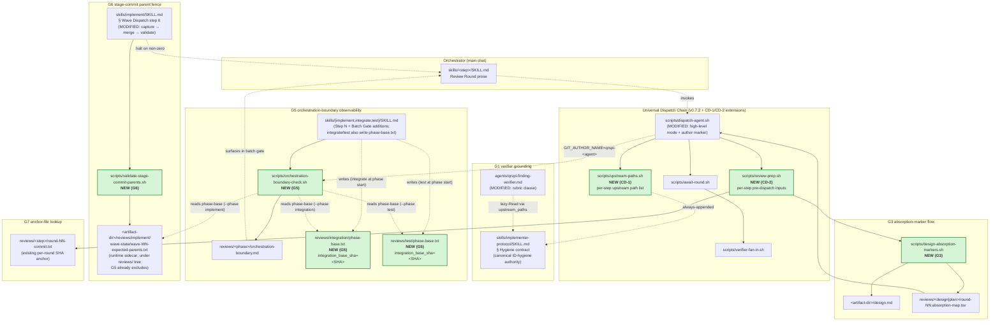

# Structure: qrspi-plus v0.7.3 — pipeline correctness + prompt-footprint reduction

v0.7.3 lands four new bash scripts, one new repo-root data file (`VERSION`), one new shared snippet directory (`skills/_shared/` additions), one new agent-rubric clause set across four agent bodies, edits to eight artifact-step SKILL bodies + three phase SKILL bodies + the implementer-protocol body + the using-qrspi bootstrapper, and a release-wide bats-name sweep across `tests/**/*.bats` — all landing in a single slice with no follow-on phase.

## File Map

### Slice: v0.7.3 release

#### CD-1 — `upstream-paths.sh` extraction

| File | Action | Responsibility | Goal IDs |
|------|--------|---------------|----------|
| `scripts/upstream-paths.sh` | Create | Print per-step upstream-artifact path list to stdout; reads `pipeline:` from `<artifact-dir>/config.md` only for steps whose upstream set is mode-aware (Plan today). Unknown step → always-appended SKILL paths + exit 0. | CD-1, G1, G4 |
| `skills/using-qrspi/SKILL.md` | Modify | Replace the "Per-step upstream-artifact lists" prose block with a one-line directive citing `scripts/upstream-paths.sh`. | CD-1, G9 |
| `tests/unit/test-upstream-paths.bats` | Create | Bats coverage: known-step set per step (Goals, Questions, Research, Design, Phasing, Structure, Parallelize, Replan), Plan branch (full vs. quick), unknown-step always-appended-only behavior, malformed `config.md` → halt diagnostic, always-appended array contains `skills/implementer-protocol/SKILL.md` (G1 surface). | CD-1, G1, G4 |

#### CD-2 — `review-prep.sh` + dispatch-agent high-level mode

| File | Action | Responsibility | Goal IDs |
|------|--------|---------------|----------|
| `scripts/review-prep.sh` | Create | Per-step pre-dispatch input generator. Produces the per-round diff (narrowing per G7 anchor-file lookup); produces the absorption-map at the Design and Plan steps; writes outputs to `<artifact-dir>/reviews/<step>/round-NN.*` per existing path conventions. Step table internal; new inputs added by editing this script, not by editing skill prose. | CD-2, G3, G7 |
| `scripts/dispatch-agent.sh` | Modify | Add high-level entry mode: when `--step --round --artifact-dir` accompany the existing batched-mode flags, invoke `review-prep.sh` first, then thread the produced paths (`diff_file_path`, `absorption_map_path`) into reviewer dispatch prompts. Preserve the low-level `--diff-file` mode for tests and per-task dispatch. Propagate review-prep failures by exiting non-zero with stderr verbatim. Also (G5): wrap dispatched subagent git commands with `GIT_AUTHOR_NAME=qrspi-<agent>` / `GIT_AUTHOR_EMAIL=bot@qrspi.local`. | CD-2, G5 |
| `skills/goals/SKILL.md` | Modify | Replace the diff-emission Bash redirect paragraph in § Review Round with a single high-level `dispatch-agent.sh --step goals --round NN --artifact-dir <ABS>` invocation. | CD-2, G9 |
| `skills/questions/SKILL.md` | Modify | Same diff-emission-prose → high-level-dispatch replacement as Goals. | CD-2, G9 |
| `skills/research/SKILL.md` | Modify | Same. | CD-2, G9 |
| `skills/design/SKILL.md` | Modify | Same; the high-level call additionally causes review-prep to produce `reviews/design/round-NN.absorption-map.tsv` for the design-reviewer's fidelity check (G3 change 4). | CD-2, G3, G9 |
| `skills/phasing/SKILL.md` | Modify | Same. | CD-2, G9 |
| `skills/structure/SKILL.md` | Modify | Same. | CD-2, G9 |
| `skills/parallelize/SKILL.md` | Modify | Same. | CD-2, G9 |
| `skills/replan/SKILL.md` | Modify | Same. | CD-2, G9 |
| `tests/unit/test-review-prep.bats` | Create | One fixture per supported step asserting the documented output set (diff path written, absorption-map written for Design + Plan steps). Fail-loud on a corrupt `artifact-dir`. | CD-2 |
| `tests/unit/test-dispatch-agent-highlevel-mode.bats` | Create | Side-by-side parity test: high-level invocation produces identical dispatch prompts and manifest entries to the equivalent low-level invocation with pre-computed paths. | CD-2 |
| `tests/lint/test-no-diff-redirect-prose.bats` | Create | Grep audit: zero `git diff > round-NN.diff` Bash redirect blocks remain across the eight artifact-step skills. | CD-2, G9 |

#### CD-3 — R8 prose-density rule

| File | Action | Responsibility | Goal IDs |
|------|--------|---------------|----------|
| `skills/_shared/prompt-design-rules.md` | Modify | Insert verbatim `### R8 — Prose density: short declarative sentences, full behavioral precision` between R7 and the cross-cutting-principles `---` separator. Update the finding-type gate `rule-violation` row to cite `R1-R8`. | CD-3 |
| `tests/lint/test-prompt-design-rules-r8.bats` | Create | Anchor-phrase grep: R8 heading present, tightening-pattern table header present, "What NOT to tighten" subheading present, reviewer-test sentence present; finding-type gate cites literal `R1-R8`; no R-rule heading duplicated; every R-ID cited in the gate exists as a heading. | CD-3 |

#### G1 — Verifier rubric grounded in canonical ID-hygiene authority

| File | Action | Responsibility | Goal IDs |
|------|--------|---------------|----------|
| `agents/qrspi-finding-verifier.md` | Modify | Append the verbatim rubric clause naming `skills/implementer-protocol/SKILL.md` § Hygiene contract as the canonical ID-hygiene authority; instruct the verifier to consult it via `<upstream_paths>` Read and treat absence as a dispatch defect (no improvised fallback). | G1 |
| `scripts/upstream-paths.sh` | Modify | Add `skills/implementer-protocol/SKILL.md` to the always-appended SKILL paths array (joins `skills/<step>/SKILL.md` + `skills/using-qrspi/SKILL.md`). | G1 |
| `tests/unit/test-finding-verifier-id-hygiene-grounding.bats` | Create | Synthetic verifier dispatch on a fixture finding (a `[Tnn]` token in a bats test name) reads the hygiene contract from `upstream_paths`, locates the matching forbidden-token row, and writes a sidecar with score ≥ 70. Pinned regression-direction case scores < 70 under a v0.7.2-baseline rubric stub. | G1 |

#### G2 — `[Tnn]` sweep + structural lint + blocking self-check

| File | Action | Responsibility | Goal IDs |
|------|--------|---------------|----------|
| `tests/**/*.bats` (release-wide sweep) | Modify | Regex sweep stripping `\s*\[T\d+(-[a-z0-9]+)?\]\s*` and `\s*R\d+-F\d+\b\s*` from inside `@test "..."` description strings. Body content untouched. Plan owns the per-file enumeration; Structure commits that the sweep PR is a single mechanical pass over the entire `tests/` tree. | G2 |
| `tests/lint/test-bats-test-name-id-hygiene.bats` | Create | Permanent CI gate: grep every `@test "..."` line under `tests/**/*.bats`; assert the description string contains no `\[T\d+(-[a-z0-9]+)?\]` or `\bR\d+-F\d+\b` match. Fail output lists `file:line` + offending string. Honors a `# bats lint:no-id-hygiene` inline carve-out marker above the `@test` line for tests of the lint itself. | G2 |
| `skills/implementer-protocol/SKILL.md` | Modify | Promote § Pre-DONE self-check from advisory to blocking: an ID-hygiene match in any `@test "..."` description string added or modified by the task halts the DONE signal until the implementer fixes it. One anchor sentence change. | G2 |
| `tests/unit/test-id-hygiene-lint-fail-direction.bats` | Create | Drive the new lint against a fixture file containing `[T99]` — asserts non-zero exit + documented diagnostic shape. Carries the `# bats lint:no-id-hygiene` carve-out for the fixture string. | G2 |

#### G3 — Plan-author respects design-absorption markers

| File | Action | Responsibility | Goal IDs |
|------|--------|---------------|----------|
| `scripts/design-absorption-markers.sh` | Create | Grep `design.md` for the 4 enumerated marker patterns (heading-suffix, `**Explicit non-goal.**`, acceptance-criterion "no separate vN.N task ships under …", free-prose "deferred to vN.N"); print absorbed-goal redirect map (`<absorbed-ID>\t<absorbing-ID|"no-task">`) to stdout. Single source of truth = `design.md`; no committed map artifact. | G3 |
| `skills/plan/SKILL.md` | Modify | Add the verbatim pre-fanout anchor sentence: before drafting any per-task spec, run `scripts/design-absorption-markers.sh`, ingest the redirect map, refuse to draft standalone tasks for absorbed IDs, halt with BLOCKED rather than manufacture a task home. | G3 |
| `agents/qrspi-plan-spec-reviewer.md` | Modify | Append the verbatim rubric clause: Read the absorption map at `absorption_map_path` and assert no `plan.md` task carries an absorbed-goal ID; flag any such task as `change_type: scope`. | G3 |
| `agents/qrspi-design-reviewer.md` | Modify | Append the verbatim fidelity-check rubric clause: when `absorption_map_path` is in dispatch parameters, verify the map preserves authorial intent across every entry; flag intent/marker contradictions, missing markers, and contradictory dual markers. | G3 |
| `scripts/review-prep.sh` | Modify | (Part of CD-2's create.) At the Design step, run `design-absorption-markers.sh` and write the map to `reviews/design/round-NN.absorption-map.tsv`. At the Plan step, run it against the run's `design.md` and write the map to `reviews/plan/round-NN.absorption-map.tsv`. dispatch-agent threads both as `absorption_map_path` into the respective reviewers. | G3, CD-2 |
| `tests/lint/test-design-absorption-marker-set.bats` | Create | Scan every `design.md` under `docs/qrspi/**/`; any absorption-shaped marker text MUST match one of the 4 enumerated patterns. Drift surfaces as a lint failure on the design.md PR. | G3 |
| `tests/unit/test-design-absorption-markers.bats` | Create | Drive the script against a fixture design.md containing all 4 marker forms → expected map; against a marker-free fixture → empty output. | G3 |
| `tests/unit/test-plan-spec-reviewer-absorption.bats` | Create | Synthetic plan.md drafted with a task labeled by an absorbed goal ID + fixture absorption-map → reviewer emits a `change_type: scope` finding. | G3 |
| `tests/unit/test-design-reviewer-fidelity.bats` | Create | Synthetic design.md fixture where a goal block's body describes independent scope but the heading suffix claims "absorbed by CD-1" → reviewer emits a fidelity-mismatch finding. | G3 |

#### G4 — Plan-step upstream-artifact entry

| File | Action | Responsibility | Goal IDs |
|------|--------|---------------|----------|
| `scripts/upstream-paths.sh` | Modify | Add the `plan` step branch. Read `pipeline:` from `<artifact-dir>/config.md`. Full → `goals.md, research/summary.md, design.md, phasing.md, structure.md`. Quick → `goals.md, research/summary.md`. Missing or malformed `config.md` → halt with named diagnostic + exit non-zero. | G4 |
| `tests/unit/test-upstream-paths.bats` | Modify | Add the Plan-branch cases (full, quick, malformed-config halt) to the CD-1 test file. | G4 |

#### G5 — Orchestration Boundary observable beyond Implement

| File | Action | Responsibility | Goal IDs |
|------|--------|---------------|----------|
| `scripts/orchestration-boundary-check.sh` | Create | Accept `--phase <directory-name> --artifact-dir <path>`. Run `git status --porcelain` against the workspace (excluding the `reviews/` path tree). Run `git log <phase-base>..HEAD --format='%H %an' \| awk '$2 !~ /^qrspi-/ {print $1}'` against the integration branch's phase range to list non-subagent commits. Write findings to `<artifact-dir>/reviews/<phase>/orchestration-boundary.md`. Exit 0 on both clean and dirty (fail-soft; populated file is the signal). Phase-base SHA source by phase (Structure-owned path map): `--phase implement` reads `integration_base_sha=` from `<artifact-dir>/reviews/implement/wave-state/wave-W1-expected-parents.txt` (G6 sidecar, written by --capture at first wave's pre-merge moment); `--phase integration` reads `integration_base_sha=` from `<artifact-dir>/reviews/integration/phase-base.txt` (single-line file `integration_base_sha=<SHA>`); `--phase test` reads from `<artifact-dir>/reviews/test/phase-base.txt` (same format). Each phase's SKILL writes its own phase-base.txt at phase start (capture step); concrete call site within each SKILL is Plan's task-carving call. | G5 |
| `scripts/dispatch-agent.sh` | Modify | (Listed under CD-2.) Wrap dispatched subagent git commands with the `GIT_AUTHOR_NAME=qrspi-<agent>` / `GIT_AUTHOR_EMAIL=bot@qrspi.local` env so subagent commits carry the marker the boundary check filters on. | G5 |
| `skills/implement/SKILL.md` | Modify | Insert verbatim `### Step N — Orchestration boundary observability check` before the batch-gate step. Insert the verbatim Batch Gate menu addition (interactive) and autopilot-branched-default block. | G5 |
| `skills/integrate/SKILL.md` | Modify | Insert the verbatim § Orchestration Boundary section (HARD-RULE + Integrate-specific responsibility list + does-NOT list + rationale). Insert the verbatim Step-N observability-check block + Batch Gate additions (same as Implement). At phase start, write `reviews/integration/phase-base.txt` with `integration_base_sha=<HEAD-SHA-at-phase-entry>` (G5 phase-base anchor; consumed by `orchestration-boundary-check.sh --phase integration`). | G5 |
| `skills/test/SKILL.md` | Modify | Insert the verbatim § Orchestration Boundary section (HARD-RULE + Test-specific responsibility list, including the `reviews/test/round-NN-results.md` allowlisted-write exception + rationale). Insert the verbatim Step-N observability-check block + Batch Gate additions. At phase start, write `reviews/test/phase-base.txt` with `integration_base_sha=<HEAD-SHA-at-phase-entry>` (G5 phase-base anchor; consumed by `orchestration-boundary-check.sh --phase test`). | G5 |
| `skills/using-qrspi/SKILL.md` | Modify | Insert the verbatim `### Orchestration Boundary applies to every phase` cross-cutting note. | G5 |
| `skills/implementer-protocol/SKILL.md` | Modify | Add the new fix-task mode `revert-orchestration-drift` to the existing fix-task spec: read the violation report, `git revert --no-edit <SHA>` for each non-subagent commit in reverse chronological order, commit under the subagent's marker, write `reviews/<phase>/orchestration-boundary-revert.md`. | G5 |
| `tests/unit/test-orchestration-boundary-check.bats` | Create | Bats fixtures: clean integration branch (empty report), one non-subagent commit (one entry), uncommitted workspace edits (entry, with `reviews/` path tree excluded), `--phase` accepts directory-name verbatim (no `integrate`→`integration` normalization). | G5 |
| `tests/unit/test-dispatch-agent-author-marker.bats` | Create | Fixture subagent dispatch produces a commit whose `git log --format='%an'` matches `qrspi-<agent>`. | G5 |

#### G6 — Stage-commit parent SHA validation

| File | Action | Responsibility | Goal IDs |
|------|--------|---------------|----------|
| `scripts/validate-stage-commit-parents.sh` | Create | Two entrypoints: `--capture --artifact-dir <path> --wave <N> --task-branches <name>...` writes the pre-merge integration-base SHA + each task-tip SHA to a runtime sidecar (see § Interfaces — chosen path `<artifact-dir>/reviews/implement/wave-state/wave-WN-expected-parents.txt`, under the `reviews/` tree G5's orchestration-boundary check already excludes); `--validate --artifact-dir <path> --wave <N> --stage-commit <SHA>` reads the sidecar, reads `git log --format='%P' -n 1 <SHA>`, checks first-parent equality + task-tip set equality, halts non-zero with the `stage-commit-parent-mismatch:` diagnostic on failure. | G6 |
| `skills/implement/SKILL.md` | Modify | In § Wave Dispatch step 6 (stage-commit creation), insert two new sub-steps wrapping the existing `git merge --no-ff` call: pre-merge `validate-stage-commit-parents.sh --capture`, post-merge `validate-stage-commit-parents.sh --validate`. Halt the wave on validate non-zero; do not advance, do not record the wave complete. | G6 |
| `tests/unit/test-validate-stage-commit-parents.bats` | Create | Fixtures: correct parents → pass silently; correct task-tip set but wrong first-parent → halt naming the wrong first-parent SHA; missing task tip → halt naming missing tip; unexpected extra parent → halt naming extra parent; single-task wave → integration-base parent correctly counted, passes when present halts when absent. Sidecar-write coverage: capture step writes both fields; `parallelization.md` is unchanged after the wave (symbolic-only invariant per research Q11/Q12). | G6 |

#### G7 — Narrow-round ref selection via anchor-file lookup

| File | Action | Responsibility | Goal IDs |
|------|--------|---------------|----------|
| `skills/using-qrspi/SKILL.md` | Modify | In § Apply-fix protocol step 12, replace the `HEAD~1` narrow-ref shorthand with `git diff "$(cat reviews/<step>/round-<NN-1>-commit.txt)" -- <artifact-path>`. Keep the divergence sanity check (empty narrowed diff when content expected → halt with `narrow-round-empty-diff:` diagnostic). | G7 |
| `skills/<step>/SKILL.md` (sweep) | Modify | Any skill that inlines step-12's `HEAD~1` incantation (`grep -rn 'HEAD~1' skills/`) updated to the anchor-file-lookup form. Concrete file set surfaced by the grep at Plan time. | G7 |
| `scripts/review-prep.sh` | Modify | (Part of CD-2's create.) The diff-narrowing step inside `review-prep.sh` reads the anchor SHA from `reviews/<step>/round-<NN-1>-commit.txt` rather than using `HEAD~1`, applying the same fix structurally. | G7, CD-2 |
| `tests/unit/test-narrow-round-anchor-lookup.bats` | Create | Fixture with an unrelated commit between rounds → anchor-file-based diff returns round N's content; `HEAD~1`-based diff returns wrong content (regression guard). Missing anchor file → orchestrator's call exits non-zero. Empty-narrowed-diff → divergence sanity check fires with the named diagnostic. | G7 |

#### G8 — Centralized version source

| File | Action | Responsibility | Goal IDs |
|------|--------|---------------|----------|
| `VERSION` | Create | Repo-root bare one-line version string (e.g., `0.7.3\n`). Single canonical source. No JSON, no metadata. | G8 |
| `tools/build-plugin.mjs` | Modify | Read `VERSION` and write the value into the `"version"` field of all five consumer files on every build: `.claude-plugin/marketplace.json`, `.claude-plugin/plugin.json`, `.github/plugin/marketplace.json`, `.github/plugin/plugin.json`, `build/.claude-plugin/plugin.json`. Halt with `version-source-missing-or-malformed:` diagnostic on missing or non-single-line `VERSION`. | G8 |
| `.github/workflows/build-then-diff.yml` | Create | CI step: `node tools/build-plugin.mjs && git diff --exit-code`. Fails on any divergence between freshly-built tree and committed tree (catches version drift, build-artifact drift, marketplace `source` field drift — generalizes beyond version-stamping). | G8 |
| `docs/release-runbook.md` | Modify (or Create if absent) | Document the new release flow: edit `VERSION`, run `node tools/build-plugin.mjs`, commit `VERSION` + propagated stamps + any regenerated `build/` content in one commit. | G8 |
| `.claude-plugin/marketplace.json` | Modify (regenerated by build-plugin.mjs) | `"version"` field stamped by `tools/build-plugin.mjs` from `VERSION`. No hand edits to this field; CI build-then-diff gate enforces. | G8 |
| `.claude-plugin/plugin.json` | Modify (regenerated by build-plugin.mjs) | `"version"` field stamped by `tools/build-plugin.mjs` from `VERSION`. No hand edits to this field; CI build-then-diff gate enforces. | G8 |
| `.github/plugin/marketplace.json` | Modify (regenerated by build-plugin.mjs) | `"version"` field stamped by `tools/build-plugin.mjs` from `VERSION`. No hand edits to this field; CI build-then-diff gate enforces. Kept in lockstep with `.claude-plugin/marketplace.json` per goals.md § Constraints. | G8 |
| `.github/plugin/plugin.json` | Modify (regenerated by build-plugin.mjs) | `"version"` field stamped by `tools/build-plugin.mjs` from `VERSION`. No hand edits to this field; CI build-then-diff gate enforces. Kept in lockstep with `.claude-plugin/plugin.json` per goals.md § Constraints. | G8 |
| `build/.claude-plugin/plugin.json` | Modify (regenerated by build-plugin.mjs) | `"version"` field stamped by `tools/build-plugin.mjs` from `VERSION`. Build script is the sole writer under `build/`; no manual edits; CI build-then-diff gate enforces. | G8 |
| `tests/unit/test-version-stamping.bats` | Create | `echo "9.9.9" > VERSION && node tools/build-plugin.mjs && grep '"version": "9.9.9"'` matches in all five consumer files. Empty-file and missing-file cases halt with the named diagnostic. Hand-edit of one consumer file's `"version"` (without bumping `VERSION`) causes the build-then-diff CI step to fail (replayable in bats by invoking the same command sequence). | G8 |

#### G9 — Active-skill-prompt footprint reduction

| File | Action | Responsibility | Goal IDs |
|------|--------|---------------|----------|
| `skills/using-qrspi/SKILL.md` | Modify | Apply Pass 1 (three-tier placement: keep universal orchestrator behaviors, push multi-skill boilerplate to `_shared/`, push optional content to `references/`) + Pass 2 (delete script-mechanic restatements: jobId / tmpfile / HEAD~1 narrative / sidecar schema / `change_type` enum / verifier threshold / third-party splitter narrative / 4× verifier-wiring duplication / 2× visual-fidelity duplication) + Pass 3 (R8 tightening). Target < 350 lines. | G9, CD-3 |
| `skills/implement/SKILL.md` | Modify | Same four-pass application. Target < 500 lines. | G9, CD-3 |
| `skills/plan/SKILL.md` | Modify | Same. Target < 400 lines. | G9, CD-3 |
| `skills/{goals,questions,research,design,phasing,structure,parallelize,replan,integrate,test,implementer-protocol,reviewer-protocol,research-isolation,prompt-prose-writer,prompt-prose-reviewer}/SKILL.md` | Modify | Same four-pass application across each remaining active SKILL. Target < 300 lines each. | G9, CD-3 |
| `skills/_shared/reviewer-dispatch.md` | Create | The reviewer-dispatch incantation (currently inlined in every artifact-step skill's Review Round block). `!cat`-ed in each consuming skill at skill-load time. | G9 |
| `skills/_shared/review-loop.md` | Create | The Standard Review Loop body. `!cat`-ed in each consuming skill. | G9 |
| `skills/_shared/config-validation.md` | Create | The Config Validation procedure body. `!cat`-ed in each consuming skill. | G9 |
| `skills/_shared/compaction-checkpoint.md` | Create | The Compaction Checkpoint template. `!cat`-ed in each consuming skill. | G9 |
| `skills/_shared/pause-gate.md` | Create | The Pause Gate UI. `!cat`-ed in each consuming skill. | G9 |
| `skills/_shared/feedback-format.md` | Create | The Feedback File Format. `!cat`-ed in each consuming skill. | G9 |
| `skills/<name>/references/<topic>.md` | Create (per-skill, as identified by the trim pass) | Optional examples, worked examples, pedagogical content, rare-error-path recovery procedures. Read on-demand. Structure commits to the directory convention `skills/<name>/references/<topic>.md` for on-demand content; specific topic-file names emerge per task during each implementer's trim of their owned skill body (each Pass-1 placement task identifies the rare/optional content within its assigned skill and chooses topic filenames at extract time). Not a pre-enumerated Structure manifest, because the set is data-dependent on what the trim discovers; the directory shape and lifecycle ARE Structure's commitment. | G9 |
| `scripts/measure-active-footprint.sh` | Create | Compute per-turn footprint = `using-qrspi/SKILL.md` + heaviest active skill + `!cat`-resolved shared snippets, using a pinned deterministic tokenizer. CLI surface (flags, `!cat` resolution semantics, stdout shape, exit codes) specified in § Interfaces. | G9 |
| `docs/qrspi/2026-06-04-v073-release/g9-footprint-report.md` | Create | Captured output of `scripts/measure-active-footprint.sh` against the trimmed tree. Final acceptance gate evidence. | G9 |
| `tests/lint/test-skill-trim-audit.bats` | Create | Grep audit: zero matches across all active SKILL.md files for `jobId`, `tmpfile`, `HEAD~1`, `narrow.broaden`, `sidecar.*schema`, `change_type:.*enum`, `verifier.*threshold`, `third-party.*splitter` (narrative restatements; concrete script names in process-step calls are fine). | G9 |
| `tests/acceptance/v07-phase1/` (re-run) | Modify (re-execute) | The v0.7.2 phase-1 acceptance suite is the regression backstop. Run it against the trimmed skill set; zero regressions is the gate. No edits to the suite itself — re-execution evidence is the artifact. | G9 |

## Interfaces

These blocks specify the module-boundary contracts (CLI surface, stdout shape, exit codes, data formats Plan tasks against). Implementation bodies — control flow, error messages other than named diagnostics, internal helpers — are Implement's call.

### `scripts/upstream-paths.sh` — per-step upstream-artifact path lookup (CD-1 + G1 + G4)

```bash
# scripts/upstream-paths.sh
#
# Usage:
#   scripts/upstream-paths.sh --step <step> [--artifact-dir <path>]
#
# Flags:
#   --step <step>              Required. One of: goals | questions | research |
#                              design | phasing | structure | plan | parallelize |
#                              replan
#                              These are the artifact-bearing steps with verifier-
#                              dispatched review rounds (per design.md CD-1 and
#                              the artifact-step skill set in CD-2). Any other
#                              step value (including `implement`, `integrate`,
#                              `test`, or anything unrecognized) is treated as
#                              unknown-step fallthrough — see exit code 0 below.
#   --artifact-dir <path>      Required only for steps whose upstream set is
#                              pipeline-mode-aware (plan today). Used to read
#                              <artifact-dir>/config.md for the pipeline: field.
#
# Env: none (script is context-free).
#
# Stdout: newline-separated path list. Repo-relative paths for SKILL files;
#   step-relative basenames for artifacts. Orchestrator joins these against
#   <abs_path> per the existing dispatch composition pattern in using-qrspi
#   step 4.
#
# Always-appended (every step):
#   skills/<step>/SKILL.md
#   skills/using-qrspi/SKILL.md
#   skills/implementer-protocol/SKILL.md     # G1: canonical ID-hygiene authority
#
# Plan branch (G4):
#   pipeline: full  → goals.md, research/summary.md, design.md, phasing.md, structure.md
#   pipeline: quick → goals.md, research/summary.md
#
# Exit codes:
#   0   success — path list emitted. Includes unknown-step / unrecognized-step
#       fallthrough → always-appended SKILL paths only (per design.md CD-1
#       edge-case rule: "orchestrator failure on an absent step would be a
#       regression vs. today's prose behavior").
#   2   --artifact-dir required for this step but missing
#   3   config.md missing, unreadable, or pipeline: field missing/malformed
#       (named diagnostic on stderr; no silent fallback)
#
# Side effects: none. Pure stdin/stdout lookup; no files written.
```

### `scripts/review-prep.sh` — per-step pre-dispatch input generation (CD-2 + G3 + G7)

```bash
# scripts/review-prep.sh
#
# Usage:
#   scripts/review-prep.sh --step <step> --round <NN> --artifact-dir <path>
#
# Flags:
#   --step <step>          Required. Artifact-step name (goals | questions |
#                          research | design | phasing | structure | plan |
#                          parallelize | replan), or `task` for per-task implement
#                          review (future migration; not load-bearing for v0.7.3).
#   --round <NN>           Required. Zero-padded round number.
#   --artifact-dir <path>  Required. Absolute path to the QRSPI run directory.
#
# Env: none.
#
# Outputs (written to known paths under <artifact-dir>/reviews/<step>/):
#   round-NN.diff                         Per-round narrowed diff. Narrowing reads
#                                         the anchor SHA from reviews/<step>/
#                                         round-<NN-1>-commit.txt (G7 replacement
#                                         for HEAD~1). For round 01 the diff is
#                                         against <base-branch>.
#   round-NN.absorption-map.tsv           Design and Plan steps only (G3).
#                                         Produced by scripts/design-absorption-markers.sh
#                                         against <artifact-dir>/design.md.
#                                         Lines: <absorbed-ID>\t<absorbing-ID|"no-task">
#
# Stdout: none (outputs are file paths, written; dispatch-agent reads from disk).
#
# Exit codes:
#   0   success — all applicable outputs written; per-step inputs absent for
#       legitimate reasons (e.g., artifact not in git → no diff written) is exit 0
#   non-0  fail-loud on corrupt artifact-dir or unreadable inputs; stderr verbatim
```

### `scripts/dispatch-agent.sh` — high-level review-round entry mode (CD-2)

```bash
# scripts/dispatch-agent.sh (high-level mode added by CD-2)
#
# When the existing batched-mode flags are accompanied by --step/--round/
# --artifact-dir, dispatch-agent runs review-prep first then threads the
# produced paths into reviewer prompts:
#
#   scripts/dispatch-agent.sh \
#     --step <step> --round <NN> --artifact-dir <ABS> \
#     --output-dir <ABS>/reviews/<step>/round-<NN>/ \
#     --artifact <artifact-basename> \
#     --agents <tag>=<agent-name>,...
#
# Internal sequence:
#   1. invoke scripts/review-prep.sh --step --round --artifact-dir
#      (review-prep failure → dispatch-agent exits non-zero, stderr verbatim)
#   2. resolve produced paths:
#      diff_file_path    := <ABS>/reviews/<step>/round-<NN>.diff       (if present)
#      absorption_map_path := <ABS>/reviews/<step>/round-<NN>.absorption-map.tsv
#                                                                       (if present)
#   3. existing batched-mode prompt assembly, with the resolved paths threaded
#      into each reviewer dispatch prompt as parameters
#   4. emit M `MODE=first_party TAG=… SUBAGENT_TYPE=… MODEL=… PROMPT_FILE=…`
#      spec lines on stdout (unchanged contract)
#
# Subagent author-marker wrapping (G5):
#   For every subagent git command the dispatch chain spawns:
#     env GIT_AUTHOR_NAME="qrspi-<agent>" \
#         GIT_AUTHOR_EMAIL="bot@qrspi.local" \
#         git <subcommand> ...
#   Marker is the load-bearing input for orchestration-boundary-check.sh.
#
# Low-level mode (--diff-file <path> + existing flags) preserved verbatim for
# tests and non-standard callers; high-level mode does not displace it.
```

### `scripts/design-absorption-markers.sh` — design-marker grep (G3)

```bash
# scripts/design-absorption-markers.sh
#
# Usage:
#   scripts/design-absorption-markers.sh <design-path>
#
# Greps the named design.md for the 4 canonical absorption-marker patterns:
#   - Heading-suffix:        ^## G\d+ — .+: (moot|absorbed by CD-\d+|already fixed)
#   - Block-internal:        \*\*Explicit non-goal\.\*\*
#   - Acceptance-criterion:  no separate v\d+\.\d+(\.\d+)? task ships under (the )?G\d+ ID
#   - Free-prose:            deferred to v\d+\.\d+
#
# Stdout: redirect map, tab-separated:
#   <absorbed-ID>\t<absorbing-ID|"no-task">
#   ...
#
# Exit codes:
#   0   success (including empty output for a marker-free design.md)
#   1   <design-path> missing or unreadable
```

### `scripts/orchestration-boundary-check.sh` — phase-end discipline check (G5)

```bash
# scripts/orchestration-boundary-check.sh
#
# Usage:
#   scripts/orchestration-boundary-check.sh --phase <directory-name> \
#                                           --artifact-dir <path>
#
# Flags:
#   --phase <directory-name>  Required. Pass the directory name verbatim — the
#                             script does NOT remap names (e.g., no integrate →
#                             integration normalization). Use `integration` for
#                             Integrate, `test` for Test, `implement` for Implement.
#   --artifact-dir <path>     Required. Absolute path to the QRSPI run dir.
#
# Behavior:
#   1. git status --porcelain against the workspace, excluding paths under
#      reviews/ (per-phase review log path tree is explicitly allowed for
#      main-chat writes per the per-phase responsibility list).
#   2. git log <phase-base>..HEAD --format='%H %an' against the integration
#      branch, piped through `awk '$2 !~ /^qrspi-/ {print $1}'` to list
#      non-subagent-authored commits. (git's --author has no negation operator;
#      the post-filter awk does the negation.)
#   3. <phase-base> SHA source by phase (Structure-owned path map):
#      - `--phase implement`: read `integration_base_sha=` from the G6 wave-1
#        sidecar at `<artifact-dir>/reviews/implement/wave-state/wave-W1-expected-parents.txt`.
#        By construction, G6's --capture step records the integration base at
#        the first wave's pre-merge moment; the wave-1 sidecar IS the Implement
#        phase base, persistent across the phase, recoverable by re-running
#        --capture.
#      - `--phase integration`: read `integration_base_sha=` from
#        `<artifact-dir>/reviews/integration/phase-base.txt`.
#      - `--phase test`: read `integration_base_sha=` from
#        `<artifact-dir>/reviews/test/phase-base.txt`.
#
#   phase-base.txt format (single-line, key=value):
#      integration_base_sha=<40-char SHA>
#
#   Each phase's SKILL (Integrate, Test) writes its own phase-base.txt at the
#   phase-start capture step (analog of G6's --capture for Implement). The
#   concrete call site (which line of the SKILL writes the file, in which
#   step) is Plan's task-carving call.
#
# Output: <artifact-dir>/reviews/<phase>/orchestration-boundary.md
#   Empty file ≡ clean discipline.
#   Populated file ≡ violations; surfaced in the batch-gate menu by the
#                    consuming phase's SKILL prose.
#
# Exit codes:
#   0   always (fail-soft — populated report is the signal, not exit code).
#       Argument failures exit non-zero with a named diagnostic.
```

### `scripts/validate-stage-commit-parents.sh` — stage-commit parent fence (G6)

```bash
# scripts/validate-stage-commit-parents.sh
#
# Two entrypoints, used as a pre/post wrapper around the wave-dispatch
# `git merge --no-ff <task-branches>` call in skills/implement/SKILL.md §
# Wave Dispatch step 6.
#
# Usage:
#   scripts/validate-stage-commit-parents.sh \
#     --capture --artifact-dir <ABS> --wave <N> \
#     --task-branches <name> [<name> ...]
#
#   scripts/validate-stage-commit-parents.sh \
#     --validate --artifact-dir <ABS> --wave <N> \
#     --stage-commit <SHA>
#
# --capture:
#   Pre-merge. Reads `git rev-parse HEAD` (integration-base SHA) and
#   `git rev-parse refs/heads/<task-NN>` for each --task-branches entry.
#   Writes the runtime sidecar (path below).
#
# --validate:
#   Post-merge. Reads the sidecar written by --capture for this wave. Reads
#   actual parents from `git log --format='%P' -n 1 <stage-commit>`. Checks:
#     (a) actual_parents[0] == captured integration_base_sha
#     (b) set(actual_parents[1:]) == set(captured task_tip_shas)
#   On either failure, halts non-zero with:
#     stage-commit-parent-mismatch: stage commit <SHA> labeled merge(<task-list>)
#     has actual parents {<actual-set>}, expected {<expected-set>};
#     first-parent expected <integration-base-sha>, actual <actual-parent-0>;
#     task tips missing: <missing>; unexpected parents present: <extra>
#
# Runtime sidecar path:
#   <artifact-dir>/reviews/implement/wave-state/wave-W<N>-expected-parents.txt
#
# Sidecar format (separable fields, line-oriented for shell parsing):
#   integration_base_sha=<40-char SHA>
#   task_tip_shas=<sha1> <sha2> <sha3>
#
# Rationale for path: under `reviews/implement/wave-state/`, inside the path
# tree that G5's orchestration-boundary-check.sh already excludes from its
# `git status --porcelain` discipline scan — eliminates the false-positive
# cascade a sibling `review-state/` location would produce (every
# uncommitted wave sidecar would otherwise surface as an orchestration-
# boundary violation, because G5 only excludes `reviews/`). The
# `wave-state/wave-W<N>-…` subpath scopes one file per wave so concurrent
# waves never collide and so post-hoc audit can replay validation per wave.
# `parallelization.md` remains unchanged across the wave (symbolic-only
# branch-map invariant per research Q11/Q12); the resolved SHAs live only
# in this sidecar. Runtime sidecars are NOT committed; the file is
# recoverable by re-running --capture against the live git state, and the
# G5 `reviews/`-tree exclusion makes the uncommitted state safe.
#
# Exit codes:
#   0   --capture wrote sidecar; --validate passed.
#   2   argument failure (missing flag, wave already captured without --force).
#   3   git operation failure (rev-parse, log).
#   4   --validate parent mismatch (named diagnostic on stderr).
```

### `scripts/measure-active-footprint.sh` — G9 footprint measurement (G9)

```bash
# scripts/measure-active-footprint.sh
#
# Usage:
#   scripts/measure-active-footprint.sh [--skill <name>] [--all]
#                                       [--tokenizer <name>]
#
# Flags:
#   --skill <name>        Optional. Measure footprint with <name> as the active
#                         skill (e.g., `implement`, `plan`). Default: iterate
#                         every skill under `skills/*/SKILL.md` and report the
#                         heaviest as the per-turn measurement (the load-bearing
#                         number for G9's < 30K token gate).
#   --all                 Optional. Emit a per-skill breakdown table in addition
#                         to the single load-bearing count.
#   --tokenizer <name>    Optional. Tokenizer to use. Default: `tiktoken:cl100k_base`
#                         (pinned for determinism — G9's "< 30K tokens" gate is
#                         tokenizer-relative, so the chosen tokenizer is recorded
#                         in the stdout output AND in g9-footprint-report.md for
#                         replay). Accepted values: tiktoken:cl100k_base,
#                         tiktoken:o200k_base. Other host tokenizers may be
#                         added later; only the pinned set is supported in v0.7.3.
#
# Env: none (script is context-free).
#
# Footprint formula (per skill):
#   tokens(skills/using-qrspi/SKILL.md)
#   + tokens(skills/<active-skill>/SKILL.md  with `!cat skills/_shared/<topic>.md`
#                                            references resolved inline,
#                                            transitively, before tokenization)
#
# `!cat` resolution semantics:
#   - Lines matching `^!cat\s+(skills/_shared/[^\s]+\.md)\s*$` in any SKILL.md
#     body are resolved by substituting the referenced file's contents in-place
#     before tokenization. Resolution is transitive (a `_shared/` snippet that
#     `!cat`s another snippet resolves recursively) with cycle detection.
#   - A `!cat` reference whose target file does not exist halts with the
#     `footprint-snippet-unresolvable:` diagnostic naming the consuming skill,
#     the broken reference line, and the missing path. No silent skip.
#   - A `!cat` cycle halts with `footprint-snippet-cycle:` naming the cycle path.
#
# Stdout shape:
#   Single-skill mode (--skill <name>) or default heaviest-skill mode:
#     active_skill=<name>
#     tokenizer=<name>
#     total_tokens=<integer>
#
#   --all mode appends a TSV breakdown:
#     skill<TAB>tokens
#     using-qrspi<TAB>1234
#     implement<TAB>5678
#     ...
#
# Output is the captured body of docs/qrspi/2026-06-04-v073-release/g9-footprint-report.md
# (the report file is the script's stdout, redirected).
#
# Exit codes:
#   0   success — count emitted.
#   2   argument failure (unknown --tokenizer, --skill not found).
#   3   `footprint-tokenizer-missing:` tokenizer binary/module not installed.
#   4   `footprint-snippet-unresolvable:` `!cat` target missing (named above).
#   5   `footprint-snippet-cycle:` `!cat` cycle detected (named above).
#   6   `footprint-skill-not-found:` `skills/<name>/SKILL.md` absent.
```

### `VERSION` — repo-root canonical version source (G8)

```
# VERSION
#
# Bare one-line version string. The single file an author edits to bump the
# plugin version. tools/build-plugin.mjs reads it and stamps the value into
# all five consumer manifest files on every build.
#
# Format: exactly one non-empty line, terminated by a single newline.
#   0.7.3
#
# Consumers (stamped by tools/build-plugin.mjs):
#   .claude-plugin/marketplace.json    → "version" field
#   .claude-plugin/plugin.json         → "version" field
#   .github/plugin/marketplace.json    → "version" field
#   .github/plugin/plugin.json         → "version" field
#   build/.claude-plugin/plugin.json   → "version" field
#
# Validation: tools/build-plugin.mjs halts with
#   "version-source-missing-or-malformed: VERSION at repo root must contain a
#    single non-empty version string"
# when VERSION is missing, empty, or multi-line. No silent fallback to a
# default version.
#
# CI gate: .github/workflows/build-then-diff.yml runs
#   node tools/build-plugin.mjs && git diff --exit-code
# on every PR — any divergence between freshly-built tree and committed tree
# fails the build (catches version drift AND build/ artifact drift, the broader
# class of "did the committed build/ artifact match the source?" regressions).
```

## Architectural Diagram

Diagram organizing axis: two surfaces, separated because mixing them muddies the runtime data flow with build-time static-analysis. **(A) Runtime dispatch + observability surface** (first diagram): existing v0.7.2 universal dispatch chain extended by the four new scripts CD-1 / CD-2 / G5 / G6 introduce (shaded as new), with G1's grounding path, G3's absorption-map flow, G7's anchor-file lookup shown as data-flow arrows. **(B) Static-analysis / build-time surface** (second diagram): G2 ID-hygiene sweep + lint + blocking self-check, CD-3 R8 prose-density rule reach into `prompt-design-rules.md` and the skills that consume it, G8 version-source fan-out, and G9 shared-snippet `_shared/` + `!cat` resolution + `measure-active-footprint.sh` + footprint floor data. Boxes are scripts/files; solid arrows are data flow (reads/writes); dashed arrows are skill/agent prose pointing at script invocations or anchor citations.



Static-analysis / build-time surface (G2 ID-hygiene, CD-3 R8 rule, G8 version-source, G9 footprint):

```mermaid
flowchart TB
  subgraph G2Hygiene["G2 ID-hygiene surface"]
    BATSALL["tests/**/*.bats<br/>(release-wide sweep MODIFIED:<br/>strip [Tnn] and Rn-Fn tokens<br/>from @test descriptions)"]
    BATSLINT["tests/lint/test-bats-test-name-id-hygiene.bats<br/><b>NEW (G2)</b><br/>permanent CI lint"]
    IPSC["skills/implementer-protocol/SKILL.md<br/>§ Pre-DONE self-check<br/>(MODIFIED: advisory → BLOCKING)"]
    FIXTURE["tests/unit/test-id-hygiene-lint-fail-direction.bats<br/><b>NEW (G2)</b><br/>fail-direction fixture<br/>(carries # bats lint:no-id-hygiene carve-out)"]
    CI_G2["CI (every PR)"]
  end

  subgraph CD3Rules["CD-3 R8 prose-density rule reach"]
    RULES["skills/_shared/prompt-design-rules.md<br/>(MODIFIED: insert R8 between R7 and ---;<br/>finding-type gate row updated to R1-R8)"]
    PPW["skills/prompt-prose-writer/SKILL.md<br/>(consumes R8 via existing reference)"]
    PPR["skills/prompt-prose-reviewer/SKILL.md<br/>(consumes R8 via existing reference)"]
    G9TRIM["G9 Pass-3 tightening across all 14 SKILLs<br/>(cites R8 as authority in task spec)"]
    R8LINT["tests/lint/test-prompt-design-rules-r8.bats<br/><b>NEW (CD-3)</b><br/>anchor-phrase + gate-citation + no-dup checks"]
  end

  subgraph G8Version["G8 version source"]
    VERSION["VERSION<br/><b>NEW (G8)</b>"]
    BUILD["tools/build-plugin.mjs<br/>(MODIFIED: read VERSION, stamp consumers)"]
    M1[".claude-plugin/marketplace.json<br/>(MODIFIED: regenerated)"]
    M2[".claude-plugin/plugin.json<br/>(MODIFIED: regenerated)"]
    M3[".github/plugin/marketplace.json<br/>(MODIFIED: regenerated)"]
    M4[".github/plugin/plugin.json<br/>(MODIFIED: regenerated)"]
    M5["build/.claude-plugin/plugin.json<br/>(MODIFIED: regenerated)"]
    CI_BD[".github/workflows/build-then-diff.yml<br/><b>NEW (G8)</b><br/>build + git diff --exit-code"]
  end

  subgraph G9Footprint["G9 active-skill-prompt footprint reduction"]
    SHARED["skills/_shared/<br/>reviewer-dispatch.md, review-loop.md,<br/>config-validation.md, compaction-checkpoint.md,<br/>pause-gate.md, feedback-format.md<br/><b>NEW (G9)</b>"]
    SKILLS["skills/*/SKILL.md<br/>(MODIFIED: 4-pass trim;<br/>!cat references to _shared/)"]
    REFS["skills/&lt;name&gt;/references/&lt;topic&gt;.md<br/><b>NEW (G9, per-skill)</b><br/>on-demand optional content"]
    MEAS["scripts/measure-active-footprint.sh<br/><b>NEW (G9)</b><br/>tiktoken:cl100k_base default<br/>resolves !cat transitively"]
    REPORT["docs/qrspi/2026-06-04-v073-release/<br/>g9-footprint-report.md<br/><b>NEW (G9)</b><br/>floor: < 30K tokens<br/>(acceptance-gate evidence)"]
    REGRESS["tests/acceptance/v07-phase1/<br/>(re-run: regression backstop)"]
    TRIMLINT["tests/lint/test-skill-trim-audit.bats<br/><b>NEW (G9)</b><br/>grep audit zero matches for<br/>script-mechanic narrative restatements"]
  end

  BATSALL --> BATSLINT
  FIXTURE --> BATSLINT
  BATSLINT --> CI_G2
  IPSC -. blocking self-check .-> BATSALL

  RULES -. R8 cited as authority .-> G9TRIM
  RULES --> PPW
  RULES --> PPR
  RULES --> R8LINT

  VERSION --> BUILD
  BUILD --> M1
  BUILD --> M2
  BUILD --> M3
  BUILD --> M4
  BUILD --> M5
  CI_BD --> BUILD

  SKILLS -. !cat resolves .-> SHARED
  SKILLS -. one-line pointers .-> REFS
  SKILLS --> MEAS
  SHARED --> MEAS
  MEAS --> REPORT
  SKILLS --> REGRESS
  SHARED --> REGRESS
  SKILLS --> TRIMLINT

  classDef new fill:#d6f5d6,stroke:#3a8b3a,stroke-width:2px;
  class BATSLINT,FIXTURE,RULES,R8LINT,VERSION,CI_BD,SHARED,REFS,MEAS,REPORT,TRIMLINT new;
```



## Test Architecture

The v0.7.3 test taxonomy is three types: **T1 — bats unit** (per-script + per-rubric + per-skill-prose-anchor assertions; fastest, runs under `tests/unit/`); **T2 — bats lint** (release-wide grep audits and structural lints that fail-loud on regression patterns; runs under `tests/lint/`); **T3 — bash smoke / self-host acceptance** (the v0.7.2 phase-1 acceptance suite under `tests/acceptance/v07-phase1/` re-run against the trimmed and corrected skill set, plus the v0.7.3 self-host run itself as the final integration test).

### T1 — bats unit

Per-script behavior, per-agent rubric grounding, per-skill anchor-phrase presence. Coverage boundary: any single script or single artifact (script CLI surface, agent rubric clause, skill SKILL.md anchor). Per-solution `Acceptance` subsections feeding T1:

- **CD-1 acceptance** — `scripts/upstream-paths.sh` produces the documented set per step + handles unknown step + bats coverage on the always-appended array. (`tests/unit/test-upstream-paths.bats`)
- **CD-2 acceptance** — `scripts/review-prep.sh` per-step fixture coverage + the side-by-side parity test between high-level and low-level dispatch-agent invocations. (`tests/unit/test-review-prep.bats`, `tests/unit/test-dispatch-agent-highlevel-mode.bats`)
- **G1 acceptance** — synthetic verifier dispatch on an ID-hygiene fixture finding scores ≥ 70 against `skills/implementer-protocol/SKILL.md` § Hygiene contract; regression-direction case scores < 70 against a v0.7.2-baseline rubric stub. (`tests/unit/test-finding-verifier-id-hygiene-grounding.bats`)
- **G2 acceptance** — fail-direction case for `tests/lint/test-bats-test-name-id-hygiene.bats` (driven from a sibling bats); `skills/implementer-protocol/SKILL.md` § Pre-DONE blocking-anchor presence. (`tests/unit/test-id-hygiene-lint-fail-direction.bats`)
- **G3 acceptance** — script-output table for 4 marker forms + marker-free design.md; synthetic plan-spec reviewer absorption finding; synthetic design-reviewer fidelity-mismatch finding; pre-fanout anchor-sentence grep on `skills/plan/SKILL.md`. (`tests/unit/test-design-absorption-markers.bats`, `tests/unit/test-plan-spec-reviewer-absorption.bats`, `tests/unit/test-design-reviewer-fidelity.bats`)
- **G4 acceptance** — Plan-branch outputs of `upstream-paths.sh` for full + quick pipeline modes; halt diagnostic on missing/malformed `config.md`. (`tests/unit/test-upstream-paths.bats`)
- **G5 acceptance** — orchestration-boundary-check fixtures (clean / one non-subagent commit / uncommitted-workspace / `reviews/` exclusion); dispatch-agent author-marker fixture. (`tests/unit/test-orchestration-boundary-check.bats`, `tests/unit/test-dispatch-agent-author-marker.bats`)
- **G6 acceptance** — five validate-stage-commit-parents fixtures (correct, wrong first-parent, missing tip, extra parent, single-task wave) + sidecar-write coverage proving `parallelization.md` is unchanged after the wave. (`tests/unit/test-validate-stage-commit-parents.bats`)
- **G7 acceptance** — regression-guard fixture with an unrelated commit between rounds; missing-anchor-file fail-loud case; empty-narrowed-diff divergence-sanity-check case. (`tests/unit/test-narrow-round-anchor-lookup.bats`)
- **G8 acceptance** — `VERSION` → all five consumer files round-trip; empty + missing `VERSION` halt diagnostic; hand-edit fail-direction. (`tests/unit/test-version-stamping.bats`)

### T2 — bats lint

Release-wide grep audits and structural-lint rules whose failure mode is reintroduction of a regression pattern across the corpus. Coverage boundary: the entire repository tree, scanned by structural-lint scripts. Per-solution `Acceptance` subsections feeding T2:

- **CD-2 acceptance** — zero `git diff > round-NN.diff` Bash redirect blocks remain across the eight artifact-step skills. (`tests/lint/test-no-diff-redirect-prose.bats`)
- **CD-3 acceptance** — R8 anchor-phrase grep + `R1-R8` finding-type-gate citation + no-duplicate-R-heading check + every-cited-R-ID-exists check. (`tests/lint/test-prompt-design-rules-r8.bats`)
- **G2 acceptance** — `grep -rE '@test "[^"]*\[T[0-9]+' tests/**/*.bats` returns zero matches post-sweep; the lint runs in CI on every PR and rejects synthetic regression PRs. (`tests/lint/test-bats-test-name-id-hygiene.bats`)
- **G3 acceptance** — every `design.md` under `docs/qrspi/**/` carries only marker text matching one of the 4 enumerated patterns; fails against a fixture with a non-enumerated marker form. (`tests/lint/test-design-absorption-marker-set.bats`)
- **G9 acceptance** — trim-audit grep set returns zero matches for `jobId`, `tmpfile`, `HEAD~1`, `narrow.broaden`, `sidecar.*schema`, `change_type:.*enum`, `verifier.*threshold`, `third-party.*splitter` across all active SKILL.md files (narrative restatements only — concrete script names in process-step calls are fine). (`tests/lint/test-skill-trim-audit.bats`)

### T3 — bash smoke / self-host acceptance

Phase-1 acceptance suite re-execution + the v0.7.3 self-host run itself. Coverage boundary: end-to-end pipeline behavior under realistic conditions. Per-solution `Acceptance` subsections feeding T3:

- **CD-1 acceptance** — verifier dispatches in a synthetic round produce the same `upstream_paths` parameter content as the prose-driven path produced (regression check against captured v0.7.2 fixture).
- **G2 acceptance** — a synthetic regression PR adding `[T99]` to a real test name is rejected at CI by the lint (CI integration check).
- **G3 acceptance** — v0.7.3 self-host Plan step round-01 produces zero plan-spec-reviewer absorption findings (meta-acceptance: this very run demonstrates the pre-fanout step works).
- **G4 acceptance** — v0.7.3 self-host Plan-step verifier dispatch carries a deterministic `upstream_paths` parameter (no improvisation), verifiable by capturing the dispatch parameter and asserting equality with the fixture-expected set.
- **G5 acceptance** — v0.7.3 self-host Integrate phase produces an empty `reviews/integration/orchestration-boundary.md`; the batch-gate menu surfaces a non-empty report if main-chat drift recurs.
- **G6 acceptance** — v0.7.3 self-host Implement waves all produce stage commits whose validation passes silently (zero halts); post-hoc replay of `git log --format='%P'` against each stage commit confirms parent-set equality with the wave manifest.
- **G7 acceptance** — every step-12 dispatch in any v0.7.3 self-host phase resolves its narrow ref by reading `reviews/<step>/round-<NN-1>-commit.txt`; verifiable by grepping phase review-round dispatch logs for the literal `cat reviews/` pattern.
- **G8 acceptance** — v0.7.3 release commit is shipped via the new flow (`VERSION` bumped once, single `node tools/build-plugin.mjs` propagation, single commit); CI build-then-diff gate passes on the release commit.
- **G9 acceptance** — v0.7.2 phase-1 acceptance suite (`tests/acceptance/v07-phase1/`) passes against the trimmed skill set with zero regressions; `scripts/measure-active-footprint.sh` against the trimmed tree records < 30K tokens for a typical session; output captured at `docs/qrspi/2026-06-04-v073-release/g9-footprint-report.md`.

### Cross-cutting invariants

Drawn from goals.md § Cross-Cutting Notes and from CD blocks. The owning test type for each invariant is named alongside.

- **G1 → G2 prerequisite (T1 owns).** A reviewer finding flagging an `[Tnn]` token in a bats test name survives the verifier (score ≥ 70) only when the rubric clause + always-appended hygiene-contract path are both in place. T1 verifies via the G1 fixture + the always-appended-array assertion in `test-upstream-paths.bats`; a regression that drops either side immediately fails T1.
- **CD-1 / CD-2 / G1 / G3 / G4 wiring coherence (T1 owns).** `upstream-paths.sh` always-appended array contains `skills/implementer-protocol/SKILL.md` (G1); Plan branch is mode-aware (G4); `review-prep.sh` produces the absorption-map at Design + Plan (G3); dispatch-agent's high-level mode threads both `diff_file_path` and `absorption_map_path` into reviewer prompts (CD-2). All four assertions live in T1 unit tests against the script CLI surfaces.
- **G5 author-marker integrity (T1 owns).** Every subagent commit produced by the dispatch chain carries `GIT_AUTHOR_NAME=qrspi-<agent>`; without it every commit looks like a violation. T1 verifies via the dispatch-agent author-marker fixture; T3 verifies in self-host by inspecting integration-branch commit authors.
- **G6 symbolic-only branch-map preservation (T1 owns).** `parallelization.md` is unchanged after a wave; the runtime sidecar carries the resolved SHAs out of band per research Q11/Q12. T1 verifies via `test-validate-stage-commit-parents.bats` sidecar-write coverage.
- **G6 / G7 paired round-mechanics surface (T1 + T3 own).** Both touch the per-round / per-wave commit anchor surface and both prevent silent-clean-for-the-wrong-reason failures. T1 unit-tests each in isolation; T3 confirms in self-host that no narrow-round dispatch resolves against a wrong commit and no stage-commit lands with a mismatched parent set.
- **G7 anchor-file existence dependency (T1 owns).** `reviews/<step>/round-NN-commit.txt` is the per-round anchor written by step 11 (research Q13/Q14: file-write, not its own commit). Missing anchor file → narrow-ref `cat` fails loudly; no silent fallback to `HEAD~1`. T1 verifies via the missing-anchor case in `test-narrow-round-anchor-lookup.bats`.
- **G8 version-source uniqueness (T1 + T2 own).** `VERSION` is the only file an author edits to bump version; all five consumer files are stamped by `tools/build-plugin.mjs`. T1 verifies the round-trip stamping. T2-equivalent CI gate (`.github/workflows/build-then-diff.yml`) asserts no divergence between freshly-built tree and committed tree — generalizing beyond version-stamping to catch the entire `build/`-artifact-drift class (the v0.7.2.3 `source` regression shape).
- **G9 regression-guard backstop (T3 owns).** The v0.7.2 phase-1 acceptance suite is the load-bearing gate that a load-bearing rule has not been over-trimmed. A failing T3 test diagnoses a content placement error and escalates the content from `references/` back into the active skill body, or restores the deleted boilerplate to `_shared/`.
- **G9 manifest lockstep (T3 owns implicitly via G8).** Goals.md § Constraints requires `.github/plugin/*` to stay in lockstep with `.claude-plugin/*` (issue #277 consolidation deferred). G8's CI build-then-diff gate enforces this structurally: both manifest pairs are stamped from `VERSION` on every build, and any drift fails the build.
