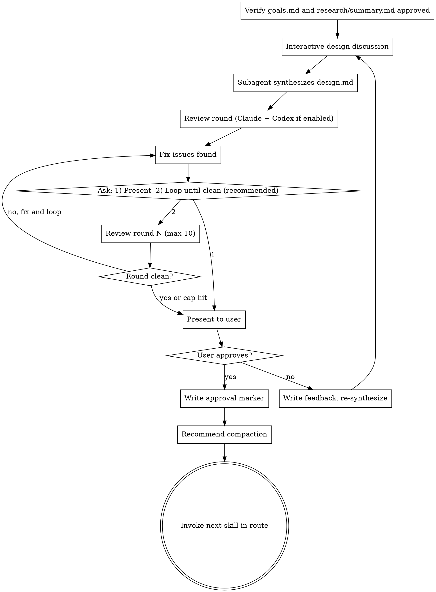

# Design (QRSPI Step 4)

**Announce at start:** "I'm using the QRSPI Design skill to explore approaches and define the architecture."

## Overview

Translate research findings into an architecture through interactive discussion. Propose approaches with trade-offs, define vertical slices, establish phases with replan gates, and include a test strategy. The discussion happens conversationally; a subagent synthesizes `design.md` per round.

## Artifact Gating

**Required inputs:**
- `goals.md` with `status: approved`
- `research/summary.md` with `status: approved`

If either artifact is missing or not approved, refuse to run and tell the user which artifact is needed.

Read `config.md` from the artifact directory to determine whether Codex reviews are enabled. If `config.md` doesn't exist, default to `codex_reviews: false`.

<HARD-GATE>
Do NOT synthesize design.md without approved goals.md AND research/summary.md.
Do NOT proceed to Structure without user approval of the design.
</HARD-GATE>

## Execution Model

**Interactive in main conversation** (like Goals). User and Claude discuss approaches. Subagent synthesizes `design.md` per round. Each rejection round launches a new subagent with original inputs + all prior feedback files.

## Process



### Interactive Design Discussion

1. Propose 2-3 design approaches with trade-offs, lead with recommendation
2. Include test strategy: what types of tests (unit, integration, E2E), what layers get tested, what frameworks
3. Include high-level Mermaid system diagram showing major components, relationships, and data flow
4. Enforce vertical slice decomposition with explicit anti-pattern examples:
   - BAD: "DB layer, then API layer, then service layer, then frontend"
   - GOOD: "User registration (DB + API + service + frontend), then user profile (DB + API + service + frontend)"
5. Define phases with replan gates. Phase 1 is always the PoC — it must prove the full stack works end-to-end. Ask user which slices go in the PoC phase and where replan checkpoints belong.
6. If no CI pipeline exists, note CI setup as the first task in Phase 1, blocking all other tasks. For greenfield projects, this task should also include creating project convention files (CLAUDE.md, linting config, etc.) so later reviewers have rules to enforce.

### Design Synthesis Subagent

Once the discussion settles, launch a **subagent** to synthesize `design.md`.

**Subagent inputs:**
- `goals.md`
- `research/summary.md`
- A summary of the design discussion (key decisions, user preferences, chosen approach)
- Any prior feedback files

**Output format for `design.md`:**

```markdown
---
status: draft
---

# Design: {Project/Feature Name}

## Approach
{Chosen approach and rationale}

## Key Decisions
{Decisions made during discussion with reasoning}

## Trade-offs Considered
{Alternatives that were rejected and why}

## Test Strategy
{Test types, layers, frameworks}

## System Diagram
{Mermaid diagram}

## Vertical Slices
{Slice definitions with layers each touches}

## Phases
### Phase 1: PoC
{Slices in PoC, what it proves}

### Phase 2: {name}
{Slices and replan gate criteria}
```

### Review Round

After synthesis, run one review round:

1. **Claude review subagent** — launch with `design.md`, `goals.md`, `research/summary.md` to check:
   - Does the design address all goals and acceptance criteria?
   - Are trade-offs clearly stated?
   - Any internal contradictions?
   - Is the test strategy appropriate for the design?
   - YAGNI check — any unnecessary complexity?
   - Are slices truly vertical (end-to-end), not horizontal layers?
   - Are phase boundaries reasonable? Does Phase 1 (PoC) prove the full stack?
   
   The subagent returns structured findings. The orchestrating skill writes them to `reviews/design-review.md`.

2. **Codex review** (if `config.md` has `codex_reviews: true`) — invoke `codex:rescue` with the artifact path (`design.md`), input artifacts (`goals.md`, `research/summary.md`) for cross-reference, and the same review criteria. The orchestrating skill appends Codex findings to `reviews/design-review.md`.

3. Fix any issues found in both reviews.

4. Ask the user ONCE: `1) Present for review  2) Loop until clean (recommended)`
   - **1:** Proceed to human gate, but clearly state the review status: "Note: reviews found issues which were fixed but have not been re-verified in a clean round. The artifact may still have issues."
   - **2:** Loop autonomously — run review → fix → review → fix without re-prompting. Stop ONLY when a round is clean ("Reviews passed clean") or 10 rounds reached ("Hit 10-round review cap — presenting for your review."). Then proceed to human gate. **Do not re-ask between rounds.**
   
   **Default recommendation is always option 2.** Clean reviews before human review catch cross-reference inconsistencies that are hard to spot manually.

### Human Gate

Present `design.md` to the user — "hammer on it" review point. **Always state the review status** when presenting: either "Reviews passed clean in round N" or "Reviews found issues in round N which were fixed but not re-verified."

On approval, if reviews have not passed clean, note this and ask if they'd like a review loop before finalizing. Then write `status: approved` in frontmatter.

On rejection, write the user's feedback to `feedback/design-round-{NN}.md` (using the standard feedback file format from `using-qrspi`), then continue the conversation and re-synthesize with a new subagent that receives: `goals.md`, `research/summary.md`, the latest design-discussion summary, and **all** prior feedback files (not just the latest round). After re-generation, the review cycle restarts.

### Artifact

`design.md` — approach, key decisions, trade-offs considered, test strategy, vertical slice definitions, phase groupings with replan gates, Mermaid system diagram

### Terminal State

Commit the approved `design.md` and `reviews/design-review.md` to git.

Recommend compaction: "Design approved. This is a good point to compact context before the next step (`/compact`)."

**REQUIRED:** Invoke the next skill in the `config.md` route after `design`.

## Red Flags — STOP

- Slices are horizontal layers ("database layer, then API layer, then frontend") instead of vertical ("user registration end-to-end, then user profile end-to-end")
- No test strategy section, or test strategy is just "add tests"
- Phase 1 (PoC) doesn't prove the full stack end-to-end
- YAGNI violation: features, abstractions, or extensibility not required by goals
- Design contradicts research findings without acknowledging the deviation
- No Mermaid system diagram, or diagram is just boxes without relationships
- Missing phase boundaries or replan gates for multi-phase work
- "We might need X later" as justification for including X now

## Common Rationalizations — STOP

| Rationalization | Reality |
|----------------|---------|
| "Horizontal layers are cleaner for this project" | Vertical slices are the invariant. If you think horizontal is better, present the case to the user — don't default to it. |
| "The test strategy is implied by the stack" | Write it explicitly. The Plan skill needs it to generate test expectations. |
| "We should add X for future extensibility" | YAGNI. If it's not in goals, it's not in the design. |
| "Phase 1 can just be the backend" | Phase 1 must prove the full stack. Backend-only PoC delays integration risk. |
| "The design is simple enough, skip the diagram" | Diagrams catch misunderstandings. A "simple" design still needs one. |

## Worked Example

**Good vertical slice decomposition:**

> ## Vertical Slices
>
> ### Slice 1: Client rate check (middleware → Redis → response)
> Touches: Express middleware, Redis client, HTTP response headers
> Proves: Full request lifecycle with rate limiting
>
> ### Slice 2: Rate limit metrics (middleware → metrics → dashboard)
> Touches: Express middleware, metrics collector, Grafana config
> Proves: Observability of rate limiting behavior

**Bad horizontal decomposition:**

> ## Layers
>
> ### Layer 1: Redis rate limit storage
> ### Layer 2: Middleware logic
> ### Layer 3: HTTP response formatting
> ### Layer 4: Metrics collection

The bad example splits by technical layer. Each "layer" can't be tested or demonstrated independently — they only work together.
