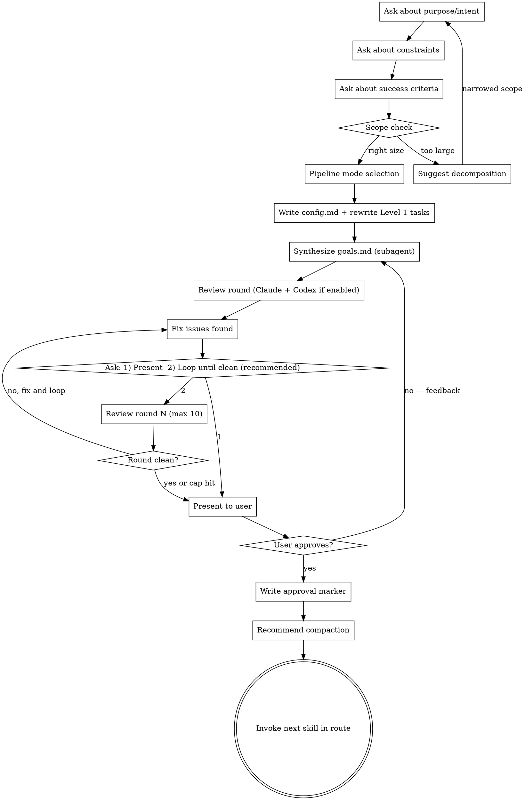

# Goals (QRSPI Step 1)

**Announce at start:** "I'm using the QRSPI Goals skill to capture what you want to build."

## Overview

Capture what the user wants — intent, constraints, success criteria, acceptance criteria. This is the "ticket" equivalent but doesn't require a ticket system. Runs as an interactive conversation in the main session, then launches a subagent to synthesize the artifact.

## Artifact Gating

**Required inputs:** None (this is the first step)

**State bootstrap:** If `.qrspi/state.json` does not exist or `state_read` returns non-zero, call `state_init_or_reconcile <artifact_dir>`.

**Before starting:**
1. Create the artifact directory: `docs/qrspi/YYYY-MM-DD-{slug}/` (relative to the project root, not the plugin directory)
   - **Slug generation:** Take the user's first description of what they want to build, extract 2-4 key words, convert to lowercase kebab-case. Examples: "I want to add user authentication" → `user-auth`, "Build a search API for products" → `product-search-api`. If ambiguous, ask the user to confirm.
   - If the directory already exists, ask the user if they want to continue an existing run or start fresh
2. Note: The `using-qrspi` entry-point skill creates a provisional "Goals" task before invoking this skill. Mark it as `in_progress`.

<HARD-GATE>
Do NOT synthesize goals.md until the pipeline mode is selected and config.md is written.
The user must explicitly choose quick fix or full pipeline before synthesis begins.
</HARD-GATE>

## Process



### Interactive Dialogue

- **One question at a time** — don't overwhelm with multiple questions
- **Prefer multiple choice** when possible, open-ended is fine too
- Focus on understanding: purpose, constraints, success criteria
- **Scope check:** If the request describes multiple independent subsystems, flag immediately. Help decompose into sub-projects — each gets its own QRSPI run.

Questions to cover (not necessarily in order — follow the conversation):
1. **What are you building?** What is the core purpose?
2. **Who is it for?** End users, internal team, API consumers?
3. **What constraints exist?** Tech stack, timeline, compatibility, performance?
4. **What does success look like?** Specific, testable acceptance criteria.
5. **What's out of scope?** Explicitly exclude to prevent scope creep.
6. **Is this greenfield or modifying existing code?**

### Pipeline Mode Selection

After intent capture (the interactive dialogue above) but before synthesizing `goals.md`, determine the pipeline configuration. Ask three questions — one at a time:

1. **Pipeline mode:** "Quick fix or full pipeline?"
   - **Quick:** goals → questions → research → plan → implement → test
   - **Full:** goals → questions → research → design → structure → plan → worktree → implement → integrate → test

2. **UX step** (only ask if `qrspi:ux` skill exists — glob for `~/.claude/plugins/cache/*/qrspi/*/skills/ux/` — skip silently if not found): "Include a UX/wireframing step after design?"

3. **Codex reviews** (only ask if `codex:rescue` is available — glob for `~/.claude/plugins/cache/openai-codex/codex/*/scripts/codex-companion.mjs` — skip silently if not found): "Use Codex for second reviews this run? (yes/no)"

Once you have answers, write `config.md` in the artifact directory:

```yaml
---
created: YYYY-MM-DD
pipeline: quick  # or full
codex_reviews: true  # or false
route:
  - goals
  - questions
  - research
  - plan  # quick stops here before implement
  - implement
  - test
---
```

**Route templates:**

- **Quick route:** goals → questions → research → plan → implement → test
- **Full route:** goals → questions → research → design → structure → plan → worktree → implement → integrate → test
- If UX was selected: insert `ux` after `design` (before `structure`) in the full route. UX is not applicable to quick-fix routes.

After writing `config.md`, rewrite the Level 1 pipeline tasks to match the route (add or remove steps as needed).

### Artifact Synthesis

Once the conversation settles, launch a **subagent** to synthesize `goals.md`:

**Subagent inputs:**
- The conversation content (user's answers to the dialogue questions)

**Subagent task:**
Produce `goals.md` with this structure:

```markdown
---
status: draft
---

# Goals: {Project/Feature Name}

## Purpose
{1-2 sentences: what is being built and why}

## Constraints
- {constraint 1}
- {constraint 2}
- ...

## Success Criteria
- [ ] {testable criterion 1}
- [ ] {testable criterion 2}
- ...

## Out of Scope
- {exclusion 1}
- {exclusion 2}

## Context
- Greenfield / Existing codebase
- {Any other relevant context from the conversation}
```

### Review Round

After synthesis, run one review round:

1. **Claude review subagent** — launch with `goals.md` to check:
   - Is `goals.md` complete and unambiguous?
   - Are acceptance criteria specific and testable?
   - Any missing constraints or assumptions?
   - Does the scope seem too broad for a single implementation?
   
   The subagent returns structured findings. The orchestrating skill writes them to `reviews/goals-review.md`.

2. **Codex review** (if `config.md` has `codex_reviews: true`) — invoke `codex:rescue` with the artifact path, review criteria, and no input artifacts for cross-reference (Goals has no predecessors). The orchestrating skill appends Codex findings to `reviews/goals-review.md`.

3. Fix any issues found in both reviews.

4. Ask the user ONCE: `1) Present for review  2) Loop until clean (recommended)`
   - **1:** Proceed to human gate, but clearly state the review status: "Note: reviews found issues which were fixed but have not been re-verified in a clean round. The artifact may still have issues."
   - **2:** Loop autonomously — run review → fix → review → fix without re-prompting. Stop ONLY when a round is clean ("Reviews passed clean") or 10 rounds reached ("Hit 10-round review cap — presenting for your review."). Then proceed to human gate. **Do not re-ask between rounds.**
   
   **Default recommendation is always option 2.** Clean reviews before human review catch cross-reference inconsistencies that are hard to spot manually.

### Human Gate

Present the synthesized `goals.md` to the user. **Always state the review status** when presenting: either "Reviews passed clean in round N" or "Reviews found issues in round N which were fixed but not re-verified."

They can:
- **Approve** → if reviews have not passed clean, note this and ask if they'd like a review loop before finalizing. Then write `status: approved` in frontmatter.
- **Request changes** → write the user's feedback to `feedback/goals-round-{NN}.md` (see using-qrspi Feedback File Format), then continue the conversation and re-synthesize with a new subagent that receives the original inputs + **all** prior feedback files (not just the latest round). After re-generation, the review cycle restarts.

### Terminal State

Commit the approved `goals.md`, `config.md`, and `reviews/goals-review.md` to git.

Recommend compaction: "Goals approved. This is a good point to compact context before the next step (`/compact`)."

**REQUIRED:** Invoke the next skill in the `config.md` route after `goals`.

## Red Flags — STOP

- User describes multiple independent subsystems but you're proceeding without decomposition
- Acceptance criteria are subjective ("it should feel fast") instead of testable ("response time < 200ms")
- Constraints section is empty — every project has constraints (tech stack, timeline, compatibility)
- Out of scope section is empty — scope creep happens when boundaries aren't explicit
- "Similar to what we did before" without specifying what exactly
- Pipeline mode selected without discussing the work's scope (quick fix for something that needs design, or full pipeline for a one-line change)
- Synthesizing goals.md before asking about constraints or success criteria

## Common Rationalizations — STOP

| Rationalization | Reality |
|----------------|---------|
| "The user already described what they want clearly" | Clear description ≠ complete goals. Acceptance criteria, constraints, and out-of-scope still need explicit capture. |
| "This is a quick fix, goals are overkill" | Quick-fix mode exists — use it. But even quick fixes need captured intent and acceptance criteria. |
| "I can infer the acceptance criteria" | Inferred criteria lead to "that's not what I meant." Make them explicit and get approval. |
| "The scope is obvious" | Obvious scope is where scope creep hides. Write it down. |
| "Let me just start the research first" | Research without approved goals means you don't know what you're looking for. |

## Worked Example

### Good goals.md — "Rate Limiter for Public API"

```markdown
---
status: draft
---

# Goals: Rate Limiter for Public API

## Purpose
Add per-client rate limiting to the public REST API to prevent abuse and ensure
fair resource usage across all API consumers.

## Constraints
- Must use Redis for shared state (already in the stack)
- Must not exceed 5ms p99 overhead on rate-limited paths
- Must respect X-Forwarded-For headers for clients behind proxies
- Must be deployable without downtime (rolling deploy)
- Timeline: complete within current sprint (5 days)

## Success Criteria
- [ ] Clients exceeding 100 requests/min receive 429 Too Many Requests
- [ ] Response includes Retry-After header with seconds until reset
- [ ] Limits are enforced consistently across all API nodes (Redis-backed)
- [ ] Rate limit headers (X-RateLimit-Limit, X-RateLimit-Remaining, X-RateLimit-Reset) present on every response
- [ ] Existing test suite passes with no regressions
- [ ] p99 latency overhead measured at < 5ms under load test

## Out of Scope
- Per-endpoint rate limits (uniform limit only)
- Admin UI for configuring limits
- Billing-tier differentiation
- IP allowlisting / blocklisting

## Context
- Existing codebase (Express + Redis already deployed)
- Rate limit key: API key from Authorization header; fallback to IP
```

### Bad goals.md — "Rate Limiting"

```markdown
---
status: draft
---

# Goals: Rate Limiting

## Purpose
Add rate limiting so the API doesn't get abused.

## Constraints
- Use existing tech stack

## Success Criteria
- [ ] Rate limiting works
- [ ] API is still fast

## Out of Scope
- (none specified)

## Context
- Existing codebase
```

### Why the bad one fails

- **"Rate limiting works"** is not testable. Works at what threshold? For which clients? Verified how?
- **"API is still fast"** is subjective. Fast compared to what baseline? Measured how?
- **Constraints section** says "existing tech stack" — this doesn't tell a downstream agent which technology to use. Redis? In-memory? A third-party service?
- **Out of scope is empty** — without explicit exclusions, downstream agents will make assumptions. One agent might scope in per-endpoint limits, another might add an admin UI. Scope creep enters here.
- **No X-Forwarded-For mention** — a real production requirement that will be discovered mid-implementation and trigger a backward loop.
- The bad goals.md will cause Questions to ask vague questions, Research to gather irrelevant material, and Design to propose an architecture the user didn't want.
