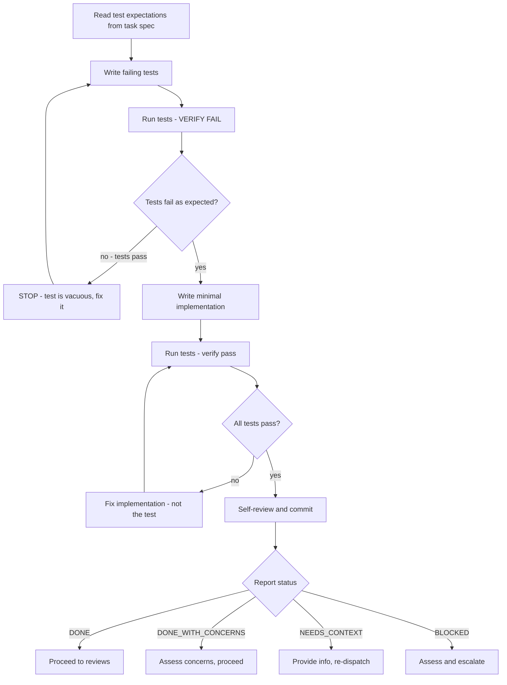
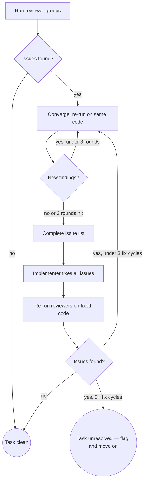

# Implement (QRSPI Step 8)

**Announce at start:** "I'm using the QRSPI Implement skill to execute TDD per task with code reviews."

## Overview

TDD execution per task in its own worktree. Write failing tests, implement to pass, run correctness and thoroughness reviews. Subagent per task.

## Iron Law

```
NO PRODUCTION CODE WITHOUT A FAILING TEST FIRST
```

## Prompt Templates

```
implement/
├── SKILL.md                    (orchestration logic only)
└── templates/
    ├── implementer.md          (TDD execution prompt)
    ├── correctness/            (always runs — quick + deep)
    │   ├── spec-reviewer.md
    │   ├── code-quality-reviewer.md
    │   ├── silent-failure-hunter.md
    │   └── security-reviewer.md
    └── thoroughness/           (deep mode only)
        ├── goal-traceability-reviewer.md
        ├── test-coverage-reviewer.md
        ├── type-design-analyzer.md
        └── code-simplifier.md
```

Correctness checks if code is right and safe — it always runs. Thoroughness checks if it's complete, well-typed, and clean — it runs in deep mode only. Execution order: spec-reviewer first (gate), remaining correctness in parallel, then thoroughness in parallel (deep only).

## Artifact Gating

Read the task file's `pipeline` field to determine which inputs to load. The task's `pipeline` field is the single source of truth — Implement never checks `config.md` for pipeline routing. Read `config.md` only for `review_depth` and `review_mode` settings.

| Input | `pipeline: quick` | `pipeline: full` |
|-------|-------------------|-------------------|
| `task-NN.md` (full text) | Yes | Yes |
| `goals.md` with `status: approved` | Yes | Yes |
| `research/summary.md` with `status: approved` | Yes | No |
| `design.md` with `status: approved` | No | Yes |
| `structure.md` with `status: approved` | No | Yes |
| `parallelization.md` with `status: approved` | No | Yes |

In the full pipeline, research is already incorporated into `design.md` and `structure.md`. In quick fix mode, `research/summary.md` provides design-like context since those artifacts don't exist.

<HARD-GATE>
Do NOT write production code without a failing test first.
Do NOT skip any reviewer in the configured review depth.
Do NOT proceed after BLOCKED status without changing approach.
Do NOT bypass the batch gate — every task's results are presented to the user.
</HARD-GATE>

## Quick Fix Mode

When Worktree is not in the route:

1. Ask review depth/mode, write to `config.md`. Default: quick depth + single round.
2. Orchestrate fix tasks from `fixes/test-round-NN/` directly.

## Per-Task TDD Process



1. **Read test expectations** from the task spec
2. **Write failing tests** based on those expectations
3. **Run tests — verify fail.** If they pass, the test is vacuous — fix it
4. **Write minimal implementation** to make the tests pass
5. **Run tests — verify pass.** If they fail, fix the implementation (not the test)
6. **Self-review and commit**

## Code Quality

Comment aggressively. Every function gets a header comment explaining: purpose, inputs, outputs, and failure behavior. Every conditional block that handles an edge case, security decision, or non-obvious flow gets an inline comment explaining *why*. Assume the code reviewer is proficient in software engineering but unfamiliar with the specific language.

## Implementer Subagent Status Reporting

| Status | Action |
|--------|--------|
| **DONE** | Proceed to reviews |
| **DONE_WITH_CONCERNS** | Read concerns, address if correctness/scope, proceed |
| **NEEDS_CONTEXT** | Provide missing info, re-dispatch |
| **BLOCKED** | Assess: more context, more capable model, break into pieces, or escalate |

## Review Groups

| Group | Reviewer | Quick | Deep | Execution |
|-------|----------|-------|------|-----------|
| Correctness | spec-reviewer | Yes | Yes | First (gate for the rest) |
| Correctness | code-quality-reviewer | Yes | Yes | Parallel after spec passes |
| Correctness | silent-failure-hunter | Yes | Yes | Parallel after spec passes |
| Correctness | security-reviewer | Yes | Yes | Parallel after spec passes |
| Thoroughness | goal-traceability-reviewer | No | Yes | Parallel after correctness passes |
| Thoroughness | test-coverage-reviewer | No | Yes | Parallel after correctness passes |
| Thoroughness | type-design-analyzer (only when new types) | No | Yes | Parallel after correctness passes |
| Thoroughness | code-simplifier | No | Yes | Parallel after correctness passes |

## Review Fix Loop (Inner Loop, Per-Task)

Follows Review Pattern 1.



### Mechanics

1. Run reviewer groups (quick = correctness only, deep = correctness then thoroughness)
2. First pass clean → task clean
3. Issues → converge (re-run on same code up to 3 rounds) to build complete list
4. Fix ALL issues, re-run → back to convergence if new issues
5. Up to 3 fix cycles. If unresolved after 3, flag and move on
6. **Single round mode:** skip convergence, run once, fix, re-run once, flag if still issues

## Dispatching Reviewers

- Read template from `implement/templates/{group}/{reviewer}.md`
- Launch as subagent with template as prompt framework
- Provide: task spec, code changes (files + content), test results, additional context per template
- Each returns: `✅ Approved` or `❌ Issues: [file:line references]`

## Artifact

`reviews/tasks/task-NN-review.md` — per-task review results.

### File Path

`reviews/tasks/task-NN-review.md` where `NN` is the zero-padded task number (e.g., `task-03-review.md`, `task-15-review.md`).

### Format

```markdown
---
task: NN
---

# Task NN Review

## Round 1 — Correctness

### spec-reviewer

**Model:** {actual model identifier, e.g., claude-opus-4-5}
**Prompt:**
{verbatim prompt sent to this reviewer}

**Response:**
{verbatim response received from this reviewer}

### code-quality-reviewer

**Model:** {actual model identifier}
**Prompt:**
{verbatim prompt sent to this reviewer}

**Response:**
{verbatim response received from this reviewer}

### silent-failure-hunter

**Model:** {actual model identifier}
**Prompt:**
{verbatim prompt sent to this reviewer}

**Response:**
{verbatim response received from this reviewer}

### security-reviewer

**Model:** {actual model identifier}
**Prompt:**
{verbatim prompt sent to this reviewer}

**Response:**
{verbatim response received from this reviewer}

## Round 1 — Thoroughness (deep only)

### goal-traceability-reviewer

**Model:** {actual model identifier}
**Prompt:**
{verbatim prompt sent to this reviewer}

**Response:**
{verbatim response received from this reviewer}

### test-coverage-reviewer

**Model:** {actual model identifier}
**Prompt:**
{verbatim prompt sent to this reviewer}

**Response:**
{verbatim response received from this reviewer}

### type-design-analyzer

**Model:** {actual model identifier}
**Prompt:**
{verbatim prompt sent to this reviewer}

**Response:**
{verbatim response received from this reviewer}

### code-simplifier

**Model:** {actual model identifier}
**Prompt:**
{verbatim prompt sent to this reviewer}

**Response:**
{verbatim response received from this reviewer}

## Post-review fixes (round 1)
- {what was changed and why}

## Round 2 — Correctness

{repeat reviewer sections as above}

## Round 2 — Thoroughness (deep only)

{repeat reviewer sections as above}

## Post-review fixes (round 2)
- {what was changed and why}
```

### Skipped Reviewers

When a reviewer is skipped (e.g., `type-design-analyzer` when no new types are introduced), include the section with:

```markdown
### type-design-analyzer

**Model:** skipped
**Reason:** {why this reviewer was skipped, e.g., "No new types introduced in this task"}
```

### Codex Subsections

When Codex is enabled, each reviewer section includes a `#### Codex` subsection after the Response:

```markdown
### spec-reviewer

**Model:** {actual model identifier}
**Prompt:**
{verbatim prompt}

**Response:**
{verbatim response}

#### Codex

**Model:** {codex model identifier}
**Prompt:**
{verbatim codex prompt}

**Response:**
{verbatim codex response}
```

### Rules

- The **orchestrating skill** (Implement) writes this file — not the reviewer subagents
- **Prompt and Response fields are verbatim** — no summarization, no paraphrasing
- **Model identifiers are actual** — use the real model ID (e.g., `claude-opus-4-5`), not generic names
- The `task` frontmatter field is **required** and must match the task number (numeric, no padding)
- Post-review fixes sections appear **between rounds**, listing what changed and why
- Correctness reviewers: `spec-reviewer`, `code-quality-reviewer`, `silent-failure-hunter`, `security-reviewer`
- Thoroughness reviewers (deep only): `goal-traceability-reviewer`, `test-coverage-reviewer`, `type-design-analyzer`, `code-simplifier`

## Terminal State

**Full pipeline:** Each task subagent returns to the Worktree orchestrator. Implement does not invoke the next step.

**Quick fix:** Present batch gate (see below). Then invoke next skill in `config.md` route after `implement` (test in quick fix).

## Batch Gate

After all tasks complete, present results and a conditional menu based on task outcomes.

**When all tasks passed clean:**

```
All tasks passed clean. Choose:
1. Re-run all reviews (confidence check)
2. Continue to next step
3. Stop
```

**When tasks have unresolved issues:**

```
{N} task(s) have unresolved issues. Choose:
1. Fix remaining issues and re-run reviews
2. Re-run all reviews (confidence check)
3. Continue anyway
4. Stop
```

After the options menu, add: "Before choosing, consider running `/compact` if context is long — implementation phases consume significant context. Compacting before Integrate gives the next skill a cleaner start."

### Batch Gate Red Flags — STOP

- Presenting "Fix remaining issues" option when all tasks passed clean

## Reviewer Name Mapping

Phase 1 → Phase 3 renames:

- `spec-compliance-reviewer` → `spec-reviewer`
- `code-reviewer` → `code-quality-reviewer`
- `test-coverage-analyzer` → `test-coverage-reviewer`

## Model Selection Guidance

| Task complexity | Recommended model |
|-----------------|-------------------|
| Mechanical tasks (1-2 files, clear spec) | Fast/cheap model (haiku) |
| Integration tasks (multi-file, pattern matching) | Standard model (sonnet) |
| Architecture/design/review | Most capable model (opus) |

Worktree uses this for implementer subagents. Implement uses it for reviewer subagents.

## Task Tracking (TodoWrite)

Sub-tasks per task:

1. Write failing tests
2. Verify tests fail
3. Write minimal implementation
4. Verify tests pass
5. Self-review and commit
6. Dispatch correctness reviewers
7. Dispatch thoroughness reviewers (deep mode)
8. Fix reviewer issues (if any)

## Red Flags — STOP

- Writing production code before a failing test exists
- Skipping a reviewer because "the change is small"
- Proceeding after BLOCKED status without changing approach
- Fixing reviewer findings without re-running the reviewer
- Self-review replacing actual review dispatch
- Committing without running tests
- Accepting "close enough" on spec compliance
- 3+ attempts to pass the same test without changing approach
- Fixing a failing test by weakening the assertion

## Common Rationalizations — STOP

| Rationalization | Reality |
|----------------|---------|
| "Too simple to test" | Simple code breaks. Write the test. |
| "I'll test after implementing" | Tests written after pass immediately — they prove nothing |
| "The test is obvious, skip verify-fail" | If you didn't see it fail, you don't know it can fail |
| "I need to write the implementation to know what to test" | Read the task spec's test expectations |
| "Mocking makes this easier" | Mock boundaries, not internals. Test real behavior. |
| "This refactor doesn't change behavior, skip tests" | If behavior doesn't change, existing tests still pass. Run them. |
| "This reviewer is redundant, I can skip it" | Each reviewer catches different classes of issues. Run them all. |
| "The change is too small for 8 reviewers" | Review depth is configured per phase, not per change. Follow config. |

## Worked Example — Good TDD Cycle

**RED:**

```typescript
test('returns 429 when client exceeds 100 requests/minute', async () => {
  for (let i = 0; i < 100; i++) {
    await request(app).get('/api/data').set('X-API-Key', 'client-1');
  }
  const response = await request(app).get('/api/data').set('X-API-Key', 'client-1');
  expect(response.status).toBe(429);
  expect(response.headers['retry-after']).toBeDefined();
});
```

**Verify RED:** `FAIL: expected 429, received 200` — fails because rate limiter doesn't exist yet ✓

**GREEN:**

```typescript
export function rateLimiter(req, res, next) {
  const key = req.headers['x-api-key'] || req.ip;
  const count = increment(key);
  if (count > 100) {
    const retryAfter = Math.ceil((windowEnd(key) - Date.now()) / 1000);
    res.set('Retry-After', String(retryAfter));
    return res.status(429).json({ error: 'Rate limit exceeded' });
  }
  next();
}
```

**Verify GREEN:** `PASS (all tests)`

**Status report:**

```
Status: DONE
Implemented: Rate limit middleware with Redis-backed counter
Tests: 6/6 passing
Files: src/middleware/rate-limiter.ts (create), src/app.ts (modify)
Self-review: Clean
```

## Worked Example — Bad (Anti-Pattern)

```
1. Wrote rate limiter middleware
2. Wrote tests to verify it works
3. All tests pass on first run ✓
```

**Why this fails:**

- Implementation before tests — violates the iron law
- Tests "pass on first run" — prove nothing
- Testing what was built, not what should be built
- Tests biased by implementation, not by task spec's test expectations

<BEHAVIORAL-DIRECTIVES>
These directives apply at every step of this skill, regardless of context.

D1 — Encourage reviews after changes: After any significant change to an artifact (whether from feedback, a fix round, or a re-run), recommend a review before proceeding. Reviews catch regressions that are invisible during forward-only execution.

D2 — Never suggest skipping steps for speed. Do not offer shortcuts, suggest merging steps, or imply steps can be skipped to save time.

D3 — There is no time crunch. LLMs execute orders of magnitude faster than humans. There is no benefit to skipping LLM-driven steps — reviews, synthesis passes, and validation rounds cost seconds. Reassure the user that thoroughness is free. If the user signals urgency, acknowledge the constraint and offer the fastest compliant path — never a non-compliant shortcut.
</BEHAVIORAL-DIRECTIVES>
