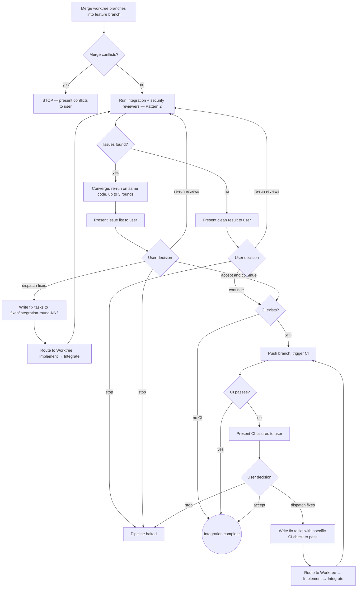

# Integrate (QRSPI Step 8.5)

**Announce at start:** "I'm using the QRSPI Integrate skill to verify cross-task integration and run CI."

## Overview

Post-merge cross-task review. Verifies tasks work together, checks cross-task security, runs CI pipeline. Only in the full pipeline route — quick fix mode skips entirely (single task, nothing to integrate). Orchestrator in main conversation.

## Iron Law

```
NO CI PUSH WITHOUT INTEGRATION REVIEW
```

## Prompt Templates

```
integrate/
├── SKILL.md
└── templates/
    ├── integration-reviewer.md
    └── security-integration-reviewer.md
```

## Artifact Gating

Required inputs:

- All current-phase task review files in `reviews/tasks/`
- Worktree branches ready to merge
- `design.md` with `status: approved` (for cross-task context)
- `structure.md` with `status: approved` (for interface definitions)
- `parallelization.md` with `status: approved` (for branch map — which branches to merge)
- `config.md` (for route — determines which skill to invoke after integrate)

If any required artifact is missing or not approved, refuse to run and tell the user which artifact is needed.

### Config Validation

Before reading `route` from `config.md`, validate the following:

**If `config.md` is missing:**

  config.md not found in the artifact directory.

  1) Re-run Goals to create config.md and set the pipeline mode
  2) Abort

**If `route` is missing:**

  config.md has no `route` field.

  1) Re-run Goals to regenerate config.md with the correct route
  2) Manually add a `route:` list to config.md
  3) Abort

<HARD-GATE>
Do NOT push to CI or approve integration without running integration and security reviews on the merged code.
Do NOT push to CI without user approval of integration review results.
Do NOT write production code fixes directly — route all fixes through Worktree → Implement → Integrate.
This applies regardless of how simple the fix appears.
</HARD-GATE>

## Process



## Process Steps

1. **Merge worktree branches** into the feature branch using `parallelization.md` branch map. **STOP if merge conflicts** — present conflicts to user with file-level details. Do not attempt auto-resolution.
2. **Integration reviews** — follows **Review Pattern 2 (Outer Loop)**. Run both reviewers (integration-reviewer + security-integration-reviewer) in parallel, then present to user regardless of outcome.
   - **Clean:** User chooses: re-run reviews (confidence check), continue to CI gate, or stop.
   - **Issues found:** Converge on unchanged code (up to 3 rounds to build complete issue list), then present converged list. User chooses: dispatch fix tasks, re-run reviews, accept and continue, or stop.
3. **Fix task dispatch:** Write fix tasks to `fixes/integration-round-NN/`. Each fix task includes:
   - The specific integration issue(s) to fix (with `file:line` references from reviewers)
   - The `pipeline: full` field (integration fixes are cross-task by definition)
   - References to the affected task specs for context
   Route through Worktree → Implement → back to Integrate. After fixes return, re-run from step 1 (merge fix branches, then re-run reviews).

## CI Pipeline Gate (Sub-Gate Within Integrate)

1. Push branch, trigger CI (GitHub Actions or equivalent)
2. Wait for results: tests, linting, security scanning, build
3. If failures: present to user. User chooses: dispatch fix tasks, accept, or stop.
4. Write fix tasks to `fixes/ci-round-NN/`. Fix tasks include the **specific CI check/test that must pass** in the task spec. The implementer fixes the issue AND verifies the CI check passes locally before returning. Reviewers also verify it passes.
5. Fix tasks route through Worktree → Implement → back to Integrate → re-run CI. If CI still fails, present to user again (no cycle counting — user is in the loop each time).
6. If no CI pipeline exists, skip this gate entirely.

## Fix Task File Format

```markdown
---
status: approved
task: NN
phase: {current phase}
pipeline: full
fix_type: integration
---

# Integration Fix NN: {description}

- **Files:** {exact paths from reviewer findings}
- **Dependencies:** none
- **LOC estimate:** ~{N}
- **Description:** {what the integration issue is and how to fix it}
- **Integration issue:** {file:line references from reviewer}
- **Test expectations:**
  - {specific integration behavior that must work after fix}
  - {existing tests that must still pass}
```

## CI Fix Task File Format

```markdown
---
status: approved
task: NN
phase: {current phase}
pipeline: full
fix_type: ci
---

# CI Fix NN: {description}

- **Files:** {exact paths from CI failure output}
- **Dependencies:** none
- **LOC estimate:** ~{N}
- **Description:** {what the CI failure is and how to fix it}
- **CI check to pass:** {specific check name, test name, or build step that must pass}
- **Test expectations:**
  - {the specific CI check listed above must pass locally before returning}
  - {all existing tests must still pass}
```

## Artifacts

- `reviews/integration/round-NN-review.md` — integration review findings per round (both integration reviewer and security integration reviewer findings, attributed separately with `## Integration Review` and `## Security Integration Review` headers)
- `reviews/ci/round-NN-review.md` — CI failure analysis per round

## Human Gate

Present integration review results (clean or converged issue list) to user after each review round. Present CI results to user after each CI run. User must approve or choose an action (dispatch fixes, re-run reviews, accept, stop) at each gate before the pipeline advances. On rejection, write the user's feedback to `feedback/integrate-round-{NN}.md` (using the standard feedback file format from `using-qrspi`).

## Terminal State

Recommend compaction: "Integration complete. This is a good point to compact context before the next step (`/compact`)."

**REQUIRED:** Invoke the next skill in the `config.md` route after `integrate`.

## Model Selection Guidance

| Task complexity | Recommended model |
|-----------------|-------------------|
| Integration reviewer dispatch | Most capable (opus) — cross-task reasoning |
| Security integration reviewer dispatch | Most capable (opus) — security analysis |
| Fix task writing | Standard (sonnet) — translating findings to task specs |

## Task Tracking (TodoWrite)

Create granular tasks for each step:

1. Merge worktree branches
2. Run integration reviewer
3. Run security integration reviewer
4. Present review results to user
5. Dispatch fix tasks (if needed)
6. Push to CI (if CI exists)
7. Handle CI results

Mark each task in_progress when starting, completed when done.

## Red Flags — STOP

- Merging branches without checking for conflicts first
- Auto-resolving merge conflicts without presenting to user
- Writing code fixes directly instead of routing through the fix pipeline
- Skipping security integration review because "integration review was clean"
- Pushing to CI without user approval of integration review results
- Accepting CI failures without user confirmation
- Re-running CI without fixing the failures first (deterministic — same code = same result)

## Common Rationalizations — STOP

| Rationalization | Reality |
|----------------|---------|
| "The merge conflicts are trivial, I can resolve them" | Present all conflicts to the user — trivial conflicts can mask semantic issues |
| "Integration review was clean, skip security" | Security issues are a different class — integration correctness doesn't imply security correctness |
| "This fix is one line, I can patch it directly" | All production code goes through Implement with reviews — that's the invariant |
| "CI is flaky, just re-run it" | Investigate the failure first. If truly flaky, present to user and let them decide |
| "No CI exists, so integration is done" | CI is one gate. Integration and security reviews are the primary gates — those still run |

## Worked Example — Good Integration Review Finding

```markdown
## Integration Review — Round 1

### Issue 1: Interface mismatch between Task 2 and Task 3
**Severity:** High
**Files:**
- `src/services/box-service.ts:45` — `createBox()` returns `Box`
- `src/api/routes/invitations.ts:23` — expects `createBox()` to return `Promise<Box>`

**Description:** Task 2 implemented `createBox()` as synchronous (returns `Box` directly), but Task 3's invitation flow calls it with `await`. The call won't fail (awaiting a non-promise resolves immediately), but the return type mismatch will cause TypeScript compilation errors if strict mode is enabled, and the synchronous DB call will block the event loop.

**Recommendation:** `createBox()` should be async — it performs a database write which should not be synchronous.
```

## Worked Example — Bad (Vague Finding)

```markdown
## Integration Review — Round 1

### Issue 1: Tasks don't work together
The box service and invitation service have some integration issues that should be fixed.
```

**Why this fails:**
- No file:line references — implementer can't locate the issue
- "Some integration issues" is not actionable
- No severity classification
- No description of what specifically is wrong
- No recommendation for how to fix

<BEHAVIORAL-DIRECTIVES>
These directives apply at every step of this skill, regardless of context.

D1 — Encourage reviews after changes: After any significant change to an artifact (whether from feedback, a fix round, or a re-run), recommend a review before proceeding. Reviews catch regressions that are invisible during forward-only execution.

D2 — Never suggest skipping steps for speed. Do not offer shortcuts, suggest merging steps, or imply steps can be skipped to save time.

D3 — There is no time crunch. LLMs execute orders of magnitude faster than humans. There is no benefit to skipping LLM-driven steps — reviews, synthesis passes, and validation rounds cost seconds. Reassure the user that thoroughness is free. If the user signals urgency, acknowledge the constraint and offer the fastest compliant path — never a non-compliant shortcut.
</BEHAVIORAL-DIRECTIVES>
