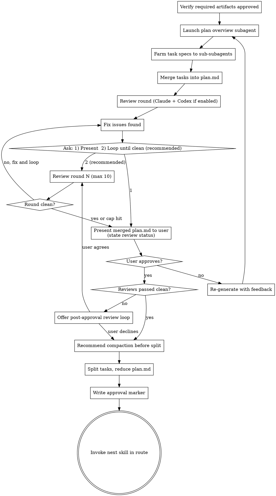

# Plan (QRSPI Step 6)

**Announce at start:** "I'm using the QRSPI Plan skill to create detailed task specs."

## Overview

Break the structure into ordered, self-contained tasks following vertical slices and phases from the design. Each task spec includes exact file paths, descriptions, test expectations, dependencies, and LOC estimates. For large plans (6+ tasks), individual task specs are farmed out to sub-subagents.

## Artifact Gating

Read `config.md` to determine pipeline mode. If `config.md` doesn't exist or has no `route` field, refuse to proceed and tell the user to re-run Goals to set the pipeline mode. The `route` field is authoritative; `pipeline` is informational (see using-qrspi Config File section).

**Full pipeline (`pipeline: full`) — required inputs:**
- `goals.md` with `status: approved`
- `research/summary.md` with `status: approved`
- `design.md` with `status: approved`
- `structure.md` with `status: approved`

**Quick fix (`pipeline: quick`) — required inputs:**
- `goals.md` with `status: approved`
- `research/summary.md` with `status: approved`

Note: Design and Structure are not in the quick fix route, so `design.md` and `structure.md` don't exist.

If any required artifact is missing or not approved, refuse to run and tell the user which artifact is needed.

Read `config.md` from the artifact directory to determine whether Codex reviews are enabled.

### Config Validation

Before using any config field, validate the following:

**If `config.md` is missing:**

  config.md not found. Cannot determine pipeline mode or route.

  1) Re-run Goals to create config.md and set the pipeline mode
  2) Abort

**If `pipeline` is missing:**

  config.md has no `pipeline` field.

  1) Re-run Goals to regenerate config.md with the pipeline field set
  2) Manually add `pipeline: full` or `pipeline: quick` to config.md
  3) Abort

**If `pipeline` has an invalid value (not `full` or `quick`):**

  config.md has an invalid value for `pipeline`: {value}
  Expected: `full` or `quick`

  1) Edit config.md and set `pipeline: full` or `pipeline: quick`
  2) Re-run Goals to regenerate config.md
  3) Abort

**If `route` is missing:**

  config.md has no `route` field.

  1) Re-run Goals to regenerate config.md with the correct route
  2) Manually add a `route:` list to config.md
  3) Abort

**If `codex_reviews` is missing:**

  config.md has no `codex_reviews` field.

  1) Add `codex_reviews: true` to config.md (Codex second reviews enabled)
  2) Add `codex_reviews: false` to config.md (Codex second reviews disabled)
  3) Re-run Goals to regenerate config.md
  4) Abort

**If `codex_reviews` has an invalid value (not `true` or `false`):**

  config.md has an invalid value for `codex_reviews`: {value}
  Expected: `true` or `false`

  1) Edit config.md and set `codex_reviews: true` or `codex_reviews: false`
  2) Re-run Goals to regenerate config.md
  3) Abort

<HARD-GATE>
Do NOT produce plan.md without all required artifacts approved (full: goals + research + design + structure; quick: goals + research).
Do NOT use placeholder content in task specs: no TBD, TODO, "similar to Task N", "add appropriate handling".
Every task spec must be self-contained — an implementation agent reading only that task must have everything it needs.
</HARD-GATE>

## Execution Model

**Subagent** produces `plan.md` overview. For large plans (6+ tasks), individual task specs are farmed out to sub-subagents (one per task or related group) to keep context manageable. Iterative with human feedback.

## Process

The graph below shows the large-plan path with sub-subagents. For small plans (<6 tasks), the overview subagent writes merged `plan.md` directly, skipping the Farm/Merge nodes.



### Plan Overview Subagent

**Inputs:**
- `goals.md`
- `research/summary.md`
- `design.md`
- `structure.md`
- Any prior feedback files

**Task:** Break the structure into ordered tasks following vertical slices and phases.

1. Break structure into ordered tasks following vertical slices and phases from `design.md`
2. Each task spec includes:
   - Exact file paths to create/modify
   - Description of what the task accomplishes
   - Test expectations in plain language (behaviors, inputs/outputs, edge cases, error conditions)
   - Dependencies on other tasks
   - LOC estimate
3. No placeholders, no TBDs, no "similar to Task N" — each spec is self-contained

**For small plans (<6 tasks):** The overview subagent writes the full merged `plan.md` directly (overview + task specs in one document).

**For large plans (6+ tasks):** The overview subagent writes `plan.md` with only the overview section (phase structure, task ordering, dependency graph). Individual task specs are dispatched to sub-subagents.

### Quick-Fix Plan Behavior

When `config.md` has `pipeline: quick`:

1. The plan subagent receives `goals.md` and `research/summary.md` only (no design.md or structure.md)
2. Produces a **single-task plan** directly — no sub-subagent dispatch, no merge/split lifecycle
3. The task spec derives file paths and test expectations from the research findings and goals
4. The merged `plan.md` contains both the overview and the single task spec
5. After approval, the single task is written to `tasks/task-01.md` and `plan.md` is reduced to overview-only (same mechanics as full pipeline, but always exactly one task)

The review round, human gate, and approval process are identical to full pipeline mode.

### Sub-Subagent Dispatch (Large Plans Only)

For large plans, farm task spec writing to sub-subagents:

**Sub-subagent inputs:**
- `plan.md` overview
- Relevant sections of `structure.md`
- `design.md` (for test strategy and vertical slice context)

Each sub-subagent writes `tasks/task-NN.md`. After all complete, the Plan skill reads all task files, appends them as sections to `plan.md`, then deletes the individual `tasks/task-NN.md` files — creating a single document as the only source of truth during review.

### Plan Document Structure (During Review)

```markdown
---
status: draft
---

# Implementation Plan

## Overview
{Phase structure, task ordering, dependency graph}

## Phase 1: {name}
{Tasks in this phase, ordering rationale}

## Phase 2: {name}
{Tasks in this phase, ordering rationale}

---

## Task Specs

### Task 1: {name}
- **Phase:** 1
- **Files:** {exact paths, create/modify}
- **Dependencies:** none
- **LOC estimate:** ~{N}
- **Description:** {what this task accomplishes}
- **Test expectations:**
  - {behavior 1}
  - {edge case 1}
  - {error condition 1}

### Task 2: {name}
...
```

### Plan Reviewer Templates

Five reviewer templates run in parallel as part of the review round. All five run always — neither quick-fix nor full-pipeline mode gates any template. Templates that require `design.md` or `structure.md` emit "NOT APPLICABLE — quick-fix route" for those checks when those files are absent.

| Template | File | Focus | Run Condition |
|----------|------|-------|---------------|
| Spec Reviewer | `templates/spec-reviewer.md` | Completeness, scope, interpretation, test coverage mapping, placeholder detection | Always |
| Security Reviewer | `templates/security-reviewer.md` | Fail-closed requirements, input validation, auth/authz, no insecure defaults | Always |
| Silent Failure Hunter | `templates/silent-failure-hunter.md` | Swallowed errors, silent fallbacks, partial state on failure, log-and-continue | Always |
| Goal Traceability Reviewer | `templates/goal-traceability-reviewer.md` | Forward trace, backward trace, gap analysis, spec-to-design fidelity | Always |
| Test Coverage Reviewer | `templates/test-coverage-reviewer.md` | Behavioral coverage, edge cases, error conditions, test expectation quality, missing design scenarios | Always |

### Review Round

After the merged `plan.md` is ready, run one review round:

1. **Claude review subagent** — launch a subagent that runs all five reviewer templates from `skills/plan/templates/` in parallel. Provide the subagent with:
   - `plan.md` (merged)
   - `goals.md`
   - `research/summary.md`
   - (full pipeline only) `design.md` and `structure.md`

   Each reviewer template is a standalone prompt document — the subagent fills in the artifact content and runs each template as a separate review pass. The five reviews run concurrently; the subagent collects all findings and returns them as a single structured report.

   The orchestrating skill writes the combined findings to `reviews/plan-review.md`.

2. **Codex review** (if `config.md` has `codex_reviews: true`) — invoke `codex:rescue` with the artifact path (`plan.md`), input artifacts (`goals.md`, `research/summary.md`, and (full pipeline only) `design.md`, `structure.md`) for cross-reference, and the same review criteria. The orchestrating skill appends Codex findings to `reviews/plan-review.md`.

3. Fix any issues found in both reviews.

4. Ask the user ONCE: `1) Present for review  2) Loop until clean (recommended)`
   - **1:** Proceed to human gate, but clearly state the review status: "Note: reviews found issues which were fixed but have not been re-verified in a clean round. The plan may still have issues." The user can still approve, but they make an informed choice.
   - **2:** Loop autonomously — run review → fix → review → fix without re-prompting. Stop ONLY when a round is clean ("Reviews passed clean") or 10 rounds reached ("Hit 10-round review cap — presenting for your review."). Then proceed to human gate. **Do not re-ask between rounds.**
   
   **Default recommendation is always option 2.** Clean reviews before human review are important because the human cannot feasibly verify cross-file consistency, forward dependencies, or migration ordering across 10+ task specs by hand — that's what the automated reviews catch.

### Human Gate

Present merged `plan.md` to the user — overview for approval, task details for spot-checking. **Always state the review status** when presenting: either "Reviews passed clean in round N" or "Reviews found issues in round N which were fixed but not re-verified."

**On approval:**

1. **If reviews have NOT passed clean** (the user chose option 1 earlier, or backward loops introduced changes after the last clean round): Ask the user before proceeding: "Reviews haven't passed clean yet. Would you like me to run a review loop to clean before splitting? This is strongly recommended — the review cycle catches cross-file inconsistencies that are hard to spot manually." If the user agrees, run the review loop (same as option 2 above), then continue. If they decline, proceed.

2. **Recommend compaction before splitting:** "Plan approved. This is a good point to compact context (`/compact`) before I split tasks into individual files — the split is mechanical and doesn't need the full conversation history." Wait for the user to compact (or decline), then proceed.

3. **Split:** Split task sections into individual `tasks/task-NN.md` files, then reduce `plan.md` to overview-only, then write `status: approved` in `plan.md` frontmatter. This ensures `tasks/*.md` files exist before `plan.md` is marked approved, avoiding a transient state where downstream skills see an approved plan but no task files.

**On rejection:** Write the user's feedback and the rejected artifact snapshot to `feedback/plan-round-{NN}.md` (using the standard feedback file format from `using-qrspi`), then launch a new subagent with original inputs + **all** prior feedback files (not just the latest round). After re-generation, the review cycle restarts from the beginning (the "loop until clean" choice applies to the new round).

### Merge/Split Mechanics

- **Before review:** For large plans (6+ tasks), sub-subagents write `tasks/task-NN.md` files → Plan skill reads all task files, appends them as sections to `plan.md`, then deletes the individual `tasks/task-NN.md` files → single document is the only source of truth during review. For small plans (<6 tasks), the plan subagent writes the merged `plan.md` directly.
- **During review:** All changes happen in the single `plan.md` — `tasks/` directory is empty, no dual source of truth.
- **After approval:** Plan skill splits each `### Task N` section back into `tasks/task-NN.md` files, then reduces `plan.md` to overview-only (removing the appended task specs). No duplication.

**Split task file format** (`tasks/task-NN.md`):

```markdown
---
status: approved
task: NN
phase: {phase number}
pipeline: full
# Optional Phase 4 enforcement fields (deferred to T24 for full schema):
# enforcement: strict
# allowed_files: [...]
# constraints: [...]
---

# Task NN: {name}

- **Files:** {exact paths, create/modify}
- **Dependencies:** {task numbers or "none"}
- **LOC estimate:** ~{N}
- **Description:** {what this task accomplishes}
- **Test expectations:**
  - {behavior 1}
  - {edge case 1}
  - {error condition 1}
```

The `pipeline` field is copied from `config.md`'s `pipeline` value at plan time. Implement reads `pipeline` from the task file — it never checks `config.md` for routing.

**Who writes the pipeline field:**
- **Plan skill** — copies from `config.md` onto every `tasks/task-NN.md` at plan time
- **Test skill** — classifies per failure (quick or full) on fix tasks
- **Integrate skill** — always `full` on integration/CI fix tasks
- **Worktree baseline fix** — always `full` on task-00

**Fix task files** also include a `fix_type` field (not present on regular tasks):
- `fix_type: integration` — written by Integrate for cross-task integration fixes
- `fix_type: ci` — written by Integrate for CI pipeline fix tasks
- `fix_type: test` — written by Test for acceptance test fix tasks

Fix tasks are stored in `fixes/{type}-round-NN/` and follow the same format as regular tasks so Worktree and Implement can process them identically.

### Artifacts

- `plan.md` — complete plan with overview + all task specs (review artifact), overview-only after approval
- `tasks/task-NN.md` — individual task specs split out after approval (implementation artifacts)

### `.qrspi/` Directory

The artifact directory contains a `.qrspi/` subdirectory managed by hooks (not by this skill):

- `state.json` — pipeline state cache (current step, approved artifacts, `phase_start_commit`)
- `task-NN-runtime.json` — per-task runtime overrides: user mid-task decisions like approved extra files and enforcement mode switches (written by hooks during implementation)
- `audit-task-NN.jsonl` — per-task audit logs (written by hooks during implementation)

**This directory is created and managed by hooks.** The Plan skill does not need to create, update, or read files in `.qrspi/`.

**State management is deterministic and hook-driven:**
- The SessionStart hook initializes and reconciles `state.json` from artifact frontmatter at the start of each session
- The PostToolUse hook syncs `state.json` automatically whenever artifact frontmatter changes (e.g., when `status: approved` is written)
- Skills do NOT need to update `state.json` when artifacts are approved — the hook handles this

**Exception — `phase_start_commit`:** The Plan skill writes `phase_start_commit` directly to `state.json` when `plan.md` is approved. This records the current HEAD hash as the diff boundary for post-integration reviews. The Plan skill is the only skill that writes to state directly; all other state updates are hook-driven.

### Terminal State

Commit the approved `plan.md`, all `tasks/task-NN.md` files, and `reviews/plan-review.md` to git.

**REQUIRED:** Invoke the next skill in the `config.md` route after `plan`.

If compaction was not done before splitting (user declined), recommend it now: "This is a good point to compact context before the next step (`/compact`)."

## Red Flags — STOP

- A task spec contains "TBD", "TODO", "implement later", or "fill in details"
- A task says "similar to Task N" instead of repeating the full spec
- Test expectations say "write tests" without specifying what behaviors to test
- A task references a type, function, or file not defined in any task
- A task depends on a later task (forward dependency)
- LOC estimate is missing or wildly unrealistic (e.g., 10 LOC for a full CRUD implementation)
- A task touches files from a different vertical slice without justification
- Phase boundaries don't align with the design's phase definitions
- Quick-fix plan has more than one task (quick fix = single task by definition)

## Common Rationalizations — STOP

| Rationalization | Reality |
|----------------|---------|
| "The implementation agent will figure out the details" | No. The plan is the contract. Vague specs produce wrong implementations. |
| "This task is similar to Task N, I'll just reference it" | Each task must be self-contained. The agent may read tasks out of order. |
| "Test expectations are implied by the description" | Write them explicitly. The Test skill uses them to generate acceptance tests. |
| "LOC estimates don't matter" | They signal scope. Unrealistic estimates mean the task is misunderstood. |
| "We can split this task during implementation" | Split now. The plan is where decomposition happens, not implementation. |
| "Quick fix doesn't need a plan" | Quick fix mode still produces a plan — it's just a single-task plan. The plan ensures the fix is reviewed before implementation. |

## Worked Example

**Good task spec:**

```markdown
### Task 3: Rate limit middleware

- **Phase:** 1
- **Files:** create `src/middleware/rate-limiter.ts`, modify `src/app.ts:34-40`
- **Dependencies:** Task 1 (Redis client), Task 2 (rate limit types)
- **LOC estimate:** ~60
- **Description:** Express middleware that checks the client's request count against the rate limit using the Redis client from Task 1. If exceeded, returns 429 with Retry-After header. If under limit, increments the counter and calls next().
- **Test expectations:**
  - Returns 429 when client exceeds 100 requests/minute
  - Returns Retry-After header with seconds until window resets
  - Calls next() when client is under limit
  - Increments Redis counter on each allowed request
  - Extracts client ID from X-Forwarded-For header
  - Returns 429 (not 500) when Redis is unreachable (fail closed)
  - Handles missing X-Forwarded-For gracefully (use IP as fallback)
```

**Bad task spec (vague, placeholders):**

```markdown
### Task 3: Rate limiting

- **Files:** TBD
- **Dependencies:** none
- **LOC estimate:** ~200
- **Description:** Add rate limiting middleware. Similar to Task 2 but for the middleware layer.
- **Test expectations:**
  - Rate limiting works correctly
  - Edge cases are handled
```

The bad example has TBD files, no dependencies (but clearly needs the Redis client), unrealistic LOC, references "similar to Task 2", and test expectations that can't be verified ("works correctly", "are handled").

<BEHAVIORAL-DIRECTIVES>
These directives apply at every step of this skill, regardless of context.

D1 — Encourage reviews after changes: After any significant change to an artifact (whether from feedback, a fix round, or a re-run), recommend a review before proceeding. Reviews catch regressions that are invisible during forward-only execution.

D2 — Complete every step before moving on: Every process step in this skill exists for a reason. Execute each step fully. If a step seems redundant given the current state, state why and ask the user — do not silently skip it.

D3 — Resist time-pressure shortcuts: If the user signals urgency ("just move on," "skip the review this time"), acknowledge the constraint and offer the fastest compliant path. Do not use urgency as justification to skip required steps.
</BEHAVIORAL-DIRECTIVES>
