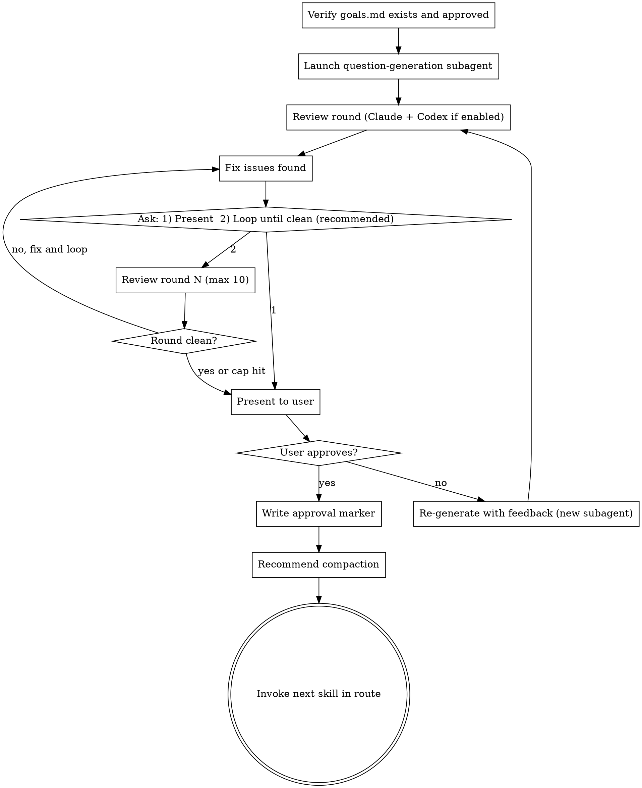

# Questions (QRSPI Step 2)

**Announce at start:** "I'm using the QRSPI Questions skill to generate research questions."

## Overview

Generate targeted research questions — query planning before any code is read. Separates "what we need to know" from "finding the answers," preventing unfocused research tangents. Questions are tagged by research type to dispatch the right specialist agents.

**Critical constraint:** Questions MUST NOT leak goals or intent. They should be neutral inquiries about how things work, not what we want to change.

## Artifact Gating

**Required inputs:**
- `goals.md` with `status: approved`

If `goals.md` doesn't exist or isn't approved, refuse to run and tell the user to complete the Goals step first.

Read `config.md` from the artifact directory to determine whether Codex reviews are enabled. If `config.md` doesn't exist, default to `codex_reviews: false`.

<HARD-GATE>
Do NOT generate questions without an approved goals.md.
Do NOT pass goals.md to any research subagent — research isolation is structural.
</HARD-GATE>

## Execution Model

**Subagent** (clean context). The subagent receives only `goals.md`.

## Process



### Question Generation Subagent

**Inputs:** `goals.md`

**Task:** Analyze goals to identify which codebase zones and external knowledge domains are relevant. Generate specific, objective research questions.

**Research type tags:**
- `[codebase]` — requires reading local code, tracing logic flows, understanding existing architecture
- `[web]` — requires web searches for competitors, existing tools, libraries, best practices, documentation
- `[hybrid]` — needs both local code reading and external research. Use ONLY when the question literally cannot be answered without both (e.g., "how does our auth token format compare to the JWT spec?"). Default to splitting into separate `codebase` and `web` questions instead.

**Goal leakage rules:**
- BAD: "We want to add real-time notifications — how do competitors handle this?" (leaks the goal)
- GOOD: "How do existing tools in this space handle real-time event delivery to clients?" (neutral inquiry)
- BAD: "How should we refactor the auth module?" (prescriptive)
- GOOD: "How does the auth module work? What are its dependencies and data flows?" (objective)

**Greenfield detection:** Run at the start of the question-generation subagent. Use the Glob tool with pattern `**/*.{ts,tsx,js,jsx,py,go,java,rs,rb,swift,kt,cs,cpp,c,h}`. If all results are inside `node_modules/`, `vendor/`, or `.git/` directories (or if there are zero results), treat this as a greenfield project — replace all `[codebase]` questions with `[web]` questions about existing solutions, frameworks, and best practices. If source files exist outside those directories, proceed normally.

**Output format for `questions.md`:**

```markdown
---
status: draft
---

# Research Questions

1. [codebase] How does the auth module work? What are its dependencies and data flows?
2. [web] What are the most common OAuth 2.0 libraries for Node.js? How do they compare?
3. [codebase] How are API endpoints registered and routed? Trace the request lifecycle.
4. [hybrid] How does our session token format compare to the JWT specification?
5. [web] What are current best practices for rate limiting in REST APIs?
```

### Review Round

After question generation, run one review round:

1. **Claude review subagent** — launch with `goals.md` + `questions.md` to check:
   - **Goal leakage check**: Do any questions reveal the user's intent, desired outcome, or planned changes? If a researcher reading only the questions could infer what we're trying to build, the questions leak too much. Flag and rewrite.
   - Are questions comprehensive? Do they cover all codebase zones implied by goals?
   - Are questions objective (asking "how does X work?" not "how should we change X?")?
   - Are research type tags appropriate for each question?
   - **Hybrid scrutiny**: Can any `[hybrid]` questions be split into separate `[codebase]` and `[web]` questions? Only approve `[hybrid]` when splitting would lose essential cross-referencing context.
   - Any redundant questions?
   - Any missing areas of investigation?
   
   The subagent returns structured findings. The orchestrating skill writes them to `reviews/questions-review.md`.

2. **Codex review** (if `config.md` has `codex_reviews: true`) — invoke `codex:rescue` with the artifact path (`questions.md`), input artifacts (`goals.md`) for cross-reference, and the same review criteria. The orchestrating skill appends Codex findings to `reviews/questions-review.md`.

3. Fix any issues found in both reviews.

4. Ask the user ONCE: `1) Present for review  2) Loop until clean (recommended)`
   - **1:** Proceed to human gate, but clearly state the review status: "Note: reviews found issues which were fixed but have not been re-verified in a clean round. The artifact may still have issues."
   - **2:** Loop autonomously — run review → fix → review → fix without re-prompting. Stop ONLY when a round is clean ("Reviews passed clean") or 10 rounds reached ("Hit 10-round review cap — presenting for your review."). Then proceed to human gate. **Do not re-ask between rounds.**
   
   **Default recommendation is always option 2.** Clean reviews before human review catch cross-reference inconsistencies that are hard to spot manually.

### Human Gate

Present `questions.md` to the user. **Always state the review status** when presenting: either "Reviews passed clean in round N" or "Reviews found issues in round N which were fixed but not re-verified."

On approval, if reviews have not passed clean, note this and ask if they'd like a review loop before finalizing. Then write `status: approved` in frontmatter.

On rejection, write the user's feedback to `feedback/questions-round-{NN}.md` (see using-qrspi Feedback File Format), then launch a new subagent with `goals.md` + rejected `questions.md` + **all** prior feedback files (not just the latest round). After re-generation, the review cycle restarts.

### Terminal State

Commit the approved `questions.md` and `reviews/questions-review.md` to git.

Recommend compaction: "Questions approved. This is a good point to compact context before the next step (`/compact`)."

**REQUIRED:** Invoke the next skill in the `config.md` route after `questions`.

## Red Flags — STOP

- A question reveals the user's intended solution ("how do competitors implement feature X that we want to add?")
- A question is prescriptive rather than exploratory ("how should we refactor X?" vs "how does X work?")
- A `[hybrid]` tag that could easily be split into `[codebase]` + `[web]`
- Questions only cover one research type (all codebase, no web, or vice versa) when the goals imply both
- Questions are too broad ("how does the app work?") or too narrow ("what's on line 42 of auth.ts?")
- Duplicate questions asking the same thing with different wording

## Common Rationalizations — STOP

| Rationalization | Reality |
|----------------|---------|
| "The questions are good enough" | Run the review. Goal leakage is subtle — you may not notice it yourself. |
| "This question needs to be hybrid" | Default to splitting. Only use hybrid when splitting loses essential cross-referencing. |
| "We don't need web research for this" | Even existing-codebase changes benefit from knowing current best practices. |
| "The goals don't imply any codebase questions" | If you're modifying code, you need to understand the existing code. Check again. |
| "I can combine these into fewer questions" | More specific questions get better research. Don't over-consolidate. |

## Worked Example

**Goal:** "Add per-client rate limiting to the public REST API"

**Good questions (no goal leakage):**

```markdown
1. [codebase] How does the Express middleware chain work? What middleware is currently registered and in what order?
2. [codebase] How are client identities resolved in the API? Is there an auth middleware that extracts client IDs?
3. [codebase] How does the application currently connect to and use Redis? What patterns are used for Redis operations?
4. [web] What are the current best practices for distributed rate limiting in Node.js applications?
5. [web] What Redis-based rate limiting algorithms exist (token bucket, sliding window, fixed window)? What are their trade-offs?
```

**Bad questions (goal leakage):**

```markdown
1. [codebase] Where should we add the rate limiting middleware?
2. [hybrid] How can we use our existing Redis connection to implement rate limiting?
3. [web] What's the best rate limiting library for Express that uses Redis?
```

The bad questions reveal intent ("add rate limiting middleware"), assume decisions ("use existing Redis"), and seek recommendations ("best library").
