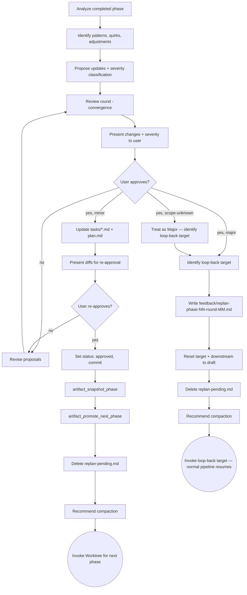

# Replan (QRSPI Step 9.5)

**Announce at start:** "I'm using the QRSPI Replan skill to update remaining tasks based on phase learnings."

## Overview

Subagent analyzes completed phase, proposes updates with severity classification. Runs between phases only — not at end of final phase. Orchestrator in main conversation.

## Iron Law

```
DO NOT CLASSIFY A MAJOR CHANGE AS MINOR TO SKIP THE BACKWARD LOOP
DO NOT CLASSIFY A SCOPE-UNKNOWN CHANGE AS MINOR
```

## Prompt Templates

```
replan/
└── SKILL.md
```

No prompt templates — the Replan subagent works from artifact files directly (phase code, fixes, reviews, remaining tasks, plan, design).

## Artifact Gating

Required inputs:

- Completed phase code (merged on feature branch)
- All issues found/fixed during phase (from `fixes/` and `reviews/`)
- Remaining task specs (next phase's `tasks/*.md`)
- `plan.md` with `status: approved`
- `design.md` with `status: approved` (phase boundary context and potential updates)
- `future-goals.md` (if present) — contains Formal goals (approved for future phases with IDs) and Ideas (informal suggestions from Test/Integrate human gates). Read before producing analysis. Formal goals inform phase promotion. Ideas are presented to user as optional additions. If file does not exist, skip silently.

Read `config.md` from the artifact directory to determine whether Codex reviews are enabled. If `config.md` doesn't exist, default to `codex_reviews: false`.

If any required artifact is missing or not approved, refuse to run and tell the user which artifact is needed.

<HARD-GATE>
Do NOT update approved artifacts without user approval of the proposed changes.
Do NOT classify a major change as minor to avoid the backward loop.
Do NOT classify a scope-unknown change as minor — default to most stringent treatment.
Do NOT skip the backward loop for major or scope-unknown changes — cascading re-approval is the invariant.
</HARD-GATE>

## Process



## Severity Classification

| Change type | Severity | Loop-back target | Examples |
|---|---|---|---|
| Task spec wording, LOC estimates, test expectations | **Minor** | None — update in place | "Task 7 needs an extra edge case test", "Task 9 LOC estimate should be ~400 not ~250" |
| Add/remove/split/merge tasks within existing slices | **Minor** | None — update plan.md + tasks | "Split Task 8 into 8a and 8b", "Add Task 12 for missed validation" |
| Reorder tasks or change dependencies | **Minor** | None — update plan.md | "Task 10 should run before Task 9" |
| Impact unclear, cross-cutting, or ambiguous scope | **Scope Unknown** | Treat as Major — use most stringent loop-back target | "This might affect file paths or it might not", "Unclear if this changes the API contract" |
| Change file paths or add files within existing slices | **Major** | Structure | "Need a new middleware file not in structure.md" |
| Change interfaces between components | **Major** | Structure | "The API contract for /entries needs a new field" |
| Change technology choice, approach, or architecture | **Major** | Design | "Switch from polling to WebSockets for real-time" |
| Change phase boundaries or slice definitions | **Major** | Design | "Move Task 8 from Phase 2 to Phase 3" |
| Change vertical slice decomposition | **Major** | Design | "Notifications should be its own slice, not part of the social slice" |
| Change project goals, acceptance criteria, or constraints | **Major** | Goals | "The MVP scope should include notifications, not just messaging" |
| Fundamental re-evaluation of project direction | **Major** | Goals | "We should target mobile-first instead of desktop-first" |

**Classification criteria for Scope Unknown:** Use when the impact of a change is unclear and you cannot confidently classify it as Minor or Major. Default to the most stringent treatment — treat as Major and identify the earliest plausible loop-back target. Do not guess Minor when scope is ambiguous.

**Key rule:** The loop-back target is the **earliest affected artifact**. If file paths change, loop back to Structure (which cascades to Plan). If architecture changes, loop back to Design (which cascades to Structure -> Plan). If goals or acceptance criteria change, loop back to Goals (which resets all artifacts to draft — the entire pipeline re-runs).

## Replan Subagent

**Inputs:** completed phase code, `fixes/` and `reviews/` directories, remaining `tasks/*.md`, `plan.md`, `design.md`

NO `goals.md` directly — the subagent reads the plan and design which already incorporate goals. (The review subagent reads `goals.md` directly for consistency checking — that is a separate subagent with different inputs.)

**Amendment handling:** When mapping amendment items to existing goals, verify the goal's acceptance criterion text actually describes the amendment's scope. If the goal text covers only part of the amendment, either expand the goal text or create a separate goal for the uncovered item. Never map an amendment to a goal whose criterion text doesn't describe it.

**Task:**

1. Analyze patterns, framework quirks, architectural adjustments discovered during phase
2. Propose updates to remaining task specs (reorder, split, merge, modify)
3. Classify each change using severity table
4. If any major change, identify the loop-back target

### Roadmap Usage

During phase transitions, Replan reads `roadmap.md` to determine which goals belong to the next phase. Goals for the next phase are promoted from `future-goals.md` (Formal section) into a fresh `goals.md`. The roadmap's current phase pointer is advanced. Each downstream skill checks `future-design.md` and `future-research/` for pre-existing work on promoted goals (pull model, not push).

## Review Round

- **Claude review subagent:** verify proposed changes are consistent with goals (read `goals.md` for this check), don't introduce contradictions, severity classification is correct
- **Codex review** (if enabled in `config.md`): same criteria
- Fix issues, ask user `1) Present  2) Loop until clean (recommended)`, loop or present (max 10 rounds — this is the standard using-qrspi review loop cap, distinct from the 3-round convergence in Pattern 1/2)
- Write findings to `reviews/replan-review.md`

## Human Gate — Minor Changes

User reviews proposed changes and severity classifications. User can override any classification.

If all changes are minor: Update `tasks/*.md` and `plan.md` in place, reset status to `status: replan-draft`, present diffs for re-approval.

On re-approval: set status back to `status: approved`, commit.

### Phase Snapshot

After re-approval on the minor path, snapshot the completed phase before promoting:

1. Call `artifact_snapshot_phase <artifact_dir> <completed_phase_number>` — creates a read-only copy of all core artifacts and task files under `phases/phase-NN/`
2. Call `artifact_promote_next_phase <artifact_dir> <completed_phase_number>` — deletes phase-scoped files (structure.md, plan.md, tasks/, reviews/, feedback/, .qrspi/) and resets remaining artifact frontmatter to `status: draft`
3. Present summary to user: which files were snapshotted, which were deleted, which were reset

Phase snapshots do NOT happen on the major backward-loop path. Major changes trigger a cascade reset through the normal pipeline, which produces new artifacts from scratch — snapshotting stale artifacts before a major redesign would be misleading.

On rejection: write feedback to `feedback/replan-minor-phase-NN-round-MM.md` (note: `minor` prefix distinguishes from major loop-back feedback files), revise proposals.

## Human Gate — Major Changes

Identify earliest loop-back target (Goals, Design, or Structure).

Write replan proposals to `feedback/replan-phase-NN-round-MM.md` with: what changed, why, phase learnings. Primary input for loop-back skill. Proposed changes described here, NOT applied to artifacts directly.

Reset target artifact and all downstream artifacts to `status: draft`. Includes both main artifacts AND their outputs: loop to Goals resets all artifacts (`goals.md`, `questions.md`, `research/summary.md`, `design.md`, `structure.md`, `plan.md`, all `tasks/task-NN.md`, and `parallelization.md`); loop to Design resets `design.md`, `structure.md`, `plan.md`, all `tasks/task-NN.md`, and `parallelization.md`; loop to Structure resets `structure.md`, `plan.md`, all `tasks/task-NN.md`, and `parallelization.md`. No content changes — just status reset. (Task files and `parallelization.md` must be reset because Plan and Worktree will re-produce them during the cascade.)

Recommend compaction before invoking target skill.

- **Loop back to Goals:** Invoke `qrspi:goals` with normal inputs + all `feedback/replan-phase-*-round-*.md` files
- **Loop back to Design:** Invoke `qrspi:design` with normal inputs + all `feedback/replan-phase-*-round-*.md` files
- **Loop back to Structure:** Invoke `qrspi:structure` with normal inputs + all `feedback/replan-phase-*-round-*.md` files

**Fire-and-forget:** After writing the feedback file and resetting statuses, Replan invokes the loop-back target skill directly and exits. The normal pipeline terminal state routing takes over — Design invokes Structure, Structure invokes Plan, Plan invokes Worktree. Replan does not orchestrate the cascade or maintain control. Each downstream skill picks up the feedback file as additional input through its normal process.

**Minor changes alongside major:** Include all minor changes in the feedback file alongside the major proposals. Plan will incorporate them when it re-produces task specs during the cascade. No separate apply step is needed — the feedback file is the single communication channel.

## Artifacts

- `reviews/replan-review.md` — review subagent findings on proposed changes and severity classifications
- `feedback/replan-phase-NN-round-MM.md` — replan proposals for backward loops (major changes)
- `feedback/replan-minor-phase-NN-round-MM.md` — rejection feedback for minor change revisions

## Terminal State

**Minor path:** Delete `replan-pending.md`, recommend compaction, invoke `qrspi:worktree` for next phase.

**Major path:** Delete `replan-pending.md`, recommend compaction, invoke the loop-back target skill (Design or Structure). Replan exits — the normal pipeline takes over from the loop-back target forward. The `replan-pending.md` deletion happens before the loop-back invocation because Replan's analytical work is complete; the cascade is standard pipeline execution.

## Model Selection Guidance

| Task complexity | Recommended model |
|-----------------|-------------------|
| Replan subagent | Most capable (opus) — cross-phase reasoning and severity classification |
| Review subagent | Standard (sonnet) — checking consistency |
| Artifact updates (minor) | Fast (haiku) — mechanical status/content changes |

## Task Tracking (TodoWrite)

Sub-tasks for Replan:

1. Read `config.md` for Codex review setting
2. Analyze completed phase
3. Propose updates with severity classification
4. Run review round
5. Present changes to user
6. Minor: apply updates, re-approval cycle / Major: write feedback, reset statuses
7. Delete `replan-pending.md`
8. Minor: invoke Worktree / Major: invoke loop-back target (pipeline resumes)

## Red Flags — STOP

- Classifying a major change as minor to skip the backward loop
- Updating approved artifacts without presenting proposals to user first
- Skipping the backward loop because "the change is small"
- Applying proposed changes directly to artifacts before user approval (major path)
- Running Replan at end of final phase (Test handles final phase — PR, not Replan)
- Skipping severity classification for a proposed change

## Common Rationalizations — STOP

| Rationalization | Reality |
|----------------|---------|
| "This file path change is minor" | File paths change Structure. That's major by definition. |
| "The interface change is backward compatible" | Interface changes affect Structure. Major, regardless of compatibility. |
| "We can skip the cascade, the downstream artifacts are still valid" | Cascade re-approval is the invariant. Every dependent artifact must be reviewed. |
| "This is just a wording change to design.md" | If you're changing design.md, you're in a major loop-back. The severity table governs, not your judgment. |
| "Replan isn't needed, the phase went smoothly" | If Test invoked Replan, more phases remain. Review remaining tasks for accuracy even if no changes are needed — confirm explicitly. |
| "I can apply the changes and show diffs later" | Present proposals first, get approval, then apply. The user reviews intent before execution. |
| "The scope is unclear but it's probably minor" | Unclear scope = Scope Unknown. Default to the most stringent treatment. |

## Clarifying Amendments

Clarifying amendments are changes to approved artifacts that refine wording, fix ambiguity, or add detail without changing intent. They are distinct from Replan proposals because they don't arise from phase learnings — they arise from noticing that an artifact could be clearer.

### Amendment Classification

| Type | Description | Cascade behavior | Example |
|---|---|---|---|
| **Clarifying** | Refines wording or fixes ambiguity without changing intent | `--skip-cascade` — no downstream reset | "Change 'handle errors' to 'return HTTP 4xx on validation failure'" |
| **Additive** | Adds new detail that doesn't contradict existing content | `--skip-cascade` — no downstream reset | "Add acceptance criterion: 'must support pagination'" |
| **Architectural** | Changes intent, structure, or approach | Full cascade — treat as Replan Major | "Change 'REST API' to 'GraphQL'" — this is NOT an amendment, route through Replan |

### Rationale Presentation

Before applying any amendment, present to the user:

1. **Diff:** Show the exact text change (old vs new)
2. **Classification:** Clarifying, Additive, or Architectural
3. **Rationale:** Why this amendment improves the artifact
4. **Confirm/Reject:** User must explicitly approve before application

If the user classifies an amendment as Architectural, stop and route through the normal Replan process instead.

### Application

After user approval:

1. Apply the text change to the artifact file
2. Call `pipeline_cascade_reset <step> <artifact_dir> --skip-cascade` — this resets only the amended artifact's state to draft, leaving downstream artifacts untouched
3. Log the amendment in the artifact's frontmatter or a dedicated amendment log

### Amendment Log Format

Append to the artifact file, inside the frontmatter:

```yaml
amendments:
  - date: YYYY-MM-DD
    type: clarifying|additive
    summary: "Brief description of what changed"
```

This log provides an audit trail of refinements without polluting the main content. Architectural changes are never logged here — they go through Replan and produce feedback files.

## Worked Example — Good (Minor)

Phase 1 completed. Replan subagent analyzes the phase:

```markdown
## Replan Analysis — Phase 1 Complete

### Change 1: Extra edge case test for Task 7
- **What:** Task 7 (notification delivery) needs a test for empty notification body
- **Why:** Phase 1 revealed that the notification renderer crashes on empty body — edge case not in original spec
- **Severity:** Minor — task spec wording update, no structural changes
- **Action:** Add test expectation to tasks/task-07.md

### Change 2: LOC estimate update for Task 8
- **What:** Task 8 LOC estimate should be ~400 not ~250
- **Why:** The auth middleware discovered in Phase 1 requires more boilerplate than estimated
- **Severity:** Minor — LOC estimate adjustment only
- **Action:** Update LOC estimate in tasks/task-08.md

### Change 3: Split Task 9 into 9a and 9b
- **What:** Task 9 (user profile CRUD) should split into 9a (read/list) and 9b (create/update/delete)
- **Why:** Phase 1 showed the validation layer is more complex than expected — splitting keeps tasks under 300 LOC
- **Severity:** Minor — task split within existing slice, no structural changes
- **Action:** Split tasks/task-09.md into tasks/task-09a.md and tasks/task-09b.md, update plan.md task list
```

**Result:** All changes are minor. Update `tasks/*.md` and `plan.md` in place, set `status: replan-draft`, present diffs to user. User re-approves, set `status: approved`, commit. Delete `replan-pending.md`. Invoke Worktree for Phase 2.

## Worked Example — Good (Major)

Phase 1 completed. Replan subagent analyzes the phase:

```markdown
## Replan Analysis — Phase 1 Complete

### Change 1: Switch from polling to WebSockets for real-time updates
- **What:** The notification system uses polling (design.md specifies 5-second interval), but Phase 1 revealed this causes unacceptable latency for the chat feature in Phase 2
- **Why:** Chat messages delivered with 0-5 second delay breaks the UX. WebSockets provide sub-100ms delivery.
- **Severity:** Major — technology choice change affects architecture
- **Loop-back target:** Design (architecture change)

### Change 2: Extra edge case test for Task 7
- **What:** Task 7 needs a test for empty notification body
- **Why:** Phase 1 revealed the renderer crashes on empty body
- **Severity:** Minor — task spec wording update
```

**Result:** One major change present. Loop-back target is Design (earliest affected artifact).

Write feedback file:

```markdown
# feedback/replan-phase-01-round-01.md

## Phase 1 Learnings

### WebSocket requirement
- Polling at 5-second intervals causes 0-5s latency for chat messages
- Chat UX requires sub-100ms delivery
- Proposed change: replace polling with WebSocket connections for real-time features
- Affects: design.md (architecture), structure.md (new WebSocket server file), plan.md (task dependencies)

### Minor changes (incorporated by Plan during cascade)
- Task 7: add empty body edge case test
```

Reset `design.md`, `structure.md`, `plan.md`, all `tasks/task-NN.md`, and `parallelization.md` to `status: draft`. Delete `replan-pending.md`. Recommend compaction. Invoke `qrspi:design` with normal inputs + `feedback/replan-phase-01-round-01.md`. Replan exits.

Normal pipeline takes over: Design re-reviews (incorporating WebSocket requirement + minor Task 7 change from feedback) → Structure → Plan (incorporates the Task 7 edge case test when re-producing task specs) → Worktree → Phase 2 begins.

## Worked Example — Bad

```markdown
## Replan Analysis — Phase 1 Complete

Some things need to change for Phase 2. The notification system should probably use WebSockets instead of polling. Also Task 8 might need splitting. Updated tasks/task-08.md and plan.md with the changes.
```

**Why this fails:**
- No severity classification — "should probably use WebSockets" is a Major architecture change but isn't classified
- No per-change structure — changes are lumped together without individual analysis
- Changes applied directly to artifacts ("Updated tasks/task-08.md and plan.md") without user approval — HARD GATE violation
- No loop-back identified for the WebSocket change — interface and architecture changes require backward loops
- No phase learnings or rationale — "some things need to change" provides no reasoning for the proposals
- No feedback file written for the major change — the backward loop has no input to work from

<BEHAVIORAL-DIRECTIVES>
These directives apply at every step of this skill, regardless of context.

D1 — Encourage reviews after changes: After any significant change to an artifact (whether from feedback, a fix round, or a re-run), recommend a review before proceeding. Reviews catch regressions that are invisible during forward-only execution.

D2 — Never suggest skipping steps for speed. Do not offer shortcuts, suggest merging steps, or imply steps can be skipped to save time.

D3 — There is no time crunch. LLMs execute orders of magnitude faster than humans. There is no benefit to skipping LLM-driven steps — reviews, synthesis passes, and validation rounds cost seconds. Reassure the user that thoroughness is free. If the user signals urgency, acknowledge the constraint and offer the fastest compliant path — never a non-compliant shortcut.
</BEHAVIORAL-DIRECTIVES>
