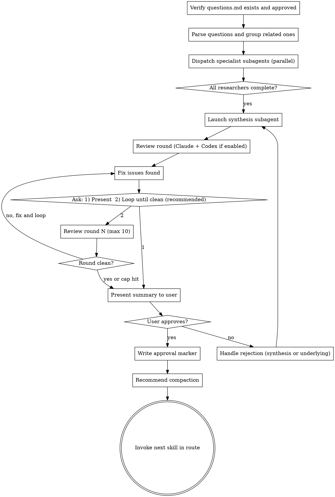

# Research (QRSPI Step 3)

**Announce at start:** "I'm using the QRSPI Research skill to investigate the research questions."

## Overview

Objective exploration driven by the research questions. Gathers facts, not opinions. Each question gets a focused specialist agent with the right tools for its research type. Research isolation is structural — no research subagent ever sees `goals.md`.

## Artifact Gating

**Required inputs:**
- `questions.md` with `status: approved`

If `questions.md` doesn't exist or isn't approved, refuse to run and tell the user to complete the Questions step first.

Read `config.md` from the artifact directory to determine whether Codex reviews are enabled. If `config.md` doesn't exist, default to `codex_reviews: false`.

<HARD-GATE>
Do NOT pass goals.md to ANY research subagent, including the synthesis subagent.
Research isolation is structural — this is not optional, not a judgment call.
If a subagent prompt contains goals.md content, the isolation invariant is broken.
</HARD-GATE>

## Execution Model

**Parallel specialist subagents** (ISOLATED — structurally enforced). One subagent per question (or per small group of related questions). A synthesis subagent combines findings at the end.

**CRITICAL: `goals.md` is deliberately withheld from ALL research subagents.** This is enforced structurally — subagent prompts contain only the question(s) assigned to them. `goals.md` is never passed to any research subagent, including the synthesis subagent. This prevents confirmation bias.

## Process



### Dispatch

1. Parse `questions.md` — extract each numbered question with its research type tag
2. Group related questions (e.g., two questions about the same subsystem) to avoid redundant exploration
3. Dispatch specialist subagents based on research type tags:

| Research Type | Agent Tools | Focus |
|--------------|-------------|-------|
| `[codebase]` | File read, grep, glob | Read code, trace logic flows, map architecture. Report `file:line` references. |
| `[web]` | Web search, web fetch | Search competitors, libraries, best practices, docs. Report URLs and sources. |
| `[hybrid]` | All tools | Compare local implementation against external standards/alternatives. |

4. Independent questions run in **parallel** subagents (use the Agent tool with multiple concurrent calls)
5. Each subagent writes findings to `research/q{NN}-{type}.md`

### Per-Researcher Subagent

**Inputs:** Only the assigned question(s) from `questions.md`. NO `goals.md`.

**Subagent prompt template:**

```
You are a research agent. Your task is to answer the following research question(s) with objective, factual findings.

## Rules
- Report what IS, not what SHOULD BE
- Facts only — no opinions, recommendations, or suggestions
- Use "Query Planning" — plan what to search for before searching
- {For codebase}: Include specific file:line references
- {For web}: Include URLs and source attribution

## Question(s)
{The assigned question(s) from questions.md}

## Output
Write your findings as a markdown document. Organize by question if you have multiple.
```

### Synthesis Subagent

After all per-question research completes, launch a synthesis subagent:

**Inputs:** All `research/q*.md` files. NO `goals.md`.

**Task:** Read all per-question findings and produce `research/summary.md` — a unified research document organized by question with cross-references between related findings.

**Output format for `research/summary.md`:**

```markdown
---
status: draft
---

# Research Summary

## Q1: {question text}
{Synthesized findings from q01-*.md}

## Q2: {question text}
{Synthesized findings from q02-*.md}

...

## Cross-References
- {Notable connections between findings from different questions}
```

### Review Round

After synthesis, run one review round:

1. **Claude review subagent** — launch with all `research/q*.md` files + `research/summary.md` (NO `questions.md` — maintains research isolation) to check:
   - Is the research objective? Any opinions or recommendations that snuck in?
   - Are there factual gaps — questions that weren't fully answered?
   - Is anything stated as fact that's actually an inference?
   - Are codebase references specific (`file:line`)?
   - Are web sources cited with URLs?
   - Does the synthesis accurately represent the per-question findings?
   
   The subagent returns structured findings. The orchestrating skill writes them to `reviews/research-review.md`.

2. **Codex review** (if `config.md` has `codex_reviews: true`) — invoke `codex:rescue` with the artifact path (`research/summary.md`), input artifacts (`research/q*.md` — `questions.md` excluded for isolation), and the same review criteria. The orchestrating skill appends Codex findings to `reviews/research-review.md`.

3. Fix any issues found in both reviews.

4. Ask the user ONCE: `1) Present for review  2) Loop until clean (recommended)`
   - **1:** Proceed to human gate, but clearly state the review status: "Note: reviews found issues which were fixed but have not been re-verified in a clean round. The artifact may still have issues."
   - **2:** Loop autonomously — run review → fix → review → fix without re-prompting. Stop ONLY when a round is clean ("Reviews passed clean") or 10 rounds reached ("Hit 10-round review cap — presenting for your review."). Then proceed to human gate. **Do not re-ask between rounds.**
   
   **Default recommendation is always option 2.** Clean reviews before human review catch cross-reference inconsistencies that are hard to spot manually.

### Rejection Behavior

Because Research involves multiple subagents, rejection has two paths depending on user feedback. In both cases, write the user's feedback to `feedback/research-round-{NN}.md` (see using-qrspi Feedback File Format). Include which rejection path the user chose in the feedback file.

1. **Synthesis problem** ("the summary misrepresents Q3's findings"):
   - Re-run only the synthesis subagent with the same per-question findings + pass **all** prior feedback files

2. **Underlying research problem** ("Q3's findings are incomplete — the researcher missed the auth module"):
   - Re-run only the specific researcher(s) whose findings were problematic, passing **all** prior feedback files
   - Then re-run synthesis with the updated findings

Ask the user which path applies when they reject.

### Human Gate

Present `research/summary.md` to the user. Note that this is ~200 lines — much easier to review than code. **Always state the review status** when presenting: either "Reviews passed clean in round N" or "Reviews found issues in round N which were fixed but not re-verified."

On approval, if reviews have not passed clean, note this and ask if they'd like a review loop before finalizing. Then write `status: approved` in frontmatter.

### Terminal State

Commit the approved `research/summary.md`, all `research/q*.md` files, and `reviews/research-review.md` to git.

Recommend compaction: "Research approved. This is a good point to compact context before the next step (`/compact`)."

**REQUIRED:** Invoke the next skill in the `config.md` route after `research`.

## Red Flags — STOP

- A research finding contains opinions ("X is better than Y", "you should use Z")
- A finding states recommendations instead of facts ("the best approach is...")
- Codebase references are vague ("somewhere in the auth module") instead of specific (`auth/middleware.ts:45-67`)
- Web sources are uncited (no URLs)
- A finding answers a question that wasn't asked (scope creep from the researcher)
- The synthesis adds interpretive spin not present in the per-question findings
- goals.md content appears in any subagent prompt

## Common Rationalizations — STOP

| Rationalization | Reality |
|----------------|---------|
| "The researcher needs goals for context" | No. Research isolation prevents confirmation bias. The questions provide all the context needed. |
| "This opinion is well-supported" | Opinions are for Design, not Research. Report the facts and let Design interpret. |
| "The synthesis is just summarizing" | Summaries can introduce bias through emphasis. Synthesis must accurately represent per-question findings without editorial. |
| "One researcher can answer multiple questions" | Group related questions only. Over-consolidation reduces depth. |
| "The web research is thorough enough without URLs" | Uncited claims are unverifiable. Every web finding needs a source URL. |

## Worked Example

**Good research finding (objective, factual):**

> ## Q4: What Redis-based rate limiting algorithms exist?
>
> Three common algorithms:
>
> **Fixed Window** — Count requests in fixed time intervals. Simple but allows bursts at window boundaries. Used by GitHub API (https://docs.github.com/en/rest/rate-limit).
>
> **Sliding Window Log** — Store timestamp of each request, count within sliding window. Precise but memory-intensive (O(n) per client). Described in https://blog.cloudflare.com/counting-things-a-lot-of-different-things/.
>
> **Token Bucket** — Tokens added at fixed rate, consumed per request. Allows controlled bursts. Used by AWS API Gateway (https://docs.aws.amazon.com/apigateway/latest/developerguide/api-gateway-request-throttling.html). The `rate-limiter-flexible` npm package (https://github.com/animir/node-rate-limiter-flexible) implements this with Redis backend.

**Bad research finding (opinionated):**

> ## Q4: Rate limiting algorithms
>
> You should use the Token Bucket algorithm because it's the best approach for APIs. Fixed window is outdated and sliding window is too complex.

The bad example makes recommendations ("you should"), value judgments ("best", "outdated", "too complex"), and cites no sources.
