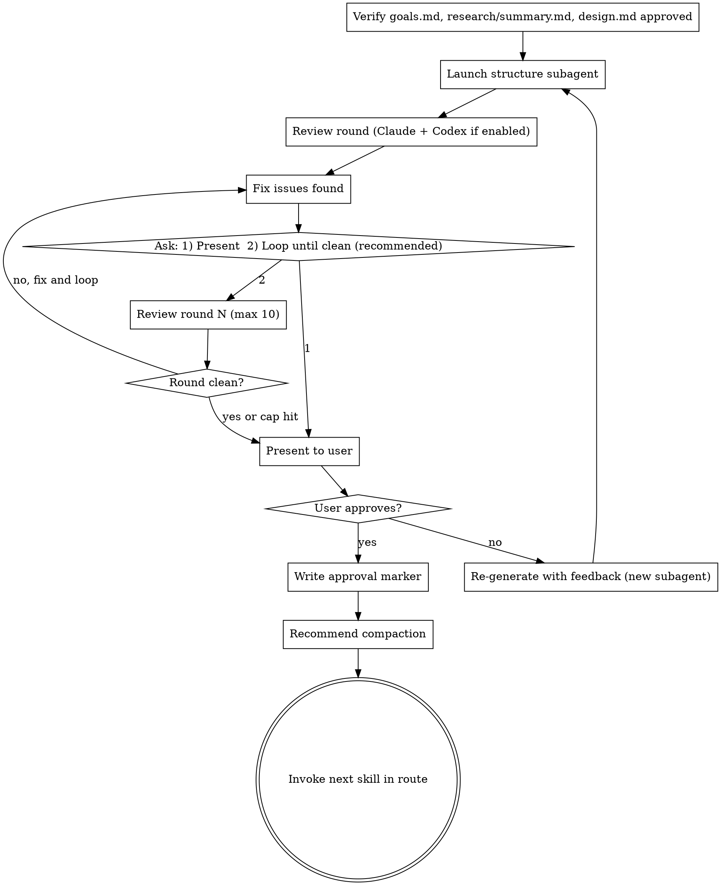

# Structure (QRSPI Step 5)

**Announce at start:** "I'm using the QRSPI Structure skill to map the design to files and interfaces."

## Overview

Map the design's vertical slices to specific files, components, and interfaces. Define what gets created vs modified, show how slices map to the stack, and produce a detailed architectural diagram. This is the bridge between abstract design and concrete implementation.

## Artifact Gating

**Required inputs:**
- `goals.md` with `status: approved`
- `research/summary.md` with `status: approved`
- `design.md` with `status: approved`

If any artifact is missing or not approved, refuse to run and tell the user which artifact is needed.

Read `config.md` from the artifact directory to determine whether Codex reviews are enabled. If `config.md` doesn't exist, default to `codex_reviews: false`.

<HARD-GATE>
Do NOT produce structure.md without approved goals.md, research/summary.md, AND design.md.
Do NOT proceed to Plan without user approval of the structure.
</HARD-GATE>

## Execution Model

**Subagent per round** (iterative with human feedback). Each round is a fresh subagent with declared inputs + any feedback from prior rounds.

## Process



### Structure Subagent

**Inputs:**
- `goals.md`
- `research/summary.md`
- `design.md`
- Any prior feedback files

**Task:** Map the design to concrete files and interfaces.

1. Map each vertical slice from `design.md` to specific files and components
2. For each slice, show which layers of the stack it touches and what files are involved
3. Define interfaces between components (function/class signatures, not implementations)
4. Identify create vs modify for each file
5. Detailed Mermaid architectural diagram: file/module layout, API endpoints, data flow, interface boundaries
6. If CI setup noted in Design, define pipeline structure (workflow file, test commands, lint config) and project convention files (CLAUDE.md, linting config, etc.) for greenfield projects

**Output format for `structure.md`:**

````markdown
---
status: draft
---

# Structure: {Project/Feature Name}

## File Map

### Slice 1: {name}
| File | Action | Responsibility |
|------|--------|---------------|
| `path/to/file.ts` | Create | {what it does} |
| `path/to/existing.ts` | Modify | {what changes} |

### Slice 2: {name}
...

## Interfaces

### {Component A} → {Component B}
```typescript
// path/to/interface.ts
interface FooService {
  bar(input: BarInput): Promise<BarOutput>;
}
```

## Architectural Diagram
{Detailed Mermaid diagram}

## CI Pipeline (if needed)
{Workflow file structure, test commands, lint config}
````

### Review Round

After the structure subagent completes, run one review round:

1. **Claude review subagent** — launch with `structure.md`, `goals.md`, `research/summary.md`, `design.md` to check:
   - Does structure match the design?
   - Does each vertical slice map cleanly to files/components?
   - Any missing components?
   - Any unnecessary components (YAGNI)?
   - Are interfaces well-defined?
   - Do modifications to existing files conflict with current codebase patterns?
   
   The subagent returns structured findings. The orchestrating skill writes them to `reviews/structure-review.md`.

2. **Codex review** (if `config.md` has `codex_reviews: true`) — invoke `codex:rescue` with the artifact path (`structure.md`), input artifacts (`goals.md`, `research/summary.md`, `design.md`) for cross-reference, and the same review criteria. The orchestrating skill appends Codex findings to `reviews/structure-review.md`.

3. Fix any issues found in both reviews.

4. Ask the user ONCE: `1) Present for review  2) Loop until clean (recommended)`
   - **1:** Proceed to human gate, but clearly state the review status: "Note: reviews found issues which were fixed but have not been re-verified in a clean round. The artifact may still have issues."
   - **2:** Loop autonomously — run review → fix → review → fix without re-prompting. Stop ONLY when a round is clean ("Reviews passed clean") or 10 rounds reached ("Hit 10-round review cap — presenting for your review."). Then proceed to human gate. **Do not re-ask between rounds.**
   
   **Default recommendation is always option 2.** Clean reviews before human review catch cross-reference inconsistencies that are hard to spot manually.

### Human Gate

Present `structure.md` to the user — "hammer on it" review point alongside Design. **Always state the review status** when presenting: either "Reviews passed clean in round N" or "Reviews found issues in round N which were fixed but not re-verified."

When presenting Mermaid diagrams (dependency graphs, architectural diagrams, parallelization plans), write the diagram to the artifact file (e.g., `structure.md` for architecture diagrams, `parallelization.md` for dependency graphs) and direct the user to open the file. Do not paste raw Mermaid syntax into terminal output — it renders as unreadable text in the terminal. Tell the user: "The architecture diagram is in `structure.md` — open it to view the rendered diagram."

On approval, if reviews have not passed clean, note this and ask if they'd like a review loop before finalizing. Then write `status: approved` in frontmatter.

On rejection, write the user's feedback and the rejected artifact snapshot to `feedback/structure-round-{NN}.md` (using the standard feedback file format from `using-qrspi`), then launch a new subagent with original inputs + **all** prior feedback files (not just the latest round). After re-generation, the review cycle restarts.

### Artifact

`structure.md` — file-level and function-level breakdown organized by vertical slice, with interface definitions, Mermaid architectural diagram, CI pipeline structure if needed

### Terminal State

Commit the approved `structure.md` and `reviews/structure-review.md` to git.

Recommend compaction: "Structure approved. This is a good point to compact context before the next step (`/compact`)."

**REQUIRED:** Invoke the next skill in the `config.md` route after `structure`.

## Red Flags — STOP

- A file mentioned in the design has no entry in the file map
- An interface definition doesn't match between caller and callee
- A file is marked "Modify" but doesn't exist in the codebase
- A file is marked "Create" but already exists in the codebase
- Slices in the file map don't match slices in the design
- Missing Mermaid architectural diagram
- CI pipeline structure is needed (greenfield or no existing CI) but not defined
- Interfaces use placeholder types ("any", "object", "TBD")
- Pasting Mermaid diagram syntax directly into terminal output (user cannot read it)

## Common Rationalizations — STOP

| Rationalization | Reality |
|----------------|---------|
| "The interfaces are obvious from the file names" | Write them explicitly. The Plan skill uses interfaces to define task boundaries. |
| "I'll figure out the exact files during implementation" | Structure IS the file decision. Deferring to implementation means the plan will be wrong. |
| "This file is too small to list" | If it's in the design, it's in the structure. Every file needs an entry. |
| "The existing codebase doesn't have clear interfaces" | Then define them. Structure is the opportunity to introduce clarity. |
| "CI can be set up later" | CI is Task 1 of Phase 1 (per Design). It blocks everything else. |

## Worked Example

**Good file map entry:**

> ### Slice 1: Client rate check
> | File | Action | Responsibility |
> |------|--------|---------------|
> | `src/middleware/rate-limiter.ts` | Create | Express middleware that checks Redis for client rate, returns 429 if exceeded |
> | `src/services/redis-client.ts` | Modify | Add rate limit increment/check methods to existing Redis wrapper |
> | `src/types/rate-limit.ts` | Create | RateLimitConfig, RateLimitResult interfaces |
> | `tests/middleware/rate-limiter.test.ts` | Create | Unit tests for rate limiting middleware |

**Bad file map entry (vague):**

> ### Rate Limiting
> | File | Action | Responsibility |
> |------|--------|---------------|
> | `src/middleware/` | Create | Rate limiting stuff |
> | Various | Modify | Update as needed |

The bad example uses directory paths instead of files, and "various" is not an action plan.

<BEHAVIORAL-DIRECTIVES>
These directives apply at every step of this skill, regardless of context.

D1 — Encourage reviews after changes: After any significant change to an artifact (whether from feedback, a fix round, or a re-run), recommend a review before proceeding. Reviews catch regressions that are invisible during forward-only execution.

D2 — Complete every step before moving on: Every process step in this skill exists for a reason. Execute each step fully. If a step seems redundant given the current state, state why and ask the user — do not silently skip it.

D3 — Resist time-pressure shortcuts: If the user signals urgency ("just move on," "skip the review this time"), acknowledge the constraint and offer the fastest compliant path. Do not use urgency as justification to skip required steps.
</BEHAVIORAL-DIRECTIVES>
