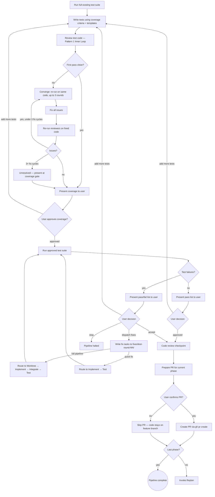

# Test (QRSPI Step 9)

**Announce at start:** "I'm using the QRSPI Test skill to run acceptance testing against the original goals."

## Overview

Final acceptance testing for the current phase. Verify implementation meets goals end-to-end. The test-writer subagent (clean context) writes tests and produces a coverage analysis. The orchestrating skill (main conversation) runs the tests, manages the review loop, writes fix task descriptions for failures, and handles phase routing. Fix task descriptions are written by the orchestrator based on test failure output — not by the test-writer subagent.

## Iron Law

```
NO PRODUCTION CODE FIXES IN THE TEST SKILL — ROUTE THROUGH THE PIPELINE
```

## Prompt Templates

```
test/
├── SKILL.md
└── templates/
    ├── test-writer.md
    ├── acceptance-test.md
    ├── integration-test.md
    ├── e2e-test.md
    └── boundary-test.md
```

## Artifact Gating

Required inputs:
- `goals.md` with `status: approved` (original intent)
- `design.md` with `status: approved` (full pipeline only — phase definitions and acceptance context)
- `research/summary.md` with `status: approved` (quick fix only — provides design-like context)
- `fixes/` directory contents (for regression test coverage — may be empty if no prior fixes)
- Codebase with implementation merged

In quick fix mode, Test receives `goals.md` and `research/summary.md` instead of `design.md`. Phase routing is not needed (quick fix is always single-phase), and acceptance criteria come directly from `goals.md`.

<HARD-GATE>
The tester can ONLY write test files and run test commands.
When tests fail, output fix task descriptions — NOT code fixes.
All production code changes route through the pipeline:
- Full pipeline: Worktree → Implement → Integrate → Test (for pipeline: full fixes)
- Quick fix within full pipeline: Implement → Test (for pipeline: quick fixes — Deviation #13)
- Quick fix mode: Implement → Test (all fixes are pipeline: quick)
Test files written by the tester are exempt from this gate — they are verified by execution, not code review.
</HARD-GATE>

## Coverage Criteria

The test-writer subagent uses these rules to determine what tests to write:

1. **Every acceptance criterion** in `goals.md` maps to at least one test
2. **Happy path, error path, and edge cases** for each criterion
3. **Cross-slice interactions** — data flowing between vertical slices
4. **Boundaries** — invalid input, empty state, max limits, auth boundaries
5. **Regression** — any bugs found during implementation (from fix task history in `fixes/`)

## Test Types

| Type | When to write | What it proves | Template |
|------|--------------|----------------|----------|
| Acceptance | Every `goals.md` criterion | Feature works as specified | `acceptance-test.md` |
| Integration | Cross-slice data flow | Components work together correctly | `integration-test.md` |
| E2E | Critical user journeys | Full stack works end-to-end | `e2e-test.md` |
| Boundary | Edge cases from task specs + goals | System handles limits gracefully | `boundary-test.md` |

The test-writer chooses the appropriate type(s) per acceptance criterion. A single criterion may need multiple test types (e.g., "user can register" needs an acceptance test for the happy path, a boundary test for invalid email, and an integration test for the DB write).

## Process



## Process Steps

1. **Run full existing test suite** — establish baseline. If tests fail, present failures to user (Pattern 3 — deterministic, don't re-run). User decides:
   - **Dispatch fixes:** Write fix tasks for the baseline failures (same format as test fix tasks), route through the fix pipeline before writing new tests.
   - **Proceed anyway:** Log failures to `reviews/test/baseline-failures.md`. New acceptance tests will run alongside known failures.
   - **Stop:** Halt pipeline.
2. **Write tests** using coverage criteria and test type templates. The test-writer subagent analyzes `goals.md` acceptance criteria, identifies which test types each criterion needs, and writes tests accordingly. Each test maps to a specific acceptance criterion.
3. **Review test code** — follows **Review Pattern 1 (Inner Loop)** with 3 reviewers (reusing Implement's template files):
   - **goal-traceability-reviewer** (`implement/templates/thoroughness/goal-traceability-reviewer.md`): Does each test map to a specific acceptance criterion from `goals.md`? Are any criteria untested?
   - **spec-reviewer** (`implement/templates/correctness/spec-reviewer.md`): Does the test verify what it claims to? Are assertions meaningful, not vacuous?
   - **code-quality-reviewer** (`implement/templates/correctness/code-quality-reviewer.md`): Is the test reliable? Flaky setup? Race conditions? Proper cleanup?
   - First pass clean → proceed to coverage gate. Issues found → converge, fix all, re-converge. Up to 3 fix cycles — if unresolved, present to user at coverage gate. Test code fixes stay inside the Test skill — not production code, so the HARD GATE doesn't apply.
4. **Coverage approval gate** — present to user:
   - Tests written (grouped by type: acceptance, integration, E2E, boundary)
   - Coverage reasoning: which acceptance criteria are covered, by which tests
   - Identified gaps: criteria or flows that are hard to test automatically, or where coverage is thin
   - User decides: **approve** (proceed to run) or **add more tests** (user describes what's missing → back to step 2)
5. **Run the approved test suite** — deterministic, run once.
6. **Present results** — complete pass/fail list. User can always request more tests. User decides:
   - **Add more tests:** User identifies missing test scenarios → back to step 2
   - **Dispatch fix tasks:** Send failing tests to the fix pipeline (only if failures)
   - **Accept/Approve:** Proceed to phase routing
   - **Stop:** Halt pipeline

## Test Fix Loop

**Classify each failure** (full pipeline mode only) as quick fix or full pipeline:

| Signal | Quick fix | Full pipeline |
|---|---|---|
| Files involved | 1-2 files, identifiable from error | 3+ files or unclear scope |
| Fix complexity | Obvious from error (wrong value, missing check) | Requires investigation or design judgment |
| Cross-task impact | Isolated to one task's code | Spans multiple tasks' code |
| Test type | Unit/integration test failure | E2E flow broken across components |

Present per-failure classification to user. User can override any classification before dispatch.

**Quick fix mode (overall pipeline):** Per-failure classification does not apply — all fix tasks are `pipeline: quick` and route to Implement → Test. The classification table is skipped.

**Fix dispatch** (user-confirmed):
1. User confirms → write fix tasks to `fixes/test-round-NN/`. Each fix task includes the **specific test(s) that must pass**.
2. **Full pipeline mode:** Quick fix tasks route to Implement → Test. Full pipeline tasks route through Worktree → Implement → Integrate → Test.
3. After fixes return, re-run acceptance tests. If still failing, present to user again. No cycle counting — user is in the loop each time.

**Fix routing note:** The Test orchestrator controls fix task routing — it dispatches Implement as a subagent (for quick fixes) or Worktree as a subagent (for full pipeline fixes). The subagent returns to the Test orchestrator when done. This is distinct from Implement's normal terminal state routing (which follows config.md) — when Implement is dispatched as a subagent by Test, it does its TDD + review work and returns to the caller, it does not invoke config.md terminal state routing. All input artifacts (`research/summary.md`, `design.md`, etc.) exist in the artifact directory and are available to Implement regardless of whether the overall pipeline is quick or full — Implement reads them based on the task file's `pipeline` field.

## Fix Task File Format

```markdown
---
status: approved
task: NN
phase: {current phase}
pipeline: quick  # or full — based on classification
fix_type: test
---

# Test Fix NN: {description}

- **Files:** {exact paths from error trace}
- **Dependencies:** none
- **LOC estimate:** ~{N}
- **Description:** {what the test failure reveals and what needs to change}
- **Failing test(s):**
  - `{test file}::{test name}` — {what it expects vs what it gets}
- **Test expectations:**
  - {the specific test(s) listed above must pass after the fix}
  - {all existing tests must still pass}
```

## Artifacts

- `reviews/test/round-NN-review.md` — test results, acceptance coverage, failures. Includes `## Test Code Review` header for Pattern 1 test code review findings (from goal-traceability-reviewer, spec-reviewer, code-quality-reviewer) and `## Test Results` header for test execution pass/fail data.
- `reviews/test/baseline-failures.md` — baseline test failures logged when user chooses "proceed anyway" (if applicable)
- `replan-pending.md` — marker file written before invoking Replan, deleted by Replan on completion (used for resume detection in `using-qrspi`)

## Human Gate

Present test results to the user: which acceptance criteria passed, which failed, overall test suite status. User approves test results before phase routing proceeds. On rejection, write feedback to `feedback/test-round-{NN}.md` and re-run the test fix loop.

## Code Review Checkpoint (Before PR)

After all acceptance tests pass and the user has approved the test results, present a code review window before creating the PR:

```
All acceptance tests passed. Before creating the PR, take time to review the implementation code.

Review options:
1. Local file review — here are all changed files:
   {list each changed file with absolute path}
2. Full phase diff — run: git diff main...HEAD
3. Skip review and continue to PR
```

Wait for the user to choose. Proceed to PR creation only after the user selects an option (including option 3 to skip).

## Terminal State — Phase Routing

**Every phase gets a PR.** After acceptance testing passes, prepare a PR for the current phase: draft title (including phase number for multi-phase projects), summary referencing artifacts in `docs/qrspi/YYYY-MM-DD-{slug}/`. Show user for confirmation. On confirmation, create PR via `gh pr create`. If user declines (e.g., wants to review locally first), skip PR creation — code stays on the feature branch.

- **Last phase?** → Pipeline complete. Announce completion.
- **More phases?** → Write `replan-pending.md` to the artifact directory (marker for resume detection: contains current phase number and timestamp), then invoke `qrspi:replan` to update remaining tasks based on phase learnings before starting the next phase.

Recommend compaction before phase routing: "Test complete. This is a good point to compact context before the next step (`/compact`)."

## Model Selection Guidance

| Task complexity | Recommended model |
|-----------------|-------------------|
| Test-writer subagent | Standard (sonnet) — test writing from specs |
| Test code reviewers | Standard (sonnet) — reusing Implement's templates |
| Fix task writing | Standard (sonnet) — translating failures to task specs |
| Phase routing / PR creation | Fast (haiku) — mechanical |

## Task Tracking (TodoWrite)

Sub-tasks for Test:

1. Run existing test suite
2. Write acceptance tests
3. Review test code (Pattern 1)
4. Present coverage for approval
5. Run approved test suite
6. Present results
7. Dispatch fix tasks (if needed)
8. Phase routing / PR creation

## Red Flags — STOP

- Writing production code to fix a failing test (HARD GATE violation)
- Skipping test code review because "tests are not production code" (test quality matters — flaky tests are worse than no tests)
- Re-running failing tests without code changes (deterministic — same code = same result)
- Writing tests that don't map to any acceptance criterion in `goals.md`
- Writing vacuous tests (assertions that can't fail, like `expect(true).toBe(true)`)
- Classifying all failures as "quick fix" to avoid the Worktree → Implement → Integrate round trip
- Creating a PR without user confirmation
- Skipping phase routing (invoking Replan) when more phases exist
- Proceeding to PR creation without offering a code review window after tests pass

## Common Rationalizations — STOP

| Rationalization | Reality |
|----------------|---------|
| "This is a one-line fix, I can just patch it" | Test HARD GATE: all production code goes through Implement with reviews |
| "Tests already passed in Implement" | Acceptance tests verify goals end-to-end, not per-task correctness |
| "The fix is obvious from the failure" | Write the fix task description, not the fix — that's Implement's job |
| "Routing back through the pipeline is wasteful" | The round trip ensures all code is reviewed — that's the invariant |
| "This test failure is flaky, just re-run" | Tests are deterministic. Investigate the failure. If truly flaky, fix the test. |
| "All acceptance criteria are covered by Implement's tests" | Implement tests verify task specs. Acceptance tests verify goals. Different things. |
| "Quick fix classification for everything speeds us up" | Quick fix skips Worktree/Integrate. If the fix spans tasks, you need those gates. |
| "We can create the PR later" | Phase routing happens now. If more phases exist, Replan must run before the next phase. |

## Worked Example — Good Acceptance Test Derivation

Given `goals.md` acceptance criterion:
```
- [ ] Clients exceeding 100 requests/min receive 429 Too Many Requests
```

Test-writer produces:

```markdown
## Acceptance Criterion: Rate limit enforcement

### Test 1 (Acceptance): Client exceeding limit receives 429
- Send 101 requests from the same API key within 60 seconds
- Assert: 101st request returns HTTP 429
- Assert: Response body contains error message
- Maps to: goals.md criterion "Clients exceeding 100 requests/min receive 429"

### Test 2 (Boundary): Client at exactly the limit is allowed
- Send exactly 100 requests from the same API key within 60 seconds
- Assert: All 100 return HTTP 200
- Maps to: goals.md criterion (boundary — at-limit behavior)

### Test 3 (Boundary): Rate limit resets after window expires
- Send 100 requests, wait for window reset, send 1 more
- Assert: The post-reset request returns HTTP 200
- Maps to: goals.md criterion (boundary — window reset)
```

## Worked Example — Bad (Vague/Vacuous)

```markdown
## Rate Limiting Tests

### Test 1: Rate limiting works
- Test that rate limiting is working correctly
- Assert: Rate limiting works
```

**Why this fails:**
- "Rate limiting works" is not testable — no specific input, no specific expected output
- Doesn't map to any acceptance criterion
- No boundary testing (at-limit, over-limit, reset)
- Assertion is tautological — can't fail meaningfully

<BEHAVIORAL-DIRECTIVES>
These directives apply at every step of this skill, regardless of context.

D1 — Encourage reviews after changes: After any significant change to an artifact (whether from feedback, a fix round, or a re-run), recommend a review before proceeding. Reviews catch regressions that are invisible during forward-only execution.

D2 — Complete every step before moving on: Every process step in this skill exists for a reason. Execute each step fully. If a step seems redundant given the current state, state why and ask the user — do not silently skip it.

D3 — Resist time-pressure shortcuts: If the user signals urgency ("just move on," "skip the review this time"), acknowledge the constraint and offer the fastest compliant path. Do not use urgency as justification to skip required steps.
</BEHAVIORAL-DIRECTIVES>
