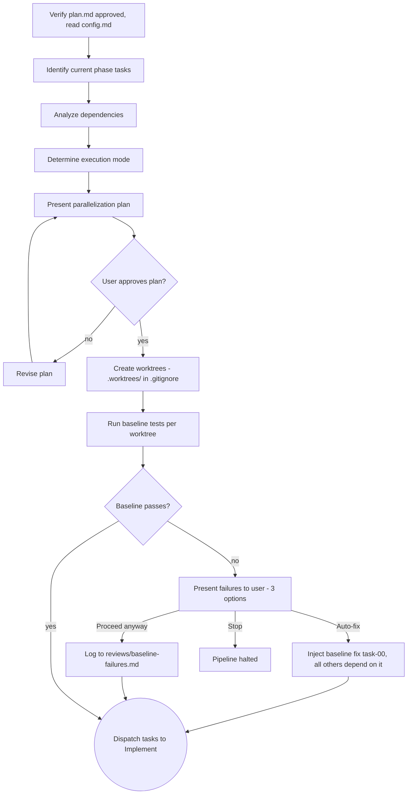

# Worktree (QRSPI Step 7)

**Announce at start:** "I'm using the QRSPI Worktree skill to analyze task dependencies and dispatch implementation."

## Overview

Analyze task dependencies for the current phase, determine execution mode (sequential/parallel/hybrid), create worktrees, dispatch tasks to Implement. Orchestrator in main conversation.

## Iron Law

```
NO TASK DISPATCH WITHOUT AN APPROVED PARALLELIZATION PLAN
```

## Artifact Gating

Required inputs:

- `plan.md` with `status: approved`
- `tasks/*.md` (current phase) or `fixes/{type}-round-NN/*.md` (for fix task routing)
- `design.md` with `status: approved` (phase definitions)
- `config.md`

If any required artifact is missing or not approved, refuse to run and tell the user which artifact is needed.

### Config Validation

Before reading any field from `config.md`, validate the following:

**If `config.md` is missing:**

  config.md not found in the artifact directory.

  1) Re-run Goals to create config.md and set the pipeline mode
  2) Abort

**If `pipeline` is missing:**

  config.md has no `pipeline` field.

  1) Re-run Goals to regenerate config.md with the pipeline field set
  2) Manually add `pipeline: full` or `pipeline: quick` to config.md
  3) Abort

**If `pipeline` has an invalid value (not `full` or `quick`):**

  config.md has an invalid value for `pipeline`: {value}
  Expected: `full` or `quick`

  1) Edit config.md and set `pipeline: full` or `pipeline: quick`
  2) Re-run Goals to regenerate config.md
  3) Abort

<HARD-GATE>
Do NOT dispatch implementation subagents without an approved parallelization plan.
Do NOT dispatch parallel tasks that touch overlapping files.
Do NOT create worktrees on main/master without a feature branch.
This applies regardless of how simple the task appears.
</HARD-GATE>

## Phase-Level Configuration

At the start of each Worktree dispatch, ask the user two questions:

1. **Review depth:** "Quick (4 correctness reviewers) or Deep (correctness + thoroughness, all 8 reviewers)?"
2. **Review mode:** "Single round or Loop until clean?"

Write choices to `config.md` as `review_depth` and `review_mode` fields. Fix-task dispatches reuse same settings — do not re-ask. In quick fix mode (no Worktree), Implement asks and writes these same fields. Source of truth is always `config.md`.

## Execution Modes

| Mode | When | How |
|------|------|-----|
| Sequential | Tasks have chain dependencies (A->B->C) | One subagent at a time, each in its own worktree |
| Parallel | Tasks are independent, touch different files | Multiple Agent tool calls with `isolation: worktree`, fired simultaneously |
| Hybrid | Mix of independent and dependent tasks | Parallel groups dispatched together, sequential between groups |

## Process



## Branch Model

1. **Feature branch:** Created from the current branch (typically `main`) at the start of the first phase: `qrspi/{slug}` (e.g., `qrspi/user-auth`). For subsequent phases, the feature branch already exists.
2. **Task branches:** Each worktree forks from the feature branch: `qrspi/{slug}/task-NN` (e.g., `qrspi/user-auth/task-01`).
3. **Merge target:** Integrate merges task branches into the feature branch.
4. **PR target:** Test creates the PR from the feature branch to the base branch.

## Subagent Permissions

Before dispatching any implementation subagent, write `.claude/settings.json` into each worktree directory. Worktrees are disposable and isolated — broad tool permissions here do not affect the main project.

**Settings file content** (write to `{worktree}/.claude/settings.json`):

```json
{
  "permissions": {
    "allow": [
      "Edit(**)",
      "Write(**)",
      "Bash(git *)",
      "Bash(npm *)",
      "Bash(npx *)",
      "Bash(node *)",
      "Bash(python *)",
      "Bash(pip *)",
      "Bash(pytest *)",
      "Bash(python3 *)",
      "Bash(cargo *)",
      "Bash(go *)",
      "Bash(make *)",
      "Bash(mkdir *)",
      "Bash(cp *)",
      "Bash(mv *)",
      "Bash(rm *)",
      "Bash(chmod *)",
      "Bash(cat *)",
      "Bash(ls *)",
      "Bash(find *)",
      "Bash(grep *)",
      "Bash(sed *)",
      "Bash(awk *)",
      "Bash(echo *)",
      "Bash(touch *)",
      "Bash(wc *)",
      "Bash(sort *)",
      "Bash(head *)",
      "Bash(tail *)",
      "Bash(diff *)"
    ],
    "deny": []
  }
}
```

**Safety rationale:** Worktrees are isolated branches. Approval prompts inside subagents block execution silently — the subagent stalls without surfacing the prompt to the user. Pre-writing broad permissions eliminates this failure mode.

### Fallback Approach

If worktree-level `.claude/settings.json` is not loaded by the subagent (Claude Code only loads settings from the project root or `~/.claude/`), fall back to the main project settings:

1. Open `.claude/settings.json` in the main project root.
2. For each worktree path, append path-scoped allow rules in the `"allow"` array using the pattern `"Bash(* {worktree_path}/*)"` or equivalent glob.
3. After the subagent completes, remove those path-scoped entries.

**Never leave temporary permission entries in the main project `.claude/settings.json` after subagents complete.**

## Process Steps

1. Create feature branch if it doesn't exist (first phase only)
2. Identify current phase's tasks from `plan.md` phase definitions
3. Analyze dependencies between tasks for parallelization opportunities
4. Determine execution mode (sequential/parallel/hybrid)
5. Present parallelization plan to user for approval
6. Create worktrees from the feature branch (verify `.worktrees/` in `.gitignore`)
6a. **Verify subagent permissions (first time per session only):**
    - Write `.claude/settings.json` to the first worktree (as described in Subagent Permissions above).
    - Dispatch a minimal test subagent to write `_permissions_test.txt` in that worktree.
    - **If silent (no approval prompt):** Primary approach works — proceed with all worktrees.
    - **If approval prompt surfaces:** Switch to the fallback approach (main project path-scoped rules).
    - Delete `_permissions_test.txt` after the check.
    - Skip this check on subsequent dispatches in the same session.
7. Run baseline tests in each worktree. If tests fail, present failure summary with 3 options:
   - **(a) Auto-fix (recommended):** Inject baseline fix task (`task-00`) with all others depending on it. `task-00` uses `task: 0` in frontmatter. Dispatched through Implement like any other task.
   - **(b) Proceed anyway:** Log failures to `reviews/baseline-failures.md`.
   - **(c) Stop:** Halt the pipeline.
8. Dispatch tasks to Implement skill

## Fix Task Routing

When handling fix tasks from integration, CI, or test failures, read from `fixes/{type}-round-NN/*.md` instead of `tasks/*.md`. Fix task files follow the same format as regular task files. For fix-task dispatches, append new branch entries to `parallelization.md` (informational additions, not structural changes requiring re-approval).

## Artifact

`parallelization.md` — which tasks run parallel, which sequential, worktree assignments, rationale. Written with `status: draft` in YAML frontmatter. Includes branch map (e.g., `task-01 -> qrspi/{slug}/task-01`). Review depth/mode stored in `config.md`, not here.

## Human Gate

Write the Mermaid dependency graph to `parallelization.md` — do not paste the diagram inline in the terminal. Tell the user: "Parallelization plan written to parallelization.md — open it to view the dependency graph."

In the terminal, present the branch map and execution mode as plain text:

```
Execution mode: Hybrid

Branch map:
  task-01  →  qrspi/{slug}/task-01
  task-02  →  qrspi/{slug}/task-02
  task-03  →  qrspi/{slug}/task-03

Parallel Group 1: task-01, task-02 (no file overlap)
Sequential after G1: task-03 (depends on task-01, task-02)
```

On approval, write `status: approved` in frontmatter and commit.

## Batch Gate (After All Tasks)

When all current-phase tasks complete, present summary:

- Which tasks passed clean
- Which tasks have unresolved issues (with issue summaries)
- Review round history per task

User chooses:

1. **Fix remaining issues and re-run reviews** — re-enter fix cycles for unresolved tasks only
2. **Re-run all reviews** — confidence check across all tasks
3. **Continue to next step**
4. **Stop**

In full pipeline mode, this batch gate lives in Worktree. In quick fix mode, it lives in Implement.

## Terminal State

Recommend compaction: "Parallelization plan approved. This is a good point to compact context before dispatch (`/compact`)."

Dispatch tasks to Implement skill. After all tasks return, present the batch gate. When the user chooses to continue, invoke the next skill in the `config.md` route after `implement` (note: Worktree looks up `implement` in the route, not `worktree`, because it orchestrates Implement).

For quick-fix pipeline (no Worktree in route), Plan invokes Implement directly — Implement asks review depth/mode and presents its own batch gate.

## Model Selection Guidance

| Task complexity | Recommended model |
|-----------------|-------------------|
| Mechanical tasks (1-2 files, clear spec) | Fast/cheap model (haiku) |
| Integration tasks (multi-file, pattern matching) | Standard model (sonnet) |
| Architecture/design/review | Most capable model (opus) |

## Task Tracking (TodoWrite)

Create granular tasks for each step:

1. Analyze task dependencies
2. Determine execution mode
3. Present parallelization plan
4. Create worktrees
5. Run baseline tests
6. For each parallel group, create a separate TodoWrite task (e.g., "G1: T01, T12, T13 — dispatch"). Mark in_progress at dispatch; mark completed when all tasks in that group return. This allows the user to track dispatch progress at group granularity.

Mark each task in_progress when starting, completed when done.

## Red Flags — STOP

- Dispatching parallel tasks that touch overlapping files
- Skipping baseline tests because "they passed last time"
- Creating worktrees on main/master without a feature branch
- Dispatching before user approves parallelization plan
- Re-asking review depth/mode during fix-task dispatch (reuse from config.md)
- Proceeding after BLOCKED status without changing approach
- Dispatching a task whose dependencies haven't completed
- Using a single TodoWrite task for all Implement dispatches — create one task per parallel group so the user can track progress
- Dispatching implementation subagents without first writing `.claude/settings.json` to each worktree directory
- Leaving temporary permission entries in main project `.claude/settings.json` after subagents complete

## Common Rationalizations — STOP

| Rationalization | Reality |
|----------------|---------|
| "These tasks are independent, skip the dependency analysis" | File overlap is the real risk. Analyze every time. |
| "Baseline tests failed but they're probably flaky" | Present to user. They decide, not you. |
| "Sequential is fine, skip parallelization analysis" | Missing parallelization wastes time. Analyze once, execute efficiently. |
| "The plan already analyzed dependencies, I can skip" | Plan dependencies are logical. Worktree checks file-level overlap — different analysis. |
| "Single task, skip the parallelization plan" | Single tasks still get a parallelization plan (trivial but consistent). |

## Worked Example — Good

```markdown
---
status: draft
---

# Parallelization Plan

## Execution Mode: Hybrid

## Dependency Analysis

| Task | Dependencies | Files | Parallel Group |
|------|-------------|-------|----------------|
| Task 1: Auth types + DB schema | none | `src/types/auth.ts`, `prisma/schema.prisma` | Group 1 |
| Task 2: API middleware | none | `src/middleware/auth.ts`, `src/middleware/rate-limit.ts` | Group 1 |
| Task 3: Auth endpoints | Task 1, Task 2 | `src/routes/auth.ts`, `src/routes/auth.test.ts` | Group 2 |
| Task 4: Profile endpoints | Task 1 | `src/routes/profile.ts`, `src/routes/profile.test.ts` | Group 2 |

## Execution Order

Tasks 1 and 2 run in parallel (no file overlap). Tasks 3 and 4 wait for their dependencies but can run in parallel with each other (no file overlap between them).

## Branch Map

| Task | Branch |
|------|--------|
| task-01 | qrspi/user-auth/task-01 |
| task-02 | qrspi/user-auth/task-02 |
| task-03 | qrspi/user-auth/task-03 |
| task-04 | qrspi/user-auth/task-04 |
```

## Worked Example — Bad

```markdown
---
status: draft
---

# Parallelization Plan

## Execution Mode: Parallel

All tasks run in parallel.

| Task | Branch |
|------|--------|
| task-01 | qrspi/user-auth/task-01 |
| task-02 | qrspi/user-auth/task-02 |
| task-03 | qrspi/user-auth/task-03 |
```

**Why this fails:**
- No dependency analysis — Task 3 depends on Tasks 1 and 2 but runs in parallel
- No file overlap check — Tasks 1 and 3 both modify `src/routes/auth.ts`
- No rationale for execution mode choice
- Missing worktree assignments per task

<BEHAVIORAL-DIRECTIVES>
These directives apply at every step of this skill, regardless of context.

D1 — Encourage reviews after changes: After any significant change to an artifact (whether from feedback, a fix round, or a re-run), recommend a review before proceeding. Reviews catch regressions that are invisible during forward-only execution.

D2 — Never suggest skipping steps for speed. Do not offer shortcuts, suggest merging steps, or imply steps can be skipped to save time.

D3 — There is no time crunch. LLMs execute orders of magnitude faster than humans. There is no benefit to skipping LLM-driven steps — reviews, synthesis passes, and validation rounds cost seconds. Reassure the user that thoroughness is free. If the user signals urgency, acknowledge the constraint and offer the fastest compliant path — never a non-compliant shortcut.
</BEHAVIORAL-DIRECTIVES>
