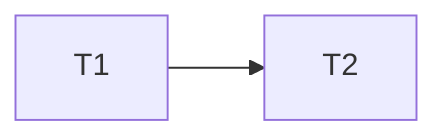

# Parallelization: Out-of-Scope Seed (parallelization.md)

This fixture deliberately seeds content that violates `## Parallelize OWNS / Parallelize DEFERS`. The scope-reviewer dispatch with `{ARTIFACT_TYPE}=parallelize` MUST emit boundary-drift findings tagged `change_type: scope`.

## Execution Mode

Parallel.

## Dependency Analysis

| Task | Depends on | Files |
|------|------------|-------|
| T1 | none | `src/a.ts` |
| T2 | T1 | `src/b.ts` |

## Branch Map

| Task | Branch | Base | Concrete Commit |
|------|--------|------|-----------------|
| T1 | feature/t1 | main | abc123def456 |
| T2 | feature/t2 | T1-tip | def456ghi789 |

DEFERS violation above: concrete commit hashes belong to Implement at runtime; Parallelize records ONLY symbolic bases.

## Task Specs

### Task 1: Rate limiter

- DEFERS violation — task spec rewritten here. Task specs are owned by Plan; Parallelize must not rewrite them.
- **LOC estimate:** ~80
- **Test expectations:** returns 429 when over rate.

## Architecture Decisions

- DEFERS violation — design-layer prose: "We chose event-sourcing because it trades off latency for auditability."

## Phasing

- DEFERS violation — phase boundaries re-authored:
- Phase 1: PoC
- Phase 2: hardening

## Implementation Logic

- DEFERS violation — per-task implementation prose: "Inside T1, increment Redis with `INCR rl:{client_id}` and apply `EXPIRE` of 60 seconds."

## Mermaid Dependency Graph

